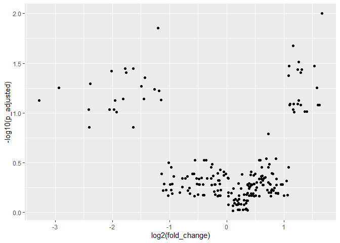
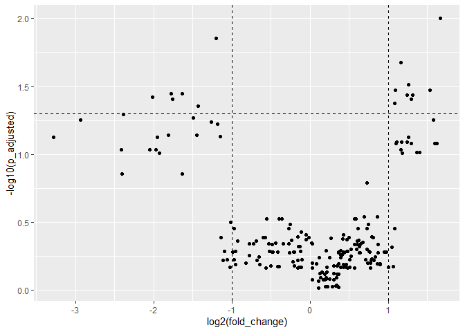
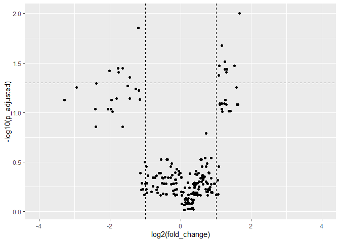
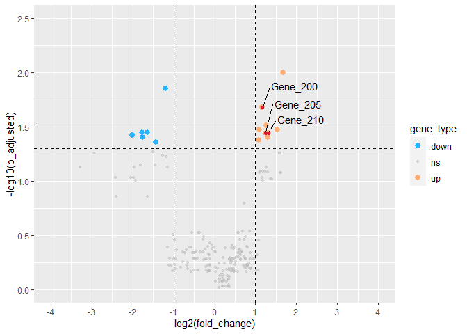
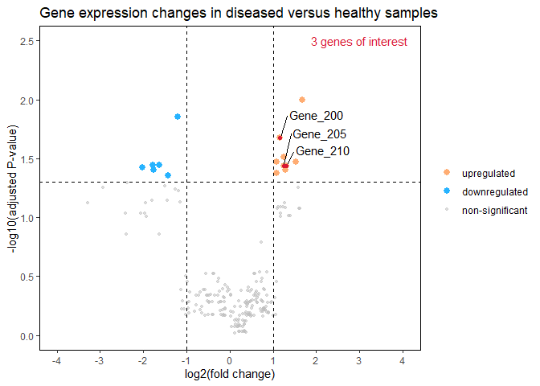

How to draw a volcano plot using ggplot2
================
Erika Duan
2021-06-13

-   [Introduction](#introduction)
-   [Creating a test dataset](#creating-a-test-dataset)
-   [Drawing a simple volcano plot](#drawing-a-simple-volcano-plot)
-   [Adding horizontal and vertical
    lines](#adding-horizontal-and-vertical-lines)
-   [Modifying the x-axis and y-axis](#modifying-the-x-axis-and-y-axis)
-   [Adding colour, size and
    transparency](#adding-colour-size-and-transparency)
-   [Labelling points of interest](#labelling-points-of-interest)
-   [Modifying plot theme and labels](#modifying-plot-theme-and-labels)

``` r
#-----load required packages-----
if (!require("pacman")) install.packages("pacman")
pacman::p_load(tidyverse,
               ggrepel) # for best label separation
```

# Introduction

In 2018, deep into my academic research on immune cell behaviour in
response to pathogens, I was learning about RNA sequencing workflows and
starting to code in R. The original version of this post, which
described the RNA sequencing
[DESEQ2](https://bioconductor.riken.jp/packages/3.7/bioc/vignettes/DESeq2/inst/doc/DESeq2.html)
workflow in more detail, was written as a short lightning talk for
R-Ladies Melbourne in 2018.

In the last two years, a surprising number of small yet handy functions
have been added to `tidyverse`. This post has been re-purposed to
highlight the versatility of `ggplot2` for creating beautiful graphs.
Most of the coding logic should still be attributed to Chuanxin Liu, my
former PhD student and current data science colleague.

# Creating a test dataset

We start with a data frame containing just three columns of information:

-   Row Id (gene symbol)  
-   Fold change (change in gene expression levels in diseased versus
    healthy tissue samples)  
-   Adjusted P-value (adjusted with a correction for multiple testing)

**Note:** The code used to create the test dataset can be accessed from
the `Rmd` file accompanying this tutorial.

``` r
#-----using kable to quickly visualise the test dataset-----  
diseased_vs_healthy %>%
  head(10) %>%
  knitr::kable()
```

| gene\_id | fold\_change | p\_adjusted |
|:---------|-------------:|------------:|
| Gene\_1  |    0.1030276 |   0.0745895 |
| Gene\_2  |    0.1307854 |   0.0556738 |
| Gene\_3  |    0.1879219 |   0.0926644 |
| Gene\_4  |    0.1892141 |   0.1384388 |
| Gene\_5  |    0.1918493 |   0.0509335 |
| Gene\_6  |    0.2412195 |   0.0926644 |
| Gene\_7  |    0.2469141 |   0.0379006 |
| Gene\_8  |    0.2557200 |   0.0926861 |
| Gene\_9  |    0.2586995 |   0.0745895 |
| Gene\_10 |    0.2631660 |   0.0984035 |

# Drawing a simple volcano plot

A simple volcano plot depicts:

-   Along its x-axis: log2(fold\_change)  
-   Along its y-axis: -log10(p\_adjusted)

**Note:** The y-axis depicts -log10(p\_adjusted), which allows the
points on the plot to project upwards as the fold change increases or
decreases i.e. like a volcano spray. Graphically, this is more intuitive
to visualise.

The versatility of `ggplot2` also means that you don’t necessarily need
to create new columns for your axis transformations.

``` r
#-----creating a simple volcano plot-----
vol_plot <- diseased_vs_healthy %>%
  ggplot(aes(x = log2(fold_change),
             y = -log10(p_adjusted))) + 
  geom_point() 

vol_plot # a simple volcano plot is created
```

<!-- -->

# Adding horizontal and vertical lines

The functions `geom_hline` and `geom_vline` can be used to add
horizontal and vertical lines on your plot respectively. In this case, I
am interested in visualising boundaries for genes which have a padj
&lt;= 0.05 and a fold change &lt;= 0.05 or &gt;= 2.

``` r
#-----define quandrants of interest-----
vol_plot + 
  geom_hline(yintercept = -log10(0.05),
             linetype = "dashed") + # horizontal dashed line
  geom_vline(xintercept = c(log2(0.5), log2(2)),
             linetype = "dashed") # vertical dashed line
```

<!-- -->

# Modifying the x-axis and y-axis

Volcano plots should have a symmetrical x-axis. One way we can do this
is by manually setting the limits of the x-axis using `xlim(min, max)`.

``` r
#-----identify the best range for xlim-----
diseased_vs_healthy %>%
  select(fold_change) %>%
  min() %>%
  log2() %>%
  floor() 
#> [1] -4   

diseased_vs_healthy %>%
  select(fold_change) %>%
  max() %>%
  log2() %>%
  ceiling()
#> [1] 2  

#-----add xlim-----  
vol_plot + 
  geom_hline(yintercept = -log10(0.05),
             linetype = "dashed") + 
  geom_vline(xintercept = c(log2(0.5), log2(2)),
             linetype = "dashed") + 
  xlim(-4, 4) # manually specify x-axis limits
```

<!-- -->

We can also change the limits of the x-axis via `scale_x_continuous`.
This method also gives us the flexibility to finetune the spacing and
labelling of axis tick marks.

``` r
#-----modify scale_x_continuous-----
vol_plot + 
  geom_hline(yintercept = -log10(0.05),
             linetype = "dashed") + 
  geom_vline(xintercept = c(log2(0.5), log2(2)),
             linetype = "dashed") +
  scale_x_continuous(breaks = c(seq(-3, 3, 1)), # modify x-axis tick intervals  
                     limits = c(-4, 4)) + # modify xlim 
  scale_y_continuous(breaks = c(seq(0, 2.5, 0.5)), # modify y-axis tick intervals
                     limits = c(0, 2.5)) # modify ylim
```

<!-- -->

**Note:** The values listed for the x and y limits supercede the range
of values listed for x and y breaks.

# Adding colour, size and transparency

To visualise different groups of genes using different colours, point
sizes, shapes or transparencies, we would need to categorise genes into
different groups and store this data as a new parameter (i.e. new column
of data).

In this case, I am going to label:

-   Genes with a fold change &gt;= 2 and adjusted p-value &lt;= 0.05 as
    ‘up’.
-   Genes with a fold change &lt;= 0.5 and adjusted p-value &lt;= 0.05
    as ‘down’.
-   All other genes as ‘ns’ i.e. non-significant.

``` r
#-----create a new column which distinguishes individual rows by type----- 
diseased_vs_healthy <- diseased_vs_healthy %>%
  mutate(gene_type = case_when(fold_change >= 2 & p_adjusted <= 0.05 ~ "up",
                               fold_change <= 0.5 & p_adjusted <= 0.05 ~ "down",
                               TRUE ~ "ns"))   

#-----obtaining a summary of gene_type numbers-----           
diseased_vs_healthy %>%
  count(gene_type) %>%
  knitr::kable()
```

| gene\_type |   n |
|:-----------|----:|
| down       |   6 |
| ns         | 202 |
| up         |   9 |

``` r
# note that the function count is equivalent to     

# diseased_vs_healthy %>%
#   group_by(gene_type) %>%
#   summarize(count = n()) 
```

In `ggplot2`, we have the option to specify our own colour, size and
shape scheme using `scale_color_manual` etc. A tidy way of doing this is
to store your manual specifications as vectors.

``` r
#-----double check how many different categories exist under gene_type----- 
diseased_vs_healthy %>%
  distinct(gene_type) 
```

    ## # A tibble: 3 x 1
    ##   gene_type
    ##   <chr>    
    ## 1 ns       
    ## 2 down     
    ## 3 up

``` r
#-----adding colour, size and alphas (transparency) to a simple volcano plot----- 
cols <- c("up" = "#ffad73", "down" = "#26b3ff", "ns" = "grey") 
sizes <- c("up" = 2.5, "down" = 2.5, "ns" = 1) 
alphas <- c("up" = 1, "down" = 1, "ns" = 0.5)

fancy_vol_plot <- diseased_vs_healthy %>%
  ggplot(aes(x = log2(fold_change),
             y = -log10(p_adjusted))) + 
  geom_point(aes(color = gene_type, # specify color, size and alpha as new aes parameters  
                 size = gene_type,
                 alpha = gene_type)) + 
  geom_hline(yintercept = -log10(0.05),
             linetype = "dashed") + 
  geom_vline(xintercept = c(log2(0.5), log2(2)),
             linetype = "dashed") +
  scale_color_manual(values = cols) + # modify colour
  scale_size_manual(values = sizes) + # modify point size
  scale_alpha_manual(values = alphas) + # modify point transparency
  scale_x_continuous(breaks = c(seq(-4, 4, 1)), 
                     limits = c(-4, 4)) +  
  scale_y_continuous(breaks = c(seq(0, 2.5, 0.5)),
                     limits = c(0, 2.5)) 

fancy_vol_plot
```

<!-- -->

# Labelling points of interest

We can also label a subset of points using `geom_text` or
`geom_text_repel`. This can be done by creating a new column which only
stores the labels of interest (i.e. only rows of interest will have a
label and all other rows will be designated as `NA`).

**Note:** adjusting the parameters for optimal text separation using
`geom_text_repel` can be a bit fiddly. I generally tend to start by
modifying force and then deciding which region of the plot I want to
nudge my text/labels towards. [See
here](https://cran.r-project.org/web/packages/ggrepel/vignettes/ggrepel.html)
for more tips on adjusting `geom_text_repel` parameters.

We can also colour the points of interest by overlaying another scatter
plot on top of the original plot.

``` r
#-----overlay another scatter plot of labelled points-----
fancy_vol_plot + 
  geom_point(data = diseased_vs_healthy %>%
               filter(gene_id %in% interesting_genes), # only show genes of interest   
             color = "#d91933",
             size = 1.5)  
```

<!-- -->

**Note:** The second `geom_point` function still inherits the aesthetics
of the original ggplot.

# Modifying plot theme and labels

Plot visualisation can be further improved by changing the `theme` of
the plot, or by modifying individual `theme` parameters. The function
`labs` is also a handy way of specifying all your plot labels within a
single function. The function `annotate` can be used to add small
annotations that can be stored as short labels or vectors.

**Note:** Sadly, there isn’t an easy way to change the text displayed
inside the figure legends, apart from changing the text in the data
frame itself. This is probably the most involved modification I’ve
encountered.

``` r
#-----factor and recode gene_type to change legend text-----  
diseased_vs_healthy <- diseased_vs_healthy %>%
  mutate(gene_type = factor(gene_type, # create factor  
                               levels = c("up", "down", "ns")), # reorder factor
         gene_type = fct_recode(gene_type,
                                "upregulated" = "up",
                                "downregulated" = "down",
                                "non-significant" = "ns")) 

cols <- c("upregulated" = "#ffad73", "downregulated" = "#26b3ff", "non-significant" = "grey") 
sizes <- c("upregulated" = 2.5, "downregulated" = 2.5, "non-significant" = 1) 
alphas <- c("upregulated" = 1, "downregulated" = 1, "non-significant" = 0.5)

#-----rewrite ggplot and modify plot themes and labels-----
final_vol_plot <- diseased_vs_healthy %>%
  ggplot(aes(x = log2(fold_change),
             y = -log10(p_adjusted),
             label = labelled_genes)) + 
  geom_point(aes(color = gene_type, 
                 size = gene_type,
                 alpha = gene_type)) +
  geom_text_repel(force = 3,
                  hjust = 0, 
                  nudge_x = 0.3, 
                  nudge_y = 0.2, 
                  direction = "y",
                  na.rm = T) +
  geom_hline(yintercept = -log10(0.05),
             linetype = "dashed") + 
  geom_vline(xintercept = c(log2(0.5), log2(2)),
             linetype = "dashed") +
  geom_point(data = diseased_vs_healthy %>%
               filter(gene_id %in% interesting_genes), 
             color = "#d91933",
             size = 1.5) +
  scale_color_manual(values = cols) +
  scale_size_manual(values = sizes) +
  scale_alpha_manual(values = alphas) +
  scale_x_continuous(breaks = c(seq(-4, 4, 1)), 
                     limits = c(-4, 4)) +  
  scale_y_continuous(breaks = c(seq(0, 2.5, 0.5)),
                     limits = c(0, 2.5)) 

final_vol_plot +
  theme_classic() + # creates a white background
  theme(panel.border = element_rect(colour = "black", fill = NA, size= 0.5),
        legend.title = element_blank()) + # creates a plot border 
  labs(title = "Gene expression changes in diseased versus healthy samples",
       x = "log2(fold change)",
       y = "-log10(adjusted P-value)") +
  annotate("text", x = 3, y = 2.5,
           label = "3 genes of interest", color = "#d91933")
```

<!-- -->
