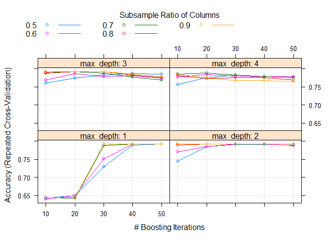

Working with dummy variables and factors
================
Erika Duan
2020-05-03

  - [Introduction](#introduction)
  - [Creating a test dataset](#creating-a-test-dataset)
  - [Working with factors](#working-with-factors)
      - [Creating factors](#creating-factors)
      - [Modifying factor levels](#modifying-factor-levels)
  - [Using dummy variables](#using-dummy-variables)
      - [Creating dummy variables](#creating-dummy-variables)
  - [Machine learning exercise](#machine-learning-exercise)
      - [Generate train and test data](#generate-train-and-test-data)
          - [Obtain random forest friendly train and test
            data](#obtain-random-forest-friendly-train-and-test-data)
          - [Obtain XGBoost friendly train and test
            data](#obtain-xgboost-friendly-train-and-test-data)
          - [Obtain linear SVM friendly train and test
            data](#obtain-linear-svm-friendly-train-and-test-data)
  - [Other resources](#other-resources)

``` r
#-----load required packages-----  
if (!require("pacman")) install.packages("pacman")
pacman::p_load(here,
               tidyverse,
               fastDummies, # for creating dummy variables
               caret,
               randomForest, # random forest modelling
               xgboost, # XGBoost modelling
               kernlab, # linear SVM modelling
               doParallel) # parallel processing  
```

# Introduction

I found myself wrangling (or getting stuck on) factor levels for a good
30+ minutes earlier this week. This circumstance arose from different
machine learning models requiring different data formats.

Let’s say you have a binary classification problem and you want to train
a random forest model, a gradient boosted tree (XGBoost) model and a
support vector model (SVM) model.

**Requirements:**

  - The random forest algorithm handles both numerical categorical and
    numeric predictor variables. The response variable needs to be a
    factor.

  - The XGBoost algorithm only handles numerical predictor variables.
    The response variable needs to be converted into a numerical vector
    (i.e. `0` or `1`).

  - The linear SVM algorithm requires scaled numerical predictor
    variables. The response variable needs to be converted into a factor
    that is not represented by `0` and `1`.

This means that a single dataset can end up requiring multiple factor
and dummy variable transformations. Let’s explore this scenario further
using a fun test dataset.

# Creating a test dataset

Cats are such idiosyncratic creatures. You can never really tell if a
cat wants a pat but then decides to bite you instead. So what if machine
learning could help us better predict cat behaviour (*to pat or not to
pat - that is the question*)?

**Note:** The code used to create this dataset can be accessed from the
`Rmd` file accompanying this tutorial.

``` r
#-----using kable to quickly visualise the test dataset-----  
cat_prediction %>%
  head(10) %>%
  knitr::kable()
```

| cat\_breed         | age | fav\_activity       | likes\_children | will\_bite |
| :----------------- | --: | :------------------ | :-------------- | :--------- |
| mixed              | 5.0 | napping             | no              | no         |
| bengal             | 7.2 | napping             | no              | no         |
| siamese            | 0.8 | sitting\_on\_humans | no              | no         |
| bengal             | 4.0 | napping             | no              | no         |
| british\_shorthair | 4.8 | hunting\_toys       | no              | yes        |
| bengal             | 5.8 | sitting\_on\_humans | no              | yes        |
| aristocat          | 5.8 | sitting\_on\_humans | no              | no         |
| bengal             | 7.0 | napping             | no              | yes        |
| siamese            | 5.6 | napping             | no              | no         |
| ragdoll            | 2.3 | hunting\_toys       | no              | no         |

# Working with factors

## Creating factors

There are two ways to handle factors:

  - Using base `R` to create factors and modify factor levels.  
  - Using [`forcats`](https://r4ds.had.co.nz/factors.html) from the
    `tidyverse` library to simplify complex factor wrangling.

Using `factor` without specifying factor levels automatically converts
character vectors into a numerical index of character vectors.
Specifying factor levels also allows you to specify the order of levels.

**Note:** Factor levels need to match `unique(vector_values)` to prevent
the generation of `NA` values.

``` r
#-----converting the response variable into a factor using base R-----  
cat_prediction_factor <- factor(cat_prediction$will_bite)

# str(cat_prediction$will_bite)
#> Factor w/ 2 levels "no","yes": 1 1 2 1 2 2 1 2 2 1 ...  

cat_prediction_factor <- factor(cat_prediction$will_bite,
                                   levels = c("no", "yes")) 

# make sure levels == unique(cat_prediction$will_bite)
# otherwise your response variable will be converted into NAs

cat_prediction_char <- as.character(cat_prediction_factor)  

# str(cat_prediction_char)
#> chr [1:500] "no" "no" "yes" "no" "yes" "yes" "no" "yes" "yes" "no" ...
```

Applying `as.character` back onto a factor returns the original
character vector, rather than the numerical index.

## Modifying factor levels

In base R, modifying factor levels directly modifies the factor itself.
I personally think that the safest way is to modify factor levels is by
specifying replacement and original level names using `list`. Note that
this approach requires all levels to be specified inside the list, or
`NA` values will be generated.

``` r
#-----converting factor levels using base R-----
levels(cat_prediction_factor) <- list(no_biting = "no",
                                      yes_ouch = "yes")

# str(cat_prediction_factor)
#> Factor w/ 2 levels "no_biting","yes_ouch": 1 1 2 1 2 2 1 2 2 1 ...

cat_prediction_char <- as.character(cat_prediction_factor)

# str(cat_prediction_char)
#>  chr [1:500] "no_biting" "no_biting" "yes_ouch" "no_biting" "yes_ouch" ...

#----the dangers of modifying levels without referencing names----- 
cat_prediction_factor <- factor(cat_prediction$will_bite,
                                   levels = c("no", "yes")) 
 
# str(cat_prediction_factor)
#> Factor w/ 2 levels "no","yes": 1 1 2 1 2 2 1 2 2 1 ...

levels(cat_prediction_factor) <- c("yes", "no") # accidentally inverting factor level order
 
# str(cat_prediction_factor)
#> Factor w/ 2 levels "yes","no": 1 1 2 1 2 2 1 2 2 1 ...
```

You can also modify factor levels using
[`fct_recode`](https://r4ds.had.co.nz/factors.html#modifying-factor-levels)
from `forcats`. The chief advantages of `fct_recode` are that:

  - It does not modify levels that are not referenced (instead of
    converting them to `NA`).  
  - It will warn you if you accidentally refer to a level that does not
    exist.

<!-- end list -->

``` r
#-----converting factor levels using forcats-----   
cat_prediction %>%
  mutate(will_bite_factor = factor(will_bite),
         will_bite_factor = fct_recode(will_bite,
                                       "no_biting" = "no",
                                       "yes_ouch" = "yes")) # new level name = old level name
```

**Note:** The `forcats` package also contains other functions for
modifying or ordering factor levels, which are very useful for plotting
graphs of categorical variables. This tutorial is limited to applying
factors to binary data.

# Using dummy variables

## Creating dummy variables

According to
[Wikipedia](https://en.wikipedia.org/wiki/Dummy_variable_\(statistics\)),
a dummy variable is one that takes only the value 0 or 1 to indicate the
absence or presence of some categorical effect that may be expected to
shift the outcome. Note that if you have an ordinal variable with more
than two responses, conversion into numerical values (`1`, `2`, `3`
etc.) is **only valid** if the distance between each ordinal variable is
exactly the same.

I like to use the `fastDummies` package for fast conversion of character
into binary (i.e. dummy) columns.

``` r
#-----using fastDummies::dummy_cols to create dummy variables-----  
# view all categorical variables  
cat_prediction %>%
  select_if(~ is.character(.)) %>%
  map(~ unique(.))
```

    ## $cat_breed
    ## [1] "mixed"             "bengal"            "siamese"          
    ## [4] "british_shorthair" "aristocat"         "ragdoll"          
    ## 
    ## $fav_activity
    ## [1] "napping"           "sitting_on_humans" "hunting_toys"     
    ## [4] "window_watching"  
    ## 
    ## $likes_children
    ## [1] "no"  "yes"
    ## 
    ## $will_bite
    ## [1] "no"  "yes"

``` r
# identify all categorial variables  

categorical_variables <- cat_prediction %>%
  select(-will_bite) %>% # remove response variable
  select_if(is.character) %>%
  colnames(.)

# create dummy variables
cat_prediction_num <- dummy_cols(cat_prediction, # .data
                                 select_columns = categorical_variables, 
                                 remove_selected_columns = T) # remove original categorical columns 

head(cat_prediction_num)
```

    ## # A tibble: 6 x 14
    ##     age will_bite cat_breed_arist~ cat_breed_bengal cat_breed_briti~
    ##   <dbl> <chr>                <int>            <int>            <int>
    ## 1   5   no                       0                0                0
    ## 2   7.2 no                       0                1                0
    ## 3   0.8 no                       0                0                0
    ## 4   4   no                       0                1                0
    ## 5   4.8 yes                      0                0                1
    ## 6   5.8 yes                      0                1                0
    ## # ... with 9 more variables: cat_breed_mixed <int>,
    ## #   cat_breed_ragdoll <int>, cat_breed_siamese <int>,
    ## #   fav_activity_hunting_toys <int>, fav_activity_napping <int>,
    ## #   fav_activity_sitting_on_humans <int>,
    ## #   fav_activity_window_watching <int>, likes_children_no <int>,
    ## #   likes_children_yes <int>

# Machine learning exercise

Let’s return to our original task of trying to use machine learning to
reduce the risk of future unfriendly cat encouters. We want to take a
random portion of our dataset and, using cross-validation, train a
random forest, XGBoost and linear SVM model.

## Generate train and test data

As this is a simple dataset, we can use \``tidyverse` or
`createDataPartition` from the `caret` library to create our train and
test data.

``` r
#-----using caret::createDataPartition to create training and test data----- 
set.seed(111) # always set.seed  

trainIndex <- createDataPartition(cat_prediction$will_bite, # vector of outcomes
                                  p = 0.7, 
                                  list = FALSE, 
                                  times = 1)

cat_prediction_train <- cat_prediction[ trainIndex,] # 351 observations
cat_prediction_test  <- cat_prediction[-trainIndex,] # 149 observations   

#-----equivalent method using tidyverse-----  
set.seed(111)

cat_prediction_tv <- cat_prediction %>%
  mutate(id = row_number()) # for anti_join by = "id" to create test

cat_prediction_train_tv <- cat_prediction_tv %>% sample_frac(0.7)
cat_prediction_test_tv  <- anti_join(cat_prediction_tv, cat_prediction_train_tv,
                                     by = 'id')

# compare::compare(cat_prediction_train, cat_prediction_train_tv)
#> FALSE 

# note that these two methods sample different observations despite set.seed(111)   
```

**Note:** There may be times when you will be interested in using
[stratified
sampling](https://stats.stackexchange.com/questions/250273/benefits-of-stratified-vs-random-sampling-for-generating-training-data-in-classi)
to make sure that the representation of a certain demographic is
proportionally represented in both the train and test data. This can be
done by implementing `group_by` via a `tidyverse`
[approach](https://stackoverflow.com/questions/54566428/caret-creating-stratified-data-sets-based-on-several-variables).

``` r
#-----doublecheck the train data-----
head(cat_prediction_train) # check values  
```

    ## # A tibble: 6 x 5
    ##   cat_breed   age fav_activity      likes_children will_bite
    ##   <chr>     <dbl> <chr>             <chr>          <chr>    
    ## 1 bengal      7.2 napping           no             no       
    ## 2 siamese     0.8 sitting_on_humans no             no       
    ## 3 bengal      4   napping           no             no       
    ## 4 bengal      5.8 sitting_on_humans no             yes      
    ## 5 aristocat   5.8 sitting_on_humans no             no       
    ## 6 siamese     5.6 napping           no             no

``` r
str(cat_prediction_train) # check column type  
```

    ## Classes 'tbl_df', 'tbl' and 'data.frame':    351 obs. of  5 variables:
    ##  $ cat_breed     : chr  "bengal" "siamese" "bengal" "bengal" ...
    ##  $ age           : num  7.2 0.8 4 5.8 5.8 5.6 6.4 1.4 2.9 5 ...
    ##  $ fav_activity  : chr  "napping" "sitting_on_humans" "napping" "sitting_on_humans" ...
    ##  $ likes_children: chr  "no" "no" "no" "no" ...
    ##  $ will_bite     : chr  "no" "no" "no" "yes" ...

### Obtain random forest friendly train and test data

Because random forest algorithms handle both numerical categorical and
numeric variables, transformations are not needed for predictor
variables in `cat_prediction_train` and `cat_prediction_test`. The only
modification that we need to perform is to convert the response variable
`will_bite` into a factor.

``` r
#-----convert response variable into a factor-----
cat_prediction_train$will_bite <- factor(cat_prediction_train$will_bite)
cat_prediction_test$will_bite <- factor(cat_prediction_test$will_bite)

# str(cat_prediction_train$will_bite)
#> Factor w/ 2 levels "no","yes": 1 1 1 2 1 1 1 1 1 1 ...  
```

``` r
#-----identify model parameters for tuning-----   
modelLookup(model = "rf")
```

    ##   model parameter                         label forReg forClass probModel
    ## 1    rf      mtry #Randomly Selected Predictors   TRUE     TRUE      TRUE

``` r
#-----implementing parallel processing-----
# implementing parallel processing  

core_number <- detectCores() - 1  
cl <- makePSOCKcluster(core_number)
registerDoParallel(cl)  

#-----creating the random forest model-----  
# learn how to set.seed when parallel processing  

# enable cross-validation  
control <- trainControl(method='repeatedcv', 
                        number = 10, 
                        repeats = 3,
                        search = 'grid') # hyperparameter tuning enabled   

tunegrid <- expand.grid(mtry = c(1:4))  

rf_model <- train(will_bite ~ .,
                  data = cat_prediction_train,
                  method = "rf",
                  metric = "Accuracy",
                  ntrees = 50,  
                  tuneGrid = tunegrid, 
                  trControl = control)

stopCluster(cl) # stop parallel processing

#-----visualise best random forest model-----
print(rf_model) 
```

    ## Random Forest 
    ## 
    ## 351 samples
    ##   4 predictor
    ##   2 classes: 'no', 'yes' 
    ## 
    ## No pre-processing
    ## Resampling: Cross-Validated (10 fold, repeated 3 times) 
    ## Summary of sample sizes: 317, 315, 315, 315, 316, 316, ... 
    ## Resampling results across tuning parameters:
    ## 
    ##   mtry  Accuracy   Kappa     
    ##   1     0.6494974  0.05443978
    ##   2     0.7944413  0.57261339
    ##   3     0.8020386  0.60171398
    ##   4     0.7925366  0.57706913
    ## 
    ## Accuracy was used to select the optimal model using the largest value.
    ## The final value used for the model was mtry = 3.

``` r
plot(rf_model)
```


### Obtain XGBoost friendly train and test data

The XGBoost algorithm only handles numerical variables and predictor
variables need to be stored as a `DMatrix` object. The response variable
also needs to be converted into a numeric vector (i.e. `0` or `1`).

``` r
#-----convert categorical predictor variables into dummy variables-----
categorical_variables <- cat_prediction_train %>%
  select(-will_bite) %>% # remove response variable
  select_if(is.character) %>%
  colnames(.)

# create dummy variables in train data
cat_prediction_train_x <- cat_prediction_train %>%
  select(-will_bite) %>%
  dummy_cols(., 
             select_columns = categorical_variables, 
             remove_selected_columns = T) 

# create dummy variables in test data
cat_prediction_test_x <- cat_prediction_test %>%
  select(-will_bite) %>%
  dummy_cols(., 
             select_columns = categorical_variables, 
             remove_selected_columns = T)  

#-----convert response variables into a numeric factor-----
# create numerical response variable from train data
y_train_xgb <- cat_prediction_train$will_bite 

levels(y_train_xgb) <- list("0" = "no",
                            "1" = "yes")

# create numerical response variable from test data
y_test_xgb <- cat_prediction_test$will_bite 

levels(y_test_xgb) <- list("0" = "no", # numerical values have to be wrapped by ""
                           "1" = "yes")
```

``` r
#-----identify model parameters for tuning-----   
modelLookup(model = "xgbTree")
```

    ##     model        parameter                          label forReg forClass
    ## 1 xgbTree          nrounds          # Boosting Iterations   TRUE     TRUE
    ## 2 xgbTree        max_depth                 Max Tree Depth   TRUE     TRUE
    ## 3 xgbTree              eta                      Shrinkage   TRUE     TRUE
    ## 4 xgbTree            gamma         Minimum Loss Reduction   TRUE     TRUE
    ## 5 xgbTree colsample_bytree     Subsample Ratio of Columns   TRUE     TRUE
    ## 6 xgbTree min_child_weight Minimum Sum of Instance Weight   TRUE     TRUE
    ## 7 xgbTree        subsample           Subsample Percentage   TRUE     TRUE
    ##   probModel
    ## 1      TRUE
    ## 2      TRUE
    ## 3      TRUE
    ## 4      TRUE
    ## 5      TRUE
    ## 6      TRUE
    ## 7      TRUE

``` r
#-----creating the XGBoost model-----   
# convert train and test predictor variables into DMatrixes   
x_train_xgb <- as.matrix(cat_prediction_train_x) %>%
  xgb.DMatrix()

x_test_xgb <- as.matrix(cat_prediction_test_x) %>%
  xgb.DMatrix()

set.seed(111)  

control <- trainControl(method='repeatedcv', 
                        number = 10, 
                        repeats = 3,
                        search = 'grid', # hyperparameter tuning enabled
                        allowParallel = F, # xgboost already enables parallel processing
                        returnData = F)     

tunegrid <- expand.grid(nrounds = c(10, 20, 30, 40, 50),
                        max_depth = c(1, 2, 3, 4),
                        colsample_bytree = seq(0.5, 0.9, length.out = 5),
                        eta = 0.1,
                        gamma = 0,
                        min_child_weight = 1,
                        subsample = 1)  

xgboost_model <- train(x_train_xgb, # predictor variables
                       y_train_xgb, # response variable
                       method = "xgbTree",
                       metric = "Accuracy",
                       tuneGrid = tunegrid, 
                       trControl = control)

#-----visualise best XGBoost model-----
print(xgboost_model) 
```

    ## eXtreme Gradient Boosting 
    ## 
    ## No pre-processing
    ## Resampling: Cross-Validated (10 fold, repeated 3 times) 
    ## Summary of sample sizes: 315, 316, 316, 317, 316, 315, ... 
    ## Resampling results across tuning parameters:
    ## 
    ##   max_depth  colsample_bytree  nrounds  Accuracy   Kappa       
    ##   1          0.5               10       0.6429832   0.019695430
    ##   1          0.5               20       0.6496001   0.062691539
    ##   1          0.5               30       0.7292328   0.395258084
    ##   1          0.5               40       0.7890570   0.593375130
    ##   1          0.5               50       0.7918876   0.602078129
    ##   1          0.6               10       0.6401261  -0.001886792
    ##   1          0.6               20       0.6503906   0.056735625
    ##   1          0.6               30       0.7511936   0.467570494
    ##   1          0.6               40       0.7918876   0.602078129
    ##   1          0.6               50       0.7918876   0.602078129
    ##   1          0.7               10       0.6439356   0.000000000
    ##   1          0.7               20       0.6429832   0.007241838
    ##   1          0.7               30       0.7880781   0.589055535
    ##   1          0.7               40       0.7918876   0.602078129
    ##   1          0.7               50       0.7918876   0.602078129
    ##   1          0.8               10       0.6439356   0.000000000
    ##   1          0.8               20       0.6439356   0.000000000
    ##   1          0.8               30       0.7918876   0.602078129
    ##   1          0.8               40       0.7918876   0.602078129
    ##   1          0.8               50       0.7918876   0.602078129
    ##   1          0.9               10       0.6439356   0.000000000
    ##   1          0.9               20       0.6439356   0.000000000
    ##   1          0.9               30       0.7918876   0.602078129
    ##   1          0.9               40       0.7918876   0.602078129
    ##   1          0.9               50       0.7918876   0.602078129
    ##   2          0.5               10       0.7443371   0.435852801
    ##   2          0.5               20       0.7851105   0.567652340
    ##   2          0.5               30       0.7907454   0.584081801
    ##   2          0.5               40       0.7897121   0.587844271
    ##   2          0.5               50       0.7887862   0.586552220
    ##   2          0.6               10       0.7695378   0.510943328
    ##   2          0.6               20       0.7853221   0.574361270
    ##   2          0.6               30       0.7919655   0.596401377
    ##   2          0.6               40       0.7919935   0.598887560
    ##   2          0.6               50       0.7881839   0.592512079
    ##   2          0.7               10       0.7919141   0.600022588
    ##   2          0.7               20       0.7918876   0.602078129
    ##   2          0.7               30       0.7918876   0.602078129
    ##   2          0.7               40       0.7918876   0.602078129
    ##   2          0.7               50       0.7918876   0.602078129
    ##   2          0.8               10       0.7890305   0.593336139
    ##   2          0.8               20       0.7918876   0.602078129
    ##   2          0.8               30       0.7918876   0.602078129
    ##   2          0.8               40       0.7918876   0.602078129
    ##   2          0.8               50       0.7918876   0.602078129
    ##   2          0.9               10       0.7918876   0.602078129
    ##   2          0.9               20       0.7918876   0.602078129
    ##   2          0.9               30       0.7918876   0.602078129
    ##   2          0.9               40       0.7918876   0.602078129
    ##   2          0.9               50       0.7918876   0.602078129
    ##   3          0.5               10       0.7603984   0.478861395
    ##   3          0.5               20       0.7740585   0.524694889
    ##   3          0.5               30       0.7815966   0.548765792
    ##   3          0.5               40       0.7861967   0.563350570
    ##   3          0.5               50       0.7843448   0.562324731
    ##   3          0.6               10       0.7681513   0.523239978
    ##   3          0.6               20       0.7863072   0.564397385
    ##   3          0.6               30       0.7785761   0.552714525
    ##   3          0.6               40       0.7813803   0.559599759
    ##   3          0.6               50       0.7738375   0.545857432
    ##   3          0.7               10       0.7872051   0.588834306
    ##   3          0.7               20       0.7918876   0.601001507
    ##   3          0.7               30       0.7872035   0.590816562
    ##   3          0.7               40       0.7768316   0.565965304
    ##   3          0.7               50       0.7691005   0.546295691
    ##   3          0.8               10       0.7891099   0.594586089
    ##   3          0.8               20       0.7918876   0.602078129
    ##   3          0.8               30       0.7918876   0.602078129
    ##   3          0.8               40       0.7824665   0.580012678
    ##   3          0.8               50       0.7759353   0.562414787
    ##   3          0.9               10       0.7918876   0.602078129
    ##   3          0.9               20       0.7918876   0.602078129
    ##   3          0.9               30       0.7918876   0.602078129
    ##   3          0.9               40       0.7851899   0.586465915
    ##   3          0.9               50       0.7775973   0.568193034
    ##   4          0.5               10       0.7557672   0.479938851
    ##   4          0.5               20       0.7757688   0.527010276
    ##   4          0.5               30       0.7825195   0.550292573
    ##   4          0.5               40       0.7776190   0.543963542
    ##   4          0.5               50       0.7757688   0.540743538
    ##   4          0.6               10       0.7769141   0.527271470
    ##   4          0.6               20       0.7832804   0.554282001
    ##   4          0.6               30       0.7796327   0.546953561
    ##   4          0.6               40       0.7786788   0.546888968
    ##   4          0.6               50       0.7778618   0.547169610
    ##   4          0.7               10       0.7845658   0.559840451
    ##   4          0.7               20       0.7871771   0.569162128
    ##   4          0.7               30       0.7824121   0.561043685
    ##   4          0.7               40       0.7777295   0.552413464
    ##   4          0.7               50       0.7759073   0.545998417
    ##   4          0.8               10       0.7814566   0.562992450
    ##   4          0.8               20       0.7729396   0.546286450
    ##   4          0.8               30       0.7747635   0.551536754
    ##   4          0.8               40       0.7748179   0.550492261
    ##   4          0.8               50       0.7691519   0.535062385
    ##   4          0.9               10       0.7842624   0.564814446
    ##   4          0.9               20       0.7749253   0.555973237
    ##   4          0.9               30       0.7671693   0.539724504
    ##   4          0.9               40       0.7672222   0.537133467
    ##   4          0.9               50       0.7644164   0.527233121
    ## 
    ## Tuning parameter 'eta' was held constant at a value of 0.1
    ## 
    ## Tuning parameter 'min_child_weight' was held constant at a value of
    ##  1
    ## Tuning parameter 'subsample' was held constant at a value of 1
    ## Accuracy was used to select the optimal model using the largest value.
    ## The final values used for the model were nrounds = 40, max_depth = 2,
    ##  eta = 0.1, gamma = 0, colsample_bytree = 0.6, min_child_weight = 1
    ##  and subsample = 1.

``` r
plot(xgboost_model)
```



### Obtain linear SVM friendly train and test data

The linear SVM algorithm requires scaled numerical predictor variables.
The response variable needs to be converted into a factor.

``` r
#-----convert categorical predictor variables into dummy variables-----
categorical_variables <- cat_prediction_train %>%
  select(-will_bite) %>% # remove response variable
  select_if(is.character) %>%
  colnames(.)

# create dummy variables in train data
cat_prediction_train_svm <- cat_prediction_train %>%
  dummy_cols(., 
             select_columns = categorical_variables, 
             remove_selected_columns = T) 

# create dummy variables in test data
cat_prediction_test_svm <- cat_prediction_test %>%
  dummy_cols(., 
             select_columns = categorical_variables, 
             remove_selected_columns = T)  

#-----convert response variable into a factor-----
cat_prediction_train_svm$will_bite <- factor(cat_prediction_train_svm$will_bite)
cat_prediction_test_svm$will_bite <- factor(cat_prediction_test_svm$will_bite)  
```

``` r
#-----identify model parameters for tuning-----   
modelLookup(model = "svmLinear")
```

    ##       model parameter label forReg forClass probModel
    ## 1 svmLinear         C  Cost   TRUE     TRUE      TRUE

``` r
#-----implementing parallel processing-----
# implementing parallel processing  

core_number <- detectCores() - 1  
cl <- makePSOCKcluster(core_number)
registerDoParallel(cl)  

#-----creating the linear SVM model----- 
# learn how to set.seed when parallel processing   

control <- trainControl(method='repeatedcv', 
                        number = 10, 
                        repeats = 3,
                        search = 'grid') # hyperparameter tuning enabled   

tunegrid <- expand.grid(C = c(0.1, 0.5, 1.0, 1.5, 2.0))  

svm_model <- train(will_bite ~ ., 
                   cat_prediction_train_svm, # response variable
                   method = "svmLinear",
                   metric = "Accuracy",
                   tuneGrid = tunegrid, 
                   trControl = control,
                   preProcess = c("center", "scale")) # sensitive to outliers  

stopCluster(cl) # stop parallel processing

#-----visualise best linear SVM model-----
print(svm_model) 
```

    ## Support Vector Machines with Linear Kernel 
    ## 
    ## 351 samples
    ##  13 predictor
    ##   2 classes: 'no', 'yes' 
    ## 
    ## Pre-processing: centered (13), scaled (13) 
    ## Resampling: Cross-Validated (10 fold, repeated 3 times) 
    ## Summary of sample sizes: 315, 317, 317, 315, 315, 316, ... 
    ## Resampling results across tuning parameters:
    ## 
    ##   C    Accuracy   Kappa    
    ##   0.1  0.7696063  0.5417940
    ##   0.5  0.7696063  0.5417940
    ##   1.0  0.7696063  0.5414426
    ##   1.5  0.7696063  0.5414426
    ##   2.0  0.7696063  0.5414426
    ## 
    ## Accuracy was used to select the optimal model using the largest value.
    ## The final value used for the model was C = 0.1.

``` r
plot(svm_model)
```


**Note:** This tutorial only addresses the finicky factor and dummy
variable conversions required when testing multiple machine learning
algorithms. A complete machine learning workflow will also cover the
evaluation of predictions generated in the test data and model-agnostic
explainability methods, and is beyond the scope of this tutorial.

# Other resources

  - The R4DS guide to wrangling
    [factors](https://r4ds.had.co.nz/factors.html).

  - A
    [tutorial](http://www.cookbook-r.com/Manipulating_data/Renaming_levels_of_a_factor/)
    on renaming factor levels.

  - A beginner friendly
    [tutorial](www.rebeccabarter.com/blog/2017-11-17-caret_tutorial/) on
    using `caret` by Rebecca Barter.

  - Notes on [model training and tuning with
    `caret`](https://topepo.github.io/caret/model-training-and-tuning.html#customizing-the-tuning-process).

  - Notes on [parallel processing with
    `caret`](https://topepo.github.io/caret/parallel-processing.html).
