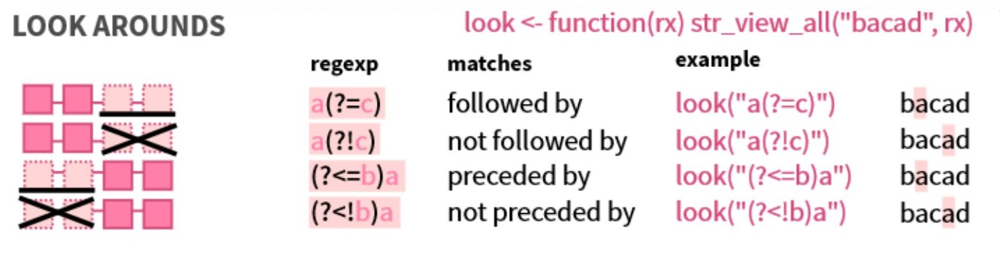

```{r, echo = FALSE, message = FALSE, warning = FALSE}  
#-----load required packages-----  
if (!require("pacman")) install.packages("pacman")
pacman::p_load(here,  
               tidyverse,
               tidytext, 
               topicmodels,
               DT) # for visualising tables   
```


# Introduction   

Comment fields sit right in between tidy tabular data entries and large text files (i.e. documents) in terms of wrangling effort. They require human naunce to decode and more problematically, both the quality and completeness of comment entries vary depending on individual engagement with reporting requirements.   

This can make it hard to gauge whether wrangling comment fields is a fruitful endeavour (especially when you have multiple other data sources that need examining). Luckily, some knowledge of string manipulations and regular expressions can help simplify this process.      


# Creating a test dataset   

Let's imagine that my local chocolate company, [Haighs Chocolates](https://www.haighschocolates.com.au), wants to understand what food critics versus Haighs fans think about their newest product. They send out a bag of free samples with a link to an online survey that asks individuals to rate their chocolates (on a scale of 1 to 10) and provide additional comments.    

**Note:** The code used to create this dataset can be accessed from the `Rmd` file accompanying this tutorial.    

```{r, echo = FALSE, warning = FALSE}
#-----creating a test dataset-----
# this chunk of code has no other purpose except to provide us with an example dataset    
survey_list <- list(
  expert_1 = c(8, '<textarea name="comment" form="1"> &lt;Grade A beans.&gt; Easily melts. Smooth chocolate shell, with a crunchy malty filling, and not so sweet <p> I enjoyed this. </textarea>'), 
  
  expert_2 = c(7, '<textarea name="comment" form="1"> &lt;Grade A beans with subtle caramel hints.&gt; Melts well. Smooth exterior. Glossy coating. Malt-filled core may be too sweet for some. </textarea>'),  
  
  expert_3 = c(8, '<textarea name="comment" form="1"> &lt;Grade A beans.&gt; <p> Caramel and vanilla undertones complement the bitter dark chocolate - low sugar content and smooth chocolate shell. <p> Recommended. </textarea>'),  
  expert_4 = c(10, '<textarea name="comment" form="1"> &lt;Grade A cocoa beans.&gt; Melts easily. Smooth dark chocolate contrasts nicely against the crunchy malty filling. </textarea>'),  
  
  expert_5 = c(7, '<textarea name="comment" form="1"> &lt;Grade A beans,&gt; likely of Ecuador origin. Smooth dark chocolate coating. Malt filling ratio could be decreased. Easy to eat. </textarea>'),  
  
  fan_1 = c(9, '<textarea name="comment" form="1"> Delicious and melts in your mouth. The malt crunch is a nice touch <p> Would recommend. </textarea>'),  
  
  fan_2 = c(10, '<textarea name="comment" form="1"> Smooth dark chocolate shell likely made from grade A beans. Has some nice crunch. <p> This is definiely one of my new favourites! </textarea>'),  
  
  fan_3 = c(8, '<textarea name="comment" form="1"> Tastes great. Smooth and tasty chocolate. <p> Recommended. </textarea>'),  
  
  fan_4 = c(10, '<textarea name="comment" form="1"> This will be one of my new favourites. Love the malty interior! </textarea>'),  
  
  fan_5 = c(9, '<textarea name="comment" form="1"> Haighs has a history of using the best (grade A) beans. Love the caramel undertones. </textarea>'),  
  
  fan_6 = c(9, '<textarea name="comment" form="1"> Delicious :)!!! </textarea>')
)  

survey <- survey_list %>% 
  map_df(~ as_tibble(t(.))) # transpose list and convert into data frame  

survey <- survey %>%
  mutate(respondee = names(survey_list)) %>%
  rename("rating" = "V1",
         "comment_field" = "V2") %>%
  select(respondee, everything()) # reorder respondee as first column  
```

```{r}
#-----quickly visualise the test dataset-----  
survey %>%
  head(10) # fields containing html flags are not properly rendered by kable 
```


# Introduction to regular expressions       

Regular expressions (or regex) can be thought of as a separate syntax for handling patterns in strings. In R, regular expressions can be directly enclosed inside quotes (`""` or `''`) like regular character strings, or explicitly referenced inside `regex()`. For convenience, I prefer the former approach but the latter approach can help increase code readability.                  

```{r, results = 'hide'}
#-----call regular expressions in R-----
many_apples <- c("Apple", "apple", "APPLE", "apples")

str_extract(many_apples, # the string
            "apples?") # the pattern i.e. regex  
#> [1] NA       "apple"  NA       "apples"

#-----call regular expressions in R using regex()-----
# regex() provides additional arguments

str_extract(many_apples, 
            regex("apples?", ignore_case = T))  
#> [1] "Apple"  "apple"  "APPLE"  "apples"

# regex() also allows comments to improve regex readability  

str_extract(many_apples, 
            regex("
                  apple  # contains the word apple
                  s?  # contains zero or one of the letter s
                  " , comments = T))
#> [1] NA       "apple"  NA       "apples"  
```


## Match characters   

Some sequences of characters have specific meanings. For example, `s` refers to the letter `"s"` but `\s` refers to any type of white space. To call `\s` whitespace in R, an additional backslash `\` is required to escape special character behaviour i.e. `\\s`.          

```{r, results = 'hide'}
#-----examples of special character sequences-----  
words_and_spaces <- c("a cat",
                      "acat",
                      "a   cat",
                      "a\ncat",
                      "a\\ncat")

# "a\\s+cat" calls variations of a...cat separated by one or more whitespaces 
# note that the string "a\ncat" also counts because \n refers to a new line

str_extract(words_and_spaces, "a\\s+cat")  
#> [1] "a cat"   NA        "a   cat" "a\ncat"  NA      

# "\\S+" refers to everything that is not white space (starting from left to right)  

str_extract(words_and_spaces, "\\S+")  
#> [1] "a"       "acat"    "a"       "a"       "a\\ncat"
```

**Note:** The special characters `\s` versus `\S`, `\d` versus `\D` and `\w` versus `\W` are handy as they allow the extraction of opposite pattern types. For example, `\w` refers to any word character whilst `\W` and `[\w]` both refer to anything that is not a word character.       


## Character anchors   

I feel that the goal of writing good regex is to be as specific as possible. This is why character anchors can be useful (i.e. using `^` and `$` to denote the start and end of your string respectively).     

If we revisit the regex example above, we can clearly see that the presence or absence of character anchors mean very different things.    

```{r, results = 'hide'}
#-----impact of character anchors-----    
words_and_spaces <- c("a cat",
                      "acat",
                      "a   cat",
                      "a\ncat",
                      "a\\ncat")

# "\\S+" refers to everything that is not white space (from left to right unless specified)  

str_extract(words_and_spaces, "\\S+")  
#> [1] "a"       "acat"    "a"       "a"       "a\\ncat"  

str_extract(words_and_spaces, "^\\S+")  
#> [1] "a"       "acat"    "a"       "a"       "a\\ncat"  # same output    

str_extract(words_and_spaces, "\\S+$") 
#> [1] "cat"     "acat"    "cat"     "cat"     "a\\ncat" # different output      
```


## Character classes and groupings   

Creating character classes and groupings is handy when you are interested in extracting specific letter and/or digit combinations. Special characters that are often found inside character classes and groupings:  

+ The operation `or` is represented by `|` i.e [a|c]   
+ The operation `range` is represented by `-` i.e. [a-z]   
+ The operation `excludes` is represented by `^` i.e. [^a-c]     

```{r, results = 'hide'}
#-----extract patterns using character classes i.e. []-----  
strange_fruits <- c("apple1",
                    "bapple2",
                    "capple3",
                    "dapple4",
                    "epple5",
                    "aggle0")

str_extract(strange_fruits, "[a-d]")
#> [1] "a" "b" "c" "d" NA  "a"  

# "[a-d][^p]" refers to one character between a and d followed by one character that is not p  

str_extract(strange_fruits, "[a-d][^p]")
#> [1] NA   "ba" "ca" "da" NA   "ag"   

# "[0|5-9]" refers to a number that is zero or a number from 4 to 9

str_extract(strange_fruits, "[0|4-9]")
#> [1] NA  NA  NA  "4" "5" "0"   
```

```{r, results = 'hide'}
#-----extract character using groupings i.e. ()-----     
strange_fruits <- c("apple1",
                    "bapple2",
                    "capple3",
                    "dapple4",
                    "epple5",
                    "aggle1")  

str_extract(strange_fruits, "a(pp|gg)le")
#> [1] "apple" "apple" "apple" "apple" NA      "aggle"    

# groups can be referenced by their order of appearance i.e. \\1 = first group = (e)  

str_extract(strange_fruits, "(a)(p|g)\\2")
#> [1] "app" "app" "app" "app" NA    "agg"   

# (e) is group 1 and referred to as \\1   
# (p|g) is group 2 and referred to as \\2   
```

**Note:** The difference between a character class and a grouping is that a character class refers to only one character (whilst allowing for multiple character forms), whereas a group refers to an entire sequence of characters.   

## Greedy versus lazy matches   

Using a non-greedy as opposed to greedy match allows you to extract just the first sequence of characters separated by a white space or punctuation mark. This use case is most applicable to trimming strings or extracting file or object names.       

```{r, results = 'hide'}
#-----use cases for greedy matches-----   
messy_dates <- c("Thursday 24th May",
                 "Thursday  24th May  ",
                 "May",
                 "May    ")

# extract the first word in the string      

str_extract(messy_dates, "^\\w+") # * represents zero or more of i.e. a greedy match   
#> [1] "Thursday" "Thursday" "May"      "May"   

str_extract(messy_dates, "^\\w{0,}") # * and {0,} are the same  
#> [1] "Thursday" "Thursday" "May"      "May"    

str_extract(messy_dates, "^(\\S+)") # also produces the same output  
#> [1] "Thursday" "Thursday" "May"      "May"    

#-----use cases for non-greedy matches-----  
str_replace_all(messy_dates, "\\s" , "-") # replaces each individual whitespace
#> [1] "Thursday-24th-May"    "Thursday--24th-May--" "May"                  "May----"       

str_replace_all(messy_dates, "\\s{1,4}" , "-") 
#> [1] "Thursday-24th-May"  "Thursday-24th-May-" "May"                "May-"       

# use look arounds (next topic) to replace the whitespace(s) after the first word     

str_replace_all(messy_dates, "(?<=^\\S{1,100})\\s{1,4}" , "-") 
#> [1] "Thursday-24th May"   "Thursday-24th May  " "May"                 "May-"     

```

**Note:** For further details exploring the last example, read [this stack overflow post](https://stackoverflow.com/questions/52431841/how-to-find-the-first-space-in-a-sentence-with-regular-expressions-within-r).       


## Look arounds    

Look around operations are useful when you are unsure of the pattern itself, but you know exactly what its preceding or following pattern is. I've found that the clearest explanation of look around operations comes from the RStudio cheetsheet on [`string_r`](https://github.com/rstudio/cheatsheets/blob/master/strings.pdf) and is depicted below.         

```{r, echo = FALSE, fig.align = 'center', fig.show = 'hold', out.width = '60%'} 
  
```

```{r, results = 'hide'}
#-----use cases for different types of look arounds-----  
recipes <- c("crossiant recipes",
             "apple pie recipe",
             "chocolate cake  recipe", # extra space
             "cookie receipe",  # deliberate typo
             "secret KFC-recipe", 
             "very secret  McDonalds soft-serve recipe") # extra space  

# use positive look-ahead (?=...) to extract the preceding word

str_extract(recipes, "\\S+(?=\\s?(recipes?))")   
#> [1] "crossiant"  "pie"        NA           NA           "KFC-"       "soft-serve"   

# use positive look-behind (?<=) to identify the secret recipe   

str_extract(recipes, "(?<=secret\\s{1,10})\\S+.+")   
#> [1] NA                            NA                            NA                           
#> [4] NA                            "KFC-recipe"                  "McDonalds soft-serve recipe"
```

**Note:** Positive look-behinds require defined boundary specifications i.e. the operation `+` needs to be converted into `{1,1000}`.     


# Improving comment field readability   

With regex revised, let us return to the Haighs chocolate survey. The first thing we can see is that html tags have been retained inside the comment field and that this field is very long (i.e. difficult to read).   

We can improve the readability of the survey by:  

+ Removing all html tags using regex.    
+ Separating phrases into individual fields i.e. columns using [`separate()`](https://tidyr.tidyverse.org/reference/separate.html).     

```{r}
#-----examine survey data-----
survey %>%
  head(5)   

#-----remove html tags-----
remove_html_tags <- regex("
                          <  # starts with <
                          [^>]+  # contains one or more of all characters excepting > 
                          >  # ends with >
                          ", comments = T)

remove_more_html <- regex("
                          \\& # starts with &
                          \\w+ # contains one or more word characters
                          \\; # ends with ;
                          ", comments = T) 

survey <- survey %>%
  mutate(comment_field = str_replace_all(comment_field, remove_html_tags, ""),
         comment_field = str_replace_all(comment_field, remove_more_html, ""))

#-----examine comment field-----  
survey %>%
  select(comment_field) %>%
  head(5) %>%
  knitr::kable()
```

We can split the comment field into smaller phrases, separating by punctuation marks or conjunctions.     

```{r}
#-----separate comment field into an unknown number of columns of phrases-----    
nmax <- max(str_count(survey$comment_field, "[:punct:]|and|with|against")) + 1

survey <- survey %>%   
  separate(comment_field,
           into = paste0("Field", seq_len(nmax)),
           sep = "[:punct:]|and|with|against", # separate on punctuation or conjunctions  
           remove = F,
  extra = "warn",
  fill = "right") 

#-----examine comment field-----  
survey %>%
  select(-c(respondee, rating, comment_field)) %>%
  head(5) %>%
  knitr::kable()
```


# Extracting fields of interest     

After separating the comment field into individual phrases, I can see that there are references to:  

+ the cocoa bean grade  
+ presence of caramel or vanilla flavour     
+ chocolate smoothness    
+ how well the chocolate melts   
+ sugar content/ sweetness level  
+ malt filling   
+ chocolate coating     

Information about cocoa bean grade is highly structured. This means that extracting the letter following the word "Grade" is sufficient. A similar logic can be applied to extract whether caramel or vanilla flavour or chocolate smoothness was mentioned.          

```{r}
#-----extract information about cocoa bean grade-----
tidy_survey <- survey %>%
  select(comment_field) %>% 
  mutate(cocoa_grade = str_extract(comment_field, "(?<=[G|g]rade\\s{0,2})[A-C]"),
         is_caramel = case_when(str_detect(comment_field, "[C|c]aramel") ~ "yes",
                                TRUE ~ "NA"), 
         is_vanilla = case_when(str_detect(comment_field, "[V|v]anilla") ~ "yes",
                                TRUE ~ "NA"),
         is_smooth = case_when(str_detect(comment_field, "[S|s]mooth") ~ "yes",
                               TRUE ~ "NA"))

# note that when using case_when, TRUE cannot be a logical vector
```

For more descriptive topics (i.e. )   

```{r}
melt_status <- survey 
  
```


# Difference between gsub and str_replace
# Difference between replace and str_replace


# Other resources   

+ This tutorial is based on the excellent [regular expressions vignette](https://cran.r-project.org/web/packages/stringr/vignettes/regular-expressions.html)  from `stringr`.   
+ [Strings chapter](https://r4ds.had.co.nz/strings.html) from R4DS by Garrett Grolemund and Hadley Wickham.         
+ The Rstudio [`stringr` cheatsheet](https://github.com/rstudio/cheatsheets/blob/master/strings.pdf).   
+ Sites for testing your own regular expressions:  
  + (https://regex101.com/)     
+ https://monkeylearn.com/topic-analysis/  
+ https://www.tidytextmining.com/tidytext.html
+ https://www.tidytextmining.com/topicmodeling.html

