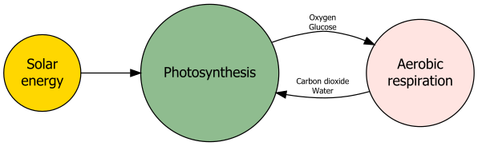
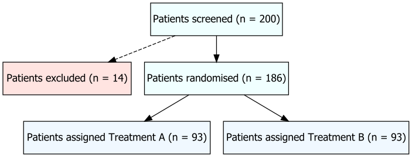

Using DiagrammeR to draw flow charts
================
Erika Duan
2020-06-10

  - [Introduction](#introduction)
  - [Introduction to DiagrammeR](#introduction-to-diagrammer)
  - [Using `create_graph()` to create a simple
    graph](#using-create_graph-to-create-a-simple-graph)
  - [Using `grVis()` to create a simple flow
    chart](#using-grvis-to-create-a-simple-flow-chart)
  - [Using `grVis()` to create more complex flow
    charts](#using-grvis-to-create-more-complex-flow-charts)
      - [Workflow structure flow chart](#workflow-structure-flow-chart)
      - [Clinical trial progress flow
        chart](#clinical-trial-progress-flow-chart)
      - [Multi-site clinical trial progress flow
        chart](#multi-site-clinical-trial-progress-flow-chart)
  - [Other resources](#other-resources)

# Introduction

Each Friday, I have been waking up at 6 am AEST to attend the [R Toronto
data workshop
series](https://rohanalexander.com/toronto_data_workshop.html)
co-founded by [Rohan Alexander](https://rohanalexander.com/) and [Kelly
Lyons](individual.utoronto.ca/klyons/). This week, [Marija
Pejcinovska](https://www.statistics.utoronto.ca/people/directories/graduate-students/marija-pejcinovska),
a PhD student from the University of Toronto talked in part about using
string distance algorithms to integrate data (global maternity rates)
from multiple data sources.

Marija’s slides also contained some R package recommendations, such as
using `DiagrammeR` to create flow charts. As someone who has to create a
lot of flow charts, I thought to give `DiagrammeR` a try.

# Introduction to DiagrammeR

`DiagrammeR` depends on `igraph` and `visNetwork`, which are
network/graphical visualisation packages. According to its comprehensive
[package
documentation](https://rich-iannone.github.io/DiagrammeR/graphviz_and_mermaid.html),
`DiagrammeR` supports the expression and visualisation of a graph
description language called the DOT language.

``` r
#-----examining DiagrammeR package dependencies----  
packages <- installed.packages() 
packages[packages[, "Package"] == "DiagrammeR", "Imports"] 
```

    ## [1] "dplyr (>= 0.7.6), downloader (>= 0.4), glue (>= 1.3.0),\nhtmltools (>= 0.3.6), htmlwidgets (>= 1.2), igraph (>= 1.2.2),\ninfluenceR (>= 0.1.0), magrittr (>= 1.5), purrr (>= 0.2.5),\nRColorBrewer (>= 1.1-2), readr (>= 1.1.1), rlang (>= 0.2.2),\nrstudioapi (>= 0.7), scales (>= 1.0.0), stringr (>= 1.3.1),\ntibble (>= 1.4.2), tidyr (>= 0.8.1), viridis (>= 0.5.1),\nvisNetwork (>= 2.0.4)"

As described in a great tutorial
[here](https://cyberhelp.sesync.org/blog/visualization-with-diagrammeR.html),
there are three different ways to create a graph:

  - Using the functions `create_graph()` and `render_graph()` on a list
    of nodes and edges.  
  - Creating a valid diagram specification in DOT language and passing
    this to the function `grViz()`.  
  - Creating a valid diagram specification and passing this to the
    function `mermaid()`.

# Using `create_graph()` to create a simple graph

The simplest way is to create a graph is to use `create_graph()` on a
list of nodes and edges dataframes. This method is very powerful for
drawing simple relationships between objects with numerical vector IDs
or highlighting features within complex graphical networks . The full
list of node and edge attributes can be found
[here](https://rich-iannone.github.io/DiagrammeR/ndfs_edfs.html).

``` r
#-----define graph edges and nodes-----  
# 1 == "Photosynthesis"
# 2 == "Aerobic respiration"  
# 3 == "Solar energy"  

edges <- create_edge_df(from = c(1, 2, 3), # code numerical vectors only
                        to = c(2, 1, 1),
                        label = c("Oxygen \n Glucose", "Carbon dioxide \n Water", NA),
                        color = "black") 

nodes <- create_node_df(n = 3,
                        label = c("Photosynthesis", "Aerobic \n respiration", "Solar \n energy"),
                        type = "lower",
                        style = "filled",
                        fillcolor = c("darkseagreen", "mistyrose", "gold"), 
                        fontcolor = "black",
                        shape = "circle",
                        fixedsize = T)

#-----create graph-----
my_graph <- create_graph(nodes_df = nodes, edges_df = edges)  

#-----render graph-----
# render_graph(my_graph) does not work for rendering github documents  

#-----export graph-----
export_graph(my_graph, file_name = here("02_figures", "2020-06-06_simple-flowchart.svg"),
             file_type = "svg")
```


There are several limitations to this approach when you want to create a
flow chart instead of a graph, and your flow chart contains detailed
specifications.

  - Edges must be coded as numerical vector IDs, and subsequently
    labelled by numerical vector ID order in nodes.  
  - There is no easy way to specify node positions (it would make more
    sense to have Solar energy displayed as the top node).  
  - There is no easy way to specify edge label positions.  
  - The final graph is trimmed if the node labels are too long.

# Using `grVis()` to create a simple flow chart

Instead, I would greatly recommend the `grVis()` approach for drawing
customisable flow charts.

``` r
#-----create a simple flow chart using grViz-----  
my_graphviz <- grViz("digraph {
         
               graph[layout = dot, rankdir = LR]
                     
               node[shape = circle, style = filled] # set global node attributes 
                     
               a[label = 'Photosynthesis', fillcolor = 'darkseagreen']
               b[label = 'Aerobic \nrespiration', fillcolor = 'mistyrose']
               c[label = 'Solar \nenergy', fillcolor = 'gold']

               edge[color = black, fontsize = 8] # set global edge attributes  
                     
               a -> b[label = 'Oxygen \nGlucose']
               a -> b[style = 'invis']
               b -> a[label = 'Carbon dioxide \n Water']
               b -> a[style = 'invis']
               b -> a[style = 'invis']
               b -> a[style = 'invis']
               c -> a[label = '            ']
                     
               }")

# my_graphviz

#-----export graph-----
my_graphviz %>% 
  export_svg %>%
  charToRaw %>%
  rsvg_svg(here("02_figures", "2020-06-06_simple-flowchart-grVis.svg"))
```



A few tricks I used above were:

  - To set global attributes for nodes and edges, and then override
    where required with local attributes.  
  - To create additional layers of invisible edges, for lengthening the
    arrows between specific nodes as recommended
    [here](https://stackoverflow.com/questions/11283701/how-to-specify-the-length-of-an-edge-in-graphviz).  
  - To create an edge label with an empty string, for lengthening a
    specific edge.

# Using `grVis()` to create more complex flow charts

You will quickly discover that `grVis` is an incredibly versatile tool.

## Workflow structure flow chart

In this example, I am interested in creating a flow chart of my machine
learning workflow to share with another data science team (this example
is heavily inspired by [an example from Michael Harper’s
blog](https://mikeyharper.uk/flowcharts-in-r-using-diagrammer/)).

Note that the different types of node shapes available are listed
[here](https://www.graphviz.org/doc/info/shapes.html).

``` r
#-----create a flow chart describing my ML workflow-----  
my_ML_workflow <- grViz("digraph {
         
                  graph[layout = dot]
                     
                  node[shape = rectangle, style = filled, fillcolor = 'blanchedalmond'] 
                     
                  data_source_1[label = 'Data \n warehouse', shape = cylinder, fillcolor = 'azure']
                  data_source_2[label = 'Survey.csv', fillcolor = 'aliceblue']
                  data_source_3[label = 'External data \n API', shape = cylinder, fillcolor = 'azure']
                  
                  process_1[label = 'Data cleaning \n and joining']
                  process_2[label = 'Feature selection']
                  process_3[label = 'Split train \n and test dataset']  
                  process_4[label = 'Cross-validation']  
                  process_5[label = 'Test different \n ML algorithms']
                  process_6[label = 'Evaluate different \n ML algorithms']
                     
                  file_1[label = 'Clean data', fillcolor = 'aliceblue']
                  file_2[label = 'Training data', fillcolor = 'aliceblue']
                  file_3[label = 'Test data', fillcolor = 'aliceblue']
                     
                  product_1[label = 'Optimal \n ML model', shape = 'ellipse', fillcolor = 'lightsalmon']
                     
                  edge[color = black, fontsize = 12] # set global edge attributes
                     
                  data_source_1 -> process_1
                  data_source_2 -> process_1
                  data_source_3 -> process_1  
                     
                  process_1 -> file_1
                     
                  file_1 -> process_2
                  process_2 -> process_3
                  process_3 -> file_2
                  process_3 -> file_3
                     
                  file_2 -> process_4
                  process_4 -> process_5
                  process_5 -> process_4
                     
                  process_5 -> file_3
                  file_3 -> process_6
                  process_6 -> product_1
                     
                  product_1 -> process_4[label = '      Constantly monitor \n for ML model drift',
                                         style = 'dashed', penwidth = 2, weight = 2, 
                                         color = 'firebrick', fontcolor = 'firebrick']
                     
                  }")

# my_ML_workflow  

#-----export graph-----
my_ML_workflow %>% 
  export_svg %>%
  charToRaw %>%
  rsvg_svg(here("02_figures", "2020-06-06_simple-flowchart-ML-workflow.svg"))
```


## Clinical trial progress flow chart

Another handy feature of `grVis()` is that values generated in R can be
directly passed into flow charts.This is done by setting node labels as
`@@n` within the graph and passing values to `[n]` in the footer of the
plot.

``` r
#-----create flow chart dependent on changing parameters-----  
# store data inside a list
set.seed(111)
a <- 200
b <- sample(1:60, 1)
c <- 200 - b
d <- ceiling(c/2)
e <- c - d

flow_chart_data <- list(a, b, c, d, e)

# create grVis graph

simple_trial <- grViz("digraph {
         
                graph[layout = dot]
                     
                node[shape = rectangle, style = filled, margin = 0.2, fillcolor = 'azure']  
                     
                a[label = '@@1']
                b[label = '@@2', fillcolor = 'mistyrose']
                c[label = '@@3']
                d[label = '@@4', fillcolor = 'aliceblue']
                e[label = '@@5', fillcolor = 'aliceblue']

                edge[color = black] # set global edge attributes  
                
                a -> b[style = 'dashed']
                a -> c[weight = 2] # weighs this edge to be centrally placed 
                c -> d
                c -> e
                     
                }
                     
[1]: paste0('Patients screened (n = ', flow_chart_data[[1]], ')')
[2]: paste0('Patients excluded (n = ', flow_chart_data[[2]], ')')
[3]: paste0('Patients randomised (n = ', flow_chart_data[[3]], ')')
[4]: paste0('  Patients assigned Treatment A (n = ', flow_chart_data[[4]], ')')
[5]: paste0('  Patients assigned Treatment B (n = ', flow_chart_data[[5]], ')')
") 

# simple_trial  

#-----export graph-----
simple_trial %>% 
  export_svg %>%
  charToRaw %>%
  rsvg_svg(here("02_figures", "2020-06-06_flowchart-clinical-single.svg"))
```



## Multi-site clinical trial progress flow chart

Things get better as `grVis()` also allows visualisation of subgroups
within a graph.

The process of adding subgroups involves:

1.  Define subclusters.
2.  Define nodes in each subcluster.  
3.  Define edges as usual.

<!-- end list -->

``` r
#-----create flow chart with subgroups that are dependent on changing parameters-----  
# store data inside a list
set.seed(111)
a <- 200
b <- sample(1:60, 1)
c <- 200 - b
d <- ceiling(c/2)
e <- c - d

set.seed(222)
f <- 125
g <- sample(1:45, 1)
h <- 125 - b
i <- ceiling(h/2)
j <- h - i

hospital_a <- list(a, b, c, d, e)
hospital_b <- list(f, g, h, i, j)

# create grVis graph  

multi_trial <- grViz("digraph {

               graph[layout = 'dot', rankdir = TB]
               
               node[shape = rectangle, style = filled, margin = 0.2, fillcolor = 'azure']
               
               subgraph cluster_a { 
               graph[rankdir = TB, label = 'Hospital A', fontsize = 18, 
                     shape = rectangle, style = dashed]

               a[label = '@@1']
               b[label = '@@2', fillcolor = 'mistyrose']
               c[label = '@@3']
               d[label = '@@4', fillcolor = 'aliceblue']
               e[label = '@@5', fillcolor = 'aliceblue']
               
               }
               
               subgraph cluster_b { 
               graph[rankdir = TB, label = 'Hospital B', fontsize = 18, 
                     shape = rectangle, style = dashed]
             
               f[label = '@@6']
               g[label = '@@7', fillcolor = 'mistyrose']
               h[label = '@@8']
               i[label = '@@9', fillcolor = 'aliceblue']
               j[label = '@@10', fillcolor = 'aliceblue']
               
               }
               
               edge[color = black]
               
               a -> b[style = 'dashed']
               a -> c[weight = 2] # weighs this edge to be centrally placed 
               c -> d
               c -> e
               f -> g[style = 'dashed']
               f -> h[weight = 2] # weighs this edge to be centrally placed 
               h -> i
               h -> j
               
               }
      
[1]: paste0('Patients screened (n = ', hospital_a[[1]], ')')
[2]: paste0('Patients excluded (n = ', hospital_a[[2]], ')')
[3]: paste0('Patients randomised (n = ', hospital_a[[3]], ')')
[4]: paste0('  Patients assigned Treatment A (n = ', hospital_a[[4]], ')')
[5]: paste0('  Patients assigned Treatment B (n = ', hospital_a[[5]], ')')
[6]: paste0('Patients screened (n = ', hospital_b[[1]], ')')
[7]: paste0('Patients excluded (n = ', hospital_b[[2]], ')')
[8]: paste0('Patients randomised (n = ', hospital_b[[3]], ')')
[9]: paste0('  Patients assigned Treatment A (n = ', hospital_b[[4]], ')')
[10]: paste0('  Patients assigned Treatment B (n = ', hospital_b[[5]], ')')
")  

# multi_trial

#-----export graph-----
multi_trial %>% 
  export_svg %>%
  charToRaw %>%
  rsvg_svg(here("02_figures", "2020-06-06_flowchart-clinical-multiple.svg"))
```


# Other resources

  - DiagrammeR [package
    documentation](https://rich-iannone.github.io/DiagrammeR/graphviz_and_mermaid.html).

  - DiagrammeR
    [vignette](https://cran.r-project.org/web/packages/DiagrammeR/vignettes/node-edge-data-frames.html)
    for creating node and edge data frames.

  - A great [blog
    post](https://cyberhelp.sesync.org/blog/visualization-with-diagrammeR.html)
    by Rachael Blake comparing the `create_graph()` and `grVis()`
    approach.

  - A great [blog
    post](https://mikeyharper.uk/flowcharts-in-r-using-diagrammer/) by
    Michael Harper on using `grVis()` to draw flow charts.
