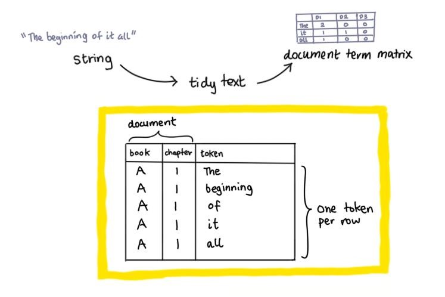

```{r, echo = TRUE, message = FALSE, warning = FALSE}  
#-----load required packages-----  
if (!require("pacman")) install.packages("pacman")
pacman::p_load(here,  
               tidyverse,  
               tidytext,
               textstem) # for lemmatisation and stemming    
```


# Introduction    

What are examples of useful natural language processing (NLP) projects? Since the creation of [GTP-3](https://www.youtube.com/watch?v=_x9AwxfjxvE), some uses of natural language processing models have been:   

+ To answer questions (if the answer to the question can be extracted from the text).    
+ Document summarisation (human oversight is required to confirm that the content of the summary has not altered).    
+ Document retrieval (if the most relevant documents can be found within the collective corpus).        

Let's attempt to summarise a series of documents, or to be precise, chocolate samples surveys in this tutorial.  

# Creating a test dataset   

Let's revisit the Haighs chocolate survey that I used in a [previous tutorial](https://github.com/erikaduan/R-tips/blob/master/03_blog_posts/2020-05-16_untangling-strings/2020-05-16_untangling-strings.md) about regular expressions and cleaning free text fields. The survey has already been stripped of html elements using regular expressions.              

**Note:** The code used to create this dataset can be accessed from the `Rmd` file accompanying this tutorial.    

```{r, echo = FALSE, warning = FALSE}
#-----creating a test dataset-----
# this chunk of code has no other purpose except to provide us with an example dataset    
survey_list <- list(
  expert_1 = c(8, '<textarea name="comment" form="1"> &lt;Grade A beans.&gt; Easily melts. Smooth chocolate shell, with a crunchy malty filling, and not so sweet <p> I enjoyed this. </textarea>'), 
  
  expert_2 = c(7, '<textarea name="comment" form="1"> &lt;Grade A beans with subtle caramel hints.&gt; Melts well. Smooth exterior. Glossy coating. Malt-filled core may be too sweet for some. </textarea>'),  
  
  expert_3 = c(8, '<textarea name="comment" form="1"> &lt;Grade A beans.&gt; <p> Caramel and vanilla undertones complement the bitter dark chocolate - low sugar content and smooth chocolate shell. <p> Recommended. </textarea>'),  
  expert_4 = c(10, '<textarea name="comment" form="1"> &lt;Grade A cocoa beans.&gt; Melts easily. Smooth dark chocolate contrasts nicely against the crunchy malty filling. </textarea>'),  
  
  expert_5 = c(7, '<textarea name="comment" form="1"> &lt;Grade A beans,&gt; likely of Ecuador origin. Smooth dark chocolate coating. Malt filling ratio could be decreased. Easy to eat. </textarea>'),  
  
  fan_1 = c(9, '<textarea name="comment" form="1"> Delicious and melts in your mouth. The malt crunch is a nice touch <p> Would recommend. </textarea>'),  
  
  fan_2 = c(10, '<textarea name="comment" form="1"> Smooth dark chocolate shell likely made from grade A beans. Has some nice crunch. <p> This is definiely one of my new favourites! </textarea>'),  
  
  fan_3 = c(8, '<textarea name="comment" form="1"> Tastes great. Smooth and tasty chocolate. <p> Recommended. </textarea>'),  
  
  fan_4 = c(10, '<textarea name="comment" form="1"> This will be one of my new favourites. Love the malty interior! </textarea>'),  
  
  fan_5 = c(9, '<textarea name="comment" form="1"> Haighs has a history of using the best (grade A) beans. Love the caramel undertones. </textarea>'),  
  
  fan_6 = c(9, '<textarea name="comment" form="1"> Delicious :)!!! </textarea>')
)  

survey <- survey_list %>% 
  map_df(~ as_tibble(t(.))) # transpose list and convert into data frame  

survey <- survey %>%
  mutate(respondee = names(survey_list)) %>%
  rename("rating" = "V1",
         "comment_field" = "V2") %>%
  select(respondee, everything()) # reorder respondee as first column  

survey <- survey %>%
  mutate(comment_field = str_replace_all(comment_field, "<[^>]+>", ""),
         comment_field = str_replace_all(comment_field, "\\&\\w+\\;", ""))  

survey %>%
  knitr::kable()
```


# Tidy data principles     

The `tidytext` structure consists of a data table containing a single token per row (which can be a single word, bigram, sentence, line, paragraph or separation around a regular expression pattern). The function `unnest_token` is used to tokenise a body of text (i.e. corpus).    

```{r, echo = FALSE, fig.align = 'center', fig.show = 'hold', out.width = '80%'} 
  
```

The basic workflow for natural language processing involves:  

1. Tokenisation - process should be very fast as it occurs before other processing tasks.  

2. Normalisation     

3. Lemmatisation or stemming - lemmatisation algorithms can be complex whereas stemming is a lot faster but cruder.          

## Tokenisation    

Tokenisation is the task of segmenting running text into words. It needs to consider whether punctuation should be removed (when it indicates a sentence or phrase boundary) or kept (as some words contain punctuation i.e. a.m., Inc., ). It needs to consider whether clitic contractions (i.e. can't, don't and we'll) should be expanded and whether multiword expressions should be captured as a single token (i.e. New York, rock and roll).    

For example, the Penn Treebank tokenisation standard:   

+ Separates out clitic contractions (separates don't into does and n't).   
+ Keeps hyphenated words together.  
+ Separates out all punctuation.  

**Note:** It can be useful to construct subword tokens (i.e. morphemes) to process unknown words in a test corpus. An example is byte-pair encoding, which merges the most frequently occuring letter/symbol pairs together to produce a reference list of subwords. New words found in the test corpus can then be broken down into known subwords, using regular expressions.    

```{r, results = 'hide'}
#-----tokenise survey using single words-----
tidy_survey <- survey %>%
  mutate(survey_number = seq(1 : nrow(survey))) %>%
  select(survey_number,
         "survey" = "comment_field") # rename and select column   

tidy_single_survey <- unnest_tokens(tidy_survey,
                                    output = word, input = survey,
                                    to_lower = F)  

nrow(tidy_single_survey)
#> [1] 170  
```

```{r, echo = FALSE}
#-----visualise tidy single survey-----    
head(tidy_single_survey) %>%
  knitr::kable()
```

```{r, results = 'hide'}
#-----tokenise survey using bigrams-----
tidy_bigram_survey <- unnest_tokens(tidy_survey,
                                    output = word, input = survey,
                                    token = "ngrams", n = 2, # bigrams
                                    to_lower = F)  

nrow(tidy_bigram_survey)
#> 160  
```

```{r, echo = FALSE}
#-----visualise tidy bigram survey-----    
head(tidy_bigram_survey) %>%
  knitr::kable()
```


## Normalisation  

Normalisation is the process of converting tokens into a standard format, for example by converting tokens into a lower case for generalisation (information retrieval and speech recognition) tasks.    

**Note:** Capitalisation is usually kept for text classification and information extraction tasks, as the preserving the difference between US (United States) and us is important for these tasks.       

```{r, results = 'hide'}
#-----convert tokens to lower case-----  
# conversation turns A from a grade into an article and stop word     

tidy_bigram_survey %>%
  mutate(word = tolower(word)) %>%
  head(6)

#>   survey_number word            
#>           <int> <chr>           
#> 1             1 grade a         
#> 2             1 a beans         
#> 3             1 beans easily    
#> 4             1 easily melts    
#> 5             1 melts smooth    
#> 6             1 smooth chocolate
```


## Lemmatisation versus stemming    

Lemmatisation is the non-trivial process of determining whether two words share the same root word i.e. the word *be* is the root word of *is*, *am* and *are*. The process involves separating individual words into stems (morpheme with a central meaning) and affixes (morphemes with additional meanings) using reference dictionaries built using specialised linguistics knowledge.        

In contrast, stemming can be used as a faster but cruder substitute for lemmatisation. Stemming is used to remove end-word affixes using a series of established rules i.e. replace `[a-z]est` with `[a-z]` and replace `sses` with `ss`.          

```{r, results = 'hide'}
#-----lemmatise words-----
lemmatize_strings("I saw the spotted puppy chasing the bouncing ball")
#> [1] "I see the spot puppy chase the bounce ball"    

#-----stem words-----
stem_strings("I saw the spotted puppy chasing the bouncing ball")
#> [1] "I saw the spot puppi chase the bounc ball"  
```


## Removal of stop words  

```{r}

```


# Basic tidy text analytics      

```{r}

```


# Term frequency-inverse document frequency (tf-idf)   

```{r}

```


# Topic modelling   

If the comment fields are short, you should actually be able to eyeball shared parameters of interest (i.e. cocoa bean grade, whether it melts well, whether it is smooth, whether malt filling was mentioned and whether it was sweet). 

A more systematic method would be to do some topic modelling (at the sub-sentence level) on the survey responses. A simple approach involves:  

+ Convert survey responses into a tidy text format (a table with one-token-per-row).  
+ Tokenise the text and clean tokens i.e. remove stop words.     
+ Create an LGA model with a predefined number of topics (k).    

```{r}
#-----creating a tidy text-----
# tidy_survey <- survey %>%
#   select(starts_with("Field", ignore.case = F)) %>%
#   pivot_longer(cols = everything(),
#                names_to = "line",
#                values_to = "text") # stack all fields into a single row of data  
# 
# # remove rows containing NA, "" or white space
# 
# tidy_survey <- tidy_survey %>%
#   mutate(text = str_replace_na(text)) %>% # convert NAs into "NA"  
#   filter(text != "NA",
#          text != "",
#          !(str_detect(text, "^\\s+$"))) %>%
#   mutate(line = seq_along(line))
# 
# # create and tidy tokens  
# 
# survey_tokens <- tidy_survey %>%
#   unnest_tokens(word, text) %>%
#   anti_join(stop_words) # remove common stop words i.e. "the", "of", "to"  
# 
# # count most frequent words 
# 
# survey_tokens <- survey_tokens %>% 
#   group_by(line) %>%
#   count(word, sort = TRUE) %>%
#   rename("document" = "line",
#          "term" = "word",
#          "count" = "n")
# ```
# 
# ```{r}
# #-----create a LDA_VEM topic model with 2 topics-----
# survey_dtm <- survey_tokens %>% 
#   cast_dtm(document, term, count) # requires a tibble with columns document|term|count
# 
# survey_lda <- LDA(survey_dtm, k = 2,
#                   control = list(seed = 123)) # set a seed to create a reproducible model  
# ```
# 
# ```{r}
# #-----extracting word topic probabilities-----  
# #  provides the probability of a term being generated from a topic
# survey_topics <- tidy(survey_lda, matrix = "beta")


```


# Resources  

+ The Speech and Language Processing [textbook](https://web.stanford.edu/~jurafsky/slp3/) by Dan Jurafsky and James H. Martin   
+ An introduction to [topic modelling](https://towardsdatascience.com/topic-modeling-in-nlp-524b4cffeb68)     