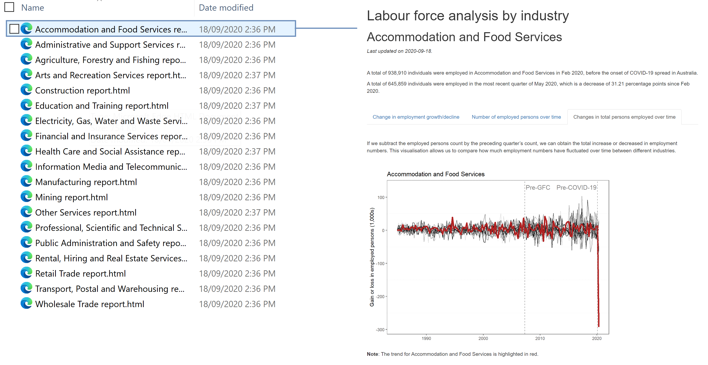

Automating R Markdown report generation (Part 2)
================
Erika Duan
2020-09-19

  - [Introduction](#introduction)
  - [Creating an R script for data sourcing and
    cleaning](#creating-an-r-script-for-data-sourcing-and-cleaning)
  - [Creating an R Markdown template
    report](#creating-an-r-markdown-template-report)
  - [Creating an R script for report
    automation](#creating-an-r-script-for-report-automation)
  - [Resources](#resources)

# Introduction

This post follows from [an earlier
post](https://github.com/erikaduan/R-tips/blob/master/03_blog_posts/2020-08-30_automating_RMDs/2020-08-30_automating_RMDs.md)
describing the preliminary steps towards automated reporting in R.

Creating an automated reporting workflow requires the following setup:

1.  A consistent file structure for project inputs (i.e. raw data),
    outputs (i.e. clean data) and analysis reports.  
2.  A data sourcing and cleaning script that can be refreshed.  
3.  An R Markdown template report that references report variables as
    yaml parameters.  
4.  A report automation script.


# Creating an R script for data sourcing and cleaning

We need to create a single R script that:

1.  Downloads raw data from its original source (i.e. an internet
    hyperlink or data API).  
2.  Cleans raw data.  
3.  Saves the clean dataset as an output.

This setup allows us to automate reporting changes whenever the original
source data is updated, assuming that there are no changes to data
formating.

``` r
#-----load required packages-----  
if (!require("pacman")) install.packages("pacman")
pacman::p_load(here,  
               tidyverse,
               readxl) # read excel spreadsheets    

#-----step 1: download ABS data-----  
data_url <- "https://beta.abs.gov.au/statistics/labour/employment-and-unemployment/labour-force-australia-detailed/jul-2020/6291004.xls"

download.file(data_url, destfile = here("data", "ABS_labour_force_by_industry_table_4.xls"), mode = "wb")   

#-----step 2: clean ABS data-----  
data_path <- here::here("data", "ABS_labour_force_by_industry_table_4.xls")

raw_table_4 <- data_path %>%
  excel_sheets() %>%
  set_names() %>% # extract all sheet names  
  str_subset(., "Data.+") %>% # subset relevant sheet names    
  map_dfc(~ read_excel(path = data_path,
                       sheet = .x, 
                       col_names = T)) 

raw_table_4 <- raw_table_4 %>%
  slice(10: nrow(raw_table_4)) %>%
  rename(date = ...1) %>%
  mutate(date = as.Date(as.numeric(date), origin = "1899-12-30")) %>%
  arrange(date)

remove_cols <- str_subset(colnames(raw_table_4), "^Employed total") # remove summary columns   

raw_table_4  <- raw_table_4  %>%
  select(-all_of(remove_cols))  

selected_cols <- colnames(raw_table_4)[c(1, # select date column
                                         seq(3, # select first seasonally adjusted column
                                             ncol(raw_table_4),
                                             by = 3))] # select consecutive seasonally adjusted columns    

raw_table_4 <- raw_table_4 %>%
  select(all_of(selected_cols))  

colnames(raw_table_4) <- str_remove_all(colnames(raw_table_4), "\\s;.+") # clean column names  

raw_table_4 <- raw_table_4 %>% # pivot longer to add industry type as a column  
  pivot_longer(cols = -date,
               names_to = "industry",
               values_to = "count") # units in 1000s  

raw_table_4 <- raw_table_4 %>%
  mutate(count = as.numeric(count),
         count = round(count, digits = 3)) # round counts to nearest person  

#-----step 3: save clean ABD data as output-----  
write_csv(raw_table_4, here("output", "tidy_ABS_labour_force_by_industry_table_4.csv"))  
```

# Creating an R Markdown template report

The R Markdown template report contains the code for data visualisation
and reporting outcomes.


The key difference between a standard data analytical report and an R
Markdown template report is the absence of hardcoded variables and
exploratory code in the template report. The template report should
contain the minimal and most efficient code required to generate your
report outputs (i.e. figures, tables and summary text).

An example of a chunk of code found inside my R Markdown template report
is shown below. The only step that uses hard coded variables is the
position of annotated text on the plot (this position remains fixed in
the report).

``` r
#-----figure 3: create change in employed persons plot-----  
fluctuations <- tidy_data %>%
  group_by(industry) %>%  
  mutate(count_change = count - lag(count, default = first(count))) %>%
  ungroup() 

first_count <- tidy_data %>%
  filter(industry == params$industry,
         date == min(date)) %>%
  pull(count)

single_fluctuation <- tidy_data %>%
  filter(industry == params$industry) %>%
  mutate(count_change = count - lag(count, default = first_count))

ggplot(fluctuations, aes(x = date, y = count_change)) +
  geom_line(aes(colour = industry)) +
  scale_colour_manual(values = getPalette(total_colours)) +  
  geom_line(data = single_fluctuation, col = "firebrick", size = 1.5) + 
  geom_vline(xintercept = c(as.Date(params$before_gfc), as.Date(params$before_covid)),
             colour = "grey50",
             linetype = "dashed") +
  labs(x = NULL,
       y = "Gain or loss in employed persons (1,000s)",  
       title = paste(params$industry)) + 
  theme_bw() + 
  theme() + 
  theme(panel.grid.major = element_blank(),
        panel.grid.minor.x = element_blank(),
        panel.grid.minor.y = element_line(linetype = "dashed"),
        legend.position = "none") +
  annotate("text", x = as.Date("2009-09-01"), y = 130,
           label = "Pre-GFC", colour = "grey50", size = 4.5) +   
  annotate("text", x = as.Date("2016-06-01"), y = 130,
           label = "Pre-COVID-19", colour = "grey50", size = 4.5)  
```

**Note:** As you are creating your template report, you can knit it into
an html report and test it iteratively until you generate final polished
product.

# Creating an R script for report automation

The R script for report automation is a simple for loop that contains:

1.  Your variables of interest (obtained from your clean dataset).  
2.  The function `render` which uses your R Markdown template report as
    its input file and your list of variables as the parameter of
    interest, to generate a series of output files.

**Note:** Remember to save your output files as `.html` files if you
want to render html reports.

``` r
#-----load required packages-----  
if (!require("pacman")) install.packages("pacman")
pacman::p_load(here,  
               tidyverse)  

#-----load required data-----  
tidy_data <- read_csv(here("output", "tidy_ABS_labour_force_by_industry_table_4.csv"))    

#-----create for loop to automate reporting-----  
for (industry_i in unique(tidy_data$industry)) {
  rmarkdown::render(
    input = here("src", "02_industry-report.Rmd"),
    params = list(industry = industry_i), 
    output_file = here("analysis", glue::glue("{industry_i} report.html"))
  )
}
```

Violà\! You can now enjoy the products of your automated reporting
workflow.



# Resources

  - A great [presentation](bit.ly/marvelRMD) and companion [blog
    post](https://themockup.blog/posts/2020-07-25-meta-rmarkdown/) by
    Thomas Mock on advanced R Markdown features.

  - A great [blog
    post](https://sharla.party/post/usethis-for-reporting/) on how to
    turn your R data analysis into a reproducible R package by Sharla
    Gelfand.

  - A great [blog
    post](https://emilyriederer.netlify.app/post/rmddd-tech-appendix/)
    by Emily Riederer on data analysis productionisation in R.

  - A great [blog
    post](https://towardsdatascience.com/what-does-it-mean-to-productionize-data-science-82e2e78f044c)
    by Schaun Wheeler on the importance of data science
    productionisation.
