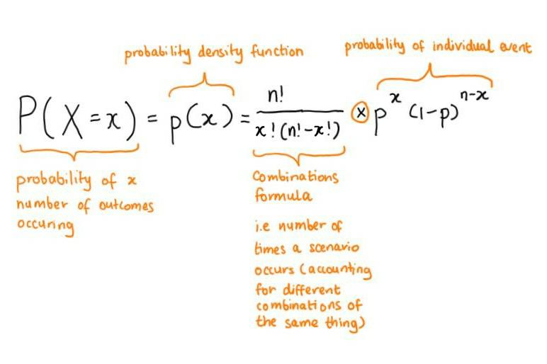
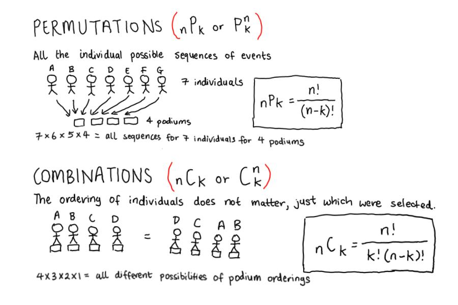

```{r, echo = TRUE, message = FALSE, warning = FALSE}  
#-----load required packages-----  
if (!require("pacman")) install.packages("pacman")
pacman::p_load(here,  
               tidyverse,
               ggrepel, 
               DescTools,
               Hmisc) 
```


# Introduction  

Discrete probability distributions are a great place to start learning about mathematical models. Discrete probability distributions can be used to describe real-world processes such as detecting manufacturing defects. This is because discrete probability distributions model variables which are categorical or discrete counts.   

# Bernoulli trial   

A bernoulli trial is the simplest discrete distribution. It has two important assumptions:  

+ There are only two possible outcomes for each trial. 
+ The outcome of individual trials is independent of each other (the first outcome does not affect the probability of a second outcome also happening).     

Keeping in mind that there are only two possible outcomes (i.e. x = 0 or x = 1), the probability mass function for a Bernoulli distribution is defined as $p^{x}\times(1-p)^{1-x}$.  

This can be simplied into the following conditions.     
$$p(x) = \begin{cases} 1 - p & for \; x = 0 \\
p & for \; x = 1 \end{cases} where \; 0<P<1$$    

The **expectation** (or theoretical mean of discrete random variables) of a Bernoulli distribution can therefore be calculated.  
$$E(X) = \sum_{i=0}^{1} x \times p(x) = 0\times (1-p)+1 \times p = p$$    

The **variance** of a Bernoulli distribution can also be easily calculated.      
$$Var(X) = E(X^2)-E(X)^2 = (0^2 \times (1-p)+1^2 \times p)-(p^2) = p(1-p)$$  

```{r, results = 'hide'}
#-----calculate the expectation and variance of a Bernoulli distribution-----  
summarise_bernoulli_dist <- function(p) {
  if(p == 0 | p >= 1) {
    stop("Error: probability must be between 0 and 1.")
  }
  
  mean <- p
  var <- p * (1 - p)
  
  list(P = p, 
       Expectation = mean,
       Variance = var)
}

summarise_bernoulli_dist(p = 0.23)  
#> $P
#> [1] 0.23
# 
#> $Expectation
#> [1] 0.23
# 
#> $Variance
#> [1] 0.1771
```


# Binomial distribution  

The binomial distribution can be described as a finite number of Bernoulli trials which are all independent of each other. Each independent trial has two discrete outcomes.      

Its probability mass function can be written as below.  
$$p(x) = \frac{n!}{x!(n-x)!} \times p^{x}(1-p)^{n-x}$$

This equation can be broken down into two components: the combinations formula (the total number of combinations of successes and failures can happen) and the bernoulli trial (i.e. the probability of one specific ordering of successes and failures).      

```{r, echo = FALSE, fig.align = 'center', fig.show = 'hold', out.width = '60%'}     
    
```

The binomial coefficient, or combinations formula, is represented below.   
$$\binom{n}{k} = \frac{n!}{k!(n-k)!} \; for \; k = 0, 1, 2, ... , n$$   

It arises from the concept of finding all combinations of a particular permutation of object orderings.      

```{r, echo = FALSE, fig.align = 'center', fig.show = 'hold', out.width = '80%'}     
    
```

```{r, results = 'hide'}
#-----calculate binomial probability-----  
# if the probability of an account being hacked is p = 0.001
# what is the probability 2 accounts are hacked out of 1000   

dbinom(x = 2, size = 1000, prob = 0.001)
#> [1] 0.1840317  

# what is the probability of 2 or less accounts being hacked out of 1000 accounts 

pbinom(q = 2, size = 1000, prob = 0.001)
#> [1] 0.9197907  

# what is the probability of more than 2 accounts being hacked out of 100 accounts  
1 - pbinom(q = 2, size = 1000, prob = 0.001)
#> [1] 0.08020934  
```

```{r, results = 'hide'}
#-----create binomial probability distribution function-----  
calc_binom_dist <- function(x, n, p) {
  combinations <- choose(n, x) 
  combinations * (p^x) * ((1-p)^(n-x))
}

calc_binom_dist(x = 2, n = 1000, p = 0.001) 
#> [1] 0.1840317
```

The **expectation** can be [derived](https://www.probabilisticworld.com/binomial-distribution-mean-variance-formulas-proof) as $E(X) = n\times p$. The intuitive explanation is that the mean of the binomial distribution is equal to the sum of the mean of each independent variable that constitutes the distribution.          

The **variance** can be [derived](https://www.probabilisticworld.com/binomial-distribution-mean-variance-formulas-proof) as $Var(X) = n \times p(1-p)$.      


# Binomial confidence intervals  


## Normal approximation interval      

To calculate [bionomial proportion confidence intervals](https://en.wikipedia.org/wiki/Binomial_proportion_confidence_interval), the easiest concept is to estimate normal approximation intervals for the binomial proportion. We assume that the distribution of the standard error of $\hat p$ is approximately normal. We can use this approach if our sample sizes are relatively large ($n\times p>5$ and $n\times q>5$) and the probability of each independent bernoulli trial is not close to 0 or 1.     

The normal approximation interval for a binomial proportion is represented below.   

$$C.I.\;for\;p = \hat p \times z \times \sqrt{\frac{\hat p(1-\hat p)}{n}}$$       

**Note:** Whilst the rationale for the normal approximation interval is the easiest to understand, its underlying assumption that the variance is independent of the mean renders it undesirable for use. The normal approximation interval is also called the Wald interval.      

```{r, results = 'hide'}
#-----estimate the unemployment rate using the normal approximation interval-----    
# 600 people were randomly surveyed and 78 were unemployed  

n <- 600
n_success <- 78  

#------calculate 95% and 99% confidence interval for the true unemployment rate-----  
# use the DescTools package  

BinomCI(n_success, n,
        conf.level = 0.95,
        sides = "two.sided",
        method = "wald")

#>      est    lwr.ci    upr.ci
#> [1,] 0.13 0.1030906 0.1569094

BinomCI(n_success, n,
        conf.level = 0.99,
        sides = "two.sided",
        method = "wald")

#>       est     lwr.ci    upr.ci
#> [1,] 0.13 0.09463507 0.1653649
```

```{r}
#-----create a function to manually calculate binomial normal approximation intervals-----  
calc_binom_CI_wald <- function(n, k, CI = 0.95) {
  if(!is.numeric(n)) {
    stop("Error: n must be a number (number of total trials).")
  }
  
  if(!is.numeric(k)) {
    stop("Error: k must be a number (number of successful trials).")
  }
  
  if(!is.numeric(CI) | CI > 1) {
    stop("Error: the 95% confidence interval should be represented as 0.95 and etc.")
  }
  
  alpha <- 1 - CI
  z <- qnorm(p = 1 - (alpha/2))
  p_hat <- k/n
  
  lower_bound <- p_hat - z * sqrt(p_hat * (1 - p_hat)/n)
  upper_bound <- p_hat + z * sqrt(p_hat * (1 - p_hat)/n)
  
  return(c("est" = p_hat, "lwr.ci" = lower_bound, "upr.ci" = upper_bound))
}

calc_binom_CI_wald(n = 600, k = 78, CI = 0.95)

#>       est    lwr.ci    upr.ci 
#> 0.1300000 0.1030906 0.1569094 
```


## Wilson score interval    

The Wilson score interval is recommended instead of the normal approximation interval as the actual coverage probability (i.e. 0.95) is closer to the calculated confidence interval.  

This approach starts by using the normal approximation of the binomial.  
$$z\approx \frac{p-\hat {p}}{\sigma_{n}} \;where\; \sigma_{n} = \sqrt\frac{p(1-p)}{n}$$  
$$(p-\hat {p})^2 = z^2\times \sqrt\frac{p(1-p)}{n}$$  

The lower and upper bounds of the Wilson score interval is derived by solving the rearranged quadratic equation below.   
$$(1+\frac{z^2}{n}) p^2 + (-2\hat p-\frac{z^2}{n})p + (\hat p^2) = 0$$

**Note:** A continuity correction also exists for the Wilson score interval. Continuity corrections are used when the probability mass function of a discrete distribution is very jagged (i.e. not very smooth).    

```{r, results = 'hide'}
#-----estimate the unemployment rate using the Wilson score interval-----    
# 600 people were randomly surveyed and 78 were unemployed  

n <- 600
n_success <- 78  

p_hat <- n_success/n

#------calculate 95% and 99% confidence interval for the true unemployment rate-----
# use the DescTools package  

BinomCI(n_success, n,
        conf.level = 0.95,
        sides = "two.sided",
        method = "wilson")

#>        est    lwr.ci    upr.ci
#>  [1,] 0.13 0.1054271 0.1592806  

BinomCI(n_success, n,
        conf.level = 0.99,
        sides = "two.sided",
        method = "wilson")

#>        est     lwr.ci    upr.ci
#>  [1,] 0.13 0.09864373 0.1694498
```


## Clopper-Pearson interval    

The Clopper–Pearson interval is an exact interval as it is directly based on the binomial distribution. The lower and upper bounds of the confidence interval is represented through the following two binomial distributions, where $n_1 = 1, 2, 3, ..., n-1$.   

$$\sum_{x = n_1}^{n} \frac{n!}{x!(n-x)!} \times {p_{L}}^{x}(1-p_{L})^{n-x} = \frac{\alpha}{2}$$  
$$\sum_{x = 0}^{n_1} \frac{n!}{x!(n-x)!} \times {p_{U}}^{x}(1-p_{U})^{n-x} = \frac{\alpha}{2}$$  

An exception is that the lower bound is zero when $x = 0$ and the upper bound is 1 when $x = n$.   

**Note:** The formula for calculating the Clopper-Pearson interval can also be re-written based on the beta-binomial or F distribution.   

**Note:** Although the Clopper-Person approach has been traditionally favoured, its results are more conservative than results obtained using the Wilson score interval. This is because the coverage probability of the exact Clopper-Pearson interval is always at least $1 - \alpha$.      

```{r, results = 'hide'}
#-----estimate the unemployment rate using the Clopper-Pearson interval-----    
# 600 people were randomly surveyed and 78 were unemployed  

n <- 600
n_success <- 78  

p_hat <- n_success/n

#------calculate 95% and 99% confidence interval for the true unemployment rate-----
BinomCI(n_success, n,
        conf.level = 0.95,
        sides = "two.sided",
        method = "clopper-pearson")

#>        est    lwr.ci    upr.ci
#>  [1,] 0.13 0.1041328 0.1595719

BinomCI(n_success, n,
        conf.level = 0.99,
        sides = "two.sided",
        method = "clopper-pearson")

#>        est     lwr.ci    upr.ci
#>  [1,] 0.13 0.09686711 0.1691624
```


## Comparison of different binomial interval estimation methods    

A summary of the estimated confidence intervals for the local unemployment rate, as calculated using different interval methods, can be viewed below.    

```{r, echo = FALSE, message = FALSE}  
#-----view table of all intervals-----  
# define arguments 

n <- 600
n_success <- 78  

conf.level <- c(0.95, 0.99)
method <- c("wald", "wilson", "clopper-pearson")

# create a data frame of all combinations of arguments 

parameters <- expand.grid(conf.level = conf.level,
                          method = method,
                          stringsAsFactors = F)

# iterate over function with multiple arguments

CIs <- map2(parameters$conf.level, parameters$method, ~ BinomCI(78, 600, sides = "two.sided",
                                                                conf.level = .x, method = .y)) 

#-----unlist to create the final data frame-----  
CIs <- matrix(unlist(CIs), ncol = 3, byrow = T) %>%
  as_tibble(.name_repair = "unique") 

colnames(CIs) <- c("est", "lwr.ci", "upr.ci")
CIs <- cbind(parameters, CIs)  

knitr::kable(CIs)
```


# Drawing control limits for binomial proportions (funnel plots)   

Probability distributions can be used to approximate the occurrence of natural (especially social) phenomenon, where the results obtained arise from:  

1. The true distribution (which exists in theory but is unknown).       
2. Natural and unavoidable variability (i.e. stochastic error) observed.          

Stochastic errors should not be confused with systematic errors. The former can be modelled using statistic analysis whereas the latter should be physically eliminated from the study through improved study design.    

The exercise below aims to replicate the concept of visualising bionomial proportion confidence intervals using funnel plots, as inspired by Figure 9.2 from The Art of Statistics - Learning from Data by David Spiegelhalter. I have made up a series of random unemployment rates for different LGAs.         

```{r, results = 'hide', message = FALSE, warning = FALSE}
#-----construct a scenario to create a the funnel plot------ 
# imagine if the national unemployment rate is 10%
# we already know p = 0.1
# we want to know if the unemployment rate of LGAs differs from p     

lgas <- c("Albury", "Bega Valley", "Broken Hill",
          "Byron", "Central Coast", "Griffith", 
          "Inner West", "Leeton", "Murray River",
          "Newcastle", "Orange", "Parramatta")

lga_pop <- c(52171, 33941, 18114,
             33399, 336611, 26356, 
             191194, 11407, 11872,
             160707, 41210, 234444)

lga_unemploy_count <- c(5313, 3294, 1962,
                        3433, 33751, 2797, 
                        18812, 1008, 1225,
                        15894, 6357, 23094)  

#-----create dataframe for all LGAs-----  
unemployment_data <- tibble(lgas,
                            lga_pop,
                            lga_unemploy_count) 

unemployment_data <- unemployment_data %>% 
  mutate(lga_unemploy_rate = lga_unemploy_count / lga_pop)

#----calculate 95% confidence intervals using the Wilson score interval-----  
values_total <- c(seq(1, 400000, 10))
values_10_percent <- values_total * 0.1

CIs <- map2(values_10_percent, values_total, ~ BinomCI(.x, .y, conf.level = 0.95,
                                                       sides = "two.sided",
                                                       method = "wilson"))

# create CIs matrix  

CIs <- matrix(unlist(CIs), ncol = 3, byrow = T) %>%
  as_tibble(.name_repair = "unique") 

colnames(CIs) <- c("est", "lwr.ci", "upr.ci")

CIs <- CIs %>%
  mutate(lga_pop = values_total)  

unemployment_data <- bind_rows(unemployment_data, CIs)
```

```{r, message = FALSE, warning = FALSE}
#-----visualise the funnel plot-----  
# x-axis displays LGA population size
# y-axis displays local unemployment rate  
# control limits are 95% confidence intervals for p  

unemployment_data %>%
  ggplot(aes(x = lga_pop, y = lga_unemploy_rate, label = lgas)) +
  geom_point() + 
  geom_text_repel(colour = "grey30", direction = "both", force = 2, nudge_x = 10000, nudge_y = 0.005) + 
  geom_hline(yintercept = 0.1, size = 0.5, colour = "firebrick", linetype = "dashed") + 
  geom_line(aes(x = lga_pop, y = lwr.ci), colour = "steelblue", linetype = "dotted") + 
  geom_line(aes(x = lga_pop, y = upr.ci), colour = "steelblue", linetype = "dotted") + 
  scale_x_continuous(labels = scales::comma) + 
  scale_y_continuous(limits = c(0.04, 0.16), labels = scales::percent_format(accuracy = 1)) + 
  labs(x = "LGA resident population",
       y = "LGA unemployment rate (%)",
       title = "Which LGA unemployment rates significantly differ from the national rate?") + 
  theme_bw() +
  theme(panel.grid.minor = element_blank(),
        panel.grid.major.x = element_blank(),
        panel.grid.major.y = element_line(linetype = "dashed"))  
```

**Note:** The final step in generating a funnel plot would be to calculate overdispersion limits (when we have more variation between LGAs than expected from statistical theory alone). It would also be interesting to apply the [package `nullabor`](https://cran.r-project.org/web/packages/nullabor/vignettes/nullabor.html) to visually confirm that the unemployment rate in Orange is not differently distributed due to chance alone.      
 

# Resources  

+ [Youtube video series](https://www.jbstatistics.com/discrete-probability-distributions/) explaining discrete probability distributions.     
+ Mathmatical [proof](https://www.probabilisticworld.com/binomial-distribution-mean-variance-formulas-proof/) for the derivation of the binomial distribution's mean and variance.     
+ [Explanation](https://stats.stackexchange.com/questions/29641/standard-error-for-the-mean-of-a-sample-of-binomial-random-variables) of how the standard error of the mean is defined for a binomial distribution using the normal approximation.     
+ Explanations [here](https://corplingstats.wordpress.com/2014/02/05/binomial-normal-wilson/), [here](https://influentialpoints.com/Training/confidence_intervals_of_proportions-principles-properties-assumptions.htm) and [here](http://users.stat.ufl.edu/~aa/articles/agresti_coull_1998.pdf) of the Wilson score interval for calculating the confidence interval of a proportion as modelled by a binomial distribution. 
+ [Explanation](https://rcompanion.org/handbook/H_02.html) of how to calculate confidence intervals for proportions in R.     
+ Blog posts [here](https://blogs.sas.com/content/iml/2011/11/23/funnel-plots-for-proportions.html) and [here](https://blogs.sas.com/content/iml/2018/11/26/funnel-plot-immunization-rates.html) for drawing funnel plots in SAS.    
+ An excellent introduction to drawing funnel plots from the [NHS R community blog](https://nhsrcommunity.com/blog/introduction-to-funnel-plots/).    
+ An excellent [research article](http://hbiostat.org/papers/hsor/providerProfiling/ver18gui.pdf) providing guidelines for the standardisation of constructing funnel plots.  
