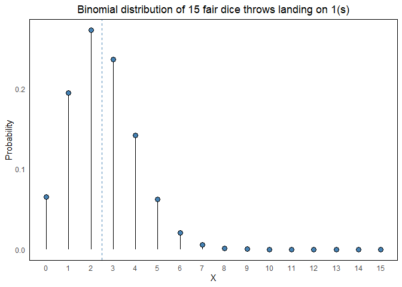
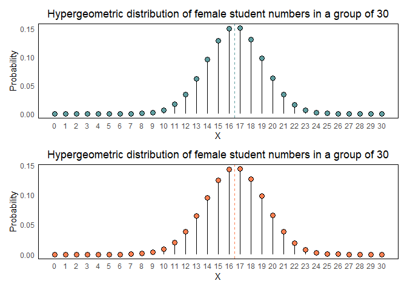
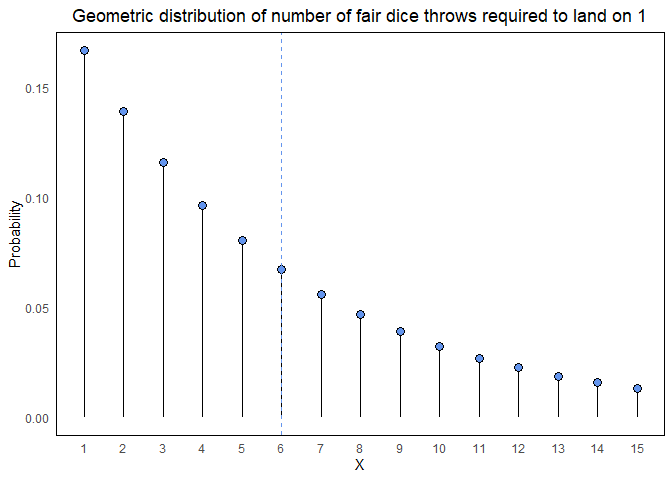
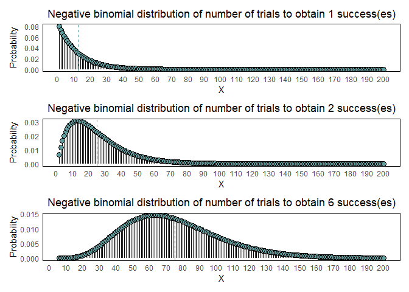
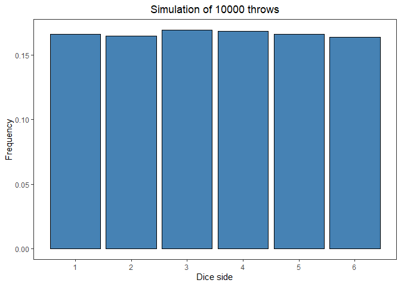
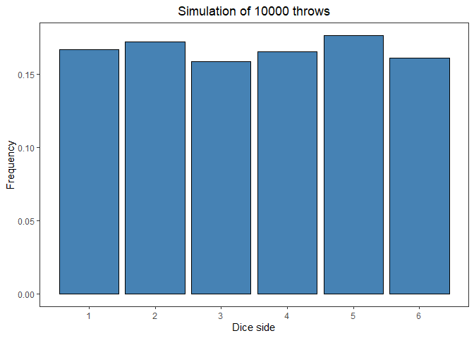
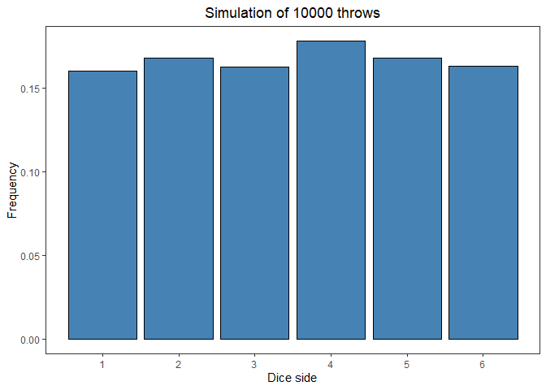

Introduction to hypergeometric, geometric, negative binomial and
multinomial distributions
================
Erika Duan
2020-10-11

  - [Introduction](#introduction)
  - [Hypergeometric distribution](#hypergeometric-distribution)
  - [Approximating the hypergeometric distribution with the binomial
    distribution](#approximating-the-hypergeometric-distribution-with-the-binomial-distribution)
  - [Geometric distribution](#geometric-distribution)
  - [Negative binomial distribution](#negative-binomial-distribution)
  - [Multinomial distribution](#multinomial-distribution)
  - [Resources](#resources)

``` r
#-----load required packages-----  
if (!require("pacman")) install.packages("pacman")
pacman::p_load(here,  
               tidyverse,
               patchwork) 
```

# Introduction

This tutorial extends our exploration of discrete probability
distributions, which began with [an introduction to bernoulli trials and
the binomial
distribution](https://github.com/erikaduan/R-tips/blob/master/03_blog_posts/2020-09-12_binomial_distribution/2020-09-12_binomial-distribution.md#drawing-control-limits-for-binomial-proportions-funnel-plots).

As revision, we may recall that the binomial distribution has the
following properties:

  - It allows us to calculate the probability of
     number of successes
    occurring out of 
    bernoulli trials, where the outcome of each trial is independent of
    each other and has the same probability of occuring.  
  - Its probability mass function is calculated from a) the total number
    of all possible combinations of
     trial successes and
    b) the probability of one single arrangement of
     successes and
     failures.  
      
     = \\frac{n!}{x!(n-x)!} \\times p^{x}(1-p)^{n-x}")  
      
  - Its mean is  = n\\times p") and its variance is  = n \\times p(1-p)").

<!-- end list -->

``` r
#-----calculate probability mass function of binomial distribution-----  
# what is the probability mass function of a fair dice landing on 1(s) if I throw the dice 15 times   

# k = 0, 1, 2, ... 15
# n = 15
# p = 1/6  

k <- seq(0, 15, 1) 

binom_dist <- set_names(k) %>%
  map_df(~ dbinom(.x, 15, 1/6)) %>%
  pivot_longer(cols = everything(),
               names_to = "k",
               values_to = "prob") 

mean_binom <- 15 * (1/6)

#-----visualise probability mass function of binomial distribution-----  
binom_dist %>%
  mutate(k = as.numeric(k)) %>% 
  ggplot(aes(x = k, y = prob)) +
  geom_segment(aes(x = k, xend = k, y = 0, yend = prob)) +
  geom_point(size = 3, shape = 21, fill = "steelblue") +
  geom_vline(xintercept = mean_binom, linetype = "dashed", colour = "steelblue") + 
  scale_x_continuous(breaks = c(seq(0, 15, 1))) + 
  labs(x = "X",
       y = "Probability",
       title = "Binomial distribution of 15 fair dice throws landing on 1(s)") + 
  theme_minimal() +
  theme(panel.grid = element_blank(),
        panel.border = element_rect(fill = NA, colour = "black"),
        plot.title = element_text(hjust = 0.5))   
```



# Hypergeometric distribution

The hypergeometric distribution is used in scenarios where sampling
without replacement occurs (i.e. the outcome obtained is dependent on
the prior samples that were selected). We cannot use the binomial
distribution here as the outcome of each trial is not independent of
each other.

Instead, we use the combinations formula to aid us in calculating the
hypergeometric distribution.

To extend the combinations formula, we consider the following five
parameters:

  - ") is the probability of obtaining
     successes from a
    sample of .  
  -  is the size of the
    population.  
  -  is the size of the
    sample.  
  -  is the number of
    successes in the population
    .  
  -  is the number of
    successes in the sample .

**Note:** Once a sample (i.e. event success) is taken out of the
population without replacement, the probability of observing an event
success changes. This is most impacted when
 is a small number.


The mean of the hypergeometric distribution can be derived as  = n\\times \\frac{k}{N}").  
The variance of the hypergeometric distribution is defined as  = n\\times \\frac{k}{N}\\times \\frac{N-n}{N}\\times \\frac{N-k}{N-1}").

``` r
#-----calculate probability of hypergeometric distribution-----    
# out of a school of 300 students, 165 students are female and 135 are male
# probability of a group of 30 students having 15 female and 15 male students

dhyper(15, # number of female students in randomly selected group
       165, # number of female students in school
       135, # number of male students in school 
       30)  
#> [1] 0.128921    
```

``` r
#-----calculate probability mass function of hypergeometric distribution-----  
max(0, 30 - (300 - 165)) # calculate minimum value for x  
#> [1] 0

min(165, 30) # calculate maximum value for x  
#> [1] 30   

hypergeom_dist <- set_names(seq(0, 30, 1)) %>%
  map_df(~ dhyper(.x, 165, 135, 30)) %>%
  pivot_longer(cols = everything(),
               names_to = "X",
               values_to = "prob") 

mean_hypergeom <- 30 * (165/300)  

#-----visualise hypergeometric distribution-----
hypergeom_dist %>%
  mutate(X = as.numeric(X)) %>% 
  ggplot(aes(x = X, y = prob)) +  
  geom_segment(aes(x = X, xend = X, y = 0, yend = prob)) +
  geom_point(size = 3, shape = 21, fill = "cadetblue") +
  geom_vline(xintercept = mean_hypergeom, linetype = "dashed", colour = "cadetblue") + 
  scale_x_continuous(breaks = c(seq(0, 30, 1))) + 
  labs(y = "Probability",
       title = "Hypergeometric distribution of female student numbers in a group of 30") + 
  theme_minimal() +
  theme(panel.grid = element_blank(),
        panel.border = element_rect(fill = NA, colour = "black"),
        plot.title = element_text(hjust = 0.5))     
```


**Note**: The advantage of the hypergeometric distribution is that it
can be used to calculate the probability mass function for events with
more than two outcomes.

``` r
#-----calculate probability of multivariate hypergeometric distribution-----   
# suppose a data science consultancy employs 55 males, 17 females and 2 non-binary persons 
# what is the probability that a team of 6 employees contains 3 males, 2 females and 1 non-binary person  

N <- 55 + 17 + 2
n <- 6

choose_teams <- choose(N, n)
choose_males <- choose(55, 3)
choose_females <- choose(17, 2) 
choose_binary <- choose(2, 1)

(choose_males * choose_females * choose_binary)/choose_teams
#> [1] 0.03852032
```

# Approximating the hypergeometric distribution with the binomial distribution

The binomial distribution can sometimes be used to approximate the
hypergeometric distribution. This occurs when we are sampling no more
than 5% of a large population (so the probability of a successful event
occuring does not significantly change as we sample without
replacement).

We can explore this further using a simulation using the scenario above,
but where:

1.  The sample size is 5% of the population (n = 30 and N = 600).
2.  The sample size is 10% of the population (n = 30 and N = 300).  
3.  The sample size is 25% of the population (n = 30 and N = 120).

<!-- end list -->

``` r
#-----calculate hypergeometric vs binomial distribution-----
hypergeom_600 <- dhyper(0:30, 330, 270, 30)
hypergeom_300 <- dhyper(0:30, 165, 135, 30)
hypergeom_120 <- dhyper(0:30, 66, 54, 30)  
binom_30 <- dbinom(0:30, 30, 0.55) # p = 165/300   

hypergeom_all <- tibble(X = 0:30,
                        N_600 = hypergeom_600,
                        N_300 = hypergeom_300,
                        N_120 = hypergeom_120,
                        binom = binom_30) %>%
  pivot_longer(cols = -contains("X"), 
               names_to = "N_size", values_to = "prob") %>%
  mutate(type = case_when(str_detect(N_size, "N_") ~ "hypergeometric",
                          str_detect(N_size, "binom")  ~ "binomial"),
         N_size = case_when(N_size == "N_600" ~ "600 (5%)",
                            N_size == "N_300" ~ "300 (10%)",
                            N_size == "N_120" ~ "120 (25%)"))

#-----visualise hypergeometric distribution overlaid on binomial approximation-----     
ggplot(hypergeom_all) +  
  geom_col(aes(x = X, y = prob),
           hypergeom_all %>% filter(type == "binomial"),
           fill = "gainsboro",
           colour = "black",  
           width = 0.5) +
  geom_line(aes(x = X, y = prob, colour = N_size),
            hypergeom_all %>% filter(type == "hypergeometric"),
            size = 0.5) + 
  scale_color_brewer(palette = "Dark2") + 
  scale_x_continuous(breaks = c(seq(0, 30, 1))) + 
  labs(y = "Probability",
       colour = "N",
       title = "Binomial approximation of hypergeometric distribution when n ~ 5% of N") + 
  theme_minimal() +
  theme(panel.grid = element_blank(),
        panel.border = element_rect(fill = NA, colour = "black"),
        plot.title = element_text(hjust = 0.5)) 
```



# Geometric distribution

The [geometric
distribution](https://en.wikipedia.org/wiki/Geometric_distribution)
describes the probability mass function of the number of bernoulli
trials required before we encounter the first successful trial outcome.
It is useful for modelling events of high importance (i.e. the
probability of a random citizen being able to provide CPR).

The probability mass function of a geometric distribution can be
described as the probability of encountering
 trial failures
before encountering the first trial success (i.e. we define
 as the number of trials
required to obtain the first successful event).  
  
 = (1-p)^{x-1}\\times p \\; for \\; x = 1, 2, ..., x")  

The mean of the geometric distribution can be derived as  = \\sum_{i=0}^{1} x \\times p(x) = \\frac{1}{p}").

The variance of the geometric distribution is defined as  = \\frac{1-p}{p^2}").

**Note:** The function `dgeom(x, prob)` defines
 as the number of trial
failures that occur before the first success is observed.

``` r
#-----calculate probability of geometric distribution-----    
# example 1  
# what is the probability that the 6th person in a population knows CPR i.e. P(x = 6)       

p <- 0.3 # success = person who knows CPR (0.3)
x <- 6 # number of trials taken to encounter person who knows CPR  

dgeom(x - 1, p) 
#> [1] 0.050421  

# example 2  
# what is the probability the 1st to 4th person is the 1st person who knows CPR i.e. P(x <= 4)  

dgeom(c(seq(0, 3, 1)), p) %>%
  sum(.)
#> [1] 0.7599   

1 - ((1 - p)^4)  
#> [1] 0.7599   
```

**Note:** The probability of a success first occuring before or during
the  trial is the complement of the probability of a success first
occuring after more than  trials. The latter event is also defined as the probability of

failures occuring. The cummulative probability distribution for the
geometric distribution is thus defined below.  
  
 = 1 - P(X \> x) = 1 - (1-p)^{x}")  

``` r
#-----calculate probability mass function of geometric distribution-----
# what is the probability mass function of obtaining the first 1 (success) from a fair dice  
# assuming a maximum of 15 throws 
# calculate P(x = X) where X represents the number of trials needed to observe the first success  

p <- 1/6
x <- seq(0, 14, 1) 

geom_dist <- set_names(x, seq(1, 15, 1)) %>%
  map_df(~ dgeom(.x, 1/6)) %>%
  pivot_longer(cols = everything(),
               names_to = "X",
               values_to = "prob") 

mean_geom <- 1 / (1/6)  

#-----visualise probability mass function of geometric distribution-----  
geom_dist %>%
  mutate(X = as.numeric(X)) %>% 
  ggplot(aes(x = X, y = prob)) +  
  geom_segment(aes(x = X, xend = X, y = 0, yend = prob)) +
  geom_point(size = 3, shape = 21, fill = "cornflowerblue") +
  geom_vline(xintercept = mean_geom, linetype = "dashed", colour = "cornflowerblue") + 
  scale_x_continuous(breaks = c(seq(0, 15, 1))) + 
  labs(y = "Probability",
       title = "Geometric distribution of number of fair dice throws required to land on 1") + 
  theme_minimal() +
  theme(panel.grid = element_blank(),
        panel.border = element_rect(fill = NA, colour = "black"),
        plot.title = element_text(hjust = 0.5))   
```



**Note:** The minimum value of the geometric distribution is 1 (i.e. the
first trial obtains a successful outcome) and there is no upper bound.
The mode of the geometric distribution is always 1, with probabilities
decreasing with larger values of
 (i.e. right skewness).

# Negative binomial distribution

Extending the concept of the geometric distribution, the negative
binomial distribution describes the probability mass function of the
number of benoulli trials required to obtain the

success (i.e. for a single distribution, the variable
 is fixed amd P(X)
represents the number of bernoulli trials required to obtain the

success.

This means that the negative binomial distribution must obtain the
following conditions:

  - The  trial
    must contain 
    successes i.e. !}{(r-1)!((x-1)-(r-1))!} \\times p^{(r-1)}(1-p)^{(x-1)-(r-1)}")  
  - The  trial must also be a success and has a probability of
    .  
  - To calculate the probability mass function of the
     trial, we simply multiple the two equations above (as
    events occur independently of each other).

The probability mass function can be written below, as the probability
that the  bernoulli trial contains the

success.  
  
 = \\frac{(x-1)!}{(r-1)!((x-1)-(r-1))!} \\times p^{(r-1)}(1-p)^{(x-1)-(r-1)} \\times p")  
  
 = \\frac{(x-1)!}{(r-1)!(x-r)!} \\times p^{r}(1-p)^{(x-r)}\\;for\\;x=r, r+1,...")  

The mean is  = \\frac{r}{p}").  
The variance is  = \\frac{r(1-p)}{p^2}").

**NOte:** The function `dnbinom(x, size, prob)` defines
 as the number of
failures prior to the

success.

``` r
#-----calculate probability of negative binomial distribution-----    
# in a local region, the probability of getting influenza in winter is 0.08 
# what is the probability that a hospital identifies 5 influenza cases if it randomly samples 50 people   
# assume 100% detection rate of influenza  

r <- 5
p <- 0.08
x <- 50 - r # number of failures before the rth success

dnbinom(x, r, p) 
#> [1] 0.01629236  

#-----create a function with calculates the probability of a negative binomial distribution-----  
calc_neg_binomial <- function(n_trials, r, prob) {
  if(!is.numeric(n_trials) | n_trials < r) {
    stop("Error: n_trials must be a number which is equal to or bigger than r.")
  } 
  
  if(!is.numeric(prob) | prob > 1) {
    stop("Error: prob must be a number which is between 0 and 1.")
  }
  
  if(!is.numeric(r)) {
    stop("Error: r must be a number.")
  }
  
  n_minus_1 <- n_trials - 1
  r_minus_1 <- r - 1
  n_minus_r <- n_trials - r
  
  combinations <- choose(n_minus_1, r_minus_1) 
  combinations * (prob^r) * ((1 - prob)^(n_minus_r))
}

calc_neg_binomial(50, 5, 0.08) 
#> [1] 0.01629236 
```

``` r
#-----calculate probability mass function of negative binomial distribution-----    
neg_binom_dist <- set_names(seq(5, 200, 1)) %>%
  map_df(~ calc_neg_binomial(.x, 5, 0.08)) %>%
  pivot_longer(cols = everything(),
               names_to = "X",
               values_to = "prob") 

mean_trials <- 5 / 0.08  

#-----visualise negative binomial distribution-----
neg_binom_dist %>%
  mutate(X = as.numeric(X)) %>% 
  ggplot(aes(x = X, y = prob)) +  
  geom_segment(aes(x = X, xend = X, y = 0, yend = prob)) +
  geom_point(size = 3, shape = 21, fill = "cadetblue") +
  geom_vline(xintercept = mean_trials, linetype = "dashed", colour = "cadetblue") + 
  scale_x_continuous(breaks = c(seq(0, 200, 10))) + 
  labs(y = "Probability",
       title = "Negative binomial distribution of number of trials to obtain 5 successes") + 
  theme_minimal() +
  theme(panel.grid = element_blank(),
        panel.border = element_rect(fill = NA, colour = "black"),
        plot.title = element_text(hjust = 0.5))     
```



**Note:** [As per
Wikipedia](https://en.wikipedia.org/wiki/Negative_binomial_distribution),
a property of the negative binomial distribution is that it decreases in
right skewness as 
increases.

``` r
#-----visualise change in negative binomial distribution with increasing r-----   
neg_binom_dist_1 <- set_names(seq(1, 200, 1)) %>%
  map_df(~ calc_neg_binomial(.x, 1, 0.08)) %>%
  pivot_longer(cols = everything(),
               names_to = "X",
               values_to = "prob") %>%
  mutate(r_value = 1)

neg_binom_dist_2 <- set_names(seq(2, 200, 1)) %>%
  map_df(~ calc_neg_binomial(.x, 2, 0.08)) %>%
  pivot_longer(cols = everything(),
               names_to = "X",
               values_to = "prob") %>%
  mutate(r_value = 2)

neg_binom_dist_6 <- set_names(seq(6, 200, 1)) %>%
  map_df(~ calc_neg_binomial(.x, 6, 0.08)) %>%
  pivot_longer(cols = everything(),
               names_to = "X",
               values_to = "prob") %>%
  mutate(r_value = 6)

# create a function to plot negative binomial distributions  

plot_neg_binom <- function(df, r) {
  mean_trials <- r/0.08 
  
  df %>%
    mutate(X = as.numeric(X)) %>% 
    ggplot(aes(x = X, y = prob)) +  
    geom_segment(aes(x = X, xend = X, y = 0, yend = prob)) +
    geom_point(size = 3, shape = 21, fill = "cadetblue") +
    geom_vline(xintercept = mean_trials, linetype = "dashed", colour = "cadetblue") + 
    scale_x_continuous(breaks = c(seq(0, 200, 10))) + 
    labs(y = "Probability",
         title = paste0("Negative binomial distribution of number of trials to obtain ", r, " success(es)")) +  
    theme_minimal() +
    theme(panel.grid = element_blank(),
          panel.border = element_rect(fill = NA, colour = "black"),
          plot.title = element_text(hjust = 0.5))
}    

plot_1 <- plot_neg_binom(neg_binom_dist_1, 1)
plot_2 <- plot_neg_binom(neg_binom_dist_2, 2)
plot_6 <- plot_neg_binom(neg_binom_dist_6, 6)

plot_1 / plot_2 / plot_6 
```


# Multinomial distribution

The [multinomial
distribution](https://en.wikipedia.org/wiki/Multinomial_distribution)
expands upon the concept of the binomial distribution and models the
probability of counts for each side of a
 sided dice (which does
not have to be fair) rolled  times.

The assumptions of the multinomial distribution are:

  - Trials are independent of each other (observing the outcome from one
    trial does not affect the likelihood of observing an outcome in
    another trial).
  - The number of outcomes possible in a single trial is greater than
    2.  
  - Individual outcomes are mutually exclusive (only one outcome type
    can be observed per trial).  
  - In any single trial, these
     outcomes occur with
    the probability  where .

If we let 
represent the number of occurrences of outcome
, then the probability
mass function of the multinomial distribution can be described below.


  - The expectation of  = n\\times p_i").  
  - The variance of is  = n \\times p_i(1-p_i)").

<!-- end list -->

``` r
#-----calculate probability of multinomial distribution-----  
# 4 blood types with probabilities pO = 0.45, pA = 0.2, pB = 0.25, pAB = 0.1 
# probability of 10 randomly sampled people where 4 have O, 2 have A, 3 have B and 1 has AB blood type   

dmultinom(x = c(4, 2, 3, 1), prob = c(0.45, 0.2, 0.25, 0.1))  
#> [1] 0.03229242  
```

**Note:** The function `rmultinom` can be used to simulate a matrix of
sample distributions drawn from a multinomial probability.

``` r
#-----simulate a matrix of sample distributions using rmultinom-----  
simulation <- rmultinom(n = 6, # number of experiments
                        size = 10, # number of people samples per experiment
                        prob = c(0.45, 0.2, 0.25, 0.1))  

# transpose matrix so rows reflect a single experiment and columns reflect frequency of each variable observed

simulation %>%
  t() %>%
  as_tibble(.name_repair = "unique") %>%
  rename("Type O" = "...1",
         "Type A" = "...2",
         "Type B" = "...3",
         "Type AB" = "...4") %>%
  knitr::kable()
```

| Type O | Type A | Type B | Type AB |
| -----: | -----: | -----: | ------: |
|      4 |      3 |      3 |       0 |
|      3 |      1 |      3 |       3 |
|      8 |      1 |      1 |       0 |
|      8 |      1 |      1 |       0 |
|      4 |      3 |      3 |       0 |
|      3 |      2 |      3 |       2 |

We can also simulate the multinomial distribution with the example of a
fair dice throw, with sides  and an
equal probability of landing on each number i.e. .

**Note:** Observe how the frequency of  approaches
 as the number of dice throws significantly increase.

``` r
#-----create a function to simulate a dice throw-----  
throw_dice <- function() {
  sample(1:6, size = 1, replace = T) 
}

set.seed(111)
throw_dice()
#> [1] 6  
```

``` r
#-----simulate 4 scenarios where dice is thrown 100 times-----      
plot_throws <- function(n_throws, seed) {
  set.seed(seed)
  
  times_100 <- replicate(n_throws, throw_dice()) %>%
    tibble(result = .)  
  
  times_100 <- count(times_100, result) %>%
    mutate(frequency = n / sum(n))  
  
  plot <- times_100 %>%
    ggplot(aes(x = result, y = frequency)) +
    geom_col(fill = "steelblue", colour = "black") + 
    scale_x_continuous(breaks = 1:6) +
    labs(x = "Dice side", y = "Frequency",
         title = paste0("Simulation of ", n_throws, " throws")) +
    theme_bw() +
    theme(panel.grid = element_blank(),
          plot.title = element_text(hjust = 0.5)) 
  
  print(plot)
}

walk2(list(100), list(111, 222, 333, 444), ~ plot_throws(.x, .y))
```


``` r
#-----simulate 4 scenarios where dice is thrown 10000 times-----   
walk2(list(10000), list(111, 222, 333, 444), ~ plot_throws(.x, .y))
```



# Resources

  - [Youtube video
    series](https://www.jbstatistics.com/discrete-probability-distributions/)
    explaining discrete probability distributions.  
  - Mathmatical proofs
    [here](https://www.statlect.com/probability-distributions/geometric-distribution)
    and
    [here](https://www.math.utah.edu/~davar/math5010/summer2010/L12.pdf)
    for the derivation of the geometric distribution’s mean and
    variance.  
  - [Blog post](https://rpubs.com/mpfoley73/458721) demonstrating how to
    calculate the geometric distribution in R.  
  - [Blog
    post](http://rstudio-pubs-static.s3.amazonaws.com/458415_99ff3bf974464136a9d925cc9d84a95d.html)
    demonstrating how to calculate the hypergeometric distribution in
    R.  
  - [Mathematical
    proof](http://www.math.ntu.edu.tw/~hchen/teaching/StatInference/notes/lecture16.pdf)
    for deriving the mean and variance of the negative binomial
    distribution.  
  - [Blog post](https://rpubs.com/mpfoley73/458738) demonstrating how to
    calculate the negative binomial distribution in R.  
  - [Blog post](https://rpubs.com/JanpuHou/296336) demonstrating how to
    calculate the multinomial distribution in R.
