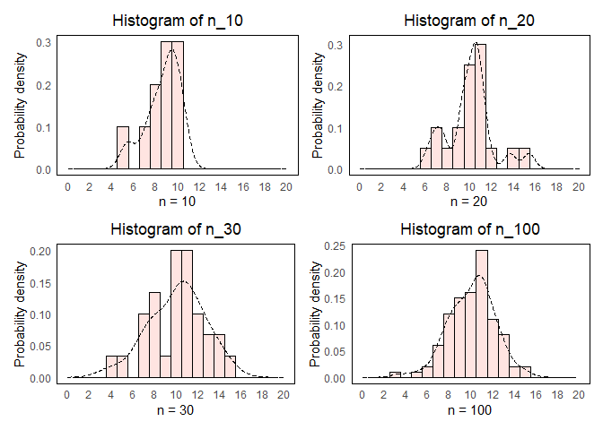
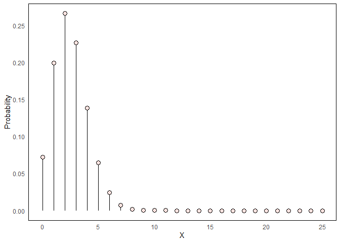

Many roads to the middle: centrality measures in statistics
================
Erika Duan
2020-09-06

  - [Introduction](#introduction)
  - [Standard normal distribution](#standard-normal-distribution)
  - [Arithmetic mean](#arithmetic-mean)
      - [Numerical variable](#numerical-variable)
      - [Discrete probability
        distribution](#discrete-probability-distribution)
      - [Continuous probability
        distribution](#continuous-probability-distribution)
  - [Other measures of centrality](#other-measures-of-centrality)
      - [Geometric mean](#geometric-mean)
      - [Harmonic mean](#harmonic-mean)
  - [Rolling average](#rolling-average)
  - [Resources](#resources)

``` r
#-----load required packages-----  
if (!require("pacman")) install.packages("pacman")
pacman::p_load(tidyverse,
               tidymodels,
               patchwork,
               lubridate,
               moments, # to calculate skew and kurtosis
               zoo) # to calculate rolling averages      
```

# Introduction

I’ve noticed that when descriptive statistics (finding ways to estimate
the true population’s centrality and range) are first introduced, they
tend to describe just the arithmetic mean, median, mode and standard
deviation. This can give the appearance that these four parameters are
the only way to describe centrality and range, when other mathematically
derived parameters also exist.

# Standard normal distribution

Let’s view these parameters when the data is normally distributed.

  - The distribution of the data is symmetrical.  
  - The mean
     is 0.  
  - The mean, median and mode are the same.  
  - The standard deviation
    
    is 1.  
  - The Fisher-Pearson coefficient of
    [skewness](https://en.wikipedia.org/wiki/Skewness) is 0.  
    ^3}{s^3} = 0")
    where  is the
    standard deviation.  
  - The [kurtosis](https://en.wikipedia.org/wiki/Kurtosis) is 3.  
    ^4}{s^4} = 3")
    where  is the
    standard deviation.

**Note:** The equations for skew and kurtosis are examples of higher
order moments. Skew is constructed so because a cubic power
disproportionately penalises larger deviations whilst also accounting
for the direction of that deviation.

**Note:** The equation for kurtosis standardises the impact of the skew,
standard deviation and mean to describe the thickness of the probability
distribution tail.

``` r
#-----simulate a normal distribution with 10, 20, 30 and 50 samples----- 
set.seed(111)
n_10 <- rnorm(10, mean = 10, sd = 2)
n_20 <- rnorm(20, mean = 10, sd = 2)
n_30 <- rnorm(30, mean = 10, sd = 2)
n_100 <- rnorm(100, mean = 10, sd = 2)  

#-----visualise distributions using a histogram-----  
draw_hist <- function(vector) {
  df <- tibble(values = vector) 
  
  ggplot(df, aes(x = values)) +
    geom_histogram(aes(y = ..density..), binwidth = 1, fill = "mistyrose", colour = "black") +
    geom_density(linetype = "dashed") + 
    scale_x_continuous(limits = c(0, 20),
                       breaks = seq(0, 20, 2)) +
    labs(x = paste0("n = ", length(vector)),
         y = "Probability density",
         title = paste0("Histogram of ", deparse(substitute(vector)))) + 
    theme_minimal() +
    theme(panel.grid = element_blank(),
          panel.border = element_rect(fill = NA, colour = "black"),
          plot.title = element_text(hjust = 0.5)) # center plot title
}

p1 <- draw_hist(n_10)
p2 <- draw_hist(n_20)
p3 <- draw_hist(n_30)
p4 <- draw_hist(n_100)
```

We can calculate the mean, standard deviation, skew and kurtosis for
each dataset.

``` r
#-----calculate mean-----  
mean <- set_names(list(n_10, n_20, n_30, n_100),
                  nm = list("n_10", "n_20", "n_30", "n_100")) %>%
  map_dfc(~ mean(.x)) %>%
  pivot_longer(cols = everything(),
               names_to = "dataset",
               values_to = "mean")  

#-----calculate standard deviation-----
sd <- set_names(list(n_10, n_20, n_30, n_100),
                  nm = list("n_10", "n_20", "n_30", "n_100")) %>%
  map_dfc(~ sd(.x)) %>%
  pivot_longer(cols = everything(),
               names_to = "dataset",
               values_to = "sd")  

# sd of sample mean is calculated as the square root of sum((xi-x)^2)/ n-1 

#-----calculate skew-----   
skew <- set_names(list(n_10, n_20, n_30, n_100),
                  nm = list("n_10", "n_20", "n_30", "n_100")) %>%
  map_dfc(~ skewness(.x)) %>%
  pivot_longer(cols = everything(),
               names_to = "dataset",
               values_to = "skew")    

#-----calculate kurtosis-----  
kurtosis <- set_names(list(n_10, n_20, n_30, n_100),
                      nm = list("n_10", "n_20", "n_30", "n_100")) %>%
  map_dfc(~ kurtosis(.x)) %>%
  pivot_longer(cols = everything(),
               names_to = "dataset",
               values_to = "kurtosis")    

#-----create table of parameters-----
parameters <- mean %>%
  left_join(sd, by = "dataset") %>%
  left_join(skew, by = "dataset") %>%
  left_join(kurtosis, by = "dataset")  
```



| dataset |      mean |       sd |        skew | kurtosis |
| :------ | --------: | -------: | ----------: | -------: |
| n\_10   |  8.661973 | 1.569441 | \-0.8494573 | 2.864124 |
| n\_20   | 10.104593 | 2.140970 |   0.4313575 | 3.664703 |
| n\_30   | 10.069665 | 2.575055 | \-0.3471143 | 2.834383 |
| n\_100  | 10.073013 | 2.107576 | \-0.3069703 | 3.367849 |

# Arithmetic mean

## Numerical variable

The arithmetic mean of a numerical variable is defined as the sum of
values divided by the number of values.  
  
  

``` r
#-----calculate arithmetic mean of a numerical variable-----    
set.seed(111)
variable <- sample(1:100, 20, replace = TRUE)

calc_var_mean <- function(vector) {
  sum(vector)/ length(vector)
}

calc_var_mean(variable) 
#> 55.95    
```

## Discrete probability distribution

In a discrete probability distribution, the arithmetic mean is defined
as the sum over every possible value weighted by the probability of that
value.

This sum is made up of a combination of larger numbers (generated by
high probability values, which are most likely to be returned and reside
closest to the centre of the probability distribution) and smaller
numbers (generated by low probability values, which are much lower or
higher in value themselves). Lower values will slightly under-represent
individual contributions to the sum and higher values will slightly
over-represent individual contributions to the sum, thus balancing
out.  
  
")  

``` r
#-----create a binomial i.e. discrete probability distribution----- 
# widgits produced have probability 0.1 of being defective
# widgits are shipped in cartons of 25 widgits
# what is the probability that a carton has 0, 1, 2, 3 or 4 defective widgets?  

dbinom(x = 0:4, size = 25, prob = 0.1)
#> [1] 0.0717898 0.1994161 0.2658881 0.2264973 0.1384150

# what is the probability that a carton has at least 2 defective widgets?  

pbinom(q = 2, size = 25, prob = 0.1) # q <= 2
#> 0.537 or 0.0717898 + 0.1994161 + 0.2658881 
```

``` r
#-----visualise discrete probability distribution-----  
dsc_prob_dist <- tibble(prob = dbinom(x = 0:25, size = 25, prob = 0.1),
                        values = c(0:25))   

dsc_prob_dist %>%
  ggplot(aes(x = values, y = prob)) +
  geom_segment(aes(x = values, xend = values, y = 0, yend = prob)) +
  geom_point(size = 3, shape = 21, fill = "mistyrose") +
  scale_y_continuous(breaks = seq(0, 0.3, 0.05)) +
  labs(x = "X",
       y = "Probability") + 
  theme_minimal() +
  theme(panel.grid = element_blank(),
        panel.border = element_rect(fill = NA, colour = "black"),
        plot.title = element_text(hjust = 0.5))
```



``` r
#-----calculate mean number of defective widgets found in a carton-----
calc_dsc_prob_mean <- function(values, size, prob){
  prob_vector <- dbinom(values, size, prob)
  
  map2_dbl(prob_vector, values,
           ~ .x * .y) %>%
    sum()
}

calc_dsc_prob_mean(values = c(0:25), 25, 0.1)
#> [1] 2.5  
```

## Continuous probability distribution

In a continuous probability distribution, the range of values which
exist is defined by the probability density function
"). This
function is represented as a curve, where
") represents
the height of the curve at point
 and the area under the
curve of ")
represents the probability of
 falling within a
specified range of values (where the area under the entire curve is 1).

The mean of a continuous probability distribution is therefore the area
under the curve (i.e. integral) of ").  
  
\\,\\mathrm{d}x")  

``` r
#-----visualise continuous probability distribution-----
cont_prob_dist <- tibble(values = c(2, 10)) # range for which the function exists  

cont_prob_dist %>%
  ggplot(aes(x = values)) + 
  xlim(0, 10) +
  stat_function(fun = exp, geom = "area", fill = "mistyrose") +
  stat_function(fun = exp) +
  geom_vline(xintercept = c(2, 10), linetype = "dashed") +
  labs(x = "X",
       y = "Probability") + 
  theme_minimal() +
  theme(panel.grid = element_blank(),
        panel.border = element_rect(fill = NA, colour = "black"),
        plot.title = element_text(hjust = 0.5))
```


``` r
#-----calculate mean of continuous probability distribution-----   
integral_function <- function(x) x * exp(x)

# mean = integration of x * f(x)    

integrate(integral_function, lower = 2, upper = 10)   
#> 198230.8 with absolute error < 2.2e-09  
```

# Other measures of centrality

## Geometric mean

The geometric mean can be thought of as a method to find the average
length of the side of a geometric shape so that the exponent of the side
also corresponds to the total dimension of the geometric shape. This is
done by multiplying all sides together and taking the nth root
i.e. ![\\sqrt\[n\]{x}](https://latex.codecogs.com/png.latex?%5Csqrt%5Bn%5D%7Bx%7D
"\\sqrt[n]{x}"). For example, for any rectangle of area 36 units
squared, the geometric mean is calculated as .

The geometric mean can be written in two different ways.

  
![\\bar x\_g = \\sqrt\[n\]{x\_1\\times x\_2 \\times ... x\_n} =
\\sqrt\[n\]{\\displaystyle\\Pi\_{i=1}^{n} x\_i} =
(\\displaystyle\\Pi\_{i=1}^{n}
x\_i)^\\frac{1}{n}](https://latex.codecogs.com/png.latex?%5Cbar%20x_g%20%3D%20%5Csqrt%5Bn%5D%7Bx_1%5Ctimes%20x_2%20%5Ctimes%20...%20x_n%7D%20%3D%20%5Csqrt%5Bn%5D%7B%5Cdisplaystyle%5CPi_%7Bi%3D1%7D%5E%7Bn%7D%20x_i%7D%20%3D%20%28%5Cdisplaystyle%5CPi_%7Bi%3D1%7D%5E%7Bn%7D%20x_i%29%5E%5Cfrac%7B1%7D%7Bn%7D
"\\bar x_g = \\sqrt[n]{x_1\\times x_2 \\times ... x_n} = \\sqrt[n]{\\displaystyle\\Pi_{i=1}^{n} x_i} = (\\displaystyle\\Pi_{i=1}^{n} x_i)^\\frac{1}{n}")  

  
  

In statistics, the geometric mean is useful when we are interested in
rates of behavioural growth that change over a period of time (i.e. when
numbers in a series are dependent on each other or when numbers can
fluctuate widely). Each standard growth cycle (in weeks, months, quarter
or years) is the equivalent of an increase in the nth dimension to be
calculated.

``` r
#-----calculate unemployment growth rate change using the geometric mean-----  
# unemployment rate is 6% 
# rate increases by 30% in the next month
# rate decreases by 5% in the following month  
# rate increases by 25% in the month after  

original_rate <- 6
month_1 <- original_rate + original_rate * 0.3
month_2 <- month_1 - month_1 * 0.05    
month_3 <- month_2 + month_2 * 0.25  

month_3/original_rate
#> [1] 1.54375

calc_geom_mean <- function(growth_factor, periods) {
  rate_sum <- growth_factor %>%
    log() %>% # natural logarithm
    sum() %>%
    exp() 
  
    rate_sum^(1/ periods)
}

calc_geom_mean(growth_factor = c(1.3, 0.95, 1.25), periods = 3)
#> [1] 1.155737  

# the average unemployment rate is 15.6%  
```

## Harmonic mean

The [harmonic mean](https://en.wikipedia.org/wiki/Harmonic_mean) is the
reciprocal of the arithmetic mean of the reciprocals of a set of
different rates and is displayed below.

  
^{-1}")  

In machine learning, the harmonic mean is used to find the average of
the two different rates precision (TP/ TP + FP) and recall (TP/ TP +
FN), and this is called the [F1
score](https://en.wikipedia.org/wiki/F1_score). An F1 score of 1
represents perfect precision and recall.

  
  

The  score is
itself derived from the equation for
,
where 
is a positive number which represents how many times recall is more
important to optimise for than precision.

  
 \\times \\frac{precision\\times recall}{(\\beta^2\\times precision)\\times recall}")  

``` r
#-----calculate the F1 score for a set of predictions-----
# simulate test results  

set.seed(111)
y_test <- sample(c("yes", "no"), 100, replace = T, prob = c(0.7, 0.3))

set.seed(222)
y_pred <- sample(c("yes", "no"), 100, replace = T, prob = c(0.7, 0.3)) 

pred_results <- tibble(y_test, y_pred) %>%
  mutate(result = case_when(y_test == "yes" & y_pred == "yes" ~ "TP",
                            y_test == "yes" & y_pred == "no" ~ "FN",
                            y_test == "no" & y_pred == "yes" ~ "FP",
                            y_test == "no" & y_pred == "no" ~ "TN"))   

# view summary of TPs, FNs, FPs and TNs  

pred_results %>%
  count(result) %>%
  knitr::kable()
```

| result |  n |
| :----- | -: |
| FN     | 24 |
| FP     | 16 |
| TN     |  9 |
| TP     | 51 |

``` r
#-----calculate precision and recall-----  
precision <- (51 / (51 + 16)) * 100
recall <- (51 / (51 + 24)) * 100

#-----calculate harmonic mean of precision and recall-----  
calc_harmonic_mean <- function(precision, recall) {
  sum_reciprocals <- c(precision, recall) %>%
  map_dbl(function(x) 1/x) %>%
    sum()
  
  1 / (sum_reciprocals / 2) 
}

calc_harmonic_mean(precision, recall)  
#> [1] 71.83099
```

# Rolling average

A simple [rolling average](https://en.wikipedia.org/wiki/Moving_average)
is the unweighted mean of the previous n data and helps to visualise
trends in behavioural changes over time. Calculating rolling averages
can be thought of as creating a series of averages over different
subsets of time, plotted against time.

  
}}{n} = \\frac{1}{n} \\times \\displaystyle\\sum_{i=0}^{n-1}p_{M-i}")  

A central rolling average is taken from an equal number of data points
on either side of a central value. This better aligns variations in the
mean to variations in the data, rather than replicating data points that
are merely shifted in time.

**Note:** Using an odd number of points allows the calculation of the
rolling mean average to be symmetric.

``` r
#-----calculating a central rolling average-----  
passengers <- datasets::AirPassengers %>%
  as_tibble() %>%
  rename(passengers = x) %>% 
  mutate(time = seq(ymd("1949-01-01"), ymd("1960-12-01"), by = "month")) %>%
  mutate(passengers_mean_3 = rollmean(passengers, k = 3, fill = NA),
         passengers_mean_7 = rollmean(passengers, k = 7, fill = NA),
         passengers_mean_13 = rollmean(passengers, k = 13, fill = NA)) %>%
  pivot_longer(cols = c("passengers", "passengers_mean_3", "passengers_mean_7", "passengers_mean_13"),
               names_to = "rolling_mean",
               values_to = "numbers")

# rollmean() is center aligned by default i.e. align = "centered"   

#-----visualise central rolling average with different n-----  
actual_numbers <- passengers %>%
  filter(rolling_mean == "passengers") %>% 
  ggplot(aes(x = time, y = numbers)) + 
  geom_col() + 
  labs(x = "Time", y = "Number of passengers (1,000s)") + 
  theme_minimal() +
  theme(panel.grid = element_blank(),
        panel.border = element_rect(fill = NA, colour = "black"),
        plot.title = element_text(hjust = 0.5))   

rolling_means <- passengers %>%
  filter(rolling_mean != "passengers") %>% 
  ggplot(aes(x = time, y = numbers)) + 
  geom_line(aes(colour = rolling_mean), size = 1) + 
  scale_color_discrete(labels = c("passengers_mean_3" = "3",
                                  "passengers_mean_7" = "7",
                                  "passengers_mean_13" = "13"),
                       limits = c("passengers_mean_3", "passengers_mean_7", "passengers_mean_13")) + 
  labs(x = "Time", y = "Number of passengers (1,000s)", colour = "n") + 
  theme_minimal() +
  theme(panel.grid = element_blank(),
        panel.border = element_rect(fill = NA, colour = "black"),
        plot.title = element_text(hjust = 0.5),
        legend.position = c(0.15, 0.85))  

actual_numbers + rolling_means
```


# Resources

  - An
    [introduction](https://www.itl.nist.gov/div898/handbook/eda/section3/eda35b.htm)
    to skewness and kurtosis.  
  - Youtube videos on moments of distributions
    [here](https://www.youtube.com/watch?v=ISaVvSO_3Sg) and
    [here](https://www.youtube.com/watch?v=fv5QB3eK7jA).  
  - Youtube [video](https://www.youtube.com/watch?v=OWSOhpS00_s) on
    continuous random variables.  
  - Youtube [video](https://www.youtube.com/watch?v=Ro7dayHU5DQ) on
    deriving the mean and variance of continuous probability
    distributions.  
  - Youtube [video](https://www.youtube.com/watch?v=vWJXmRLDrrQ) on the
    concept of the geometric mean.  
  - Youtube [video](https://www.youtube.com/watch?v=jXKYI7wyqp0) on the
    concept of the harmonic mean.  
  - Tutorial on how to calculate the rolling average
    [here](https://www.storybench.org/how-to-calculate-a-rolling-average-in-r/)
    and [here](http://uc-r.github.io/ts_moving_averages).  
  - [Explanation](https://math.stackexchange.com/questions/23293/probability-density-function-vs-probability-mass-function#:~:text=Probability%20mass%20functions%20are%20used,variable%20falls%20within%20some%20interval.)
    of the definition of the probability density function.
