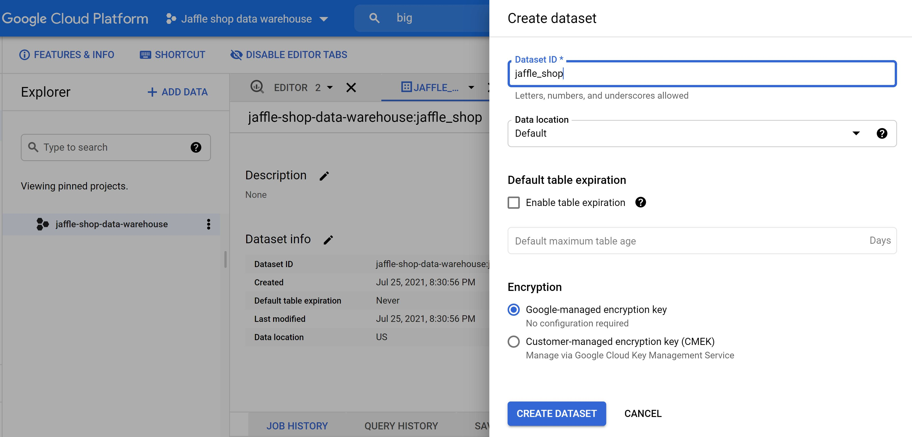
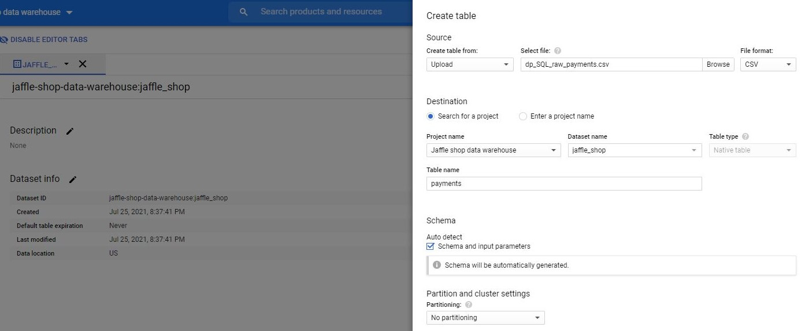

```{r setup, include=FALSE}
# Set up global environment ----------------------------------------------------
knitr::opts_chunk$set(echo=TRUE, results='hide', fig.show='asis')  
```


```{r load libraries, message=FALSE, warning=FALSE}  
# Load required packages -------------------------------------------------------  
if (!require("pacman")) install.packages("pacman")
pacman::p_load(here,  
               tidyverse,
               odbc,
               DBI,
               Rcpp,
               bigrquery)   
```
 
 
# Introduction    

I am occasionally asked whether it is more worthwhile to invest in learning R or Python. To be versatile as a data scientist, it is actually more important to become proficient in SQL (and either R or Python). This contrasts with reality where data scientists exiting from more theoretical programs lack exposure to SQL, which really requires a data warehouse to practice queries on.  

Enter the [DBT jaffle shop project](https://github.com/dbt-labs/jaffle_shop), which allows you to easily set up and query from a data warehouse in [Google BigQuery](https://cloud.google.com/bigquery). As this tutorial is limited to accessing SQL queries with R (as opposed to setting up data warehouses in Google Cloud), we will use the public jaffle shop dataset in BigQuery that anyone can select from.        


# Set up BigQuery data warehouse   

A guide to setting up a jaffle shop data warehouse in Google BigQuery exists [here](https://docs.getdbt.com/tutorial/setting-up).   

The steps are to:  

1. Sign up for a [Google Platform Account](https://console.cloud.google.com/) using a new or existing Google account. Note that you should get 10 GB storage and up to 1 TB queries/month free of charge, before you are billed for additional compute costs.    

2. Create a new Google Cloud Project and select this project in BigQuery.   

    ```{r load figure for step 2, echo=FALSE, results = 'markup', fig.align='center', out.width='60%'} 
      # Knit dp-SQL_to_R_workflows-create_BigQuery_project.jpg -----------------------
      knitr::include_graphics("../../02_figures/dp-SQL_to_R_workflows-create_BigQuery_project.jpg")
    ```

3. Create a new dataset inside your project. This is equivalent to creating a new database in a data warehouse.           

    ```{r load figure for step 3, echo=FALSE, results = 'markup', fig.align='center', out.width='80%'} 
    # Knit dp-SQL_to_R_workflows-create_dataset.jpg --------------------------------
    
    ```

4. Copy and paste the SQL query below to generate the `customers` table.   

    ```{r, eval=FALSE}
    /* Create Customers table*/ 
    SELECT
        id AS customer_id,
        first_name,
        last_name

    FROM `dbt-tutorial`.jaffle_shop.customers
    ```

5. Run the query and save the results as a BigQuery table called `customers`.      

    ```{r load figure for step 5, echo=FALSE, results = 'markup', fig.align='center', out.width='80%'} 
    # Knit dp-SQL_to_R_workflows-create_customers_table.jpg ------------------------
    knitr::include_graphics("../../02_figures/dp-SQL_to_R_workflows-create_customers_table.jpg")
    ```

6. Copy and paste the SQL query below to generate the `orders` table. Run and save the results as a BigQuery table called `orders`.      

    ```{r, eval=FALSE}
    /* Create Orders table*/ 
    SELECT
        id AS order_id,
        user_id AS customer_id,
        order_date,
        status

    FROM `dbt-tutorial`.jaffle_shop.orders
    ```

7. Unfortunately, the `payments` table does not exist as a public dataset on BigQuery. To circumvent this problem, you can download `raw_payments.csv` from the [jaffle shop GitHub repository](https://github.com/dbt-labs/jaffle_shop) and manually upload it as a new table in your project. This allows you to practice writing queries to join more than two tables together.    

    ```{r load figure for step 7, echo=FALSE, results = 'markup', fig.align='center', out.width='80%'} 
    # Knit dp-SQL_to_R_workflows-create_customers_table.jpg ------------------------
    
    ```

Congratulations! You have now created a very small-scale cloud-hosted database to practice running SQL queries on.     


# Connect to the database using `odbc`     

The purpose of this tutorial, however, is to build a workflow that integrates SQL queries within R.  

An ODBC driver is a database and operating system independent API that allows applications, including RStudio, to access data in database management systems via SQL queries. In R, we can use the packages [`odbc`](https://db.rstudio.com/r-packages/odbc/) and [`DBI`](https://db.rstudio.com/r-packages/dbi/) to [connect to and query from a database](https://db.rstudio.com/getting-started/connect-to-database/).   

**Note:** The package `odbc` provides tools to explore all tables and columns in a database whilst the package `DBI` provides back-end tools to read from, write to and query from individual tables. For Google BigQuery,     

```{r create BigQuery connection, message=FALSE}
# Identify driver name ---------------------------------------------------------
unique(odbc::odbcListDrivers()$name) 
#> [1] "SQL Server"

# Create Google BigQuery connection --------------------------------------------
# bigquery_conn <- DBI::dbConnect(odbc::odbc(),
#                                 Driver = "[BigQuery driver name]",
#                                 Catalog = "[BigQuery project name]",
#                                 Email = "[Google service account email]",
#                                 KeyFilePath = "[full path to key file]",
#                                 OAuthMechanism = 0)

bigquery_conn <- dbConnect(bigrquery::bigquery(),
                           project = "jaffle-shop-data-warehouse",
                           dataset = "jaffle_shop")

# Requires authentication for the Tidyverse API to access your Google Account   

# List available tables --------------------------------------------------------
dbListTables(bigquery_conn)
#> [1] "customers" "orders"    "payments" 
```

If you are connecting to an on-premise MS SQL database, you can bypass the need to manually enter your credentials using the `dbConnect()` code below.   

```{r create MS SQL connection, eval=FALSE}
# Create MS SQL connection -----------------------------------------------------
# MSSQL_conn <- DBI::dbConnect(odbc::odbc(),
#                              Driver = "[SQL Server driver name]",
#                              Server = "[Server address, Port]",  
#                              Database = "[Database name]", 
#                              Trusted_Connection = "Yes")  

# A warehouse may contain multiple databases    
```


# Run SQL queries in R   

Once you have established a database connection, you only need to run the following lines of code to return your SQL query as an R `data.frame`.    

1. Use `bigrquery::dbSendQuery()` or `odbc::dbSendQuery()` to submit and execute your SQL query.  
2. Use `bigrquery::dbFetch()` or `odbc::dbFetch()` to fetch the query result and return it as a `data.frame`. 
3. Use `bigrquery::dbClearResult()` or `odbc::dbClearResult()` to free all resources (i.e. memory) associated with retrieving the SQL query.  
4. Use `bigrquery::dbDisconnect()` or `odbc::dbDisconnect()` to close the database connection.  

```{r query customer table, message=FALSE}
# Send BigQuery SQL query ------------------------------------------------------
customer_query <- bigrquery::dbSendQuery(
  bigquery_conn,
  "
  SELECT 
  
    customer_id AS id,
    first_name,
    last_name
    
  From `jaffle-shop-data-warehouse.jaffle_shop.customers` 
  
  LIMIT 5
  "
) 

# Fetch BigQuery SQL query ----------------------------------------------------- 
customer_df <- bigrquery::dbFetch(customer_query)

# Clear BigQuery SQL query -----------------------------------------------------
bigrquery::dbClearResult(customer_query)

# Disconnect from BigQuery database --------------------------------------------
bigrquery::dbDisconnect(bigquery_conn)
```

```{r view customer_df}
# Preview customer_df ----------------------------------------------------------
class(customer_df)
#> [1] "tbl_df"     "tbl"        "data.frame"  

customer_df %>%
  head(3)
```

```{r output customer_df preview, echo=FALSE, results='markup'}
# Output customer_df as kable() table ------------------------------------------
customer_df %>%
  head(3) %>%
  knitr::kable()
```


# Convert between SQL and R using `dbplyr`  

```{r}

```


# Tips to productionise your SQL to workflow  

```{r}

```


# Other resources  

+ The [GitHub repository](https://github.com/dbt-labs/jaffle_shop) for the data build tool (DBT) jaffle shop project.   
+ The jaffle shop DBT Google BigQuery project [set-up tutorial](https://docs.getdbt.com/tutorial/setting-up).   
+ An RStudio [guide](https://db.rstudio.com/getting-started/connect-to-database/) on how to connect to an existing database using the `odbc` and `DBI` packages.    
+ An Rstudio [guide](https://db.rstudio.com/databases/big-query/) on how to connect to Google BigQuery using `odbc` or `bigrquery`.   

+ https://cran.r-project.org/web/packages/dbplyr/vignettes/dbplyr.html  