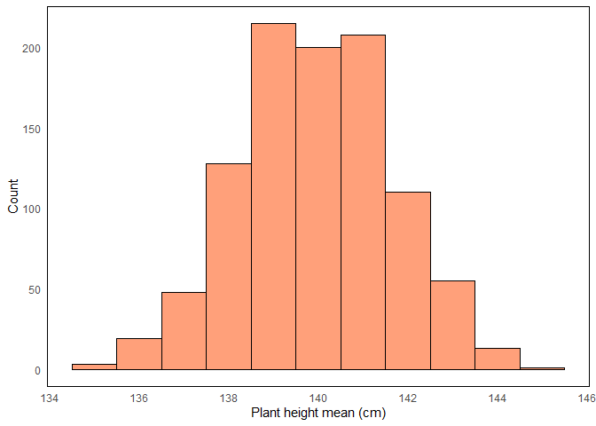

Fundamental statistical distributions
================
Erika Duan
2021-08-04

-   [Normal distribution](#normal-distribution)
    -   [Standard normal distribution](#standard-normal-distribution)
    -   [Multi-variate normal
        distribution](#multi-variate-normal-distribution)
-   [Chi-squared distribution](#chi-squared-distribution)
-   [T distribution](#t-distribution)
-   [F distribution](#f-distribution)
-   [Other resources](#other-resources)

``` r
# Load required packages -------------------------------------------------------  
if (!require("pacman")) install.packages("pacman")
pacman::p_load(here,  
               tidyverse,
               patchwork)   
```

# Normal distribution

The normal distribution, or Gaussian distribution, is frequently
observed in nature and is characterised by the following properties:

-   It is a symmetrical continuous distribution where
    .  
-   Its mean, median and mode are identical due to its symmetrical
    distribution.  
-   Its probability density function contains two parameters; the mean
    i.e.  and
    the standard deviation
    i.e. 
    where
    
    and
    .  
-   Its probability density function is described by the equation
    below:  
     = \frac{1}{\sqrt{2 \pi \sigma^2}} \times e^{\frac{-(x - \mu) ^2}{2\sigma^2}}").

Imagine that the height of tomato plants in a field is normally
distributed. It is known that the average tomato plant height is 140 cm,
with a standard deviation of 16 cm.

-   What would the distribution of tomato plant height look like if the
    height of 100 plants was randomly measured?
-   What would the probability density function of tomato plant height
    look like if the height of 10, 100 or 1000 plants was randomly
    measured?

``` r
# Simulate tomato plant heights from normal distribution -----------------------
set.seed(111)  
plant_height <- tibble(x = seq(1, 100),
                       height = rnorm(100, mean = 140, sd = 16))  

# Plot tomato plant heights ----------------------------------------------------
measurements <- plant_height %>%
  ggplot(aes(x = x, y = height)) + 
  geom_point(aes(x = x, y = height),
             shape = 21, fill = "tomato") + 
  labs(x = "X",
       y = "Plant height (cm)",
       title = "Sample plant heights") + 
  theme_minimal() +
  theme(panel.grid = element_blank(),
        panel.border = element_rect(fill = NA, colour = "black"),
        plot.title = element_text(hjust = 0.5)) 

density <- plant_height %>%
  ggplot(aes(y = height)) + 
  geom_density(aes(y = height)) + 
  labs(x = "Density",
       y = "Plant height (cm)",
       title = "Density of sample plant heights") + 
  theme_minimal() +
  theme(panel.grid = element_blank(),
        panel.border = element_rect(fill = NA, colour = "black"),
        plot.title = element_text(hjust = 0.5)) 

(measurements + density)
```

<!-- -->

``` r
# Simulate tomato plant heights from 10, 100 and 1000 samples ------------------ 
set.seed(111)
sample_10 <- tibble(x = seq(1, 10), 
                    height = rnorm(10, mean = 140, sd = 16))  

sample_100 <- tibble(x = seq(1, 100), 
                     height = rnorm(100, mean = 140, sd = 16))  

sample_1000 <- tibble(x = seq(1, 1000),
                      height = rnorm(1000, mean = 140, sd = 16))  

# Create plotting function -----------------------------------------------------
plot_density <- function(df, value) {
  value <- enquo(value)
  
  plot <- df %>%
    ggplot(aes(x = !! value)) + 
    geom_density(aes(x = !! value)) + 
    geom_vline(xintercept = 140, colour = "tomato", linetype = "dotted") +
    scale_x_continuous(limits = c(70, 210)) +
    labs(x = "Plant height (cm)",
         y = "Density",
         title = paste0("Density of ", nrow(df), " sample plant heights")) + 
    theme_minimal() +
    theme(panel.grid = element_blank(),
          panel.border = element_rect(fill = NA, colour = "black"),
          plot.title = element_text(hjust = 0.5))
  
  return(plot)
}

# Plot sample density plots ----------------------------------------------------
(plot_density(sample_10, height) / plot_density(sample_100, height) / plot_density(sample_1000, height))
```

<!-- -->

-   What would the distribution of sample means
    i.e. ,
    look like if 100 tomato plants were randomly measured from 1000
    random locations?

``` r
# Simulate 100 samples from 1000 fields ----------------------------------------
sample_means <- vector("double", length = 1000L)
for (i in 1:1000) {
  plot <- rnorm(100, mean = 140, sd = 16)
  sample_means[[i]] <- mean(plot)    
}

# Plot distribution of 100 sample means ----------------------------------------
sample_means %>%
  tibble(height = .) %>% # Convert to tibble for plotting
  ggplot(aes(x = height)) +
  geom_histogram(binwidth = 1, fill = "lightsalmon", colour = "black") +
  labs(x = "Plant height mean (cm)",
       y = "Count") + 
  theme_minimal() +
  theme(panel.grid = element_blank(),
        panel.border = element_rect(fill = NA, colour = "black"),
        plot.title = element_text(hjust = 0.5))  
```



The phenomenon above is an example of the [central limit
theorem](https://statisticsbyjim.com/basics/central-limit-theorem/),
which states that the sampling distribution of the mean for any
distribution approximates the normal distribution as the sample size
increases.

The normal distribution has a well-know probability density function
where:  
+ \~68% of values fall within one standard deviation of the mean.  
+ \~95.5% of values fall within two standard deviations of the mean.  
+ \~99.7% of values fall within three standard deviations of the mean.

``` r
# Calculate probability from probability density function ----------------------
# Store f(x) as a normal distribution with mean 140 and sd 16      
funs_x_fx <- function(x) (1/ (sqrt(2 * pi * 16 ^ 2)) * exp(-((x - 140) ^ 2) / (2 * 16 ^ 2)))

# Probability of a value falling within 1 sd of the mean -----------------------  
integrate(funs_x_fx, lower = 140 - 16, upper = 140 + 16)
#> 0.6826895 with absolute error < 7.6e-15

# Probability of a value falling within 2 sd of the mean -----------------------  
integrate(funs_x_fx, lower = 140 - (2 * 16), upper = 140 + (2 * 16))
#> 0.9544997 with absolute error < 1.8e-11 

# Probability of a value falling within 1 sd of the mean -----------------------  
integrate(funs_x_fx, lower = 140 - (3 * 16), upper = 140 + (3 * 16))
#> 0.9973002 with absolute error < 9.3e-07  
```

## Standard normal distribution

The standard normal distribution is a special form of the normal
distribution with a mean of 0 and standard deviation of 1.  
Its probability density function is therefore described by the equation
below:  

 = \frac{1}{\sqrt{2 \pi}} \times e^{\frac{-x^2}{2}}")

The linear transformation below is used to standardise randomly
distribution variables from
")
into
").  


Let’s return to our simulation of 100 tomato plant heights knowing that
the average tomato plant height is 140 cm, with a standard deviation of
16 cm.

-   What would the distribution look like if we standardised tomato
    plant height from a sample of 100 plants measured?

``` r
# Standardise normal distribution of tomato plant heights ----------------------
mean(plant_height$height)
#> [1] 139.7949

sd(plant_height$height) # In R, sd() is always calculated with n - 1 df
#> [1] 17.13368

plant_height <- plant_height %>%
  mutate(std_height = ((height - mean(plant_height$height))/ sd(plant_height$height)))  
```

``` r
# Plot distribution of standardised tomato plant heights -----------------------
plant_height %>% 
  ggplot(aes(x = std_height)) +
  geom_histogram(binwidth = 0.4, fill = "lavender", colour = "black") +
  scale_x_continuous(limits = c(-3, 3)) + 
  labs(x = "Standardised plant height (cm)",
       y = "Count") + 
  theme_minimal() +
  theme(panel.grid = element_blank(),
        panel.border = element_rect(fill = NA, colour = "black"),
        plot.title = element_text(hjust = 0.5)) 
```


## Multi-variate normal distribution

# Chi-squared distribution

-   What would the distribution of sample variance
    i.e.  look like if
    100 tomato plants were randomly measured from 1000 random fields?

``` r
# Simulate 100 samples from 1000 fields ----------------------------------------
sample_sds <- vector("double", length = 1000L)
for (i in 1:1000) {
  plot <- rnorm(100, mean = 140, sd = 16)
  sample_sds[[i]] <- sd(plot)    
}

# Plot distribution of 100 sample standard deviations --------------------------
sample_sds %>%
  tibble(height = .) %>% # Convert to tibble for plotting
  ggplot(aes(x = height)) +
  geom_histogram(binwidth = 1, fill = "tomato", colour = "black") +
  labs(x = "Plant height standard deviation (cm)",
       y = "Count") + 
  theme_minimal() +
  theme(panel.grid = element_blank(),
        panel.border = element_rect(fill = NA, colour = "black"),
        plot.title = element_text(hjust = 0.5))  
```

<!-- -->

# T distribution

# F distribution

# Other resources

-   University of Sydney Mathematics Learning Centre
    [chapter](https://www.sydney.edu.au/content/dam/students/documents/mathematics-learning-centre/normal-distribution.pdf)
    on the normal distribution.  
-   A jbstatistics [YouTube
    video](https://www.youtube.com/watch?v=iYiOVISWXS4) on the normal
    distribution.  
-   A jbstatistics [YouTube
    video](https://www.youtube.com/watch?v=4R8xm19DmPM) on how to
    standard normally distributed variables.
