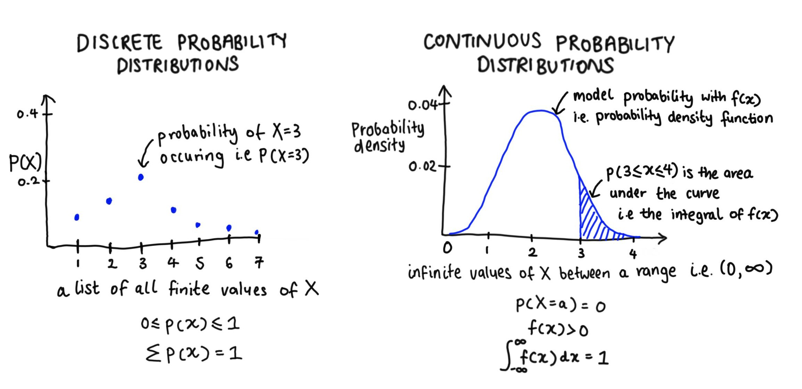
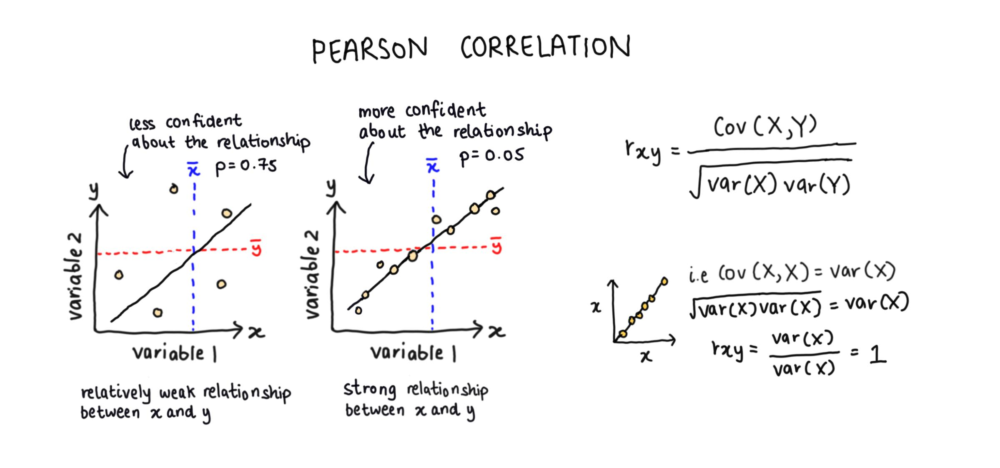

```{r setup, include=FALSE}
# Set up global environment ----------------------------------------------------
knitr::opts_chunk$set(echo=TRUE, results='hide', fig.show='asis')  
```


```{r load libraries, message=FALSE, warning=FALSE}  
# Load required packages -------------------------------------------------------  
if (!require("pacman")) install.packages("pacman")
pacman::p_load(here,  
               tidyverse,
               patchwork)   
```


# Introduction to expectation   

The expectation of a random variable X, or E(X), is its long term average.    

When we have a list of numbers, for example a sample of plant heights, it is easy to calculate the expectation or the average using the following equation: 

$\frac{x_1 + x_2 + \: ... \: + x_n}{n} = \frac{1}{n} \displaystyle \sum_{i=1}^{n}x_i = E(X)$     


However, in statistics, we are interested in modelling the probability distribution of a function (which is usually not a simple list of numbers).      

```{r load distributions figure, echo=FALSE, results = 'markup', fig.align='center', out.width='90%'} 
# Knit dp-SQL_to_R_workflows-create_customers_table.jpg ------------------------

```


## Discrete probability distributions  

The expectation of a discrete probability distribution is described by the following equation:  
 
$\displaystyle \sum_{i=1}^n x_i \times p(x_i)$      
  

Imagine if a person in the community has a probability of testing positive for COVID-19 of 0.15.   

+ What is the probability that 0 people test positive for COVID-19 out of a random sample of 10 people?  
+ What is the probability that 1 person tests positive for COVID-19 out of a random sample of 10 people?  
+ What is the probability at least 2 people will test positive for COVID-19 out of a random sample of 10 people?    

```{r calculate binom prob}
# Calculate P(X = 0) when n = 10 -----------------------------------------------
dbinom(x = 0, size = 10, prob = 0.15)
#> [1] 0.1968744
 
# Calculate P(X = 1) when n = 10 -----------------------------------------------
dbinom(x = 1, size = 10, prob = 0.15)
#> [1] 0.3474254

# Calculate P(X <= 2) when n = 10 ----------------------------------------------
dbinom(x = 0:2, size = 10, prob = 0.15) %>%
  reduce(sum)
#> [1] 0.8201965  

pbinom(q = 2, size = 10, prob = 0.15, lower.tail = T)
#> [1] 0.8201965    
```

+ What is the probability distribution for the number of people testing positive for COVID-19 out of a random sample of 10 people?  
+ What is the average number of people that will test positive for COVID-19 out of a random sample of 10 people?   
 
```{r calc binom dist}
# Calculate binomial distribution ---------------------------------------------- 
x1 <- c(0:10)
p_x1 <- dbinom(x = 0:10, size = 10, prob = 0.15)

# Calculate expectation of binomial distribution -------------------------------
expectation_b1 <- sum(x1 * p_x1)
expectation_b1
#> [1] 1.5  
```

```{r plot binom dist, results='markup'}
# Plot probability mass function for binomial distribution ---------------------
binom_dist <- tibble(x = c(0:10),
                     prob = dbinom(x = 0:10, size = 10, prob = 0.1))    

binom_dist %>%
  ggplot(aes(x = x, y = prob)) + 
  geom_segment(aes(x = x, xend = x, y = 0, yend = prob)) +
  geom_point(size = 3, shape = 21, fill = "linen") +
  geom_vline(xintercept = expectation_b1, colour = "firebrick", linetype = "dotted") + 
  scale_x_continuous(breaks = seq(0, 10, 1)) +
  labs(x = "X",
       y = "Probability",
       title = "Probability mass distribution for a binomial distribution") + 
  theme_minimal() +
  theme(panel.grid = element_blank(),
        panel.border = element_rect(fill = NA, colour = "black"),
        plot.title = element_text(hjust = 0.5)) +
  annotate("text", x = 1.85, y = 0.6, label = "E(X)", colour = "firebrick")  
```


## Continuous probability distributions  

The expectation of a continuous probability distribution is described by the following equation:   
 
$\int_{-\infty}^{\infty} x \times f(x) \:dx$     
 
The function $f(x)$ represents the height of the curve at point $x$ and $\int_{-\infty}^{\infty} f(x) \: dx$ represents the probability of $x$ falling within a value range.    

The expectation of $f(x)$, which is a probability density function, is therefore the area under the curve of $x \times f(x)$ or $\int_{-\infty}^{\infty} x \times f(x) \: dx$.      

Imagine that the height of tomato plants in a field is normally distributed. It is known that the average tomato plant height is 140 cm, with a standard deviation of 16 cm.        

+ What is the probability distribution for tomato plant height if the height of 100 plants was randomly measured?     
+ What is the mean tomato plant height if the height of 100 plants was randomly measured? How close is this to the given average of 140 cm?    

```{r calc norm dist}
# Sample values from a normal distribution -------------------------------------  
set.seed(111)
norm_dist <- tibble(x = seq(92, 188, length = 100),
                    prob_density = dnorm(x, mean = 140, sd = 16))  

# Calculate expectation of normal distribution ---------------------------------
# Store x * f(x) where f(x) is a normal distribution with mean 140 and sd 16      
funs_x_fx <- function(x) x * (1/ (sqrt(2 * pi * 16 ^ 2)) * exp(-((x - 140) ^ 2) / (2 * 16 ^ 2)))

expectation_n1 <- integrate(funs_x_fx, lower = 92, upper = 188)
expectation_n1  
#> 139.622 with absolute error < 0.00013  
```

```{r plot normal dist, results='markup'}   
# Plot probability density function for normal distribution -------------------- 
norm_dist %>%
  ggplot(aes(x = x, y = prob_density)) + 
  geom_line() + 
  geom_vline(xintercept = expectation_n1[[1]], colour = "firebrick", linetype = "dotted") + 
  scale_x_continuous(breaks = seq(90, 190, 10)) +
  labs(x = "X",
       y = "Probability density",
       title = "Probability density function for a normal distribution") + 
  theme_minimal() +
  theme(panel.grid = element_blank(),
        panel.border = element_rect(fill = NA, colour = "black"),
        plot.title = element_text(hjust = 0.5)) +
  annotate("text", x = 145, y = 0.026, label = "E(X)", colour = "firebrick")
```


# Introduction to variance    

The variance of random variable X, or Var(X), is a description of how far away individual values of x are from the mean and is defined by the following equation:     
 
$\frac{1}{n} \displaystyle \sum_{i=1}^n (X - \overline{X})^2 = E \left( \left( X-E(X) \right) ^2 \right)$        

```{r load var derivation, echo=FALSE, results = 'markup', fig.align='center', out.width='70%'} 
# Knit dp-SQL_to_R_workflows-create_customers_table.jpg ------------------------
knitr::include_graphics("../../figures/st-expectation_and_variance-variance.jpg")  
```


## Discrete probability distributions    

If the expectation of a discrete probability distribution, or $E(X)$, is:    
 
$\displaystyle \sum_{i=1}^n x_i \times p(x_i)$      

$E(X^2)$ is therefore defined as:    
 
$\displaystyle \sum_{i=1}^n x_i^2 \times p(x_i)$     

Returning to the scenario where a person in the community has a probability of testing positive for COVID-19 of 0.15.   

+ What is the variance of the number of people who test positive for COVID-19 out of a random sample of 10 people?      

```{r calc binom dist var}  
# Calculate variance of binomial distribution ----------------------------------  
x1 <- c(0:10)
p_x1 <- dbinom(x = 0:10, size = 10, prob = 0.15)  

variance_b1 <- sum((x1 ^ 2) * p_x1) - sum(x1 * p_x1) ^ 2  
variance_b1   
#> [1] 1.275     
```

+ How does the variance of the number of people who test positive for COVID-19 out of a random sample of 10 people change when the probability of testing positive changes?     

```{r calc binom dist var2}
# Calculate binomial distribution ----------------------------------------------   
p_x_all <- c(0.1, 0.4) %>%
  map(~dbinom(x = 0:10, size = 10, prob = .x)) %>%
  unlist()

binom_dist <- tibble(x = rep(c(0:10), 2),
                     binom_prob = c(paste0("p = ", rep(0.15, 11)),
                                    paste0("p = ", rep(0.4, 11))),
                     prob = p_x_all)  

# Calculate expectation and variance when p = 0.4 ------------------------------  
expectation_b2 <- sum(x1 * p_x_all[12:22])
expectation_b2
#> [1] 4  

variance_b2 <- sum((x1 ^ 2) * p_x_all[12:22]) - sum(x1 * p_x_all[12:22]) ^ 2  
variance_b2 
#> [1] 2.4  
```

```{r compare binom dist, echo=FALSE, results='markup'}
# Annotate variance of binomial distribution -----------------------------------
b1 <- binom_dist %>%
  filter(binom_prob == "p = 0.15") %>% 
  ggplot(aes(x = x, y = prob)) + 
  geom_segment(aes(x = x, xend = x, y = 0, yend = prob)) +
  geom_point(size = 3, shape = 21, fill = "linen") +
  geom_vline(xintercept = expectation_b1, colour = "firebrick", linetype = "dotted") + 
  geom_segment(aes(x = 1.5, xend = 1.5 + variance_b1, y = 0.5, yend = 0.5), 
               arrow = arrow(length = unit(0.03, "npc")),
               colour = "steelblue") + 
  geom_segment(aes(x = 1.5, xend = 1.5 - variance_b1, y = 0.5, yend = 0.5),  
               arrow = arrow(length = unit(0.03, "npc")), colour = "steelblue") + 
  scale_x_continuous(breaks = seq(0, 10, 1)) +
  labs(x = "X",
       y = "Probability",
       title = "Binomial probability distribution (p = 0.15)") + 
  theme_minimal() +
  theme(panel.grid = element_blank(),
        panel.border = element_rect(fill = NA, colour = "black"),
        plot.title = element_text(hjust = 0.5)) +
  annotate("text", x = 1.85, y = 0.55, label = "E(X)", colour = "firebrick") +
  annotate("text", x = 3.3, y = 0.5, label = "Var(X)", colour = "steelblue")  

b2 <- binom_dist %>%
  filter(binom_prob == "p = 0.4") %>% 
  ggplot(aes(x = x, y = prob)) + 
  geom_segment(aes(x = x, xend = x, y = 0, yend = prob)) +
  geom_point(size = 3, shape = 21, fill = "linen") +
  geom_vline(xintercept = expectation_b2, colour = "firebrick", linetype = "dotted") + 
  geom_segment(aes(x = 4, xend = 4 + variance_b2, y = 0.5, yend = 0.5), 
               arrow = arrow(length = unit(0.03, "npc")),
               colour = "steelblue") + 
  geom_segment(aes(x = 4, xend = 4 - variance_b2, y = 0.5, yend = 0.5),  
               arrow = arrow(length = unit(0.03, "npc")), colour = "steelblue") + 
  scale_x_continuous(breaks = seq(0, 10, 1)) +
  labs(x = "X",
       y = "Probability",
       title = "Binomial probability distribution (p = 0.4)") + 
  theme_minimal() +
  theme(panel.grid = element_blank(),
        panel.border = element_rect(fill = NA, colour = "black"),
        plot.title = element_text(hjust = 0.5)) +
  annotate("text", x = 4.35, y = 0.55, label = "E(X)", colour = "firebrick") +
  annotate("text", x = 6.9, y = 0.5, label = "Var(X)", colour = "steelblue") 

(b1 / b2)
```


## Continuous probability distributions    

Returning to the scenario where the height of tomato plants in a field is normally distributed and it is known that the average tomato plant height is 140 cm, with a standard deviation of 16 cm.         

+ What is the variance of tomato plant height if the height of 100 plants was randomly measured? How close is this to the given standard deviation of 16 cm?     

```{r}
# Calculate variance of normal distribution ------------------------------------
# Store x * f(x) where f(x) is a normal distribution with mean 140 and sd 16      
funs_x_fx <- function(x) x * (1/ (sqrt(2 * pi * 16 ^ 2)) * exp(-((x - 140) ^ 2) / (2 * 16 ^ 2)))
funs_x2_fx <- function(x) (x ^ 2) * (1/ (sqrt(2 * pi * 16 ^ 2)) * exp(-((x - 140) ^ 2) / (2 * 16 ^ 2)))

expectation_n1 <- integrate(funs_x_fx, lower = 92, upper = 188)
expectation_n1[[1]] ^ 2  
#> [1] 19494.31    

variance_n1 <- integrate(funs_x2_fx, lower = 92, upper = 188)[[1]] - (expectation_n1[[1]] ^ 2)   
sqrt(variance_n1)
#> [[1] 17.35727 
```

```{r plot norm dist var, echo=FALSE, results='markup'}
# Annotate variance of normal distribution -------------------------------------  
norm_dist %>%
  ggplot(aes(x = x, y = prob_density)) + 
  geom_line() + 
  geom_vline(xintercept = expectation_n1[[1]], colour = "firebrick", linetype = "dotted") + 
  geom_segment(aes(x = expectation_n1[[1]], xend = expectation_n1[[1]] + sqrt(variance_n1),
                   y = 0.001, yend = 0.001), 
               arrow = arrow(length = unit(0.03, "npc")),
               colour = "steelblue") + 
  geom_segment(aes(x = expectation_n1[[1]], xend = expectation_n1[[1]] - sqrt(variance_n1),
                   y = 0.001, yend = 0.001),  
               arrow = arrow(length = unit(0.03, "npc")), colour = "steelblue") +
  scale_x_continuous(breaks = seq(90, 190, 10)) +
  labs(x = "X",
       y = "Probability density",
       title = "Probability density function for a normal distribution") + 
  theme_minimal() +
  theme(panel.grid = element_blank(),
        panel.border = element_rect(fill = NA, colour = "black"),
        plot.title = element_text(hjust = 0.5)) +
  annotate("text", x = 145, y = 0.026, label = "E(X)", colour = "firebrick") + 
  annotate("text", x = 162, y = 0.00115, label = "Var(X)", colour = "steelblue") 
```


# Introduction to covariance     

The covariance is a method to calculate whether variables X and Y have a positive or negative linear relationship or no relationship with each other. It is often used as an intermediate step in other algorithms, i.e. PCA.  

```{r load covariance figure, echo=FALSE, results = 'markup', fig.align='center', out.width='80%'} 
# Knit dp-SQL_to_R_workflows-create_customers_table.jpg ------------------------
knitr::include_graphics("../../figures/st-expectation_and_variance-covariance.jpg")
```

```{r covariance depends on scale}
# Covariance depends on variable scale ----------------------------------------- 
# Assume perfect linear relationship between X and Y  
set.seed(111)
X1 <- runif(20, 0, 10) %>%
  sort()

Y1 <- X1 

# Calculate covariance ---------------------------------------------------------
cov(X1, Y1)
#> [1] 6.352332  

cov(4 * X1, 4 * Y1)
#> [1] 101.6373  
```

The following rule also holds:     
$Var(aX + bY) = a^2Var(X) + b^2Var(Y) + 2abCov(X, Y)$      

**Note:** A covariance of 0 does not imply that X and Y are independent variables. For example, Y could have a perfect non-linear relationship with respect to X and have a covariance of 0.  

```{r covariance sim}
# Simulate quadratic relationship between X and Y ------------------------------  
quad <- tibble(X = seq(-6, 6, length = 100),
               Y = -0.2 * (X ^ 2) + 6)

cov(quad$X, quad$Y)  
#> [1] -9.611069e-16 (i.e. 0) 
```

```{r plot covariance sim, results='markup'}
# Plot quadratic relationship and covariance ---------------------------------
quad %>% 
  ggplot(aes(x = X, y = Y)) +
  geom_point(shape = 21, fill = "lavender") + 
  geom_vline(xintercept = mean(quad$X),
             linetype = "dotted") + 
  labs(title = "Perfect relationship between X and Y") + 
  theme_minimal() +
  theme(panel.grid = element_blank(),
        panel.border = element_rect(fill = NA, colour = "black"),
        plot.title = element_text(hjust = 0.5)) +
  annotate("text", x = 3.5, y = 5.5, label = "Cov(X, Y) = 0", colour = "firebrick") 
```


# Introduction to the Pearson correlation coefficient    

The Pearson correlation coefficient is a method to calculate the strength of a linear relationship between variables X and Y independent of variable scale.   

```{r load correlation figure, echo=FALSE, results = 'markup', fig.align='center', out.width='90%'} 
# Knit dp-SQL_to_R_workflows-create_customers_table.jpg ------------------------   
   
```

```{r calc correlation}
# Calculate pearson correlation ------------------------------------------------   
# Assume perfect linear relationship between X and Y    
set.seed(111)   
X1 <- runif(20, 0, 10) %>%   
  sort()  

Y1 <- X1   

# Calculate covariance ---------------------------------------------------------
cor(X1, Y1)  
#> [1] 1  

cor(4 * X1, 4 * Y1)  
#> [1] 1    
```


# Other resources  

+ Statistics textbook [chapter](https://www.stat.auckland.ac.nz/~fewster/325/notes/ch3.pdf) on expectation and variance from the University of Auckland.  
+ StatQuest YouTube videos on how to find the expectation for a [discrete](https://www.youtube.com/watch?v=KLs_7b7SKi4) versus [continuous](https://www.youtube.com/watch?v=OSPr6G6Ka-U) distribution.    
+ StatQuest YouTube videos on how to find the [covariance](https://www.youtube.com/watch?v=qtaqvPAeEJY) versus [Pearson's correlation coefficient](https://www.youtube.com/watch?v=xZ_z8KWkhXE) for two variables.  
+ A jbstatistics [YouTube video](https://www.youtube.com/watch?v=oHcrna8Fk18) on discrete probability distributions.   
+ A jbstatistics [YouTube video](https://www.youtube.com/watch?v=OWSOhpS00_s) on continuous probability distributions.   