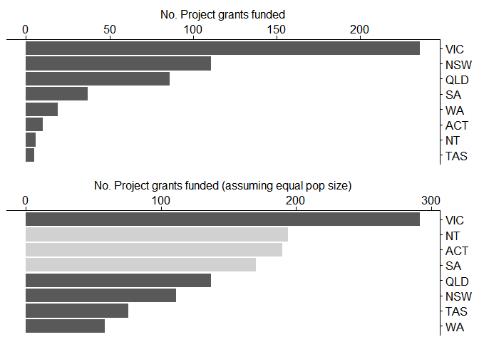

Using R to analyse NHMRC funding trends
================
Erika Duan
2019-01-09

-   [Introduction](#introduction)
-   [Data tidying](#data-tidying)
    -   [Data download](#data-download)
    -   [Data exploration](#data-exploration)
-   [Identifying data trends](#identifying-data-trends)
    -   [Differences in grant types funded](#differences-in-grant-types-funded)
    -   [Differences in funding per state/ institution](#differences-in-funding-per-state-institution)
-   [Funding and research topic coverage per state institution](#funding-and-research-topic-coverage-per-state-institution)
-   [References](#references)

Introduction
============

The NHMRC releases funding outcomes every year and these can be accessed [here](https://nhmrc.gov.au/funding/data-research/outcomes-funding-rounds). We can use this data to search for **interesting trends** like:

-   Differences in funding per state/ institution
-   Research topic diversity per state/institution
-   Most vs least well-funded research topics in terms of:
    -   Most vs least $ awarded per project for a topic or
    -   Number of projects funded per topic

Collating data from 2014-2018 can provide **addition data** on:

-   Changes in research topic popularity with time
-   Changes in research funding allocation (per state, per institution, per topic) over time

Analysing these trends allow us to monitor whether **interesting or unforseen shifts** in research topic funding have occurred over time and whether the NHMRC has **missing research gaps**. The same data can also be used to showcase strengths in Australian research and even as a surrogate indicator for future research optimism vs pessimism.

Data tidying
============

Datasets often require some **tidying** before data analysis and visualisation can be conducted. The NHMRC funding data is relatively clean, so data tidying is minimal.

Data download
-------------

To get started, we can **download the 2018 funding outcomes** directly from the [NHMRC website](https://nhmrc.gov.au/funding/data-research/outcomes-funding-rounds) using `download.file`.

On the NHMRC website, we can see that the original file is an excel spreadsheet, which we can read using the tidyverse package `readxl`.

``` r
library("tidyverse") # loads R package for data analysis
library("readxl") # loads R package for importing excel spreadsheets
library("gghighlight") # handy package for highlighting data of interest
library("cowplot") # for plotting graphs side by side
library("DT") # for displaying interactive tables

temp <- tempfile() #downloads and stores the 2018 NHMRC dataset as a temporary file

download.file("https://nhmrc.gov.au/file/12086/download?token=EQHf-aA1", 
              destfile = temp,
              method = "curl")

nhmrc_2018 <- read_excel(temp) # reads the excel file as a tidy table (tibble)
```

Data exploration
----------------

**Simple data exploration** includes using `glimpse` or `str` to examine the data structure, and `dim` to examine the data dimensions.

``` r
glimpse(nhmrc_2018) # a tidy overview of data structure
```

    ## Observations: 1,045
    ## Variables: 19
    ## $ `APP ID`              <dbl> 1150337, 1150361, 1151782, 1151848, 1151...
    ## $ `Date Announced`      <dttm> 2018-04-23, 2018-04-23, 2018-04-23, 201...
    ## $ `CIA Name`            <chr> "A/Pr Dina LoGiudice", "Prof Robert Sans...
    ## $ `Grant Type`          <chr> "Targeted Calls for Research", "Targeted...
    ## $ `Sub Type`            <chr> "Dementia in Indigenous Australians", "D...
    ## $ `Grant Title`         <chr> "Let's CHAT (Community Health Approaches...
    ## $ `Admin Institution`   <chr> "University of Melbourne", "University o...
    ## $ State                 <chr> "VIC", "NSW", "WA", "VIC", "NSW", "VIC",...
    ## $ Sector                <chr> "University", "University", "University"...
    ## $ Total                 <dbl> 2661502.0, 3046293.9, 2543423.3, 2811179...
    ## $ `Broad Research Area` <chr> "Clinical Medicine and Science", "Public...
    ## $ `Field of Research`   <chr> "Geriatrics and Gerontology", "Aborigina...
    ## $ `Res KW1`             <chr> "indigenous Australians", "dementia", "d...
    ## $ `Res KW2`             <chr> "dementia", "Aboriginal", "indigenous Au...
    ## $ `Res KW3`             <chr> "cognitive impairment", "indigenous Aust...
    ## $ `Res KW4`             <chr> "geriatrics", "randomised controlled tri...
    ## $ `Res KW5`             <chr> "health care delivery", "community inter...
    ## $ `Plain Description`   <chr> "The Let's CHAT (Community Health Approa...
    ## $ X__1                  <chr> ".", ".", ".", ".", ".", ".", ".", ".", ...

``` r
dim(nhmrc_2018) # 1045 rows and 19 columns of data
```

    ## [1] 1045   19

This allows us to identify several points:

-   Each application has a **unique ID** (important for tracking each application).
-   The column **Total** lists the funding in $AUS per application (very important continuous variable).
-   Columns **Res KW1 to Res KW5** can be combined into a single longer string (for identifying common research topics later on).
-   Columns **X\_1 and Plain Description** are not important for our analysis.

``` r
clean_2018 <- nhmrc_2018 %>%
  select(-`Plain Description`, -X__1) %>% # removes unwanted columns
  unite("Keywords", c(`Res KW1`, `Res KW2`, `Res KW3`, `Res KW4`, `Res KW5`), 
        sep = " ",
        remove = T) # creates a single column for all keywords

glimpse(clean_2018) # to check that our changes are correct
```

    ## Observations: 1,045
    ## Variables: 13
    ## $ `APP ID`              <dbl> 1150337, 1150361, 1151782, 1151848, 1151...
    ## $ `Date Announced`      <dttm> 2018-04-23, 2018-04-23, 2018-04-23, 201...
    ## $ `CIA Name`            <chr> "A/Pr Dina LoGiudice", "Prof Robert Sans...
    ## $ `Grant Type`          <chr> "Targeted Calls for Research", "Targeted...
    ## $ `Sub Type`            <chr> "Dementia in Indigenous Australians", "D...
    ## $ `Grant Title`         <chr> "Let's CHAT (Community Health Approaches...
    ## $ `Admin Institution`   <chr> "University of Melbourne", "University o...
    ## $ State                 <chr> "VIC", "NSW", "WA", "VIC", "NSW", "VIC",...
    ## $ Sector                <chr> "University", "University", "University"...
    ## $ Total                 <dbl> 2661502.0, 3046293.9, 2543423.3, 2811179...
    ## $ `Broad Research Area` <chr> "Clinical Medicine and Science", "Public...
    ## $ `Field of Research`   <chr> "Geriatrics and Gerontology", "Aborigina...
    ## $ Keywords              <chr> "indigenous Australians dementia cogniti...

**Note:** We don't want to make changes directly onto the original data or remove too many columns during initial data tidying. Some parameters may be unexpectedly useful for downstream analyses.

And with that, it's time to start some **data exploration**!

Identifying data trends
=======================

**There are no hard and fast rules for identifying data trends.** The type of data analysis depends on your research question. In general, visualisation of data distributions via `ggplot2::geom_bar` barplots can be a helpful starting point.

Differences in grant types funded
---------------------------------

With **a top-down approach** (starting with the biggest picture, then narrowing down to specific details of interest), we might first examine what grants types were funded by the NHMRC in 2018 and their proportion.

Next, we might want to know how NHMRC funding for key grant types is distributed across different states, or perhaps across different institutions per state of interest.

``` r
# Plots the distribution of grant types funded in 2018
ggplot(clean_2018, aes(x = `Grant Type`)) + 
  geom_bar() + # code below this line specifies graph formating changes only
  scale_x_discrete(position = "top") + 
  scale_y_continuous(position = "right", name = "No. of grants funded") +
  theme(axis.title.y = element_blank()) +
  coord_flip()
```


To improve visualisation, we would rank grant types from most to least abundantly funded.
To do this, we use the `forcats` package from `tidyverse`, which is designed for easy wrangling of **categorical datasets**.

``` r
clean_2018 %>%
  mutate(`Grant Type` = `Grant Type` %>% fct_infreq() %>% fct_rev()) %>% #reorders factors 
  ggplot(aes(x = `Grant Type`)) + 
  geom_bar() + 
  scale_x_discrete(position = "top") + 
  scale_y_continuous(position = "right", name = "No. of grants funded") +
  theme(axis.title.y = element_blank()) +
  coord_flip()
```


**Insight:** The majority of grants funded are **project grants**, followed by **fellowships and scholarships**. The number of Career Development fellowships (supporting mid-career researchers) funded is lower than the number of other fellowships or post-graduate scholarships (excepting the relatively rare practitioner fellowships for clinicians), and is only ~50% of the number of Early Career fellowships.

This data would support the notion that **mid-career fellowships are more competitive**, and that **there may be a lower chance of receiving independent fellowship funding during this career stage**.

We can also view the actual numbers below.

``` r
clean_2018 %>%
  mutate(`Grant Type` = `Grant Type` %>% fct_infreq()) %>% 
           count(`Grant Type`)
```

    ## # A tibble: 18 x 2
    ##    `Grant Type`                                                          n
    ##    <fct>                                                             <int>
    ##  1 Project Grants                                                      510
    ##  2 Early Career Fellowships                                            115
    ##  3 Research Fellowships                                                101
    ##  4 Postgraduate Scholarships                                            78
    ##  5 Career Development Fellowships                                       55
    ##  6 Equipment Grant                                                      42
    ##  7 Independent Research Institutes Infrastructure Support Scheme (I~    23
    ##  8 Partnerships                                                         23
    ##  9 Development Grants                                                   20
    ## 10 Targeted Calls for Research                                          17
    ## 11 Centres of Research Excellence                                       16
    ## 12 Practitioner Fellowships                                             14
    ## 13 Translating Research into Practice Fellowships                       13
    ## 14 International Collaboration - NHMRC/NAFOSTED Joint Call for Coll~     7
    ## 15 2018 Partnership Projects PRC1                                        5
    ## 16 Boosting Dementia Research Initiative                                 4
    ## 17 Boosting Dementia Research Grants -Priority Round 3                   1
    ## 18 Partnership Centre: Systems Perspective on Preventing Lifestyle-~     1

Differences in funding per state/ institution
---------------------------------------------

We can view **differences in funding across states** through two different means:

-   Total number of grants/fellowships across each state
-   Total number of grants/fellowships awarded relative to **a normalisation factor** (population size or institute number etc.)

The latter approach is more useful for comparing the research productivity of smaller states with larger states (i.e. after normalisation to the population size per state), assuming that there is a proportional increase in grant/fellowships funded with increasing population. (The real relationship is likely complicated and may feature an additional funding success penalty per small state, due to the lack of larger research hubs in smaller states, less competitive researcher recruitment packages and etc.)

To visualise the **total number of grants/ fellowships per state**, we can once again use `ggplot2::geom_bar` barplots.

``` r
grant_types <- factor(clean_2018$`Grant Type`)
levels(grant_types) # lists the types of grants available
```

    ##  [1] "2018 Partnership Projects PRC1"                                                                 
    ##  [2] "Boosting Dementia Research Grants -Priority Round 3"                                            
    ##  [3] "Boosting Dementia Research Initiative"                                                          
    ##  [4] "Career Development Fellowships"                                                                 
    ##  [5] "Centres of Research Excellence"                                                                 
    ##  [6] "Development Grants"                                                                             
    ##  [7] "Early Career Fellowships"                                                                       
    ##  [8] "Equipment Grant"                                                                                
    ##  [9] "Independent Research Institutes Infrastructure Support Scheme (IRIISS)"                         
    ## [10] "International Collaboration - NHMRC/NAFOSTED Joint Call for Collaborative Research Projects"    
    ## [11] "Partnership Centre: Systems Perspective on Preventing Lifestyle-related Chronic Health Problems"
    ## [12] "Partnerships"                                                                                   
    ## [13] "Postgraduate Scholarships"                                                                      
    ## [14] "Practitioner Fellowships"                                                                       
    ## [15] "Project Grants"                                                                                 
    ## [16] "Research Fellowships"                                                                           
    ## [17] "Targeted Calls for Research"                                                                    
    ## [18] "Translating Research into Practice Fellowships"

``` r
# Comparing project grants funded across states
Project <- clean_2018 %>% 
  filter(`Grant Type` == "Project Grants") %>%
  mutate(State = State %>% fct_infreq() %>% fct_rev()) %>%
  ggplot(aes(x = State)) +
  geom_bar() +
    scale_x_discrete(position = "top") + 
  scale_y_continuous(position = "right", name = "No. Project grants funded") +
  theme(axis.title.y = element_blank(),
        axis.title.x = element_text(size = 12)) +
  coord_flip()

# Comparing ECR fellowships funded across states
ECR <- clean_2018 %>% 
  filter(`Grant Type` == "Early Career Fellowships") %>%
  mutate(State = State %>% fct_infreq() %>% fct_rev()) %>%
  ggplot(aes(x = State)) +
  geom_bar() +
    scale_x_discrete(position = "top") + 
  scale_y_continuous(position = "right", name = "No. ECR fellowships funded") +
  theme(axis.title.y = element_blank(),
        axis.title.x = element_text(size = 12)) +
  coord_flip()

# Comparing CD fellowships funded across states
CD <- clean_2018 %>% 
  filter(`Grant Type` == "Career Development Fellowships") %>%
  mutate(State = State %>% fct_infreq() %>% fct_rev()) %>%
  ggplot(aes(x = State)) +
  geom_bar() +
    scale_x_discrete(position = "top") + 
  scale_y_continuous(position = "right", name = "No. CD fellowships funded") +
  theme(axis.title.y = element_blank(),
        axis.title.x = element_text(size = 12)) +
  coord_flip() +
  gghighlight(!State == "QLD", use_group_by = F)
```

    ## label_key: State

``` r
# Comparing Research fellowships funded across states
Research <- clean_2018 %>% 
  filter(`Grant Type` == "Research Fellowships") %>%
  mutate(State = State %>% fct_infreq() %>% fct_rev()) %>%
  ggplot(aes(x = State)) +
  geom_bar() +
    scale_x_discrete(position = "top") + 
  scale_y_continuous(position = "right", name = "No. Research fellowships funded") +
  theme(axis.title.y = element_blank(),
        axis.title.x = element_text(size = 12)) +
  coord_flip()

counts_plots <- plot_grid(Project, ECR, CD, Research,
          labels = "AUTO")

counts_title <- ggdraw() + 
  draw_label("2018 NHMRC funding outcomes (total counts)")

plot_grid(counts_title, counts_plots,
          ncol = 1, rel_heights = c(0.1, 1)) # rel_heights values control title margins
```


**Insight:** The state with the highest number of project grants was VIC, with almost twice the number of grants compared to NSW. As VIC and NSW both have large populations, this suggests that Victorian researchers likely have an increased funding success rate.

**Another important insight** is that Career Development Fellowships are more disproportionately awarded to only Victoria and NSW compared to other funding schemes. This potentially may be related to the decreased number of total CD fellowships funded (i.e. increased competition) and indicates that a mid-career pipeline leak may be more likely to exist, especially for non-VIC/NSW researchers.

### Data visualisation through geospatial data

An alternate way of visualising the same data is through **static geospatial data**. The `tmap` package requires shape objects (objects from the class Spatial or Raster; from the sp and the raster packages).

We first need a shapefile of the boundaries data of Australian States and Territories and these can be found from the Australian Bureau of Statistics [here](http://www.abs.gov.au/AUSSTATS/abs@.nsf/DetailsPage/1259.0.30.001July%202011?OpenDocument). Shapefiles will require conversion into Raster objects in R.

``` r
library(tmap) # mapping onto static geographical maps
```

### Data normalisation for inter-state comparisons

**Total counts can often obscure information, as certain biases are inherited.** For instance, it may seem as if low grant success rates occur in WA, ACT, NT and Tasmania. This, however, is not necessarily an accurate interpretation, as the total number of funding applications and applicants is likely much higher in VIC and NSW.

One way we can account for this bias is to **normalise** the total number of grants received by a factor like:

-   Total population size or
-   Total number of institutions per state (which acts as a surrogate for researcher population size)
-   Total number of unique applicants per state (if the information exists)

**To normalise by total population size**, we can use 2018 census data and obtain state population numbers [here](www.abs.gov.au/Population).

``` r
# Create a new dataset with population size
pop_2018 <- data_frame(State = c("VIC", "NSW", "QLD", "ACT", "WA", "NT", "SA", "TAS"),
                      Pop.size = c(6459800, 7987300, 5012200, 420900, 2595900, 247300, 1736400, 528100))

# Normalisation factor = state population/ largest state population
pop_2018 <- mutate(pop_2018,
                   Pop.norm.factor = Pop.size/7987300)

# Subset only relevant datasets
pop_norm_factor <- clean_2018 %>%
  select(`APP ID`, `Grant Type`, State) %>%
  filter(`Grant Type` %in% c("Project Grants", # filters for grant types of interest 
           "Early Career Fellowships",
           "Career Development Fellowships",
           "Research Fellowships")) %>%
  group_by(`Grant Type`, State) %>%
  summarise(Count = n())

# Join the corresponding normalisation factor to each state
pop_norm_2018 <- left_join(pop_norm_factor, pop_2018,
                           by = "State") %>%
  mutate(Pop.normed.count = Count / Pop.norm.factor)
```

We can now plot graphs using the normalised (by state population size) grant numbers. These normalised counts represent the total number of grants that a state would actually have received:

-   If all populations were matched in size
-   Assuming a linear positive correlation between population size and funding success

``` r
# Normalised project grants
Project.norm <- pop_norm_2018 %>% 
  filter(`Grant Type` == "Project Grants") %>%
  ggplot(aes(x = fct_reorder(State, Pop.normed.count), y = Pop.normed.count)) +
  geom_col() +
    scale_x_discrete(position = "top") + 
  scale_y_continuous(position = "right", name = "No. Project grants funded (assuming equal pop size)") +
  theme(axis.title.y = element_blank(),
        axis.title.x = element_text(size = 12)) +
  coord_flip() +
  gghighlight(!State %in% c("SA","NT","ACT"))

plot_grid(Project, Project.norm, ncol=1) 
```



**Insight:** If we factor population size (to obtain a less biased way to compare state research competitiveness), **NT, ACT and SA perform relatively well for their relatively decreased population size**. Overall project grant success rates are comparatively higher in QLD compared to NSW.

``` r
# Normalised EC Fellowships
ECR.norm <- pop_norm_2018 %>% 
  filter(`Grant Type` == "Early Career Fellowships") %>%
  ggplot(aes(x = fct_reorder(State, Pop.normed.count), y = Pop.normed.count)) +
  geom_col() +
    scale_x_discrete(position = "top",
                     drop = F) + 
  scale_y_continuous(position = "right", name = "No. funded if equal pop") +
  theme(axis.title.y = element_blank(),
        axis.title.x = element_text(size = 12)) +
  coord_flip() +
  gghighlight(!State %in% c("SA","TAS","ACT"))

# Redrawing CD Fellowships without gghighlight
CD <- clean_2018 %>% 
  filter(`Grant Type` == "Career Development Fellowships") %>%
  mutate(State = State %>% fct_infreq() %>% fct_rev()) %>%
  ggplot(aes(x = State)) +
  geom_bar() +
    scale_x_discrete(position = "top") + 
  scale_y_continuous(position = "right", name = "No. CD fellowships funded") +
  theme(axis.title.y = element_blank(),
        axis.title.x = element_text(size = 12)) +
  coord_flip()

# Normalised CD Fellowships
CD.norm <- pop_norm_2018 %>% 
  filter(`Grant Type` == "Career Development Fellowships") %>%
  ggplot(aes(x = fct_reorder(State, Pop.normed.count), y = Pop.normed.count)) +
  geom_col() +
    scale_x_discrete(position = "top") + 
  scale_y_continuous(position = "right", name = "No. funded if equal pop") +
  theme(axis.title.y = element_blank(),
        axis.title.x = element_text(size = 12)) +
  coord_flip() +
  gghighlight(!State %in% c("VIC","ACT"))

# Normalised Research Fellowships
Research.norm <- pop_norm_2018 %>% 
  filter(`Grant Type` == "Research Fellowships") %>%
  ggplot(aes(x = fct_reorder(State, Pop.normed.count), y = Pop.normed.count)) +
  geom_col() +
    scale_x_discrete(position = "top") + 
  scale_y_continuous(position = "right", name = "No. funded if equal pop") +
  theme(axis.title.y = element_blank(),
        axis.title.x = element_text(size = 12)) +
  coord_flip() +
  gghighlight(!State %in% c("SA","QLD", "NSW"))

total_ECR <- plot_grid(ECR, ECR.norm, ncol=1) 
total_CD <- plot_grid(CD, CD.norm, ncol=1) 
total_Research <- plot_grid(Research, Research.norm, ncol=1) 

plot_grid(total_ECR, total_CD, total_Research, ncol = 3)
```


**Insight:** By normalising for state population size, it appears that funding success rates are more equivalent between some smaller states and VIC, with an increased disparity between VIC and NSW. Interestingly, after normalising by population size, we can see that Victoria gets the lion's share of Research Fellowships.

**Further considerations:** Choosing a suitable normalisation factor is crucial. For instance, since the population size differs so much between the bigger and smaller states (by more than an order of magnitude), we may be over-correcting funding potential for the smaller states (by assuming that their success rates would have continued to linearly increase with population).

This gives rise to the question: what is the best normalisation factor to use?

### Choosing a suitable normalisation factor

**Population size** - grant success rates for smaller states may be over-modeled as the relationship between number of grant applications and number of grants funded per state is not necessarily linear, and the relationship between the number of grant applications and population size is not necessarily linear either.

**Number of institutes per state** - the assumption would be that smaller states have fewer individual institutions and this number may be a better surrogate for the number of researchers/ grant applicants per state. We can obtain this information from our current dataset.

There is, however, a possibility of underestimating institution numbers per state (especially for smaller states), as some very small institutions may not have received funding in 2018 and are hence omitted from this dataset.

**Number of unique grant applicants per state** - this is likely the best normalisation factor as it most accurately estimates the grant funding success rate per state. The data, however, cannot be easily obtained.

``` r
# Comparing normalisation factors - institutions per state
institutes <- clean_2018 %>% 
  select(State, `Admin Institution`) %>%
  group_by(State) %>%
  distinct(`Admin Institution`) %>%
  summarise(Institute.no = n()) %>%
  mutate(Institute.norm.factor = Institute.no/20)

norm_factor <- left_join(pop_2018, institutes,
                         by = "State") %>%
  select(State, Pop.norm.factor, Institute.norm.factor) 

norm_factor <- arrange(norm_factor, desc(Pop.norm.factor)) %>%
  mutate(Pop.norm.rank = 1:nrow(norm_factor)) %>% # rank pop norm factors
  arrange(desc(Institute.norm.factor)) %>%
  mutate(Institute.norm.rank = 1:nrow(norm_factor)) %>% # rank institute norm factors
  mutate(Pop.norm.factor = round(Pop.norm.factor, 2)) # rounds the norm factor to 2 decimal figures
  
# Drawing a table of normalisation factors and their rankings of each state

datatable(norm_factor,
          rownames = F,
          colnames = c("Population norm factor" = "Pop.norm.factor",
                       "Institute norm factor" = "Institute.norm.factor",
                       "Ranking by population" = "Pop.norm.rank",
                       "Ranking by institutions" = "Institute.norm.rank"),
          class = "hover",
          options = list(dom = "t", 
                         pageLength = 8)) %>%
  formatStyle("State", fontWeight = "bold")
```


**Insight:** If we quickly have a look at the two normalisation factors, **VIC is ranked higher than NSW by total institution number but not population size** (which may better explain why VIC received the highest number of multiple grant types).

Normalising by state population versus total institution number is **surprisingly similar** for TAS, NT and SA. ACT has a higher number of institutions relative to its population size, compared to the other smaller states. QLD and WA have a lower number of institutions relative to their population size, compared to other states.

**Surprisingly, state rankings by either normalisation factors are relatively similar to each other**, indicating that there is likely a relationship between the two parameters (we can confirm this by calculating the correlation). Looking at this table, I would prefer to normalise by total institution number, when comparing state funding success.

Funding and research topic coverage per state institution
=========================================================

``` r
# Identifying top 5 topic trends during 2018
# Plotting funding per institute and colour the fill by research topic. 
```

References
==========

This post was written based on the following resources and R packages:

**R packages:**

-   **Tidyverse** - Hadley Wickham (2017). tidyverse: Easily Install and Load the 'Tidyverse'. R package version 1.2.1. <https://CRAN.R-project.org/package=tidyverse>
    -   read\_excel
    -   ggplot2
    -   forcats
    -   dplyr
-   **gghighlight** - Hiroaki Yutani (2018). gghighlight: Highlight Lines and Points in 'ggplot2'. R package version 0.1.0. <https://CRAN.R-project.org/package=gghighlight>
-   **Cowplot** - Claus O. Wilke (2018). cowplot: Streamlined Plot Theme and Plot Annotations for 'ggplot2'. R package version 0.9.3. <https://CRAN.R-project.org/package=cowplot>
-   **DataTable** - Yihui Xie, Joe Cheng and Xianying Tan (2018). DT: A Wrapper of the JavaScript Library 'DataTables'. R package version 0.5. <https://CRAN.R-project.org/package=DT>

**Resources:**

-   [How to arrange plots using cowplot](https://cran.r-project.org/web/packages/cowplot/vignettes/plot_grid.html)
-   [Guide to categorical data analysis using forcats](https://r4ds.had.co.nz/factors.html)
-   [R for Data Science](https://r4ds.had.co.nz)
-   [How to use geospatial data in R](https://blog.exploratory.io/making-maps-for-australia-states-and-local-government-areas-in-r-d78edb506f37)
