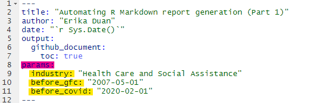
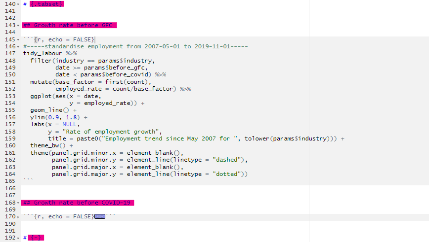
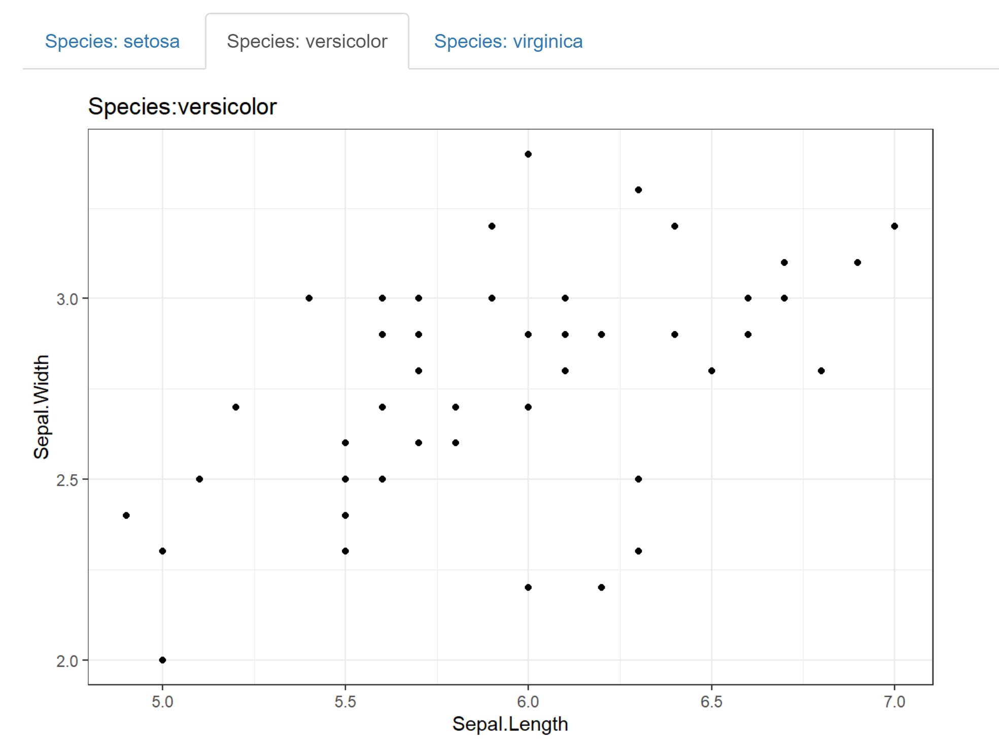

---
title: "Automating R Markdown report generation (Part 1)"
author: "Erika Duan"
date: "`r Sys.Date()`"
output:
  github_document:
    toc: true
params:
  industry: "Health Care and Social Assistance"
  before_gfc: "2007-05-01"
  before_covid: "2020-02-01"
--- 

```{r, echo = TRUE, message = FALSE, warning = FALSE}  
#-----load required packages-----  
if (!require("pacman")) install.packages("pacman")
pacman::p_load(here,  
               tidyverse,
               readxl) # read excel spreadsheets  
```


# Introduction  

When I'm working on an ad hoc data analysis project, I don't usually get enough time to explore its productionisation. Productionisation can be thought of as the implementation of an automatable (i.e scalable) data analysis delivery pipeline to data consumers. It can be a skillset that is underdeveloped in heavily analysis-oriented data scientists.    

Productionisation using R Markdown is important to learn, as an automated reporting tool enables long-term sustainability, especially when decision-making areas rely on defined data sources. In this example, I will be using quarterly released labour force data segregated by industry, occupation and sector from the Australian Bureau of Statistics (ABS) to explore R Markdown development tips.   


# Using a publicly available dataset    

The dataset is **Table 4: Employed persons by Industry division of main job** and is [publicly available](https://beta.abs.gov.au/statistics/labour/employment-and-unemployment/labour-force-australia-detailed/latest-release#industry-occupation-and-sector) from the ABS website. For analysis, we are only interested in spreadsheets with the 'Data' prefix.       

```{r, message = FALSE, warning = FALSE}
#-----load ABS spreadsheet-----
data_path <- here::here("01_raw_data", "2020-08-30_ABS-labour-force-table-4.xls")

labour_dataset <- data_path %>%
  excel_sheets() %>%
  set_names() %>% # extract all sheet names  
  str_subset(., "Data.+") %>% # subset relevant sheet names    
  map_dfc(~ read_excel(path = data_path,
                       sheet = .x, 
                       col_names = T))    
```

```{r}
#-----clean ABS spreadsheet-----   
# remove unnecessary rows  

labour_anno <- labour_dataset %>% 
  slice(1: 9)
  
tidy_labour <- labour_dataset %>%
  slice(10: nrow(labour_dataset)) %>%
  rename(date = ...1) %>%
  mutate(date = as.Date(as.numeric(date), origin = "1899-12-30")) %>%
  arrange(date)

# remove summary columns  

remove_cols <- str_subset(colnames(tidy_labour), "^Employed total")  
tidy_labour <- tidy_labour %>%
  select(-all_of(remove_cols))  

# select date column and seasonally adjusted columns    

selected_cols <- colnames(tidy_labour)[c(1, seq(3, ncol(tidy_labour), by = 3))] 

tidy_labour <- tidy_labour %>%
  select(all_of(selected_cols))  

# clean column names  

colnames(tidy_labour) <- str_remove_all(colnames(tidy_labour), "\\s;.+")

# pivot longer to add industry type as a column   

tidy_labour <- tidy_labour %>%
  pivot_longer(cols = -date,
               names_to = "industry",
               values_to = "count") # units in 1000s  

# round count to nearest 3 decimal places  

tidy_labour <- tidy_labour %>%
  mutate(count = as.numeric(count),
         count = round(count, digits = 3))   
```

**Note:** The clean dataset exists in a long format (with date and industry as filterable variables) and is previewed below.   

```{r, echo = FALSE}  
tidy_labour %>% 
  head(5) %>%  
  knitr::kable()
```


# Knitting reports with parameters    

We can specify the parameters of interest in the YAML header of our R Markdown report and reference our parameters in code.         

```{r, echo = FALSE, fig.align = 'center', fig.show = 'hold', out.width = '55%'} 
   
```
  
<br>  
  
```{r, fig.align = 'center', fig.show = 'hold', out.width = '60%'}
#-----draw longitudinal graph for Health Care and Social Assistance-----  
tidy_labour %>%
  filter(industry == params$industry) %>%
  ggplot(aes(x = date,
             y = count)) +
  geom_line() + 
  geom_vline(xintercept = c(as.Date(params$before_gfc), as.Date(params$before_covid)),
             colour = c("firebrick", "salmon"),
             linetype = "dashed") + 
  labs(x = NULL,
       y = "Employed persons (thousands)",
       title = paste0("Employment trend for ", tolower(params$industry))) + 
  theme_bw() + 
  theme(panel.grid.minor.x = element_blank(),
        panel.grid.minor.y = element_line(linetype = "dashed"),
        panel.grid.major.x = element_blank(),
        panel.grid.major.y = element_line(linetype = "dotted"))
```

**Note:** Using parameters removes the need for hardcoding reporting variables. This also allows us to render additional reports using different values of the same parameter.     


# Creating html tabs in reports 


## Creating tabs manually  

Creating [html tabs](https://bookdown.org/yihui/rmarkdown-cookbook/html-tabs.html) is a handy way to organise parallel sections of information (for example, a plot and table for the same dataset). This is as easy as adding the code `{.tabset}` next to an empty header one level higher than the header level that you want to contain within a tab.     

```{r, echo = FALSE, fig.align = 'center', fig.show = 'hold', out.width = '80%'}     
    
```

<br> 
Make sure you add the code `{-}` next to an empty higher level header to signal where tab creation ends. The html output consists of interactive headers with titles corresponding to individual header names.      

```{r, echo = FALSE, fig.align = 'center', fig.show = 'hold', out.width = '60%'}     
knitr::include_graphics("../../02_figures/2020-08-30_dynamic-tabs-example-1.png")    
```


## Creating tabs dynamically    

There will be circumstances when you do not want to or cannot manually specify the number of tabs required. In these circumstances, dynamic tabs can be created by:  

1. Creating individual plots (using a function) and storing them inside a list.  
2. Creating a chunk of code in between a header labelled `{.tabset}` and a header labelled `{-}`.
3. Setting this chunk of code with `echo = FALSE` and `results = 'asis'`.    

```{r, echo = TRUE, results = 'hide'}
#-----1. write a function that generates a plot-----
plot_iris_sepal_length_vs_width <- function(species) {
  iris %>%
    filter(Species == species) %>%
    ggplot(aes(x = Sepal.Length,
               y = Sepal.Width)) +
    geom_point() + 
    labs(title = paste0("Species:", species)) +  
    theme_bw()
}

# create plots  

plots <- iris %>%
  distinct(Species) %>%
  pull(Species) %>%
  map(~ plot_iris_sepal_length_vs_width(.x)) 

# set plot names  

species_names <- iris %>%
  distinct(Species) %>%
  pull(Species) 

plots <- set_names(plots, species_names)
```

```{r, echo = TRUE, message = FALSE, fig.show = 'hide', results = 'hide'}
#-----2. write a for loop to print code for tab creation-----  
# set echo = FALSE and results = 'asis'  
# insert chunk between a header labelled `{.tabset}` and a header labelled `{-}`  
# store plot as temp object and then print temp object

for (i in seq_along(plots)) {
  temp <- plots[[i]]
  cat("##", "Species:", names(plots[i]), "\n") # create a tabs labelled using the plot name
  print(temp) 
  cat("\n\n")
}
```

This will generate dynamically sized tabs shown below.  

```{r, echo = FALSE, fig.align = 'center', fig.show = 'hold', out.width = '80%'}     
    
```

**Note:** The [feature](https://bookdown.org/yihui/rmarkdown-cookbook/results-asis.html) `results = 'asis'` allows R code to be printed as a raw output (i.e. code is not printed inside fenced code blocks). This is handy for writing for loops to automate aspects of R Markdown report generation.       


# Resources   

+ A great [presentation](https://docs.google.com/presentation/d/e/2PACX-1vRo1eXJtiwo6aTA8KZ2E-bUbv2GOonC2RIVk_5eWQ5y-ADXbRamBhHaa3w1vMW6BkEPOMJ13ZahSo8Q/embed?start=false&loop=true&delayms=30000&slide=id.p) by Thomas Mock on advanced R Markdown features.      

+ A great [blog post](https://emilyriederer.netlify.app/post/rmddd-tech-appendix/) by Emily Riederer on data analysis productionisation in R.        

+ A great [blog post](https://towardsdatascience.com/what-does-it-mean-to-productionize-data-science-82e2e78f044c) by Schaun Wheeler on the importance of data science productionisation.     

+ The definitive R Markdown [resource guide](https://bookdown.org/yihui/rmarkdown-cookbook/html-tabs.html) by Yihui Xie.      