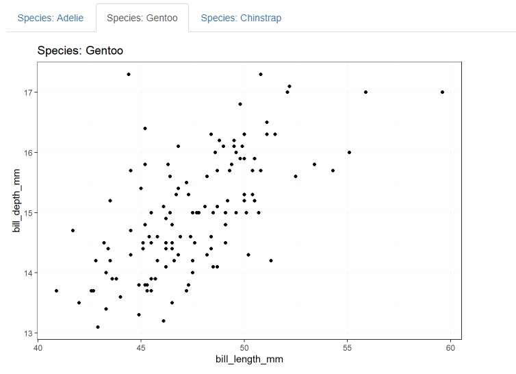

Creating professional R Markdown reports
================
Erika Duan
2022-05-22

-   [Creating html tabs in R Markdown
    reports](#creating-html-tabs-in-r-markdown-reports)
    -   [Creating tabs manually](#creating-tabs-manually)
    -   [Creating tabs dynamically](#creating-tabs-dynamically)
-   [Resources](#resources)

``` r
# Load required packages -------------------------------------------------------  
if (!require("pacman")) install.packages("pacman")
pacman::p_load(here,
               tidyverse,
               palmerpenguins)  
```

# Creating html tabs in R Markdown reports

Creating [html
tabs](https://bookdown.org/yihui/rmarkdown-cookbook/html-tabs.html) is a
handy way to organise parallel sections of information i.e. displaying
multiple plots from the same dataset. We can use the dataset from the
`palmerpenguin` R package to explore this.

``` r
# Preview palmerpenguin dataset ------------------------------------------------
palmerpenguins::penguins %>%
  head(3) %>%
  knitr::kable()
```

| species | island    | bill_length_mm | bill_depth_mm | flipper_length_mm | body_mass_g | sex    | year |
|:--------|:----------|---------------:|--------------:|------------------:|------------:|:-------|-----:|
| Adelie  | Torgersen |           39.1 |          18.7 |               181 |        3750 | male   | 2007 |
| Adelie  | Torgersen |           39.5 |          17.4 |               186 |        3800 | female | 2007 |
| Adelie  | Torgersen |           40.3 |          18.0 |               195 |        3250 | female | 2007 |

## Creating tabs manually

Tabs can be created manually by adding the code `{.tabset}` next to an
empty header one level higher than the header level that you want to
display as a tab. Make sure you add the code `{-}` next to a second
higher level header to signal where tab creation ends.


The html output consists of interactive headers with titles
corresponding to individual header names.


## Creating tabs dynamically

There will be circumstances where you do not want to or cannot manually
specify the number of tabs required. In these circumstances, dynamic
tabs can be created through the following steps:

1.  Create individual plots (using a function) and store them inside a
    list.  
2.  Create a chunk of code in between a higher level header labelled
    `{.tabset}` and another one labelled `{-}`.  
3.  Set this chunk of code with `echo=FALSE` and `results='asis'`.

``` r
# Create a list of plots -------------------------------------------------------
plot_bill_length_vs_depth <- function(penguin_species) {
  palmerpenguins::penguins %>%
    filter(species == penguin_species) %>%
    ggplot(aes(x = bill_length_mm,
               y = bill_depth_mm)) +
    geom_point() + 
    labs(title = paste0("Species: ", penguin_species)) +  
    theme_bw() +
    theme(panel.grid = element_line(linetype = "dotted"))
}

# Extract distinct species names and create a plot per species  
plots <- palmerpenguins::penguins %>%
  distinct(species) %>%
  pull(species) %>%
  map(~ plot_bill_length_vs_depth(.x)) 

# Set plot names  
species_names <- palmerpenguins::penguins %>%
  distinct(species) %>%
  pull(species) 

plots <- set_names(plots, species_names)
```

``` r
# Use a for loop to print code for tab creation via R Markdown -----------------  
# Set echo=FALSE and results='asis' in the code chunk   
# Insert chunk between a header labelled `{.tabset}` and a header labelled `{-}`  
# Store each plot as temp object and then print each temp object and two new lines  
for (i in seq_along(plots)) {
  temp <- plots[[i]]
  cat("##", "Species: ", names(plots[i]), "\n") # Create tabs from plot names
  print(temp) 
  cat("\n\n")
}
```

This will generate dynamically sized tabs as shown below.



**Note:** The option `results='asis'` allows R code to be printed as a
raw output (i.e. code is not printed inside fenced code blocks). This is
handy for writing for loops to automate aspects of R Markdown report
generation.

# Resources

-   The definitive R Markdown [resource
    guide](https://bookdown.org/yihui/rmarkdown-cookbook/html-tabs.html)
    by Yihui Xie.
