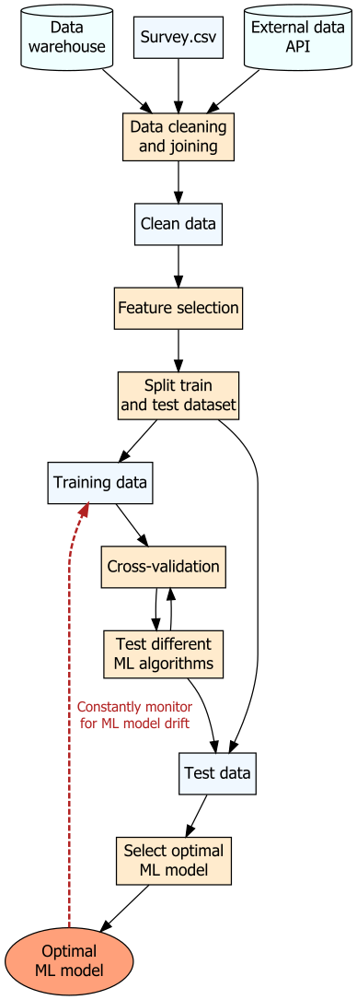

```{r setup, include=FALSE}
# Set up global environment ----------------------------------------------------
knitr::opts_chunk$set(echo=TRUE, results='hide', fig.show='hold', fig.align='center')
```


```{r load libraries, echo=TRUE, message=FALSE, warning=FALSE}  
# Load required R packages -----------------------------------------------------  
if (!require("pacman")) install.packages("pacman")
pacman::p_load(here,
               tidyverse,
               DiagrammeR,
               DiagrammeRsvg,
               rsvg, # For exporting graphs into svgs
               xml2, # For exporting graphs into svgs without prior rendering
               plotly) # For exporting mermaid graphs  
```


# Introduction to DiagrammeR    

Last year, I attended the [R Toronto data workshop series](https://www.youtube.com/user/RohanPAlexander/videos) co-founded by [Rohan Alexander](https://rohanalexander.com/) and [Kelly Lyons](individual.utoronto.ca/klyons/). During a talk by Marija Pejcinovska, Marija recommended using the package `DiagrammeR` to create flow charts in reports, so I thought I would give it a go.   

`DiagrammeR` depends on the graphical description language Graphviz, which can be accessed using the R packages `igraph` and `visNetwork`. `Diagrammer` works by passing valid graph specifications in the DOT language via the `grViz()` function to output graphs. The official documentation for `DiagrammeR` can be accessed [here](https://rich-iannone.github.io/DiagrammeR/graphviz_and_mermaid.html).  

```{r examine dependencies}
# Examining DiagrammeR package dependencies ------------------------------------  
# List all installed packages 
packages <- installed.packages() 

# Extract DiagrammeR package dependencies  
dependencies <- packages[packages[, "Package"] == "DiagrammeR", "Imports"] %>% 
  str_remove_all("\\n") %>%
  strsplit(",") 

# Output dependencies as table
dependencies %>% 
  unlist() %>%
  tibble("packages" = .) %>%
  knitr::kable()
```

According to [this very informative tutorial](https://cyberhelp.sesync.org/blog/visualization-with-diagrammeR.html), there are at least three different ways to create a graph using `DiagrammeR`:    

+ Use `create_graph()` and `render_graph()` on a list of nodes and edges.  
+ Create a valid diagram specification in DOT language and pass this as a string to the function `grViz()`.  
+ Create a valid diagram specification and pass this as a string or `.mmd` file reference to the function `mermaid()`.   


# Use `create_graph()` to create a simple graph  

Simple graphs can be created using `create_graph()` on a list of nodes and edges dataframes. This method is handy for drawing simple relationships between objects. The full list of node and edge attributes can be found [here](https://rich-iannone.github.io/DiagrammeR/ndfs_edfs.html).       

```{r create simple_graph, warning=FALSE}
# Define graph edges and nodes -------------------------------------------------  
# 1 == "Photosynthesis"
# 2 == "Aerobic respiration"  
# 3 == "Solar energy"  

edges <- create_edge_df(from = c(1, 2, 3), # Input numerical vectors 
                        to = c(2, 1, 1), # Input numerical vectors 
                        label = c("Oxygen \n Glucose", "Carbon dioxide \n Water", NA),
                        color = "black") 

nodes <- create_node_df(n = 3,
                        label = c("Photosynthesis", "Aerobic \n respiration", "Solar \n energy"),
                        type = "lower",
                        style = "filled",
                        fillcolor = c("darkseagreen", "mistyrose", "gold"), 
                        fontcolor = "black",
                        shape = "circle",
                        fixedsize = T)

# Create graph -----------------------------------------------------------------
simple_graph <- create_graph(nodes_df = nodes, edges_df = edges)  

class(simple_graph)
#> [1] "dgr_graph"

# Render graph -----------------------------------------------------------------
# render_graph(simple_graph) does not work for github documents  

# Export graph as an svg ------------------------------------------------------
export_graph(simple_graph,
             file_name = here("figures", "dv-using_diagrammer-simple_flowchart.svg"),
             file_type = "svg")
```

```{r plot simple_graph, echo=FALSE, results='hold'} 
knitr::include_graphics("../../figures/dv-using_diagrammer-simple_flowchart.svg")  
```

There are several limitations to this approach if you want to create a more complex flow chart.     

+ Edges must be coded using `to` and `from` numerical vectors.  
+ There is no easy way to specify node positions (it would make sense to have Solar energy displayed as the top node).  
+ There is no easy way to specify edge label positions.  
+ The graphical output is trimmed if the node labels are too long.  


# Use `grVis()` to create a simple flow chart     

As an alternative, I recommend using the `grVis()` approach to customise flow charts.   

```{r create simple_flowchart, warning=FALSE}
# Create a simple flow chart using grViz() -------------------------------------  
simple_flowchart <- grViz(
  "digraph {
         
    graph[layout = dot, rankdir = LR] # Set node direction
                     
    node[shape = circle, style = filled] # Set global node attributes 
                     
    a[label = 'Photosynthesis', fillcolor = 'darkseagreen']
    b[label = 'Aerobic \nrespiration', fillcolor = 'mistyrose']
    c[label = 'Solar \nenergy', fillcolor = 'gold']

    edge[color = black, fontsize = 8] # Set global edge attributes  
                     
    a -> b[label = 'Oxygen \nGlucose']
    a -> b[style = 'invis']
    a -> b[style = 'invis']
    b -> a[label = 'Carbon dioxide \n Water']
    b -> a[style = 'invis']
    b -> a[style = 'invis']
    c -> a[label = '                       ']
                     
  }"
)

# Check graph object type 
class(simple_flowchart)
#> [1] "grViz"      "htmlwidget"

# Export graph as an svg -------------------------------------------------------
simple_flowchart %>% 
  export_svg %>%
  charToRaw %>%
  rsvg_svg(here("figures", "dv-using_diagrammer-simple_flowchart_grvis.svg"))

# Alternatively export graph as an svg without prior rendering via
# simple_flowchart %>%
#  export_svg() %>%
#  read_xml() %>%
#  write_xml(here("figures", "dv-using_diagrammer-simple_flowchart_grvis.svg"))
```

```{r plot simple_flowchart, echo=FALSE, results='hold', out.width='60%'} 
knitr::include_graphics("../../figures/dv-using_diagrammer-simple_flowchart_grvis.svg")  
```

A few tricks I used above were to:  

+ Set global attributes for nodes and edges and manually override individual nodes or edges using local attributes, where required.      
+ Create additional layers of invisible edges to increase arrow curvature between specific nodes as recommended [here](https://stackoverflow.com/questions/11283701/how-to-specify-the-length-of-an-edge-in-graphviz).       
+ Create an edge label with an empty string to increase the length of a specific edge.        


# Use `grVis()` to create more complex flow charts   

The function `grVis()` is extremely versatile and can be used to draw many different types of flow charts.   


## ML workflow flow chart  

In this example, I want to create a (rather optimistic) flow chart of my machine learning workflow to share with another data science team. This example is heavily inspired [by Michael Harper's blog post](https://mikeyharper.uk/flowcharts-in-r-using-diagrammer/).       

```{r create ml_workflow, warning=FALSE}  
# Create a flow chart to describe my ML workflow -------------------------------  
ml_workflow <- grViz(
  "digraph {
         
    graph[layout = dot]
                     
    node[shape = rectangle, style = filled, fillcolor = 'blanchedalmond'] 
                     
    data_source_1[label = 'Data \n warehouse', shape = cylinder, fillcolor = 'azure']
    data_source_2[label = 'Survey.csv', fillcolor = 'aliceblue']
    data_source_3[label = 'External data \n API', shape = cylinder, fillcolor = 'azure']
                  
    process_1[label = 'Data cleaning \n and joining']
    process_2[label = 'Feature selection']
    process_3[label = 'Split train \n and test dataset']  
    process_4[label = 'Cross-validation']  
    process_5[label = 'Test different \n ML algorithms']
    process_6[label = 'Select optimal \n ML model']
                     
    file_1[label = 'Clean data', fillcolor = 'aliceblue']
    file_2[label = 'Training data', fillcolor = 'aliceblue']
    file_3[label = 'Test data', fillcolor = 'aliceblue']
                     
    product_1[label = 'Optimal \n ML model', shape = 'ellipse', fillcolor = 'lightsalmon']
                     
    edge[color = black, fontsize = 12] 
                     
    data_source_1 -> process_1
    data_source_2 -> process_1
    data_source_3 -> process_1  
                     
    process_1 -> file_1
                     
    file_1 -> process_2
    process_2 -> process_3
    process_3 -> file_2
    process_3 -> file_3
                     
    file_2 -> process_4
    process_4 -> process_5
    process_5 -> process_4
                     
    process_5 -> file_3
    file_3 -> process_6
    process_6 -> product_1
                     
    product_1 -> file_2[label = '      Constantly monitor \n for ML model drift',
                        style = 'dashed', penwidth = 2, weight = 2, 
                        color = 'firebrick', fontcolor = 'firebrick']
                     
  }"
)

# Export graph as an svg -------------------------------------------------------
ml_workflow %>% 
  export_svg %>%
  charToRaw %>%
  rsvg_svg(here("figures", "dv-using_diagrammer-ml_workflow.svg"))
```

```{r plot ml_workflow, echo=FALSE, results='hold', out.width='30%'} 
  
```

**Note:** a list of node shape types, or other node or edge attributes, can be found from the [official Graphviz documentation](https://www.graphviz.org/doc/info/shapes.html).   


## Clinical trial progress flow chart  

Another handy feature of `grVis()` is that values generated in R can be directly passed into flow charts. This is done by setting node labels as `@@[footnote number]` within the graph and passing values to `[footnote number]` outside the digraph string.     

```{r create simple_trial, warning=FALSE}
# Create flow chart with flexible parameter inputs -----------------------------  
set.seed(111)

a <- 200 # Total patients
b <- sample(1:60, 1) # Excluded patients
c <- 200 - b # Randomised patients 
d <- ceiling(c/2) # Assigned treatment A
e <- c - d # Assigned treatment B

# Store parameters inside a list
flow_chart_data <- list(a, b, c, d, e) 

# Create grVis() graph
simple_trial <- grViz(
  "digraph {
         
    graph[layout = dot]
                     
    node[shape = rectangle, style = filled, margin = 0.2, fillcolor = 'aliceblue']  
                     
    a[label = '@@1']
    b[label = '@@2', fillcolor = 'mistyrose']
    c[label = '@@3']
    d[label = '@@4']
    e[label = '@@5']

    edge[color = black]   
                
    a -> b[style = 'dashed']
    a -> c[weight = 2] # Weighs this edge more heavily so it is centrally placed 
    c -> d
    c -> e
                     
  }
                     
  [1]: paste0('Patients screened (n = ', flow_chart_data[[1]], ')')
  [2]: paste0('Patients excluded (n = ', flow_chart_data[[2]], ')')
  [3]: paste0('Patients randomised (n = ', flow_chart_data[[3]], ')')
  [4]: paste0('  Patients assigned Treatment A (n = ', flow_chart_data[[4]], ')')
  [5]: paste0('  Patients assigned Treatment B (n = ', flow_chart_data[[5]], ')')

  "
) 

# Export graph as an svg -------------------------------------------------------
simple_trial %>% 
  export_svg %>%
  charToRaw %>%
  rsvg_svg(here("figures", "dv-using_diagrammer-flowchart_clinical_single.svg"))
```

```{r plot simple_trial, echo=FALSE, results='hold', out.width='60%'} 
knitr::include_graphics("../../figures/dv-using_diagrammer-flowchart_clinical_single.svg")  
```


## Multi-site clinical trial progress flow chart   

The function `grVis()` also supports the visualisation of multiple subgroups within a single graph.   

You can create subgroups using the following steps:  

1. Define each subgroup with a unique subgraph name.     
2. Define the nodes in each subgroup inside separate `{}`.   
3. Define all the edges as per usual.    

```{r create multi_trial}
# Create flow chart with flexible parameter inputs -----------------------------  
set.seed(111)

a <- 200
b <- sample(1:60, 1)
c <- 200 - b
d <- ceiling(c/2)
e <- c - d

set.seed(222)

f <- 125
g <- sample(1:45, 1)
h <- 125 - b
i <- ceiling(h/2)
j <- h - i

# Store subgroup parameters in separate lists  
hospital_a <- list(a, b, c, d, e) 
hospital_b <- list(f, g, h, i, j)

# Create grVis() graph  
multi_trial <- grViz(
  "digraph {

    graph[layout = 'dot', rankdir = TB]
               
    node[shape = rectangle, style = filled, margin = 0.2, fillcolor = 'azure']
               
    subgraph cluster_a { 
      graph[rankdir = TB, label = 'Hospital A',
            fontsize = 18, shape = rectangle, style = dashed]

      a[label = '@@1']
      b[label = '@@2', fillcolor = 'mistyrose']
      c[label = '@@3']
      d[label = '@@4', fillcolor = 'aliceblue']
      e[label = '@@5', fillcolor = 'aliceblue']
               
    }
               
    subgraph cluster_b { 
      graph[rankdir = TB, label = 'Hospital B',
            fontsize = 18, shape = rectangle, style = dashed]
             
      f[label = '@@6']
      g[label = '@@7', fillcolor = 'mistyrose']
      h[label = '@@8']
      i[label = '@@9', fillcolor = 'aliceblue']
      j[label = '@@10', fillcolor = 'aliceblue']
               
    }
               
    edge[color = black]
               
    a -> b[style = 'dashed']
    a -> c[weight = 2] 
    c -> d
    c -> e
    f -> g[style = 'dashed']
    f -> h[weight = 2] 
    h -> i
    h -> j
               
  }
      
  [1]: paste0('Patients screened (n = ', hospital_a[[1]], ')')
  [2]: paste0('Patients excluded (n = ', hospital_a[[2]], ')')
  [3]: paste0('Patients randomised (n = ', hospital_a[[3]], ')')
  [4]: paste0('  Patients assigned Treatment A (n = ', hospital_a[[4]], ')')
  [5]: paste0('  Patients assigned Treatment B (n = ', hospital_a[[5]], ')')
  [6]: paste0('Patients screened (n = ', hospital_b[[1]], ')')
  [7]: paste0('Patients excluded (n = ', hospital_b[[2]], ')')
  [8]: paste0('Patients randomised (n = ', hospital_b[[3]], ')')
  [9]: paste0('  Patients assigned Treatment A (n = ', hospital_b[[4]], ')')
  [10]: paste0('  Patients assigned Treatment B (n = ', hospital_b[[5]], ')')

  "
)  

# Export graph as an svg -------------------------------------------------------
multi_trial %>% 
  export_svg %>%
  charToRaw %>%
  rsvg_svg(here("figures", "dv-using_diagrammer-flowchart_clinical_multiple.svg"))
```

```{r plot multi_trial, echo=FALSE, results='hold', out.width='90%'} 
knitr::include_graphics("../../figures/dv-using_diagrammer-flowchart_clinical_multiple.svg")  
```


## Entity relationship diagrams    

[Entity relationship diagrams](https://en.wikipedia.org/wiki/Entity–relationship_model) (ERDs) are useful for visualising data warehouse data table relationships. In particular, the crow's foot notation is useful for tracking table joins, especially if one-to-many or many-to-many table relationships exist. The following image of the crow's foot notation is sourced from [here](https://dev.to/helenanders26/entity-relationship-diagrams-explained-by-sonic-the-hedgehog-1m68).      

```{r, echo=FALSE, results='hold', out.width='40%'} 
knitr::include_graphics("../../figures/dv-using_diagrammer-crows_foot_notation.jpg")  
```

A tip for creating ERDs using `DiagrammeR` is to set the edge direction to both `(dir = 'both')` combined with `arrowhead` and `arrowtail` arguments. This allows you to specify [different symbols](https://rich-iannone.github.io/DiagrammeR/graphviz_and_mermaid.html#arrow-shapes) for each side of an edge.  

**Note:** Crow's foot notation is not fully supported in DOT language, but setting the arrow shape to `tee` or `crow` with [Chen's notation](https://stackoverflow.com/questions/44745480/chen-notation-whats-the-different-between-n-and-m-when-marking-a-relations) as edge labels can still convey whether data joins are one-to-one or one-to-many.    

```{r create my_erd}
# Create an ERD using grViz() --------------------------------------------------  
my_erd <- grViz(
  "digraph {
  
    graph[layout = dot, rankdir = 'LR'] 
          
    node[shape = rectangle, style = filled, fillcolor = 'linen', fontsize = 12]
          
    subgraph cluster_patient { 
      graph[rankdir = TB, label = 'Patient Table', fontsize = 18, 
            shape = rectangle, color = 'sandybrown', style = dashed]

      a[label = 'PatientID']
      b[label = 'CreatedDate']
      c[label = 'HospitalSite']
             
    }
             
    subgraph cluster_procedure { 
      graph[rankdir = TB, label = 'Procedure Table', fontsize = 18, 
            shape = rectangle, color = 'lightsalmon', style = dashed]

      d[label = 'ProcedureID']
      e[label = 'ProcedureStartDate']
      f[label = 'ProcedureFinishDate'] 
             
    }
          
    subgraph cluster_invoice { 
      graph[rankdir = TB, label = 'Invoice Table', fontsize = 18, 
            shape = rectangle, color = 'lightsalmon', style = dashed]

      g[label = 'InvoiceID']
      h[label = 'InvoiceCost']
      i[label = 'CreatedDate']
      j[label = 'PaidDate']
             
    } 
          
    edge[color = black, dir = 'both', style = 'dashed']
               
    a -> d[arrowhead = 'crow', arrowtail = 'tee', label = '1 : N']
    d -> g[arrowhead = 'tee', arrowtail = 'tee', label = '1 : 1'] 
          
  }"
)

# Export graph as an svg -------------------------------------------------------
my_erd %>% 
  export_svg %>%
  charToRaw %>%
  rsvg_svg(here("figures", "dv-using_diagrammer-erd.svg"))
```

```{r plot my_erd, echo=FALSE, results='hold', out.width = '60%'} 
knitr::include_graphics("../../figures/dv-using_diagrammer-erd.svg")   
```


# Use `mermaid()` to create a simple flow chart  

You can also pass a simplified form of the DOT language or a sequence diagram specification as a string to the function `mermaid()` to output a simple graph. Graphs created using `mermaid()` exist as html widgets and currently cannot be easily rendered as an svg.    

```{r create mermaid_flowchart}
# Create a simple flow chart using mermaid() -----------------------------------
mermaid_flowchart <- mermaid("

graph LR  

A[Photosynthesis]-->B[Aerobic respiration]
B-->A
C(Solar energy)-->A

")

# Check graph object type 
class(mermaid_flowchart)
#> [1] "DiagrammeR" "htmlwidget" 
```

**Note:** A convenient method of exporting mermaid graphs can be found from this Stack Overflow [post](https://stackoverflow.com/questions/51643494/export-mermaid-chart-from-diagrammer).  


# Other resources   

+ DiagrammeR package and [package documentation](https://rich-iannone.github.io/DiagrammeR/graphviz_and_mermaid.html) by Richard Iannone.       
+ DiagrammeR [vignette](https://cran.r-project.org/web/packages/DiagrammeR/vignettes/node-edge-data-frames.html) for creating node and edge data frames.    
+ A great [blog post](https://cyberhelp.sesync.org/blog/visualization-with-diagrammeR.html) by Rachael Blake comparing the `create_graph()` and `grVis()` approach.    
+ A great [blog post](https://mikeyharper.uk/flowcharts-in-r-using-diagrammer/) by Michael Harper on using `grVis()` to draw flow charts.       