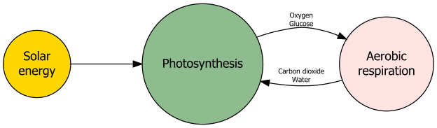
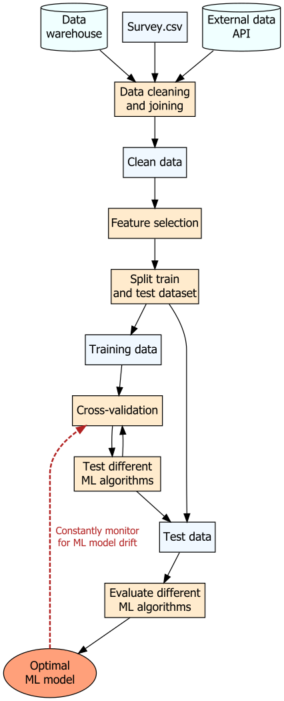
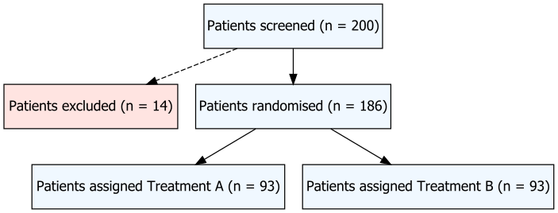
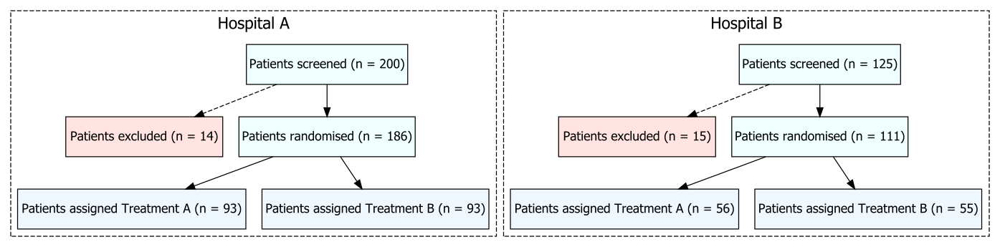
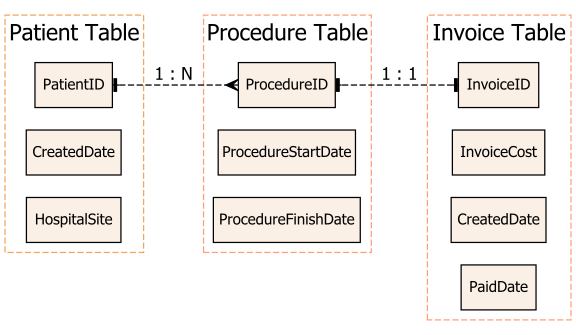

```{r, echo = TRUE, message = FALSE, warning = FALSE}  
# Load required R packages -----------------------------------------------------  
if (!require("pacman")) install.packages("pacman")
pacman::p_load(here,  
               tidyverse,
               DiagrammeR,
               DiagrammeRsvg,
               rsvg) # For exporting graphs into svgs      
```


# Introduction   

Last year, I woke up at 6 am AESD to attend the [R Toronto data workshop series](https://www.youtube.com/user/RohanPAlexander/videos) co-founded by [Rohan Alexander](https://rohanalexander.com/) and [Kelly Lyons](individual.utoronto.ca/klyons/). During a talk by Marija Pejcinovska, Marija recommended using the package `DiagrammeR` to create flow charts in reports. As someone who has to create a lot of flow charts, I thought I'd give `DiagrammeR` a try.   


# Introduction to DiagrammeR    

`DiagrammeR` depends on `igraph` and `visNetwork`, which are network/graphical visualisation packages. According to its comprehensive [package documentation](https://rich-iannone.github.io/DiagrammeR/graphviz_and_mermaid.html), `DiagrammeR` supports the expression and visualisation of a graph description language called the DOT language.  

```{r, echo = FALSE}
# Examining DiagrammeR package dependencies ------------------------------------  
packages <- installed.packages() 
packages[packages[, "Package"] == "DiagrammeR", "Imports"] 
```

As described in a great tutorial [here](https://cyberhelp.sesync.org/blog/visualization-with-diagrammeR.html), there are three different ways to create a graph:  

+ Using the functions `create_graph()` and `render_graph()` on a list of nodes and edges.  
+ Creating a valid diagram specification in DOT language and passing this to the function `grViz()`.  
+ Creating a valid diagram specification and passing this to the function `mermaid()`.  


# Using `create_graph()` to create a simple graph  

The simplest way is to create a graph is to use `create_graph()` on a list of nodes and edges dataframes. This method is very powerful for drawing simple relationships between objects with numerical vector IDs or highlighting features within complex graphical networks . The full list of node and edge attributes can be found [here](https://rich-iannone.github.io/DiagrammeR/ndfs_edfs.html).       

```{r, warning = FALSE}
#-----define graph edges and nodes-----  
# 1 == "Photosynthesis"
# 2 == "Aerobic respiration"  
# 3 == "Solar energy"  

edges <- create_edge_df(from = c(1, 2, 3), # code numerical vectors only
                        to = c(2, 1, 1),
                        label = c("Oxygen \n Glucose", "Carbon dioxide \n Water", NA),
                        color = "black") 

nodes <- create_node_df(n = 3,
                        label = c("Photosynthesis", "Aerobic \n respiration", "Solar \n energy"),
                        type = "lower",
                        style = "filled",
                        fillcolor = c("darkseagreen", "mistyrose", "gold"), 
                        fontcolor = "black",
                        shape = "circle",
                        fixedsize = T)

#-----create graph-----
my_graph <- create_graph(nodes_df = nodes, edges_df = edges)  

#-----render graph-----
# render_graph(my_graph) does not work for rendering github documents  

#-----export graph-----
export_graph(my_graph, file_name = here("figures", "dv-using_diagrammer-simple_flowchart.svg"),
             file_type = "svg")
```

```{r, echo = FALSE, fig.align = 'center', fig.show = 'hold'} 
knitr::include_graphics("../../figures/dv-using_diagrammer-simple_flowchart.svg")  
```

There are several limitations to this approach when you want to create a flow chart instead of a graph, and your flow chart contains detailed specifications.     

+ Edges must be coded as numerical vector IDs, and subsequently labelled by numerical vector ID order in nodes.  
+ There is no easy way to specify node positions (it would make more sense to have Solar energy displayed as the top node).  
+ There is no easy way to specify edge label positions.  
+ The final graph is trimmed if the node labels are too long.  


# Using `grVis()` to create a simple flow chart     

Instead, I would greatly recommend the `grVis()` approach for drawing customisable flow charts.    

```{r, warning = FALSE}
#-----create a simple flow chart using grViz-----  
my_graphviz <- grViz("digraph {
         
               graph[layout = dot, rankdir = LR]
                     
               node[shape = circle, style = filled] # set global node attributes 
                     
               a[label = 'Photosynthesis', fillcolor = 'darkseagreen']
               b[label = 'Aerobic \nrespiration', fillcolor = 'mistyrose']
               c[label = 'Solar \nenergy', fillcolor = 'gold']

               edge[color = black, fontsize = 8] # set global edge attributes  
                     
               a -> b[label = 'Oxygen \nGlucose']
               a -> b[style = 'invis']
               b -> a[label = 'Carbon dioxide \n Water']
               b -> a[style = 'invis']
               b -> a[style = 'invis']
               b -> a[style = 'invis']
               c -> a[label = '            ']
                     
               }")

# my_graphviz

#-----export graph-----
my_graphviz %>% 
  export_svg %>%
  charToRaw %>%
  rsvg_svg(here("figures", "dv-using_diagrammer-simple_flowchart_grVis.svg"))
```

```{r, echo = FALSE, fig.align = 'center', fig.show = 'hold', out.width = '60%'} 
  
```

A few tricks I used above were:  

+ To set global attributes for nodes and edges, and then override where required with local attributes.      
+ To create additional layers of invisible edges, for lengthening the arrows between specific nodes as recommended [here](https://stackoverflow.com/questions/11283701/how-to-specify-the-length-of-an-edge-in-graphviz).       
+ To create an edge label with an empty string, for lengthening a specific edge.       


# Using `grVis()` to create more complex flow charts   

You will quickly discover that `grVis` is an incredibly versatile tool.     


## Workflow structure flow chart    

In this example, I am interested in creating a flow chart of my machine learning workflow to share with another data science team (this example is heavily inspired by [an example from Michael Harper's blog](https://mikeyharper.uk/flowcharts-in-r-using-diagrammer/)).     

Note that the different types of node shapes available are listed [here](https://www.graphviz.org/doc/info/shapes.html).            
 
```{r, warning = FALSE}  
#-----create a flow chart describing my ML workflow-----  
my_ML_workflow <- grViz("digraph {
         
                  graph[layout = dot]
                     
                  node[shape = rectangle, style = filled, fillcolor = 'blanchedalmond'] 
                     
                  data_source_1[label = 'Data \n warehouse', shape = cylinder, fillcolor = 'azure']
                  data_source_2[label = 'Survey.csv', fillcolor = 'aliceblue']
                  data_source_3[label = 'External data \n API', shape = cylinder, fillcolor = 'azure']
                  
                  process_1[label = 'Data cleaning \n and joining']
                  process_2[label = 'Feature selection']
                  process_3[label = 'Split train \n and test dataset']  
                  process_4[label = 'Cross-validation']  
                  process_5[label = 'Test different \n ML algorithms']
                  process_6[label = 'Evaluate different \n ML algorithms']
                     
                  file_1[label = 'Clean data', fillcolor = 'aliceblue']
                  file_2[label = 'Training data', fillcolor = 'aliceblue']
                  file_3[label = 'Test data', fillcolor = 'aliceblue']
                     
                  product_1[label = 'Optimal \n ML model', shape = 'ellipse', fillcolor = 'lightsalmon']
                     
                  edge[color = black, fontsize = 12] # set global edge attributes
                     
                  data_source_1 -> process_1
                  data_source_2 -> process_1
                  data_source_3 -> process_1  
                     
                  process_1 -> file_1
                     
                  file_1 -> process_2
                  process_2 -> process_3
                  process_3 -> file_2
                  process_3 -> file_3
                     
                  file_2 -> process_4
                  process_4 -> process_5
                  process_5 -> process_4
                     
                  process_5 -> file_3
                  file_3 -> process_6
                  process_6 -> product_1
                     
                  product_1 -> process_4[label = '      Constantly monitor \n for ML model drift',
                                         style = 'dashed', penwidth = 2, weight = 2, 
                                         color = 'firebrick', fontcolor = 'firebrick']
                     
                  }")

# my_ML_workflow  

#-----export graph-----
my_ML_workflow %>% 
  export_svg %>%
  charToRaw %>%
  rsvg_svg(here("figures", "dv-using_diagrammer-simple_flowchart_ML_workflow.svg"))
```

```{r, echo = FALSE, fig.align = 'center', fig.show = 'hold', out.width = '30%'} 
  
```


## Clinical trial progress flow chart  

Another handy feature of `grVis()` is that values generated in R can be directly passed into flow charts.This is done by setting node labels as `@@n` within the graph and passing values to `[n]` in the footer of the plot.          

```{r, warning = FALSE}
#-----create flow chart dependent on changing parameters-----  
# store data inside a list
set.seed(111)
a <- 200
b <- sample(1:60, 1)
c <- 200 - b
d <- ceiling(c/2)
e <- c - d

flow_chart_data <- list(a, b, c, d, e)

# create grVis graph

simple_trial <- grViz("digraph {
         
                graph[layout = dot]
                     
                node[shape = rectangle, style = filled, margin = 0.2, fillcolor = 'azure']  
                     
                a[label = '@@1']
                b[label = '@@2', fillcolor = 'mistyrose']
                c[label = '@@3']
                d[label = '@@4', fillcolor = 'aliceblue']
                e[label = '@@5', fillcolor = 'aliceblue']

                edge[color = black] # set global edge attributes  
                
                a -> b[style = 'dashed']
                a -> c[weight = 2] # weighs this edge to be centrally placed 
                c -> d
                c -> e
                     
                }
                     
[1]: paste0('Patients screened (n = ', flow_chart_data[[1]], ')')
[2]: paste0('Patients excluded (n = ', flow_chart_data[[2]], ')')
[3]: paste0('Patients randomised (n = ', flow_chart_data[[3]], ')')
[4]: paste0('  Patients assigned Treatment A (n = ', flow_chart_data[[4]], ')')
[5]: paste0('  Patients assigned Treatment B (n = ', flow_chart_data[[5]], ')')

                ") 

# simple_trial  

#-----export graph-----
simple_trial %>% 
  export_svg %>%
  charToRaw %>%
  rsvg_svg(here("figures", "dv-using_diagrammer-flowchart_clinical_single.svg"))
```

```{r, echo = FALSE, fig.align = 'center', fig.show = 'hold', out.width = '60%'} 
  
```


## Multi-site clinical trial progress flow chart   

Things get better as `grVis()` also allows visualisation of subgroups within a graph.   

The process of adding subgroups involves:  

1. First defining each subcluster.     
2. Defining the nodes in each subcluster.   
3. Defining the edges as usual.    

```{r}
#-----create flow chart with subgroups that are dependent on changing parameters-----  
# store data inside a list
set.seed(111)
a <- 200
b <- sample(1:60, 1)
c <- 200 - b
d <- ceiling(c/2)
e <- c - d

set.seed(222)
f <- 125
g <- sample(1:45, 1)
h <- 125 - b
i <- ceiling(h/2)
j <- h - i

hospital_a <- list(a, b, c, d, e)
hospital_b <- list(f, g, h, i, j)

# create grVis graph  

multi_trial <- grViz("digraph {

               graph[layout = 'dot', rankdir = TB]
               
               node[shape = rectangle, style = filled, margin = 0.2, fillcolor = 'azure']
               
               subgraph cluster_a { 
               graph[rankdir = TB, label = 'Hospital A', fontsize = 18, 
                     shape = rectangle, style = dashed]

               a[label = '@@1']
               b[label = '@@2', fillcolor = 'mistyrose']
               c[label = '@@3']
               d[label = '@@4', fillcolor = 'aliceblue']
               e[label = '@@5', fillcolor = 'aliceblue']
               
               }
               
               subgraph cluster_b { 
               graph[rankdir = TB, label = 'Hospital B', fontsize = 18, 
                     shape = rectangle, style = dashed]
             
               f[label = '@@6']
               g[label = '@@7', fillcolor = 'mistyrose']
               h[label = '@@8']
               i[label = '@@9', fillcolor = 'aliceblue']
               j[label = '@@10', fillcolor = 'aliceblue']
               
               }
               
               edge[color = black]
               
               a -> b[style = 'dashed']
               a -> c[weight = 2] # weighs this edge to be centrally placed 
               c -> d
               c -> e
               f -> g[style = 'dashed']
               f -> h[weight = 2] # weighs this edge to be centrally placed 
               h -> i
               h -> j
               
               }
      
[1]: paste0('Patients screened (n = ', hospital_a[[1]], ')')
[2]: paste0('Patients excluded (n = ', hospital_a[[2]], ')')
[3]: paste0('Patients randomised (n = ', hospital_a[[3]], ')')
[4]: paste0('  Patients assigned Treatment A (n = ', hospital_a[[4]], ')')
[5]: paste0('  Patients assigned Treatment B (n = ', hospital_a[[5]], ')')
[6]: paste0('Patients screened (n = ', hospital_b[[1]], ')')
[7]: paste0('Patients excluded (n = ', hospital_b[[2]], ')')
[8]: paste0('Patients randomised (n = ', hospital_b[[3]], ')')
[9]: paste0('  Patients assigned Treatment A (n = ', hospital_b[[4]], ')')
[10]: paste0('  Patients assigned Treatment B (n = ', hospital_b[[5]], ')')

               ")  

# multi_trial

#-----export graph-----
multi_trial %>% 
  export_svg %>%
  charToRaw %>%
  rsvg_svg(here("figures", "dv-using_diagrammer-flowchart_clinical_multiple.svg"))
```

```{r, echo = FALSE, results = 'markup', fig.align = 'center', fig.show = 'hold', out.width = '90%'} 
  
```


## Entity relationship diagrams    

[Entity relationship diagrams](https://en.wikipedia.org/wiki/Entity–relationship_model) (ERDs) are useful for visualising data warehouse data joins. In particular, the crow's foot notation is useful for tracking table joins, especially if one-to-many or many-to-many table relationships exist.     

```{r, echo = FALSE, results = 'markup', fig.align = 'center', fig.show = 'hold', out.width = '50%', fig.cap = 'Image sourced from https://dev.to/helenanders26/entity-relationship-diagrams-explained-by-sonic-the-hedgehog-1m68'} 
knitr::include_graphics("../../figures/dv-using_diagrammer-crows_foot_notation.jpg")  
```

A tip for creating ERDs using `DiagrammeR` is to set the edge direction to both `(dir = 'both')` combined with `arrowhead` and `arrowtail` arguments. This allows you to specify [different symbols](https://rich-iannone.github.io/DiagrammeR/graphviz_and_mermaid.html#arrow-shapes) for each side of an edge.  

**Note:** Crow's foot notation is currently not fully supported as arrow shape options in `DiagrammeR`, but setting the arrow shape to `tee` or `crow` overlaid with [Chen's notation](https://stackoverflow.com/questions/44745480/chen-notation-whats-the-different-between-n-and-m-when-marking-a-relations) as edge labels can still help convey whether data joins are one-to-one or one-to-many.    

```{r}
#-----create an ERD via an grViz object-----  
my_ERD <- grViz("digraph {

          graph[layout = dot, rankdir = 'LR'] 
          
          node[shape = rectangle, style = filled, fillcolor = 'linen', fontsize = 12]
          
          subgraph cluster_patient { 
             graph[rankdir = TB, label = 'Patient Table', fontsize = 18, 
                   shape = rectangle, color = 'sandybrown', style = dashed]

             a[label = 'PatientID']
             b[label = 'CreatedDate']
             c[label = 'HospitalSite']
             
          }
             
          subgraph cluster_procedure { 
             graph[rankdir = TB, label = 'Procedure Table', fontsize = 18, 
                   shape = rectangle, color = 'lightsalmon', style = dashed]

             d[label = 'ProcedureID']
             e[label = 'ProcedureStartDate']
             f[label = 'ProcedureFinishDate'] 
             
          }
          
          subgraph cluster_invoice { 
             graph[rankdir = TB, label = 'Invoice Table', fontsize = 18, 
                   shape = rectangle, color = 'lightsalmon', style = dashed]

             g[label = 'InvoiceID']
             h[label = 'InvoiceCost']
             i[label = 'CreatedDate']
             j[label = 'PaidDate']
             
          } 
          
          edge[color = black, dir = 'both', style = 'dashed']
               
              a -> d[arrowhead = 'crow', arrowtail = 'tee', label = '1 : N']
              d -> g[arrowhead = 'tee', arrowtail = 'tee', label = '1 : 1'] 
          
          }")

# my_ERD

#-----export graph----- 
my_ERD %>% 
  export_svg %>%
  charToRaw %>%
  rsvg_svg(here("figures", "dv-using_diagrammer-erd.svg"))
```

```{r, echo = FALSE, results = 'markup', fig.align = 'center', fig.show = 'hold', out.width = '60%'} 
   
```

# Other resources   

+ DiagrammeR package and [package documentation](https://rich-iannone.github.io/DiagrammeR/graphviz_and_mermaid.html) by Richard Iannone.       
+ DiagrammeR [vignette](https://cran.r-project.org/web/packages/DiagrammeR/vignettes/node-edge-data-frames.html) for creating node and edge data frames.    
+ A great [blog post](https://cyberhelp.sesync.org/blog/visualization-with-diagrammeR.html) by Rachael Blake comparing the `create_graph()` and `grVis()` approach.    
+ A great [blog post](https://mikeyharper.uk/flowcharts-in-r-using-diagrammer/) by Michael Harper on using `grVis()` to draw flow charts.       