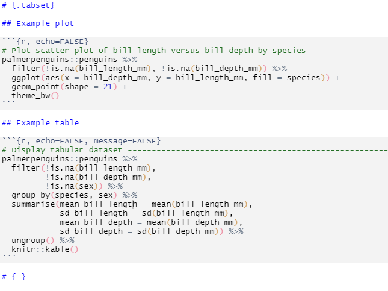
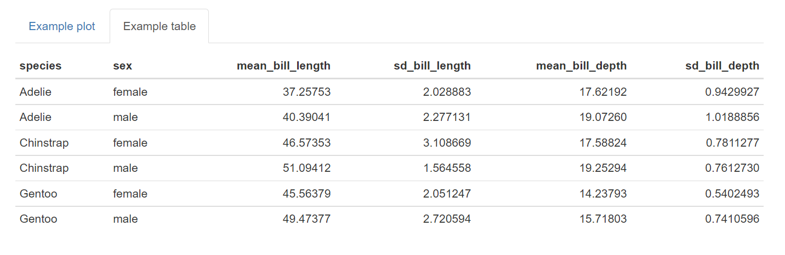
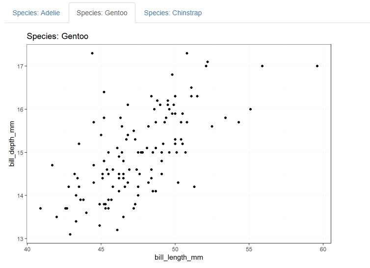

```{r setup, include=FALSE}
# Set up global environment ----------------------------------------------------
knitr::opts_chunk$set(echo=TRUE, results='hide', fig.show='hold', fig.align='center')  
```

```{r, echo=TRUE, message=FALSE, warning=FALSE}
# Load required packages -------------------------------------------------------  
if (!require("pacman")) install.packages("pacman")
pacman::p_load(here,
               janitor,
               rsdmx,
               clock,
               tidyverse,
               palmerpenguins)  
```


# Introduction

Data analysts can find themselves stuck in a cycle of ad hoc analytical requests, which prevents them from developing productionisation skills. Productionisation can be thought of as the creation of automatable data analysis workflows, which output data products to business users.

An automated workflow enables code sustainability and frees your time from performing repetitive manual processes. It is particularly useful when business areas require analyses on defined data sources.  

In this example, I will be using the monthly labour force data segregated by measure (employment status) and region from the Australian Bureau of Statistics (ABS) to explore R report productionisation tips.  


# Using a public dataset

I am using the publicly available [ABS Labour Force dataset](https://www.abs.gov.au/statistics/labour/employment-and-unemployment/labour-force-australia/latest-release) and consuming data through the [ABS Data Explorer API](https://www.abs.gov.au/about/data-services/application-programming-interfaces-apis/data-api-user-guide).    

Datasets from the ABS Data Explorer API can be read as a [SDMX format](https://www.statsilk.com/sdmx/sdmx-introduction-simple-sdmx-ml-example-and-tutorial), which seems to store data and metadata in a heavily nested XML or JSON format. The ABS currently provides one URL for the dataset itself and one for the metadata.    

```{r, message=FALSE, warning=FALSE, results='hold'}
# Connect to Labour Force API --------------------------------------------------
# Apply all filters and then select the developer API tab for the data query url
data_url <- "https://api.data.abs.gov.au/data/ABS,LF,1.0.0/M2+M1.2+1+3.1599.20+30.AUS.M?startPeriod=2019-01&dimensionAtObservation=AllDimensions"

# Obtain data as tibble data frame
labour_force <- readSDMX(data_url) %>%
  as_tibble() %>%
  clean_names()

# Preview labour force dataset 
labour_force %>%
  head(3) %>%
  knitr::kable()
```

```{r}
# Obtain metadata as tibble data frame -----------------------------------------
# The metadata URL can be found via the developer API tab under structure query
schema_url <- "https://api.data.abs.gov.au/dataflow/ABS/LF/1.0.0?references=all"
schema_labour_force <- readSDMX(schema_url)

# List metadata S4 object attributes
slotNames(schema_labour_force)
#> [1] "organisationSchemes"  "concepts"  "codelists"  "datastructures"  "xmlObj"  "schema"         
#> [7] "header"  "footer"

# Obtain list of column names from the codelist attribute   
codelists_labour_force <- slot(schema_labour_force, "codelists")

map_chr(slot(codelists_labour_force, "codelists"), ~slot(.x, "id"))
#> [1] "CL_DECIMALS"  "CL_FREQ"  "CL_LF_AGE"  "CL_LF_MEASURE"  "CL_OBS_STATUS"  "CL_SEX"  "CL_STATE"  "CL_TSEST"       
#> [9] "CL_UNIT_MEASURE"  "CL_UNIT_MULT" 
```

```{r, message=FALSE, warning=FALSE, results='hold'}
# Print metadata as tibble data frame -----------------------------------------
# Obtain a data dictionary from the concepts attribute
slot(schema_labour_force, "concepts") %>%
  as_tibble() %>%
  unite("Name", Name.en, en, na.rm = TRUE) %>%
  knitr::kable()
```

**Note:** Some metadata for the labour force dataset seems to be missing from `concepts`, i.e. M1 for employed full-time and M2 for employed part-time under Measure, and 1 for males, 2 for females and 3 for persons under Sex (nothing that a non-binary gender variable may be more relevant here).            


# Knitting reports with parameters     

We first need to identify the event that we are interested in reporting. For example, the labour force dataset contains information on the number of full-time versus part-time individuals, which can be further subdivided by sex.   

Imagine that we are interested in visualising the monthly change in the number of part-time females in the labour force since January 2019. The standard way of doing this analysis is to hard code our variables of interest.  

```{r, fig.show='hide'}
# Filter dataset by part-time females ------------------------------------------
females_part_time <- labour_force %>% 
  filter(sex == 2, # 2 represents females
         measure == "M2", # M2 represents part-time employed 
         tsest == 20) %>% # 20 represents seasonally adjusted  
  mutate(time_period = as.Date(paste0(time_period, "-01"), format = "%Y-%m-%d"),
         last_obs_value = lag(obs_value),
         change_obs_value = case_when(
           is.na(last_obs_value) ~ 0,
           TRUE ~ obs_value - last_obs_value)) %>%
  select(time_period,
         obs_value,
         change_obs_value)

# Plot time series -------------------------------------------------------------
females_part_time %>%
  ggplot(aes(x = time_period, 
             y = change_obs_value)) +
  geom_line() + 
  geom_vline(xintercept = as.Date("2020-02-01"),
             colour = "firebrick",
             linetype = "dashed") +
  annotate("label", x = as.Date("2020-02-01"), y = 150,
           label = "COVID-19", color = "firebrick") +
  labs(title = "Change in female part-time labour force participation",
       x = NULL,
       y = "Individuals (1000s)") + 
  theme_bw() +
  theme(panel.grid.major.x = element_blank(),
        panel.grid.minor.x = element_blank(),
        panel.grid.major.y = element_line(linetype = "dotted"),
        panel.grid.minor.y = element_line(linetype = "dotted"),
        plot.title = element_text(hjust = 0.5))
```

To use parameters instead of hard coded variables, we first list our parameters of interest in the YAML header of our R Markdown report.  

```{r, echo=FALSE, results='hold', out.width="55%"}
knitr::include_graphics("../../figures/p-automating_rmd_reports-yaml_params.png")
```

We can then reference the parameter keys directly in our R code. I recommend choosing short but descriptive strings as parameter values, as these can also be printed in the plot title (unlike the example below).       

```{r, results='hold', fig.width=5, fig.height=4, out.width='50%'}
# Replace code with parameter keys ---------------------------------------------
females_part_time <- labour_force %>% 
  filter(sex == params$sex, # 2 represents females
         measure == params$measure, # M2 represents part-time employed 
         tsest == params$tsest) %>% # 20 represents seasonally adjusted  
  mutate(time_period = as.Date(paste0(time_period, "-01"), format = "%Y-%m-%d"),
         last_obs_value = lag(obs_value),
         change_obs_value = case_when(
           is.na(last_obs_value) ~ 0,
           TRUE ~ obs_value - last_obs_value)) %>%
  select(time_period,
         obs_value,
         change_obs_value)

# Plot time series -------------------------------------------------------------
females_part_time %>%
  ggplot(aes(x = time_period, 
             y = change_obs_value)) +
  geom_line() + 
  geom_vline(xintercept = as.Date("2020-02-01"),
             colour = "firebrick",
             linetype = "dashed") +
  annotate("label", x = as.Date("2020-02-01"), y = 150,
           label = "COVID-19", color = "firebrick") +
  labs(title = paste0("Labour force changes for measure ",
                      params$measure,
                      " and sex ",
                      params$sex),
       x = NULL,
       y = "Individuals (1000s)") + 
  theme_bw() +
  theme(panel.grid.major.x = element_blank(),
        panel.grid.minor.x = element_blank(),
        panel.grid.major.y = element_line(linetype = "dotted"),
        panel.grid.minor.y = element_line(linetype = "dotted"),
        plot.title = element_text(hjust = 0.5))
```


# Creating html tabs in R Markdown reports  

Creating [html tabs](https://bookdown.org/yihui/rmarkdown-cookbook/html-tabs.html) is a handy way to organise parallel sections of information i.e. displaying multiple plots from the same dataset. We can use the dataset from the `palmerpenguin` R package to explore this.    

```{r, results='hold'}
# Preview palmerpenguin dataset ------------------------------------------------
palmerpenguins::penguins %>%
  head(3) %>%
  knitr::kable()
```


## Creating tabs manually  

Tabs can be created manually by adding the code `{.tabset}` next to an empty header one level higher than the header level that you want to display as a tab. Make sure you add the code `{-}` next to a second higher level header to signal where tab creation ends.  

```{r, echo=FALSE, results='hold', out.width="70%"}

```

The html output consists of interactive headers with titles corresponding to individual header names. 

```{r, echo=FALSE, results='hold', out.width="100%"}

```


## Creating tabs dynamically    

There will be circumstances where you do not want to or cannot manually specify the number of tabs required. In these circumstances, dynamic tabs can be created through the following steps:    

1. Create individual plots (using a function) and store them inside a list.   
2. Create a chunk of code in between a higher level header labelled `{.tabset}` and another one labelled `{-}`.   
3. Set this chunk of code with `echo=FALSE` and `results='asis'`.     

```{r, echo=TRUE, results='hide'}
# Create a list of plots -------------------------------------------------------
plot_bill_length_vs_depth <- function(penguin_species) {
  palmerpenguins::penguins %>%
    filter(species == penguin_species) %>%
    ggplot(aes(x = bill_length_mm,
               y = bill_depth_mm)) +
    geom_point() + 
    labs(title = paste0("Species: ", penguin_species)) +  
    theme_bw() +
    theme(panel.grid = element_line(linetype = "dotted"))
}

# Extract distinct species names and create a plot per species  
plots <- palmerpenguins::penguins %>%
  distinct(species) %>%
  pull(species) %>%
  map(~ plot_bill_length_vs_depth(.x)) 

# Set plot names  
species_names <- palmerpenguins::penguins %>%
  distinct(species) %>%
  pull(species) 

plots <- set_names(plots, species_names)
```

```{r, echo=TRUE, message=FALSE, warning=FALSE, fig.show='hide', results='hide'}
# Use a for loop to print code for tab creation via R Markdown -----------------  
# Set echo=FALSE and results='asis' in the code chunk   
# Insert chunk between a header labelled `{.tabset}` and a header labelled `{-}`  
# Store each plot as temp object and then print each temp object and two new lines  
for (i in seq_along(plots)) {
  temp <- plots[[i]]
  cat("##", "Species: ", names(plots[i]), "\n") # Create tabs from plot names
  print(temp) 
  cat("\n\n")
}
```

This will generate dynamically sized tabs as shown below.   

```{r, echo=FALSE, results='hold', out.width='80%'}     
    
```

**Note:** The option `results='asis'` allows R code to be printed as a raw output (i.e. code is not printed inside fenced code blocks). This is handy for writing for loops to automate aspects of R Markdown report generation.       


# Resources  

-   A great [presentation](https://docs.google.com/presentation/d/e/2PACX-1vRo1eXJtiwo6aTA8KZ2E-bUbv2GOonC2RIVk_5eWQ5y-ADXbRamBhHaa3w1vMW6BkEPOMJ13ZahSo8Q/embed?start=false&loop=true&delayms=30000&slide=id.p) by Thomas Mock on advanced R Markdown features.   
-   A great [blog post](https://emilyriederer.netlify.app/post/rmddd-tech-appendix/) by Emily Riederer on data analysis productionisation in R.  
-   A great [blog post](https://towardsdatascience.com/what-does-it-mean-to-productionize-data-science-82e2e78f044c) by Schaun Wheeler on the importance of data science productionisation.  
-   The definitive R Markdown [resource guide](https://bookdown.org/yihui/rmarkdown-cookbook/html-tabs.html) by Yihui Xie.  
-   A [guide](https://rstudio-pubs-static.s3.amazonaws.com/413203_eed4bd7e1eae47dcbce07096a887ed72.html) on using the `rsdmx` package to consume SDMX formatted datasets via an API call.  