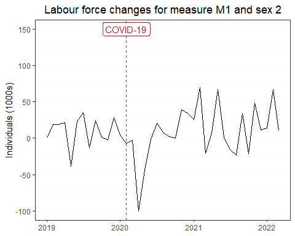

Automate R Markdown report generation - Part 1
================
Erika Duan
2022-05-22

-   [Introduction](#introduction)
-   [Using a public dataset](#using-a-public-dataset)
-   [Knitting reports with
    parameters](#knitting-reports-with-parameters)
-   [Resources](#resources)

``` r
# Load required packages -------------------------------------------------------  
if (!require("pacman")) install.packages("pacman")
pacman::p_load(here,
               janitor,
               rsdmx,
               clock,
               tidyverse,
               palmerpenguins)  
```

# Introduction

Data analysts can find themselves stuck in a cycle of ad hoc analytical
requests, which prevents them from developing productionisation skills.
Productionisation can be thought of as the creation of automatable data
analysis workflows, which output data products to business users.

An automated workflow enables code sustainability and frees your time
from performing repetitive manual processes. It is particularly useful
when business areas require analyses on defined data sources.

In this example, I will be using the monthly labour force data
segregated by measure (employment status) and region from the Australian
Bureau of Statistics (ABS) to explore R report productionisation tips.

# Using a public dataset

I am using the publicly available [ABS Labour Force
dataset](https://www.abs.gov.au/statistics/labour/employment-and-unemployment/labour-force-australia/latest-release)
and consuming data through the [ABS Data Explorer
API](https://www.abs.gov.au/about/data-services/application-programming-interfaces-apis/data-api-user-guide).

Datasets from the ABS Data Explorer API can be read as a [SDMX
format](https://www.statsilk.com/sdmx/sdmx-introduction-simple-sdmx-ml-example-and-tutorial),
which seems to store data and metadata in a heavily nested XML or JSON
format. The ABS currently provides one URL for the dataset itself and
one for the metadata.

``` r
# Connect to Labour Force API --------------------------------------------------
# Apply all filters and then select the developer API tab for the data query url
data_url <- "https://api.data.abs.gov.au/data/ABS,LF,1.0.0/M2+M1.2+1+3.1599.20+30.AUS.M?startPeriod=2019-01&dimensionAtObservation=AllDimensions"

# Obtain data as tibble data frame
labour_force <- readSDMX(data_url) %>%
  as_tibble() %>%
  clean_names()

# Preview labour force dataset 
labour_force %>%
  head(3) %>%
  knitr::kable()
```

| time_period | measure | sex | age  | tsest | region | freq | obs_value | unit_measure | unit_mult | obs_status | decimals |
|:------------|:--------|:----|:-----|:------|:-------|:-----|----------:|:-------------|:----------|:-----------|:---------|
| 2019-01     | M1      | 3   | 1599 | 30    | AUS    | M    |        NA | NUM          | 3         | s          | 1        |
| 2019-02     | M1      | 3   | 1599 | 30    | AUS    | M    |        NA | NUM          | 3         | s          | 1        |
| 2019-03     | M1      | 3   | 1599 | 30    | AUS    | M    |        NA | NUM          | 3         | s          | 1        |

``` r
# Obtain metadata as tibble data frame -----------------------------------------
# The metadata URL can be found via the developer API tab under structure query
schema_url <- "https://api.data.abs.gov.au/dataflow/ABS/LF/1.0.0?references=all"
schema_labour_force <- readSDMX(schema_url)

# List metadata S4 object attributes
slotNames(schema_labour_force)
#> [1] "organisationSchemes"  "concepts"  "codelists"  "datastructures"  "xmlObj"  "schema"         
#> [7] "header"  "footer"

# Obtain list of column names from the codelist attribute   
codelists_labour_force <- slot(schema_labour_force, "codelists")

map_chr(slot(codelists_labour_force, "codelists"), ~slot(.x, "id"))
#> [1] "CL_DECIMALS"  "CL_FREQ"  "CL_LF_AGE"  "CL_LF_MEASURE"  "CL_OBS_STATUS"  "CL_SEX"  "CL_STATE"  "CL_TSEST"       
#> [9] "CL_UNIT_MEASURE"  "CL_UNIT_MULT" 
```

``` r
# Print metadata as tibble data frame -----------------------------------------
# Obtain a data dictionary from the concepts attribute
slot(schema_labour_force, "concepts") %>%
  as_tibble() %>%
  unite("Name", Name.en, en, na.rm = TRUE) %>%
  knitr::kable()
```

| id           | Name                   | Description.en                                                                                             |
|:-------------|:-----------------------|:-----------------------------------------------------------------------------------------------------------|
| UNIT_MEASURE | Unit of Measure        | Base unit in which the observation value is expressed.                                                     |
| UNIT_MULT    | Unit of Multiplier     | The multiple of the unit of measure for which the data is expressed.                                       |
| OBS_STATUS   | Observation Status     | NA                                                                                                         |
| OBS_COMMENT  | Observation Comment    | NA                                                                                                         |
| REPYEAREND   | Reporting Year End Day | A month day that specifies the ending day of the reporting periods (e.g. YYYY-A1) within the datastucture. |
| BASE_PERIOD  | Reference Base Period  | Reference Period that the value has been based against.                                                    |

**Note:** Some metadata for the labour force dataset seems to be missing
from `concepts`, i.e. M1 for employed full-time and M2 for employed
part-time under Measure, and 1 for males, 2 for females and 3 for
persons under Sex (nothing that a non-binary gender variable may be more
relevant here).

# Knitting reports with parameters

We first need to identify the event that we are interested in reporting.
For example, the labour force dataset contains information on the number
of full-time versus part-time individuals, which can be further
subdivided by sex.

Imagine that we are interested in visualising the monthly change in the
number of part-time females in the labour force since January 2019. The
standard way of doing this analysis is to hard code our variables of
interest.

``` r
# Filter dataset by part-time females ------------------------------------------
females_part_time <- labour_force %>% 
  filter(sex == 2, # 2 represents females
         measure == "M2", # M2 represents part-time employed 
         tsest == 20) %>% # 20 represents seasonally adjusted  
  mutate(time_period = as.Date(paste0(time_period, "-01"), format = "%Y-%m-%d"),
         last_obs_value = lag(obs_value),
         change_obs_value = case_when(
           is.na(last_obs_value) ~ 0,
           TRUE ~ obs_value - last_obs_value)) %>%
  select(time_period,
         obs_value,
         change_obs_value)

# Plot time series -------------------------------------------------------------
females_part_time %>%
  ggplot(aes(x = time_period, 
             y = change_obs_value)) +
  geom_line() + 
  geom_vline(xintercept = as.Date("2020-02-01"),
             colour = "firebrick",
             linetype = "dashed") +
  annotate("label", x = as.Date("2020-02-01"), y = 150,
           label = "COVID-19", color = "firebrick") +
  labs(title = "Change in female part-time labour force participation",
       x = NULL,
       y = "Individuals (1000s)") + 
  theme_bw() +
  theme(panel.grid.major.x = element_blank(),
        panel.grid.minor.x = element_blank(),
        panel.grid.major.y = element_line(linetype = "dotted"),
        panel.grid.minor.y = element_line(linetype = "dotted"),
        plot.title = element_text(hjust = 0.5))
```

To use parameters instead of hard coded variables, we first list our
parameters of interest in the YAML header of our R Markdown report.


We can then reference the parameter keys directly in our R code. I
recommend choosing short but descriptive strings as parameter values, as
these can also be printed in the plot title (unlike the example below).

``` r
# Replace code with parameter keys ---------------------------------------------
females_part_time <- labour_force %>% 
  filter(sex == params$sex, # 2 represents females
         measure == params$measure, # M2 represents part-time employed 
         tsest == params$tsest) %>% # 20 represents seasonally adjusted  
  mutate(time_period = as.Date(paste0(time_period, "-01"), format = "%Y-%m-%d"),
         last_obs_value = lag(obs_value),
         change_obs_value = case_when(
           is.na(last_obs_value) ~ 0,
           TRUE ~ obs_value - last_obs_value)) %>%
  select(time_period,
         obs_value,
         change_obs_value)

# Plot time series -------------------------------------------------------------
females_part_time %>%
  ggplot(aes(x = time_period, 
             y = change_obs_value)) +
  geom_line() + 
  geom_vline(xintercept = as.Date("2020-02-01"),
             colour = "firebrick",
             linetype = "dashed") +
  annotate("label", x = as.Date("2020-02-01"), y = 150,
           label = "COVID-19", color = "firebrick") +
  labs(title = paste0("Labour force changes for measure ",
                      params$measure,
                      " and sex ",
                      params$sex),
       x = NULL,
       y = "Individuals (1000s)") + 
  theme_bw() +
  theme(panel.grid.major.x = element_blank(),
        panel.grid.minor.x = element_blank(),
        panel.grid.major.y = element_line(linetype = "dotted"),
        panel.grid.minor.y = element_line(linetype = "dotted"),
        plot.title = element_text(hjust = 0.5))
```



# Resources

-   A great
    [presentation](https://docs.google.com/presentation/d/e/2PACX-1vRo1eXJtiwo6aTA8KZ2E-bUbv2GOonC2RIVk_5eWQ5y-ADXbRamBhHaa3w1vMW6BkEPOMJ13ZahSo8Q/embed?start=false&loop=true&delayms=30000&slide=id.p)
    by Thomas Mock on advanced R Markdown features.  
-   A great [blog
    post](https://emilyriederer.netlify.app/post/rmddd-tech-appendix/)
    by Emily Riederer on data analysis productionisation in R.  
-   A great [blog
    post](https://towardsdatascience.com/what-does-it-mean-to-productionize-data-science-82e2e78f044c)
    by Schaun Wheeler on the importance of data science
    productionisation.  
-   A
    [guide](https://rstudio-pubs-static.s3.amazonaws.com/413203_eed4bd7e1eae47dcbce07096a887ed72.html)
    on using the `rsdmx` package to consume SDMX formatted datasets via
    an API call.
