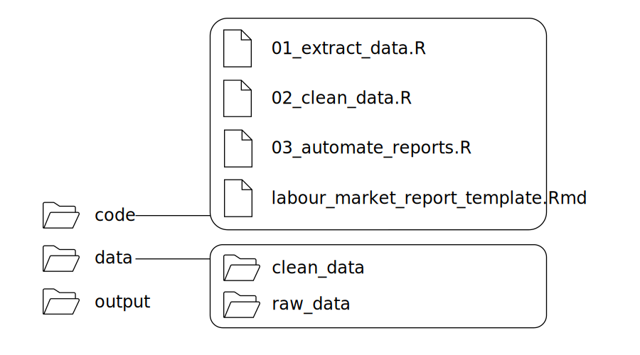
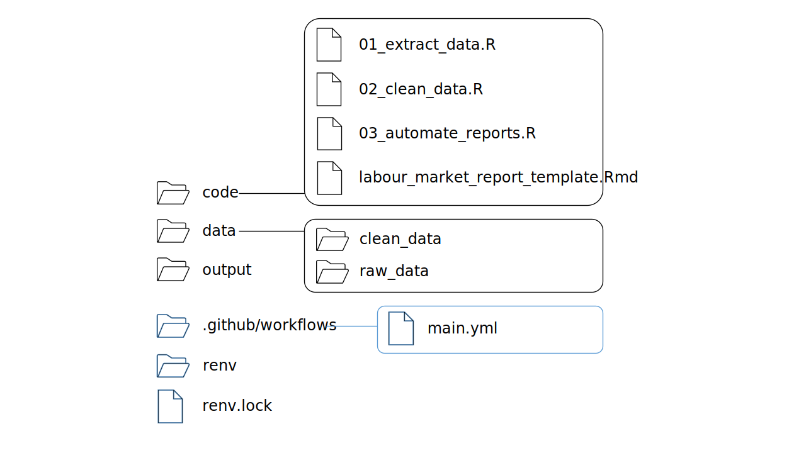

---
title: "Automate R Markdown report generation - Part 2"  
author: "Erika Duan"
date: "`r Sys.Date()`"
output:
  github_document:  
    toc: true
--- 

```{r setup, include=FALSE}
# Set up global environment ----------------------------------------------------
knitr::opts_chunk$set(echo=TRUE, results='hide', fig.show='hold', fig.align='center')  
```

```{r, echo=TRUE, message=FALSE, warning=FALSE}
# Load required packages -------------------------------------------------------  
if (!require("pacman")) install.packages("pacman")
pacman::p_load(here,
               janitor,
               rsdmx,
               clock,
               tidyverse,
               renv)  
```


# Introduction  

This tutorial follows from [part 1](https://github.com/erikaduan/r_tips/blob/master/tutorials/p-automating_rmd_reports/p-automating_rmd_reports_part_1.md), which shows how to use parameter key-value pairs for automated reporting in R.    

Creating an automated reporting workflow requires the following setup:    

1. A place to store the code, data inputs and analytical outputs, as well as information about the virtual environment and R packages used.  
2. A data ingestion script. Data version control can also be integrated immediately following this step.  
3. A data cleaning script.    
4. An R Markdown report template containing YAML parameter key-value pairs.         
5. A report automation script which iterates across all analytical parameters of interest.  
6. A YAML pipeline using GitHub Actions.     

For this tutorial, I have created a separate GitHub repository named [`abs_labour_force_report`](https://github.com/erikaduan/abs_labour_force_report) to host an automated R reporting workflow using open ABS labour force data. The rest of this tutorial will reference this GitHub repository.     


# Step 1: Establish a project workflow  

## Use consistent names    

There is no universally best way to organise your project structure. I recommend starting with a simple naming structure that everyone easily understands. My  [`abs_labour_force_report`](https://github.com/erikaduan/abs_labour_force_report) repository contains the folders `./code` to store my R scripts and Rmd documents, `./data` to store my data, and `./output` to store my analytical outputs.  

```{r, echo=FALSE, results='hold', out.width="60%"}

```

**Note:** The `./data` folder contains subfolders `./data/raw_data` and `./data/clean_data` to maintain separation between the raw (read only) and clean dataset used for further analysis.  

## Environment reproducibility  

Besides the `code`, `data` and `output` directories, a reproducible virtual environment also needs to be created to host the entire workflow. In this tutorial, I have chosen to host my [`abs_labour_force_report`](https://github.com/erikaduan/abs_labour_force_report) workflow using `GitHub Actions`, where code is triggered by a YAML pipeline stored in `./.github/workflows/main.yml`.  

To execute my R code, I need to create a virtual environment which loads my project R package dependencies and R scripts in order. R package dependencies can be managed by the [`renv`](https://rstudio.github.io/renv/articles/renv.html) package.   

To do this, the following steps need to be implemented **after** you have written all your R scripts:    

1. Install `renv` with `install.packages('renv')`.  
2. Run `renv::init()` directly in the R console to create a new project-local environment with a private R library. This only needs to be done once per project as `renv::init()` amends the project-local `.Rprofile` with new code to load the private R library when an R session is started.    
3. Use `install.packages("package")` and `remove.packages("package")` to keep installing or removing packages as required.  
4. Run `renv::snapshot()` directly in the R console. This saves the state of your project R package dependencies to a `renv.lock` lockfile.  
5. Each time your workflow is rerun inside a new virtual environment, the shell command `R -e 'renv::restore()'` needs to run in your YAML pipeline to restore your project R package dependencies from your `renv.lock` file.  

```{r, echo=FALSE, results='hold', out.width="90%"}

```

**Note:** An additional `.gitignore` file is automatically generated inside `~/renv` to prevent project R packages and related `renv` files from being committed into your remote project repository.  


# Step 2: Create data ingestion R script   

When we are downloading new data extracts, we need to create a single R script that:  

1. Downloads the first extract and saves this as the entire dataset.  
2. Downloads subsequent data extracts and only saves the new or modified data records to the original dataset.  

This task requires an if-else statement based on whether the file `labour_force_raw.csv` already exists in `./data/raw_data`. If not, the entire data extract is cleaned, a data ingestion date stamp stored in a new column and the raw datasheet saved as `./data/raw_data/labour_force_raw.csv`.   

If `data/raw_data/labour_force_raw.csv` already exists, a temporary primary key is additionally created for the new and original data extracts and records only present in the new dataset (i.e. records with a new temporary primary key) are appended to the original dataset. The temporary primary key is then removed and the appended raw datasheet is saved as `./data/raw_data/labour_force_raw.csv`.     

```{r, eval=FALSE}
# Connect to Labour Force API --------------------------------------------------
# Only extract adjusted time series (TSEST == 20)
data_url <- "https://api.data.abs.gov.au/data/ABS,LF,1.0.0/M2+M1.2+1+3.1599.20.AUS.M?startPeriod=2019-01&dimensionAtObservation=AllDimensions"  

# Obtain data as R data frame --------------------------------------------------
if (!file.exists("data/raw_data/labour_force_raw.csv")) {
  # If labour_force_raw.csv does not exist, proceed with the first raw data load 
  raw_data <- rsdmx::readSDMX(data_url) |> 
    as.data.frame() 
  
  # Remove redundant columns 
  col_unique_values <- purrr::map_dbl(raw_data, ~length(unique(.x)))
  raw_data <- raw_data[col_unique_values != 1]
  
  # Add updated_on column as a data ingestion time stamp
  # Convert SEX into integer type or readr::write_csv() will coerce into double type  
  raw_data <- raw_data %>%
    dplyr::mutate(INGESTED_ON = Sys.Date(),
                  SEX = as.integer(SEX))
} else {
  # If labour_force_raw.csv exists, return data API output as a new extract
  new_extract <- rsdmx::readSDMX(data_url) |> 
    as.data.frame() 
  
  col_unique_values <- purrr::map_dbl(new_extract, ~length(unique(.x)))
  new_extract <- new_extract[col_unique_values != 1]
  
  # Add JOIN_ID to enable anti-joins against previous time series values 
  new_extract <- new_extract |> 
    dplyr::mutate(INGESTED_ON = Sys.Date(),
                  SEX = as.integer(SEX),
                  JOIN_ID = paste(TIME_PERIOD,
                                  MEASURE,
                                  SEX,
                                  round(obsValue*1000),
                                  sep = "-"))
  
  # Load previous data and add JOIN_ID
  previous_data <- readr::read_csv("data/raw_data/labour_force_raw.csv")
  previous_data <- dplyr::mutate(previous_data, 
                                 JOIN_ID = paste(TIME_PERIOD,
                                                 MEASURE,
                                                 SEX,
                                                 round(obsValue*1000),
                                                 sep = "-"))
  
  # Extract records present in new_extract but not previous_data
  new_records <- dplyr::anti_join(new_extract, previous_data, by = "JOIN_ID")
  new_records$JOIN_ID <- NULL
  previous_data$JOIN_ID <- NULL
  
  # Merge as raw data and save in data/raw_data as labour_force_raw.csv
  # This dataset will contain multiple values for an observation if a value has 
  # been retrospectively modified for a specific date.  
  raw_data <- dplyr::bind_rows(new_records, previous_data) 
}

# Save in data/raw_data as labour_force_raw.csv --------------------------------
readr::write_csv(raw_data, "data/raw_data/labour_force_raw.csv")
```

**Note:** Data version control can also be implemented following this step in the project workflow, to track the version of the dataset being used. A popular way to do this is by creating and committing data version pointers using the open-source software [`dvc`](https://dvc.org/blog/r-code-and-reproducible-model-development-with-dvc). Integrating `dvc` is currently beyond the scope of this tutorial.    


# Step 3: Create data cleaning R script  

Storing the data ingestion and data cleaning processes in separate scripts improves code readability and helps to separate data wrangling tasks into those required to ingest a traceable raw dataset versus those required to prepare the dataset for analysis and reporting.   

Common data cleaning steps include tidying column names, converting character type column values into human-readable strings and creating new analytical variables. In the code below, I used `dplyr::lag()` to calculate the difference between current and previous labour force numbers per combination of `measure` and `sex`, and then stored this in a new column named `change_obs_value`.    

```{r, eval=FALSE}
# Load data/raw_data/labour_force_raw.csv --------------------------------------
# This dataset will contain multiple values for an observation if a value has 
# been retrospectively modified for a specific date.
raw_data <- readr::read_csv("data/raw_data/labour_force_raw.csv")

# Convert column names into snake case -----------------------------------------
clean_data <- janitor::clean_names(raw_data)

# Extract one observation per time period, measure and sex --------------------- 
clean_data <- clean_data |> 
  dplyr::arrange(desc(time_period),
                 desc(ingested_on)) |>  
  dplyr::group_by(time_period, measure, sex) |> 
  dplyr::filter(dplyr::row_number() == 1)

# Clean measure and sex values to output report ready dataset ------------------  
clean_data <- clean_data |> 
  dplyr::mutate(measure = dplyr::case_when(measure == "M1" ~ "full-time",
                                           measure == "M2" ~ "part-time"),
                sex = dplyr::case_when(sex == "1" ~ "male",
                                       sex == "2" ~ "female",
                                       sex == "3" ~ "all"))

# Convert time_period into Date type and create a value change variable --------
clean_data <- clean_data |>   
  dplyr::group_by(measure, sex) |>    
  dplyr::mutate(time_period = as.Date(paste0(time_period, "-01"), format = "%Y-%m-%d"),
                last_obs_value = dplyr::lag(obs_value),
                change_obs_value = dplyr::case_when(
                  is.na(last_obs_value) ~ 0,
                  TRUE ~ obs_value - last_obs_value)) |> 
  dplyr::ungroup()

# Save in data/clean_data as labour_force_clean.csv ----------------------------
readr::write_csv(clean_data, "data/clean_data/labour_force_clean.csv")
```
   

# Step 4: Create an R Markdown report template     

The R Markdown template contains the R code and any additional markdown or html code required for building the final report. The only difference between a standard `.Rmd` file and report template is the use of YAML parameter key-value pairs and invisible code chunks in the latter. The report template should contain the minimal code required to generate your report outputs (i.e. figures, tables and summary text).    

Example code from the R Markdown template located in [`abs_labour_force_report`](https://github.com/erikaduan/abs_labour_force_report/blob/main/code/labour_market_report_template.Rmd) is shown below.  

```{r, eval=FALSE}
# Plot data --------------------------------------------------------------------
# Fix y-axis between different reports 
y_max <- max(labour_force$change_obs_value) 
y_min <- min(labour_force$change_obs_value)   
labour_force |>  
  filter(sex == params$sex, 
         measure == params$measure) |> 
  ggplot(aes(x = time_period, 
             y = change_obs_value)) +
  geom_line() + 
  scale_y_continuous(limits = c(y_min, y_max)) +
  geom_vline(xintercept = as.Date("2020-02-01"),
             colour = "firebrick",
             linetype = "dashed") +
  annotate("label",
           x = as.Date("2020-02-01"),
           y = y_max - 10,
           label = "COVID-19", color = "firebrick") +
  labs(title = paste("Labour force change for", params$sex, params$measure, "individuals"), 
       x = NULL,
       y = "Individuals (1000s)") +
  theme_bw() +
  theme(panel.grid.major.x = element_blank(),
        panel.grid.minor.x = element_blank(),
        panel.grid.major.y = element_line(linetype = "dotted"),
        panel.grid.minor.y = element_line(linetype = "dotted"),
        plot.title = element_text(hjust = 0.5))
```

**Note:** The default YAML parameter values should contain your default or highest level cross-section of interest i.e. `category: "all"`. This allows you to preview default outputs when testing your report template using `rmarkdown::render()` or the `Knit` button in RStudio.       


# Step 5: Create an R script for report automation    

To generate reports for all parameters of interest, we need to create an R script with a for loop that performs the following actions:      

1. Create a data frame containing all analytical parameters of interest, extracted from your clean dataset.      
2. Run `rmarkdown::render()`, which inputs the report template and parameter list to generate the final set of output files.  

This step is shown below and also located in  [`abs_labour_force_report`](https://github.com/erikaduan/abs_labour_force_report/blob/main/code/03_automate_reports.R).   

```{r, eval=FALSE}
# Load packages required to render Rmd template
library(ggplot2)
library(dplyr)

# Load clean data --------------------------------------------------------------  
labour_force <- readr::read_csv("data/clean_data/labour_force_clean.csv")    

# Empty ~/output folder to recreate reports ------------------------------------
fs::dir_delete(xfun::from_root("output"))
fs::dir_create(xfun::from_root("output"))

# Create for loop to automate report generation --------------------------------
# Create data frame of the combination of all parameter values 
params_df <- expand.grid(unique(labour_force$sex), unique(labour_force$measure),
                         stringsAsFactors = FALSE)  

# Input template report and parameters list to render Rmd reports 
for (i in 1:nrow(params_df)) {
  # Temporarily change wd to ~/code with xfun::in_dir() and render Rmd inside here
  # Avoid using relative path names via here::here() for rmarkdown::render()
  xfun::in_dir(
    "code", 
    rmarkdown::render(
      input = "labour_market_report_template.Rmd",
      output_format = rmarkdown::github_document(html_preview = FALSE), 
      params = list(sex = params_df[i, 1],
                    measure = params_df[i, 2]),
      output_file = glue::glue("{params_df[i, 1]}_{params_df[i, 2]}_report.md")
    )
  )
}

# Move output files from ~/code to ~/output ------------------------------------
# Extract all files which do not end in .R or .Rmd in ~/code
code_files <- fs::dir_ls(xfun::from_root("code"),
                         regexp = "\\.R|(Rmd)$", 
                         invert = TRUE)

# Create location of output files in ~/output
output_files <- gsub("code/", "output/", code_files)

fs::file_move(code_files, output_files)
```

**Note:** Remember to save your output files as `.html` files if you want to render html reports and as `.md` files if you want to render GitHub documents.    


# Step 6: Create a CI/CD pipeline using GitHub Actions 

The ability to perform continuous integration and continuous delivery (CI/CD) is a feature of all modern data platforms. CI/CD processes allow simple to complex data jobs to be processed in response to automatic or manual triggers.    

The important components inside a CI/CD pipeline are:  

+ Events: the condition which triggers a CI/CD pipeline to run i.e. when a data source is updated or when new code is committed.      
+ Jobs: the collection of tasks which are executed when an event is triggered. Multiple jobs can run sequentially or in parallel with each other.   
+ Workflows: a workflow is the entire automation process, comprised of individual or multiple jobs that are triggered by a specific event.  In GitHub Actions, workflows are defined using a YAML file inside the `.github/workflows` directory.   

Since I know that the ABS updates its labour force data once a month, I am interested in creating a GitHub Actions workflow which reruns my code at the start of every month. Creating this workflow requires the following steps:   

1. **Strongly recommended:** Make sure your workflow is contained in a separate GitHub repository. This allows you to create a separate `.Rproj` file, `.github/workflows` directory and project local `renv` setup specific to your workflow. 
2. After all R code is written, use `renv::init()` directly in the console to initialize a new project-local environment with a private R library. Use `renv::snapshot()` to fix the versions of R packages used. This creates an `renv.lock` file which your YAML pipeline can access whenever your code is rerun.    
3. Create a YAML template named `./.github/workflows/main.yml`. A quick way to do this is to navigate to the Actions tab in your GitHub repository and click `set up a workflow yourself` to generate a basic YAML template.   

```{r, echo=FALSE, results='hold', out.width="90%"}
knitr::include_graphics("../../figures/p-automating_rmd_reports-github_actions_tab.png")
```

4. Create your GitHub Actions workflow by adapting your YAML file using templates provided by [`r-lib`](https://github.com/r-lib/actions/tree/master/setup-r) and other resources. [My YAML pipeline](https://github.com/erikaduan/abs_labour_force_report/blob/main/.github/workflows/main.yml) caches R packages and is derived from this [example](https://github.com/RMHogervorst/invertedushape/blob/main/.github/workflows/main.yml) by Roel Hogervorst.  

5. Commit your YAML pipeline into your GitHub repository. Congratulations! You have now set up a simple CI/CD workflow using GitHub actions.  

**Note:** Creating a cache for R packages is recommended as compiling R packages from source can take a long time to execute.  


# Resources   

+ Useful blog posts [here](https://ptds.samorso.ch/tutorials/workflow/) and [here](https://goodresearch.dev/pipelines.html ) with advice for creating reproducible project workflows.   
+ A useful [blog post](https://gabrieltanner.org/blog/an-introduction-to-github-actions) that summarises the features of GitHub Actions for CI/CD.  
+ Useful blog posts [here](https://blog.rmhogervorst.nl/blog/2020/09/24/running-an-r-script-on-a-schedule-gh-actions/) and [here](https://amitlevinson.com/blog/automated-plot-with-github-actions/), which describe how to use GitHub Actions to schedule R scripts.  
+ A useful [online resource](https://explainshell.com/) for explaining shell commands required to create components of the GitHub Actions YAML workflow.  
+ A useful [blog post](https://rpubs.com/glennwithtwons/reproducible-r-toolbox) explaining how to use `renv` and other R packages to maintain project reproducibility.  