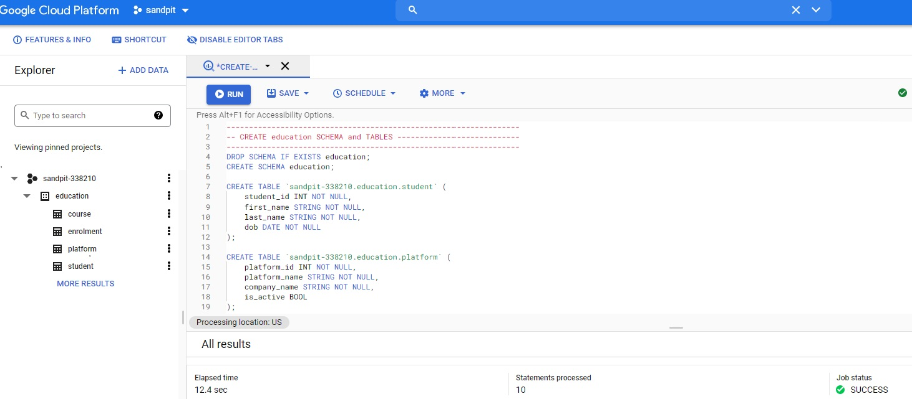

How to integrate SQL and R - Part 1
================
Erika Duan
2022-01-30

-   [Introduction to the relational
    model](#introduction-to-the-relational-model)
-   [Access SQL database via Azure Data Studio using
    T-SQL](#access-sql-database-via-azure-data-studio-using-t-sql)
-   [Access SQL database via Google BigQuery using
    MySQL](#access-sql-database-via-google-bigquery-using-mysql)
-   [Connect to the database using
    `odbc`](#connect-to-the-database-using-odbc)
-   [Run SQL queries directly](#run-sql-queries-directly)
-   [Run SQL queries in R using
    `dbplyr`](#run-sql-queries-in-r-using-dbplyr)
-   [Other resources](#other-resources)

``` r
# Load required packages -------------------------------------------------------  
if (!require("pacman")) install.packages("pacman")
pacman::p_load(here,  
               tidyverse,
               odbc,
               DBI,
               Rcpp,
               bigrquery,
               dbplyr)   
```

# Introduction to the relational model

I am sometimes asked whether it is more worthwhile to learn R or Python.
The reality is that organisations still heavily rely on databases of
tabular records, otherwise known as relational database models. This
means that it is usually more worthwhile to learn SQL and either R or
Python.

Think about the following relational model.


By storing individual (or atomic) records in separate tables, we can
update information about student course enrolments in just the
`enrolment` table and minimise introducing data redundacies elsewhere.

The benefits of organising records using a relational model include:  
+ Records are separated by content type and easier to search for.  
+ Data redundancy is minimised, especially for records with a
one-to-many relationship.  
+ Data sparsity is minimised as tables are designed to contain compact
fields.  
+ Information loss is minimised when individual records are deleted or
updated in a single table.

This tutorial shows you how to run SQL queries using R for two different
SQL databases, using T-SQL locally in Azure Data Studio and using MySQL
on cloud in Google BigQuery.

# Access SQL database via Azure Data Studio using T-SQL

The installation guide for using T-SQL locally via Azure Data Studio
comes from [installation
instructions](https://github.com/frycast/SQL_course/tree/master/create-database/T-SQL)
from [Daniel Fryer](https://github.com/frycast)’s excellent Introduction
to SQL course.

We can create a Microsoft SQL Server connection to a localhost database
using the following steps:

1.  Download and install [Azure Data
    Studio](https://docs.microsoft.com/en-us/sql/azure-data-studio/download-azure-data-studio?view=sql-server-ver15)
    from Microsoft Azure. Navigate to the recommended `User installer`
    link if using Windows and the `.zip file` download link if using
    macOS.

    

2.  Run the installation by accepting the license agreement and clicking
    through the installation process.  

3.  Open Azure Data Studio and click on the button to deploy a server.
    Select `SQL Server on Windows` as the deployment option.

    

4.  Select `SQL Server 2019` or your most recent SQL Server version for
    deployment pre-requisites.  

5.  You will then be prompted to choose a SQL Server Developer Edition
    to install. Select the `Basic` installation type and accept the
    license terms to install Microsoft SQL Server. Close the program
    once installation has completed successfully.  

6.  Return to Azure Data Studio and click on the button to create a
    connection.

7.  Set the connection type as `Microsoft SQL Server`, authentication
    type as `Windows Authentication` and server type as \`localhost.
    Leave the username and password blank and click connect. Azure Data
    Studio is now connected to SQL Server.

    

8.  After connecting to your localhost server, create a new SQL query,
    copy and paste all the text from
    [./tsql\_script.sql](https://github.com/erikaduan/r_tips/blob/master/tutorials/p-sql_to_r_workflows/tsql_script.sql)
    into your query and run it. You should now have created and added
    records to four education tables in your sandpit database.

    

# Access SQL database via Google BigQuery using MySQL

Alternatively, to practice using MySQL, we can set up a SQL database in
Google BigQuery using the following steps:

1.  Sign up for a [Google Platform
    Account](https://console.cloud.google.com/) using a new or existing
    Google account. Note that you should get 10 GB storage and up to 1
    TB queries/month free of charge, before you are billed for
    additional compute costs.

2.  Create a new Google Cloud Project. Navigate to `Manage Resources`
    via the search bar and create a new project titled `sandpit`.
    Projects must all have unique names so Google Cloud will
    automatically append a unique number after your project name if it
    is non-unique.

    

3.  Navigate to `Big Query` via the search bar and make sure that you
    have selected your newly created `sandpit` project. Click
    `compose new query` and copy and paste all the text from
    [./mysql\_script.sql](https://github.com/erikaduan/r_tips/blob/master/tutorials/p-sql_to_r_workflows/mysql_script.sql)
    into your new query and run it. You should now have created and
    added records to four education tables in your sandpit database.

    

# Connect to the database using `odbc`

The purpose of this tutorial is to build a workflow that integrates SQL
queries with R code.

An ODBC driver is a database and operating system independent API that
allows applications, including RStudio, to access data in database
management systems via SQL queries. In R, we can use the packages
[`odbc`](https://db.rstudio.com/r-packages/odbc/) and
[`DBI`](https://db.rstudio.com/r-packages/dbi/) to [connect to and query
from any SQL
database](https://db.rstudio.com/getting-started/connect-to-database/).

**Note:** The package `odbc` provides tools to explore all tables and
columns in a database whilst the package `DBI` provides back-end tools
to read from, write to and query from individual tables.

``` r
# Identify driver name ---------------------------------------------------------
unique(odbc::odbcListDrivers()$name) 
#> [1] "SQL Server"                        "SQL Server Native Client 11.0"     
#>     "SQL Server Native Client RDA 11.0" "ODBC Driver 17 for SQL Server"    
```

To connect to our local Microsoft SQL Server database, we can bypass the
need to manually enter credentials using the
`dbConnect(..., Trusted_Connection = True)`.

``` r
# Create MS SQL connection -----------------------------------------------------
tsql_conn <- DBI::dbConnect(odbc::odbc(),
                            Driver = "SQL Server Native Client 11.0",
                            Server = "localhost",
                            Database = "sandpit",
                            Trusted_Connection = "Yes")

# List available tables --------------------------------------------------------
odbc::dbListTables(tsql_conn)
#>  [1] "course"                                                   "enrolment"
#>  [3] "platform"                                                 "student"

# List available fields --------------------------------------------------------
odbc::dbListFields(tsql_conn, "student")
#> [1] "student_id" "first_name" "last_name"  "dob"

# Close MS SQL connection ------------------------------------------------------
DBI::dbDisconnect(tsql_conn)
```

Alternatively, we can use the `bigquery()` function from the `bigrquery`
package to create a BigQuery DBI driver and connect to our Google
BigQuery SQL database.

``` r
# Create Google BigQuery connection --------------------------------------------
bigquery_conn <- dbConnect(bigrquery::bigquery(),
                           project = "sandpit-338210",
                           dataset = "education")

# Requires authentication via the Tidyverse API to access your Google Account

# List available tables --------------------------------------------------------
dbListTables(bigquery_conn)
#> [1] "course"    "enrolment" "platform"  "student"

# List available fields --------------------------------------------------------
odbc::dbListFields(bigquery_conn, "student")
#> [1] "student_id" "first_name" "last_name"  "dob"      

# Close MS SQL connection ------------------------------------------------------
DBI::dbDisconnect(bigquery_conn)
```

# Run SQL queries directly

Once you have established a database connection, you only need to run
the following lines of code to return your SQL query as an R
`data.frame`.

1.  Use `dbSendQuery()` to submit and execute your SQL query.  
2.  Use `dbFetch()` to fetch the query result and return it as a
    `data.frame`.
3.  Use `dbClearResult()` to free all resources (i.e. memory) associated
    with retrieving the SQL query.  
4.  Use `dbDisconnect()` to close the database connection.

``` r
# Create MS SQL connection -----------------------------------------------------
tsql_conn <- DBI::dbConnect(odbc::odbc(),
                            Driver = "SQL Server Native Client 11.0",
                            Server = "localhost",
                            Database = "sandpit",
                            Trusted_Connection = "Yes")

# Create MS SQL query ----------------------------------------------------------
tsql_query <- odbc::dbSendQuery(
  tsql_conn,
  "
  SELECT 
  platform_id,
  AVG(course_length) AS average_course_length

  FROM education.course
  WHERE course_length IS NOT NULL
  
  GROUP BY platform_id
  
  -- select average course length for each platform, where null lengths
  -- are removed
  "
) 

# Fetch MS SQL query as R data.frame -------------------------------------------
avg_course_length <- odbc::dbFetch(tsql_query)

# Clear MS SQL query and disconnect from MS SQL database ----------------------- 
odbc::dbClearResult(tsql_query)
DBI::dbDisconnect(tsql_conn)

# Access R data.frame for further data analysis --------------------------------
avg_course_length %>%
  mutate(platform_id = factor(platform_id),         
         platform_id = fct_reorder(platform_id, average_course_length)) %>%
  ggplot(aes(x = platform_id, y = average_course_length)) +
  geom_col(fill = "linen", colour = "black") + 
  coord_flip() +
  labs(x = "Platform Id",
       y = "Course length",
       title = "Platform 1 has the course with the longest course length") +
  theme_minimal() +
  theme(panel.grid = element_blank(),
        panel.border = element_rect(fill = NA, colour = "black"))
```


``` r
# Create Google BigQuery connection --------------------------------------------
bigquery_conn <- dbConnect(bigrquery::bigquery(),
                           project = "sandpit-338210",
                           dataset = "education")

# Send BigQuery SQL query ------------------------------------------------------
mysql_query <- bigrquery::dbSendQuery(
  bigquery_conn,
  "
  SELECT 
  c.course_id,
  c.course_name,
  c.course_desc,
  c.course_length,
  c.platform_id
  
  FROM `sandpit-338210.education.course` AS c
  
  JOIN
    (SELECT 
     platform_id, 
     max(course_length) AS max_course_length
     FROM `sandpit-338210.education.course`
     GROUP BY platform_id) AS m
     
  ON c.course_length = m.max_course_length AND c.platform_id = m.platform_id
  
  ORDER BY c.platform_id 
  
  -- select course details for the course with the highest course length
  -- per platform and display these records ordered by platform_id
  "
) 

# Fetch BigQuery SQL query as R data.frame ------------------------------------- 
max_length_course_details <- bigrquery::dbFetch(mysql_query)

class(max_length_course_details)
#> [1] "tbl_df"     "tbl"        "data.frame"

# Clear BigQuery SQL query -----------------------------------------------------
bigrquery::dbClearResult(mysql_query)

# Disconnect from BigQuery database --------------------------------------------
bigrquery::dbDisconnect(bigquery_conn)
```

``` r
# Access R data.frame ----------------------------------------------------------
max_length_course_details %>%
  knitr::kable()
```

| course\_id | course\_name                      | course\_desc                                                                                | course\_length | platform\_id |
|:-----------|:----------------------------------|:--------------------------------------------------------------------------------------------|---------------:|-------------:|
| SG01       | Growing vegetable pie ingredients | All good hobbits should know that vegetable pies cannot be vegetarian                       |             90 |            1 |
| SB02       | Emergency dwarven bread           | Bake these goods to politely send unexpected guests off on their way again                  |             10 |            2 |
| GG01       | Pity pathetic creatures           | Many that live deserve death. Some that die deserve life. Can you give it to them, hobbits? |              1 |            3 |

# Run SQL queries in R using `dbplyr`

I really recommend taking the time to learn SQL. However, if you know R
and no SQL, the `dbplyr` API is a useful package to start running small
to mid-sized SQL queries. As R code is translated into SQL and executed
in the database on the remote server, using on the R to SQL conversion
via `dbplyr` is much slower than directly writing and fetching an SQL
query. This is why everyone, including `dbplyr` library creators,
strongly recommend learning SQL.

``` r
# Create Google BigQuery connection --------------------------------------------
bigquery_conn <- dbConnect(bigrquery::bigquery(),
                           project = "sandpit-338210",
                           dataset = "education")

# Use tbl() as an equivalent of glimpse ----------------------------------------
# In contrast to directly querying via SQL, the output has additional classes
course <- tbl(bigquery_conn, "course")

class(course)
#> [1] "tbl_BigQueryConnection"   "tbl_dbi"   "tbl_sql"    "tbl_lazy"   "tbl"  
```

Fetching queries via `tbl()` produces a lazy glimpse of an R
`data.frame` that only outputs the top few rows of data. To output the
entire query as an R `data.frame` for further analyses, use `collect()`
at the end of your `dplyr` code to explicitly fetch the final query.

``` r
# Couple tbl() with dplyr syntax for data transformations ----------------------
tbl(bigquery_conn, "enrolment") %>%
  filter(start_date >= "2000-01-01") %>%
  arrange(student_id, enrolment_id) %>%
  head(3)

# Class differences include tail() and nrow() not working on tbl() outputs
# tbl(bigquery_conn, "enrolment") %>%
#   filter(start_date >= "2000-01-01") %>%
#   arrange(student_id, enrolment_id) %>%
#   tail(3)
#> Error: tail() is not supported by sql sources
```

    ## # Source:     lazy query [?? x 5]
    ## # Database:   BigQueryConnection
    ## # Ordered by: student_id, enrolment_id
    ##   enrolment_id student_id course_id start_date end_date  
    ##          <int>      <int> <chr>     <date>     <date>    
    ## 1            7          1 SG02      2000-02-01 2000-04-10
    ## 2            8          1 GG01      2021-09-02 2021-09-03
    ## 3            2          2 SG02      2000-02-01 2000-04-10

``` r
# Collect tbl() query output as an R data.frame --------------------------------
enrolments_2000 <- tbl(bigquery_conn, "enrolment") %>%
  filter(start_date >= "2000-01-01") %>%
  arrange(student_id, enrolment_id) %>%
  collect()

class(enrolments_2000)
#> [1] "tbl_df"     "tbl"        "data.frame"
```

To extract the SQL query translated by `dbplyr`, use `show_query()` at
the end of your `dplyr` code to explicitly fetch the SQL translation.

**Note:** SQL translations do not always reflect the optimised SQL code
that we would actually write, especially for complicated data
transformations. This is why you should still learn SQL in the long run.

``` r
# Couple tbl() with dplyr syntax for data transformations ----------------------
# Good SQL translation
tbl(bigquery_conn, "enrolment") %>%
  filter(start_date >= "2000-01-01") %>%
  arrange(student_id, enrolment_id) %>% 
  show_query()
```

    ## <SQL>
    ## SELECT *
    ## FROM `enrolment`
    ## WHERE (`start_date` >= '2000-01-01')
    ## ORDER BY `student_id`, `enrolment_id`

``` r
# Couple tbl() with dplyr syntax for data transformations ----------------------
# SQL syntax is to use WHERE course_length IS NOT NULL  
tbl(bigquery_conn, "course") %>%
  filter(!is.na(course_length)) %>%
  group_by(platform_id) %>%
  summarise(average_course_length = mean(course_length)) %>%
  arrange(platform_id) %>%
  show_query()
```

    ## Warning: Missing values are always removed in SQL.
    ## Use `mean(x, na.rm = TRUE)` to silence this warning
    ## This warning is displayed only once per session.

    ## <SQL>
    ## SELECT `platform_id`, AVG(`course_length`) AS `average_course_length`
    ## FROM `course`
    ## WHERE (NOT(((`course_length`) IS NULL)))
    ## GROUP BY `platform_id`
    ## ORDER BY `platform_id`

``` r
# Disconnect from BigQuery database --------------------------------------------
# Always remember to disconnect your SQL database connection
bigrquery::dbDisconnect(bigquery_conn)
```

# Other resources

-   An RStudio
    [guide](https://db.rstudio.com/getting-started/connect-to-database/)
    on how to connect to an existing database using the `odbc` and `DBI`
    packages.  
-   An Rstudio [guide](https://db.rstudio.com/databases/big-query/) on
    how to connect to Google BigQuery using `odbc` or `bigrquery`.  
-   The official
    [vignette](https://cran.r-project.org/web/packages/dbplyr/vignettes/dbplyr.html)
    to using `dbplyr` for performing SQL queries via the tidyverse
    API.  
-   A great series of blog posts by Vebash Naidoo, with [part
    1](https://sciencificity-blog.netlify.app/posts/2020-12-12-using-the-tidyverse-with-databases/),
    [part
    2](https://sciencificity-blog.netlify.app/posts/2020-12-20-using-the-tidyverse-with-dbs-partii/)
    and [part
    3](https://sciencificity-blog.netlify.app/posts/2020-12-31-using-tidyverse-with-dbs-partiii/)
    containing advanced tips for using `dbplyr` to query SQL databases
    in R.
