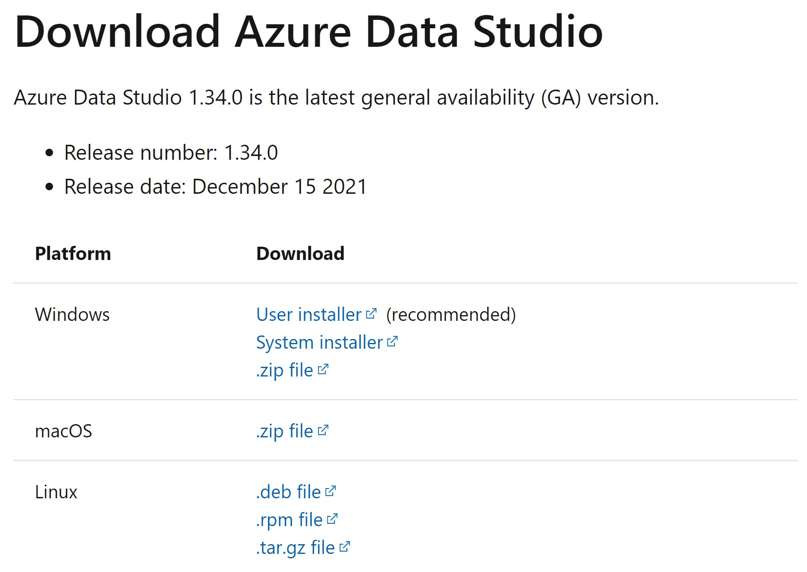
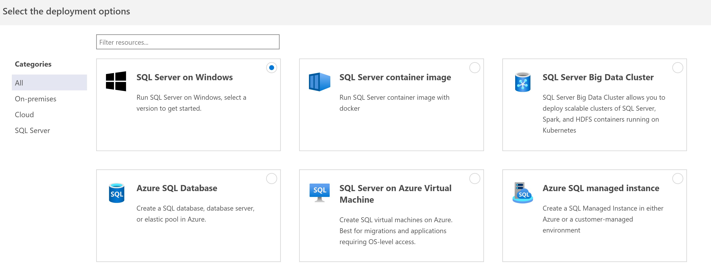
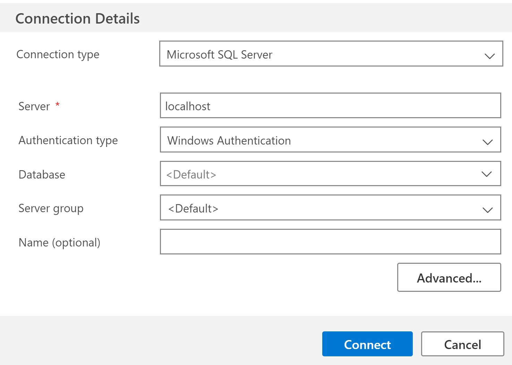
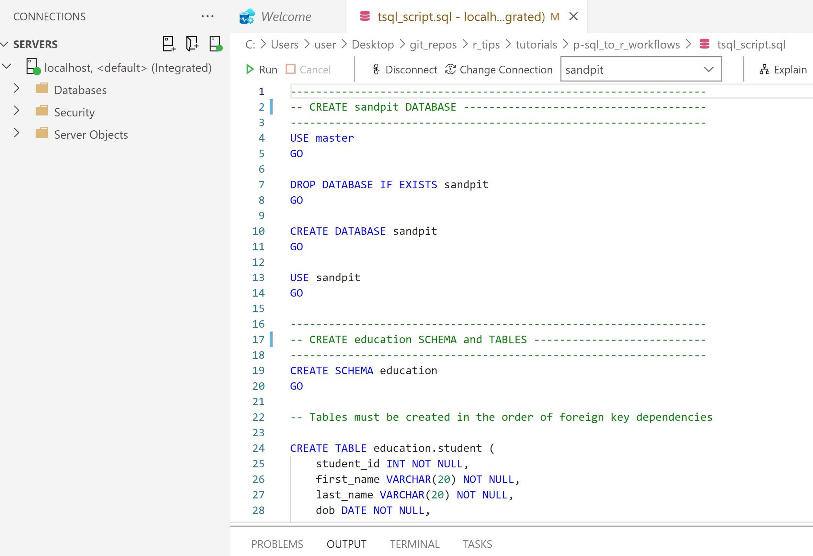
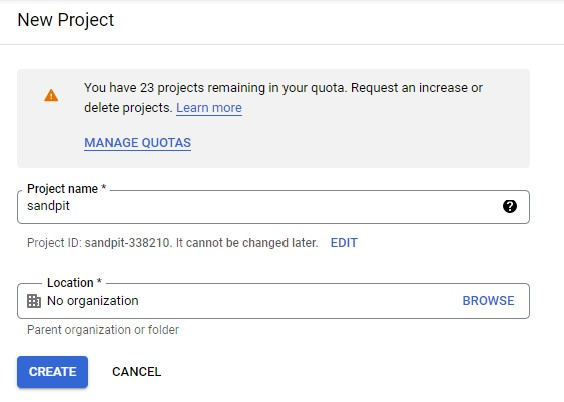

How to integrate SQL and R - Part 1
================
Erika Duan
2022-01-04

-   [Introduction to the relational
    model](#introduction-to-the-relational-model)
-   [Access SQL database via Azure Data Studio using
    T-SQL](#access-sql-database-via-azure-data-studio-using-t-sql)
-   [Access SQL database via Google BigQuery using
    MySQL](#access-sql-database-via-google-bigquery-using-mysql)
-   [Connect to the database using
    `odbc`](#connect-to-the-database-using-odbc)
-   [Run SQL queries in R](#run-sql-queries-in-r)
-   [Other resources](#other-resources)

``` r
# Load required packages -------------------------------------------------------  
if (!require("pacman")) install.packages("pacman")
pacman::p_load(here,  
               tidyverse,
               odbc,
               DBI,
               Rcpp,
               bigrquery)   
```

# Introduction to the relational model

I am sometimes asked whether it is more worthwhile to learn R or Python.
The reality is that organisations still heavily rely on databases of
tabular records, otherwise known as relational database models. This
means that it is usually more worthwhile to learn SQL and either R or
Python.

Think about the following relational model.


By storing individual (or atomic) records in separate tables, we can
update information about student course enrollments in just the
`enrollment` table. We can still do complex analysis on platform company
market shares by joining records from the `enrollment`, `course` and
`platform` tables.

The benefits of organising records using a relational model include:  
+ Records are separated by content type and easier to search for.  
+ Prevents data duplication for records with a one-to-many
relationship.  
+ Reduces data sparsity as separate tables contain compact fields.  
+ Prevents linked record loss when records are deleted or updated in a
table.

This tutorial shows you how to run SQL queries using R for two different
SQL databases, using MySQL in Google BigQuery and T-SQL in Azure Data
Studio.

# Access SQL database via Azure Data Studio using T-SQL

The installation guide for using T-SQL via Azure Data Studio comes from
[installation
instructions](https://github.com/frycast/SQL_course/tree/master/create-database/T-SQL)
written by [Daniel Fryer](https://github.com/frycast) for his excellent
Introduction to SQL course.

We can create a Microsoft SQL Server connection to a localhost database
using the following steps:

1.  Download and install [Azure Data
    Studio](https://docs.microsoft.com/en-us/sql/azure-data-studio/download-azure-data-studio?view=sql-server-ver15)
    from Microsoft Azure. Navigate to the recommended `User installer`
    link if using Windows and the `.zip file` download link if using
    macOS.

    

2.  Run the installation by accepting the license agreement and clicking
    through the installation process.  

3.  Open Azure Data Studio and click on the button to deploy a server.
    Select `SQL Server on Windows` as the deployment option.

    

4.  Select `SQL Server 2019` or your most recent SQL Server version for
    deployment pre-requisites.  

5.  You will then be prompted to choose a SQL Server Developer Edition
    to install. Select the `Basic` installation type and accept the
    license terms to install Microsoft SQL Server. Close the program
    once installation has completed successfully.  

6.  Return to Azure Data Studio and click on the button to create a
    connection.

7.  Set the connection type as `Microsoft SQL Server`, authentication
    type as `Windows Authentication` and server type as \`localhost.
    Leave the username and password blank and click connect. Azure Data
    Studio is now connected to SQL Server.

    

8.  After connecting your `localhost` server, create a new SQL query,
    copy and paste all the text from
    [tsql\_script.sql](https://github.com/erikaduan/r_tips/blob/master/tutorials/p-sql_to_r_workflows/tsql_script.sql)
    and run the query. You should now have created and added records to
    four education tables in your sandpit database.

    

# Access SQL database via Google BigQuery using MySQL

1.  Sign up for a [Google Platform
    Account](https://console.cloud.google.com/) using a new or existing
    Google account. Note that you should get 10 GB storage and up to 1
    TB queries/month free of charge, before you are billed for
    additional compute costs.

2.  Create a new Google Cloud Project and select this project in
    BigQuery.



1.  Create a new dataset inside your project. This is equivalent to
    creating a new database in a data warehouse.


1.  Copy and paste the SQL query below to generate the `customers`
    table.

``` r
/* Create Customers table*/ 
  SELECT
id AS customer_id,
first_name,
last_name

FROM `dbt-tutorial`.jaffle_shop.customers
```

1.  Run the query and save the results as a BigQuery table called
    `customers`.


1.  Copy and paste the SQL query below to generate the `orders` table.
    Run and save the results as a BigQuery table called `orders`.

``` r
/* Create Orders table*/ 
  SELECT
id AS order_id,
user_id AS customer_id,
order_date,
status

FROM `dbt-tutorial`.jaffle_shop.orders
```

1.  Unfortunately, the `payments` table does not exist as a public
    dataset on BigQuery. To circumvent this problem, you can download
    `raw_payments.csv` from the [jaffle shop GitHub
    repository](https://github.com/dbt-labs/jaffle_shop) and manually
    upload it as a new table in your project. This allows you to
    practice writing queries to join more than two tables together.


Congratulations! You have now created a very small-scale cloud-hosted
database to practice running SQL queries on.

# Connect to the database using `odbc`

The purpose of this tutorial, however, is to build a workflow that
integrates SQL queries within R.

An ODBC driver is a database and operating system independent API that
allows applications, including RStudio, to access data in database
management systems via SQL queries. In R, we can use the packages
[`odbc`](https://db.rstudio.com/r-packages/odbc/) and
[`DBI`](https://db.rstudio.com/r-packages/dbi/) to [connect to and query
from a
database](https://db.rstudio.com/getting-started/connect-to-database/).

**Note:** The package `odbc` provides tools to explore all tables and
columns in a database whilst the package `DBI` provides back-end tools
to read from, write to and query from individual tables. For Google
BigQuery,

``` r
# Identify driver name ---------------------------------------------------------
unique(odbc::odbcListDrivers()$name) 
#> [1] "SQL Server"

# Create Google BigQuery connection --------------------------------------------
# bigquery_conn <- DBI::dbConnect(odbc::odbc(),
#                                 Driver = "[BigQuery driver name]",
#                                 Catalog = "[BigQuery project name]",
#                                 Email = "[Google service account email]",
#                                 KeyFilePath = "[full path to key file]",
#                                 OAuthMechanism = 0)

bigquery_conn <- dbConnect(bigrquery::bigquery(),
                           project = "jaffle-shop-data-warehouse",
                           dataset = "jaffle_shop")

# Requires authentication for the Tidyverse API to access your Google Account   

# List available tables --------------------------------------------------------
dbListTables(bigquery_conn)
#> [1] "customers" "orders"    "payments" 
```

If you are connecting to an on-premise MS SQL database, you can bypass
the need to manually enter your credentials using the `dbConnect()` code
below.

``` r
# Create MS SQL connection -----------------------------------------------------
# MSSQL_conn <- DBI::dbConnect(odbc::odbc(),
#                              Driver = "[SQL Server driver name]",
#                              Server = "[Server address, Port]",  
#                              Database = "[Database name]", 
#                              Trusted_Connection = "Yes")  

# A warehouse may contain multiple databases    
```

# Run SQL queries in R

Once you have established a database connection, you only need to run
the following lines of code to return your SQL query as an R
`data.frame`.

1.  Use `bigrquery::dbSendQuery()` or `odbc::dbSendQuery()` to submit
    and execute your SQL query.  
2.  Use `bigrquery::dbFetch()` or `odbc::dbFetch()` to fetch the query
    result and return it as a `data.frame`.
3.  Use `bigrquery::dbClearResult()` or `odbc::dbClearResult()` to free
    all resources (i.e. memory) associated with retrieving the SQL
    query.  
4.  Use `bigrquery::dbDisconnect()` or `odbc::dbDisconnect()` to close
    the database connection.

``` r
# Send BigQuery SQL query ------------------------------------------------------
customer_query <- bigrquery::dbSendQuery(
  bigquery_conn,
  "
  SELECT 
  
    customer_id AS id,
    first_name,
    last_name
    
  From `jaffle-shop-data-warehouse.jaffle_shop.customers` 
  
  LIMIT 5
  "
) 

# Fetch BigQuery SQL query ----------------------------------------------------- 
customer_df <- bigrquery::dbFetch(customer_query)

# Clear BigQuery SQL query -----------------------------------------------------
bigrquery::dbClearResult(customer_query)

# Disconnect from BigQuery database --------------------------------------------
bigrquery::dbDisconnect(bigquery_conn)
```

``` r
# Preview customer_df ----------------------------------------------------------
class(customer_df)
#> [1] "tbl_df"     "tbl"        "data.frame"  

customer_df %>%
  head(3)
```

|  id | first\_name | last\_name |
|----:|:------------|:-----------|
|  20 | Anna        | A.         |
|  23 | Mildred     | A.         |
|  40 | Maria       | A.         |

# Other resources

-   The [GitHub repository](https://github.com/dbt-labs/jaffle_shop) for
    the data build tool (DBT) jaffle shop project.  
-   The jaffle shop DBT Google BigQuery project [set-up
    tutorial](https://docs.getdbt.com/tutorial/setting-up).  
-   An RStudio
    [guide](https://db.rstudio.com/getting-started/connect-to-database/)
    on how to connect to an existing database using the `odbc` and `DBI`
    packages.  
-   An Rstudio [guide](https://db.rstudio.com/databases/big-query/) on
    how to connect to Google BigQuery using `odbc` or `bigrquery`.  
-   The official
    [vignette](https://cran.r-project.org/web/packages/dbplyr/vignettes/dbplyr.html)
    to using `dbplyr` for performing SQL queries via the tidyverse API.
