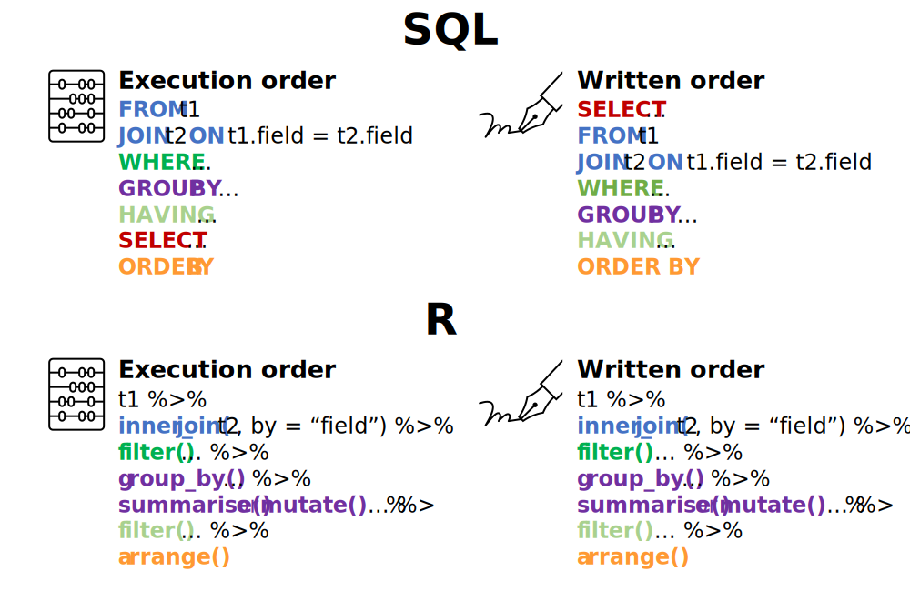

How to integrate SQL and R - Part 2
================
Erika Duan
2022-01-26

-   [Introduction](#introduction)
-   [SQL syntax quirks](#sql-syntax-quirks)
    -   [Writing `GROUP BY` SQL queries](#writing-group-by-sql-queries)
    -   [Writing SQL subqueries](#writing-sql-subqueries)
-   [Production friendly workflows](#production-friendly-workflows)
-   [Other resources](#other-resources)

``` r
# Load required packages -------------------------------------------------------  
if (!require("pacman")) install.packages("pacman")
pacman::p_load(here,  
               tidyverse,
               odbc,
               DBI,
               Rcpp)   
```

# Introduction

The second part of my tutorial series about SQL to R workflows is mainly
focused on breaking down differences between SQL and R syntax. It also
contains a rehash of Emily Riederer’s excellent [blog
post](https://emilyriederer.netlify.app/post/sql-r-flow/) on designing
flexible workflows for SQL to R projects. We will be using the SQL
database(s) we set up in the [first
tutorial](https://github.com/erikaduan/r_tips/blob/master/tutorials/p-sql_to_r_workflows/p-sql_to_r_workflows_part_1.md)
for the exercises below.

``` r
# Create MS SQL connection -----------------------------------------------------
tsql_conn <- DBI::dbConnect(odbc::odbc(),
                            Driver = "SQL Server Native Client 11.0",
                            Server = "localhost",
                            Database = "sandpit",
                            Trusted_Connection = "Yes")
```

# SQL syntax quirks

In my opinion, the easiest way of learning SQL code is to remember the
sequence of how SQL code is executed. In R, because we can chain
multiple operations together, the sequence in which R code is written is
usually identical to the sequence in which it is executed.



In SQL, the sequence in which SQL code is written does not correspond to
the sequence in which it is executed, which leads to common errors like
the example below.

``` r
# Incorrect SQL code -----------------------------------------------------------
# odbc::dbSendQuery(
#   tsql_conn,
#   "
#   SELECT 
#   student_id AS hobbit_id,
#   first_name, 
#   last_name
#   
#   FROM education.student
#   WHERE hobbit_id <> 2
#   
#   -- this query will generate an error as WHERE is executed before SELECT and
#   -- the renaming of student_id to hobbit_id happens after WHERE 
#   "
# ) 

# Correct SQL code -------------------------------------------------------------
odbc::dbSendQuery(
  tsql_conn,
  "
  SELECT
  student_id AS hobbit_id,
  first_name, 
  last_name
  
  FROM education.student
  WHERE student_id <> 2
  
  -- student_id is first filtered via WHERE and lastly renamed to hobbit_id
  "
) %>%
  odbc::dbFetch() %>%
  knitr::kable()
```

| hobbit\_id | first\_name | last\_name |
|-----------:|:------------|:-----------|
|          1 | Frodo       | Baggins    |
|          3 | Merry       | Brandybuck |
|          4 | Peregrin    | Took       |

## Writing `GROUP BY` SQL queries

## Writing SQL subqueries

# Production friendly workflows

# Other resources

-   Emily Riederer’s excellent [blog
    post](https://emilyriederer.netlify.app/post/sql-r-flow/) containing
    ideas for creating flexible SQL &lt;&gt; R project workflows.  
-   Julia Evan’s entertaining [programming
    zine](https://wizardzines.com/zines/sql/) explaining all things SQL.
    (Paywalled resource)
