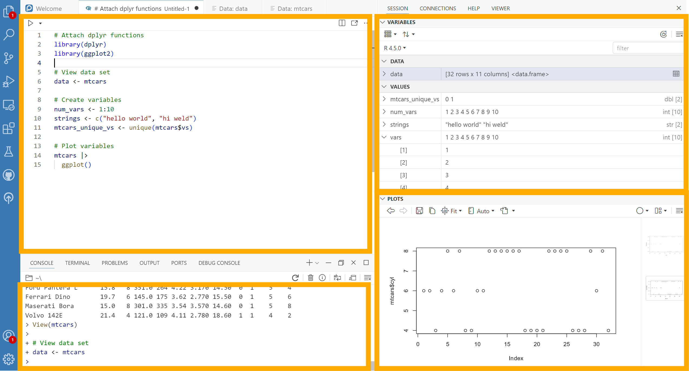
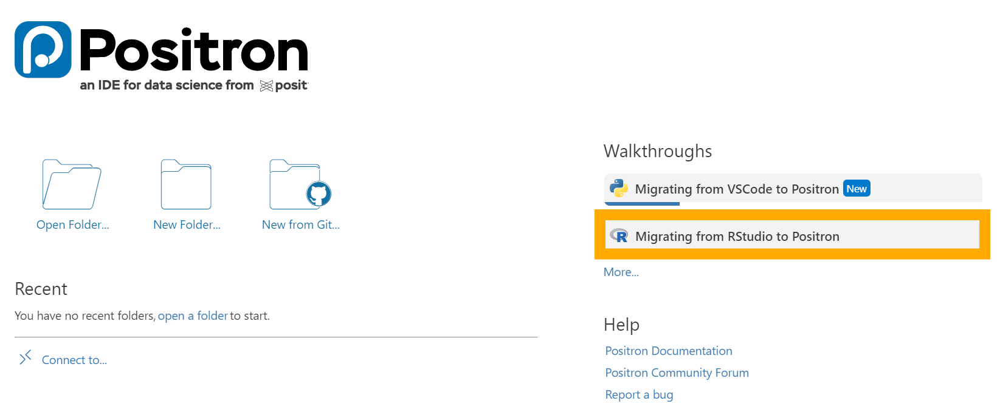
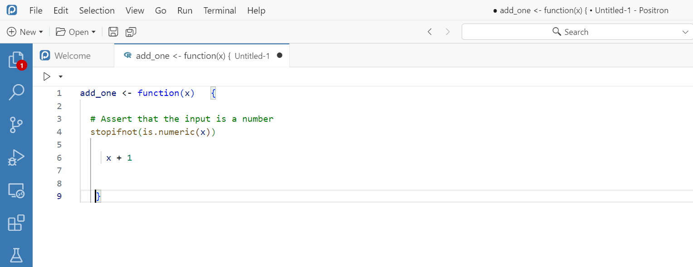
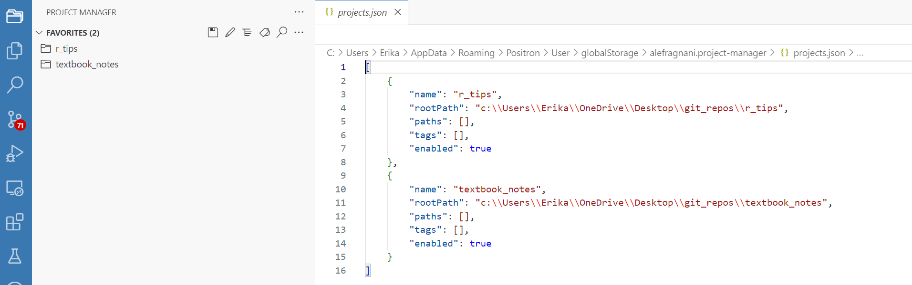
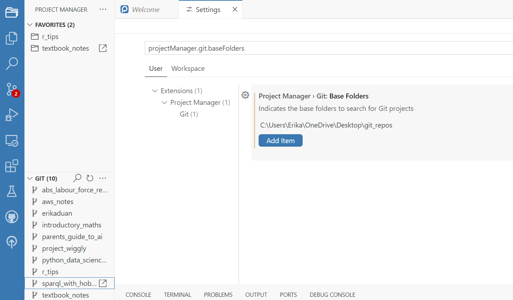

How to set up a Positron IDE
================
Erika Duan
2025-07-10

- [Integrated Development
  Environments](#integrated-development-environments)
- [Choosing Positron as an IDE](#choosing-positron-as-an-ide)
- [Positron Windows setup](#positron-windows-setup)
- [Positron versus RStudio usage
  differences](#positron-versus-rstudio-usage-differences)
  - [File organisation](#file-organisation)
- [Other resources](#other-resources)

# Integrated Development Environments

An Integrated Development Environment (IDE) is simply a software
application that supports code development. Different IDEs are popular
for different languages:

- R programmers tend to use
  [RStudio](https://posit.co/download/rstudio-desktop/).

- Cloud platform constrained Python programmers tend to use a
  proprietary variation of [JupyterLabs](https://jupyter.org/).

- Programmers switching between R, Python, Julia or other programming
  languages tend to use [Visual Studio
  Code](https://code.visualstudio.com/) (VS Code).

The RStudio IDE is already thoughtfully designed to support data
exploration and R code development. If you mostly program in R, I
recommend staying with the [RStudio
IDE](https://posit.co/download/rstudio-desktop/) and skipping this
tutorial.

# Choosing Positron as an IDE

If you are a data scientist who loves the RStudio experience but
frequently codes in Python or Julia, then
[Positron](https://positron.posit.co/start.html) may be an appealing
IDE.

The core features of Positron are:

- It provides an [R kernel](https://github.com/posit-dev/ark) for
  Jupyter applications. This enables a separate R console beneath the R
  scripts/notebooks panel (something which JupyterLabs and VS Code lack
  for R programming).

- It provides a customisable IDE layout that is more suited for data
  exploration, with ***Variables*** and ***Plots*** panes for each R
  session, and ***Connections*** and ***Help*** panes similar to
  RStudio.

  

- It is built on the [open source
  version](https://github.com/microsoft/vscode) of VS Code, so it
  aesthetically resembles VS Code and retains the appealing features of
  VS Code for programming in other languages.

- It supports most VS Code extensions. Microsoft does not permit access
  to Visual Studio Marketplace for non-Microsoft Visual Studio builds,
  so Positron’s Visual Studio extensions are hosted by [Open
  VSX](https://open-vsx.org/).

# Positron Windows setup

My simple Windows setup only involves several steps. These are all
listed in the ***Migrating from RStudio to Positron*** walkthrough on
the Positron Welcome page.

1.  Download the [Positron IDE](https://positron.posit.co/download.html)
    onto your desktop.

    

2.  Import [RStudio
    keybindings](https://positron.posit.co/rstudio-keybindings.html) by
    navigating to ***File*** \> ***Preferences*** \> ***Settings***,
    searching for `workbench.keybindings.rstudioKeybindings` and
    clicking the ***Enable*** checkbox. Restart Positron for the
    settings to take effect.

    Examples of RStudio keybindings that I use are `Ctrl` + `Alt` + `I`
    to insert a new R markdown cell and `Ctrl` + `I` to re-indent
    selected code.

3.  Opt-in to use the R code formatter
    [`air`](https://www.tidyverse.org/blog/2025/02/air/), which
    re-formats code inside `.R`, `.Rmd` and `.Qmd` files. The easiest
    way to integrate `air` inside Positron is to enable it to format
    code on save. Navigate to ***File*** \> ***Preferences*** \>
    ***Settings***, search for `@lang:r editor.formatOnSave` and click
    the ***Format a file on save*** checkbox.

    

    The formatter `air` is used to:

    - Automatically indent R code.  
    - Splits long lines of code over multiple lines (with a default code
      line width of 80 characters).  
    - Standardises the white space around code elements.  
    - Code formatting can be manually disabled by placing `# fmt: skip`
      in front of an expression.

# Positron versus RStudio usage differences

## File organisation

In RStudio, it is best practice to set up R projects by creating an
`r_project_name.Rproj` file. This `.Rproj` file marks the project root
folder and is used by the R package `here` to build relative file paths
within a self-contained project. Double clicking on an `.Rproj` file
also launches a new R session with the project directory set as the
project root.

[Positron does not support
`.Rproj files`](https://positron.posit.co/rstudio-rproj-file.html) and
alternative practices are required.

- If using `here`, the project root folder is also identifiable from the
  presence of the `.git/` folder. **Ensure that all your R projects use
  Git for code version control.**  

- In Positron, navigating to ***Explorer*** \> ***Open Folder*** will
  open a directory and set it as the project root.

- Use the
  [`Project Manager`](https://open-vsx.org/extension/alefragnani/project-manager)
  VS extension to navigate between multiple projects. In Project
  Manager, you can:

  - Set up a list of projects by manually saving individual directories
    as favourites. First open a project by navigating to ***Explorer***
    \> ***Open Folder***. Then navigate to the ***Project Manager tab***
    and click on the ***Save*** icon to save your currently open file
    directory as a new project. Projects are then listed inside a
    `projects.json` file.

  - 

  - Automatically detect directories with a `.git/` folder as projects.
    Click on the ***Project Manager tab*** and navigate down to the
    ***Git*** panel. Click ***Open Settings*** to add all the base
    folders where Git projects can be found. For example, my projects
    are found inside `C:\Users\Erika\OneDrive\Desktop\git_repos` so I
    add `C:\Users\Erika\OneDrive\Desktop\git_repos` as a file path by
    clicking ***Add Item***.

  - 

# Other resources

- <https://www.andrewheiss.com/blog/2025/07/05/positron-ssh-docker/>  
- <https://www.andrewheiss.com/blog/2024/07/08/fun-with-positron/>  
- <https://www.emilyriederer.com/post/py-rgo-2025/>
