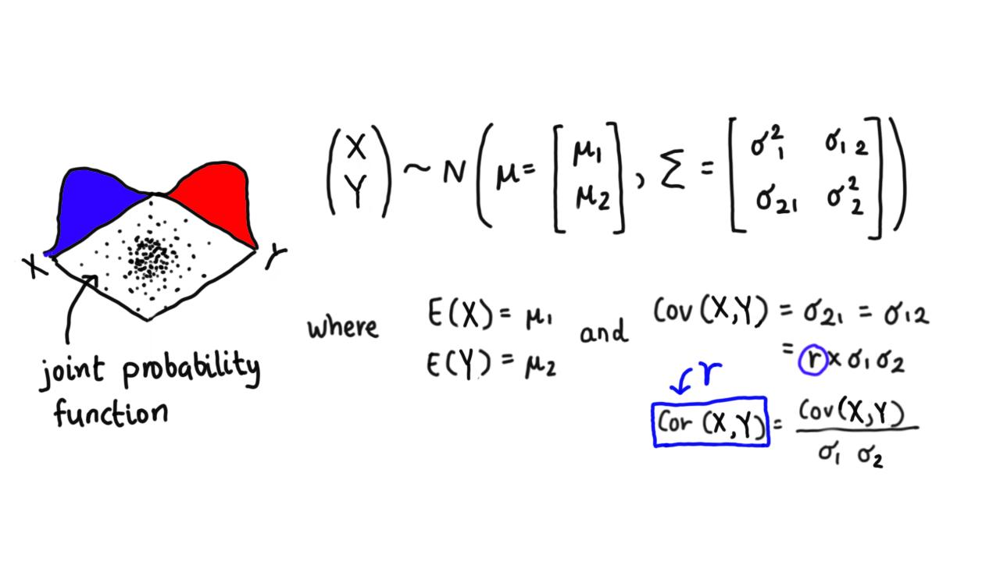

```{r setup, include=FALSE}
# Set up global environment ----------------------------------------------------
knitr::opts_chunk$set(echo=TRUE, results='hide', fig.show='asis')  
```


```{r load libraries, message=FALSE, warning=FALSE}  
# Load required packages -------------------------------------------------------  
if (!require("pacman")) install.packages("pacman")
pacman::p_load(here,  
               tidyverse,
               patchwork,
               mnormt)   
```


# Normal distribution    

The normal distribution, or Gaussian distribution, is frequently observed in nature and is characterised by the following properties:    

+ It is a symmetrical continuous distribution where $-\infty < x < \infty$.   
+ Its mean, median and mode are identical due to its symmetrical distribution.  
+ Its probability density function contains two parameters; the mean i.e. $\mu$ and the standard deviation i.e. $\sigma$ where $-\infty < \mu < \infty$ and $\sigma > 0$.   
+ Its probability density function is described by the equation below:   
$f(x) = \frac{1}{\sqrt{2 \pi \sigma^2}} \times e^{\frac{-(x - \mu) ^2}{2\sigma^2}}$.      

Imagine that the height of tomato plants in a field is normally distributed. It is known that the average tomato plant height is 140 cm, with a standard deviation of 16 cm.

+ What would the distribution of tomato plant height look like if the height of 100 plants was randomly measured?
+ What would the probability density function of tomato plant height look like if the height of 10, 100 or 1000 plants was randomly measured?  

```{r plot norm dist, results='markup'}
# Simulate tomato plant heights from normal distribution -----------------------
set.seed(111)  
plant_height <- tibble(x = seq(1, 100),
                       height = rnorm(100, mean = 140, sd = 16))  

# Plot tomato plant heights ----------------------------------------------------
measurements <- plant_height %>%
  ggplot(aes(x = x, y = height)) + 
  geom_point(aes(x = x, y = height),
             shape = 21, fill = "tomato") + 
  labs(x = "X",
       y = "Plant height (cm)",
       title = "Sample plant heights") + 
  theme_minimal() +
  theme(panel.grid = element_blank(),
        panel.border = element_rect(fill = NA, colour = "black"),
        plot.title = element_text(hjust = 0.5)) 

density <- plant_height %>%
  ggplot(aes(y = height)) + 
  geom_density(aes(y = height)) + 
  labs(x = "Density",
       y = "Plant height (cm)",
       title = "Density of sample plant heights") + 
  theme_minimal() +
  theme(panel.grid = element_blank(),
        panel.border = element_rect(fill = NA, colour = "black"),
        plot.title = element_text(hjust = 0.5)) 

(measurements + density)
```

```{r plot norm dist for different n, results='markup'}
# Simulate tomato plant heights from 10, 100 and 1000 samples ------------------ 
set.seed(111)
sample_10 <- tibble(x = seq(1, 10), 
                    height = rnorm(10, mean = 140, sd = 16))  

sample_100 <- tibble(x = seq(1, 100), 
                     height = rnorm(100, mean = 140, sd = 16))  

sample_1000 <- tibble(x = seq(1, 1000),
                      height = rnorm(1000, mean = 140, sd = 16))  

# Create plotting function -----------------------------------------------------
plot_density <- function(df, value) {
  value <- enquo(value)
  
  plot <- df %>%
    ggplot(aes(x = !! value)) + 
    geom_density(aes(x = !! value)) + 
    geom_vline(xintercept = 140, colour = "tomato", linetype = "dotted") +
    scale_x_continuous(limits = c(70, 210)) +
    labs(x = "Plant height (cm)",
         y = "Density",
         title = paste0("Density of ", nrow(df), " sample plant heights")) + 
    theme_minimal() +
    theme(panel.grid = element_blank(),
          panel.border = element_rect(fill = NA, colour = "black"),
          plot.title = element_text(hjust = 0.5))
  
  return(plot)
}

# Plot sample density plots ----------------------------------------------------
(plot_density(sample_10, height) / plot_density(sample_100, height) / plot_density(sample_1000, height))
```

+ What would the distribution of sample means i.e. $\bar x$, look like if 100 tomato plants were randomly measured from 1000 random locations?     

```{r plot CLT, results='markup', out.width='70%', fig.align='center'}
# Simulate 100 samples from 1000 fields ----------------------------------------
sample_means <- vector("double", length = 1000L)
for (i in 1:1000) {
  plot <- rnorm(100, mean = 140, sd = 16)
  sample_means[[i]] <- mean(plot)    
}

# Plot distribution of 100 sample means ----------------------------------------
sample_means %>%
  tibble(height = .) %>% # Convert to tibble for plotting
  ggplot(aes(x = height)) +
  geom_histogram(binwidth = 1, fill = "lightsalmon", colour = "black") +
  labs(x = "Plant height mean (cm)",
       y = "Count") + 
  theme_minimal() +
  theme(panel.grid = element_blank(),
        panel.border = element_rect(fill = NA, colour = "black"),
        plot.title = element_text(hjust = 0.5))  
```

The phenomenon above is an example of the [central limit theorem](https://statisticsbyjim.com/basics/central-limit-theorem/), which states that the sampling distribution of the mean for any distribution approximates the normal distribution as the sample size increases.   

The normal distribution has a well-know probability density function where:  
+ ~68% of values fall within one standard deviation of the mean.    
+ ~95.5% of values fall within two standard deviations of the mean.   
+ ~99.7% of values fall within three standard deviations of the mean.    


```{r calc p from norm dist}
# Calculate probability from probability density function ----------------------
# Store f(x) as a normal distribution with mean 140 and sd 16      
funs_x_fx <- function(x) (1/ (sqrt(2 * pi * 16 ^ 2)) * exp(-((x - 140) ^ 2) / (2 * 16 ^ 2)))

# Probability of a value falling within 1 sd of the mean -----------------------  
integrate(funs_x_fx, lower = 140 - 16, upper = 140 + 16)
#> 0.6826895 with absolute error < 7.6e-15

# Probability of a value falling within 2 sd of the mean -----------------------  
integrate(funs_x_fx, lower = 140 - (2 * 16), upper = 140 + (2 * 16))
#> 0.9544997 with absolute error < 1.8e-11 

# Probability of a value falling within 1 sd of the mean -----------------------  
integrate(funs_x_fx, lower = 140 - (3 * 16), upper = 140 + (3 * 16))
#> 0.9973002 with absolute error < 9.3e-07  
```


## Standard normal distribution   

The standard normal distribution is a special form of the normal distribution with a mean of 0 and standard deviation of 1.    
Its probability density function is therefore described by the equation below:    
$$f(x) = \frac{1}{\sqrt{2 \pi}} \times e^{\frac{-x^2}{2}}$$     

The linear transformation below is used to standardise randomly distribution variables from $X \sim N(\mu, \sigma^2)$ into $Z \sim N(0, 1)$.   
$Z = \frac{X - \mu}{\sigma}$       

Let's return to our simulation of 100 tomato plant heights knowing that the average tomato plant height is 140 cm, with a standard deviation of 16 cm.    

+ What would the distribution look like if we standardised tomato plant height from a sample of 100 plants measured?      

```{r calc standard norm dist}
# Standardise normal distribution of tomato plant heights ----------------------
mean(plant_height$height)
#> [1] 139.7949

sd(plant_height$height) # In R, sd() is always calculated with n - 1 df
#> [1] 17.13368

plant_height <- plant_height %>%
  mutate(std_height = ((height - mean(plant_height$height))/ sd(plant_height$height)))  
```


```{r plot standard norm dist, results='markup', out.width='70%', fig.align='center'}
# Plot distribution of standardised tomato plant heights -----------------------
plant_height %>% 
  ggplot(aes(x = std_height)) +
  geom_histogram(binwidth = 0.4, fill = "lavender", colour = "black") +
  scale_x_continuous(limits = c(-3, 3)) + 
  labs(x = "Standardised plant height (cm)",
       y = "Count") + 
  theme_minimal() +
  theme(panel.grid = element_blank(),
        panel.border = element_rect(fill = NA, colour = "black"),
        plot.title = element_text(hjust = 0.5)) 
```


## Bivariate normal distribution  

The bivariate normal distribution is the simplest example of a multivariate normal distribution where two random variables both have a normal distribution and their [joint probability distribution](https://en.wikipedia.org/wiki/Joint_probability_distribution) is also characterised by a normal distribution.    

```{r load bivariate norm dist figure, echo=FALSE, results = 'markup', fig.align='center', out.width='80%'} 
# Knit st-basic_distributions-bivariate_normal_distribution.jpg ----------------   
   
```


The probability density function of the bivariate normal distribution is represented by the following equation:  

$f(x, y) = \frac{1}{2\pi|\Sigma|^{1/2}}e \begin{Bmatrix} \frac{-1}{2} \begin{pmatrix} x - u_1 \\ y - u_2 \end{pmatrix}^\intercal \Sigma^{-1} \begin{pmatrix} x - u_1 \\ y - u_2 \end{pmatrix}\end{Bmatrix}$      

**Note:** Think of $y_1$ and $y_2$ as distinct random variables or model features, rather than different values from the same random variable. 

```{r, results='markup', fig.width=6, fig.height=6}
# Create a bivariate normal distribution ---------------------------------------
# Create two independent variables ~ N(0,1)  
x <- seq(-5, 5, length = 100L) 
y <- seq(-5, 5, length = 100L)

mean <- c(0, 0) # Both variables have mean = 0  

var_cov <- matrix(c(1, 0, 0, 1), # Variables are not correlated with each other  
                  nrow = 2,
                  byrow = TRUE)

# Calculate joint probability density function ---------------------------------
f_y <- function(x, y) dmnorm(cbind(x, y), mean, var_cov)
z <- outer(x, y, f_y) # Value z represents the density at (x, y)  

# Plot 2D contour plot of joint probability density function -------------------
contour(x, y, z,
        xlab = "X", ylab = "Y", 
        main = "Joint probability density function (2D contour plot)")  

# plot 3D curve of joint probability density function --------------------------
persp(x, y, z, theta = 30, phi = 30, 
      ltheta = 15, shade = 0.1, col = "lavender", expand = 0.5, r = 1, ticktype = "detailed",
      xlab = "X", ylab = "Y", zlab = "Probability density",
      main = "Joint probability density function (3D curve)")
```

```{r, results='markup', fig.width=6, fig.height=6}
# Create a bivariate normal distribution ---------------------------------------
# Create two highly correlated variables ~ N(0,1)  
x <- seq(-5, 5, length = 100L) 
y <- seq(-5, 5, length = 100L)

mean <- c(0, 0) # Both variables have mean = 0  

var_cov <- matrix(c(1, 0.8, 0.8, 1), # Highly correlated variables i.e. r = 0.8  
                  nrow = 2,
                  byrow = TRUE)

# Calculate joint probability density function ---------------------------------
f_y <- function(x, y) dmnorm(cbind(x, y), mean, var_cov)
z <- outer(x, y, f_y) # Value z represents the density at (x, y)  

# Plot 2D contour plot of joint probability density function -------------------
contour(x, y, z,
        xlab = "X", ylab = "Y", 
        main = "Joint probability density function (2D contour plot)")  

# plot 3D curve of joint probability density function --------------------------
persp(x, y, z, theta = 30, phi = 30, 
      ltheta = 15, shade = 0.1, col = "lavender", expand = 0.5, r = 1, ticktype = "detailed",
      xlab = "X", ylab = "Y", zlab = "Probability density",
      main = "Joint probability density function (3D curve)")  
```


Assuming $\boldsymbol{Y} = [Y_1, Y_2, ... Y_p]^\intercal$ represents a column vector of random variables, the following properties hold for bivariate and multivariate normal distributions:    

+ If $\boldsymbol{Y} \sim N(\boldsymbol{\mu, \boldsymbol{\Sigma}})$, then $E(\boldsymbol{Y}) = \boldsymbol \mu$ and $Cov(\boldsymbol{Y}) = \boldsymbol{\Sigma}$.  
+ If the correlation coefficient or covariance of $Y_1 \sim N(\mu, \sigma^2_1)$ and $Y_2 \sim N(\mu, \sigma^2_2)$ is 0, then $Y_1$ and $Y_2$ are independent.  
+ For any constant matrix $\boldsymbol{A}^{k\times n}$ and constant vector $\boldsymbol{b}^{k\times 1}$, if $\boldsymbol{Y} \sim N(\boldsymbol{\mu, \boldsymbol{\Sigma}})$, then the following equation applies:  
$\boldsymbol{AY} + \boldsymbol{b} \sim N(\boldsymbol{A \mu} + \boldsymbol{b}, \boldsymbol{A\Sigma A^\intercal})$  


# Chi-squared distribution    

+ What would the distribution of sample variance i.e. $s$ look like if 100 tomato plants were randomly measured from 1000 random fields?  

```{r, results='markup'}
# Simulate 100 samples from 1000 fields ----------------------------------------
sample_sds <- vector("double", length = 1000L)
for (i in 1:1000) {
  plot <- rnorm(100, mean = 140, sd = 16)
  sample_sds[[i]] <- sd(plot)    
}

# Plot distribution of 100 sample standard deviations --------------------------
sample_sds %>%
  tibble(height = .) %>% # Convert to tibble for plotting
  ggplot(aes(x = height)) +
  geom_histogram(binwidth = 1, fill = "tomato", colour = "black") +
  labs(x = "Plant height standard deviation (cm)",
       y = "Count") + 
  theme_minimal() +
  theme(panel.grid = element_blank(),
        panel.border = element_rect(fill = NA, colour = "black"),
        plot.title = element_text(hjust = 0.5))  
```


# T distribution   


# F distribution     


# Other resources  

+ University of Sydney Mathematics Learning Centre [chapter](https://www.sydney.edu.au/content/dam/students/documents/mathematics-learning-centre/normal-distribution.pdf) on the normal distribution.     
+ A jbstatistics [YouTube video](https://www.youtube.com/watch?v=iYiOVISWXS4) on the normal distribution.   
+ A jbstatistics [YouTube video](https://www.youtube.com/watch?v=4R8xm19DmPM) on how to standard normally distributed variables.   
+ A [statistical tutorial](https://ubc-mds.github.io/DSCI_551_stat-prob-dsci/lectures/noteworthy-distribution-families.html#multivariate-gaussiannormal-family-20-min-1) about the bivariate and multivariate normal distribution.   
+ A [statistical tutorial](https://ubc-mds.github.io/DSCI_551_stat-prob-dsci/lectures/dependence.html) on how to visualise multidimensional functions.      
