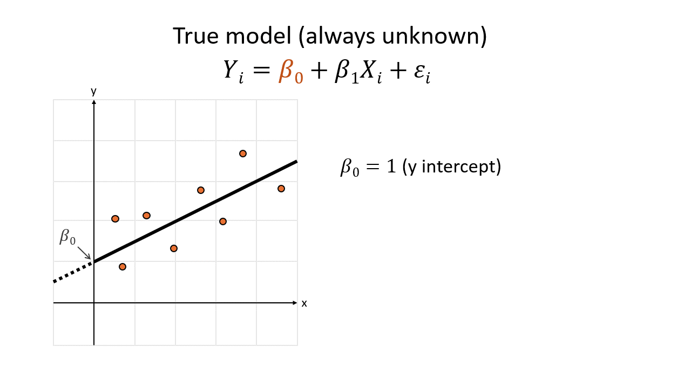
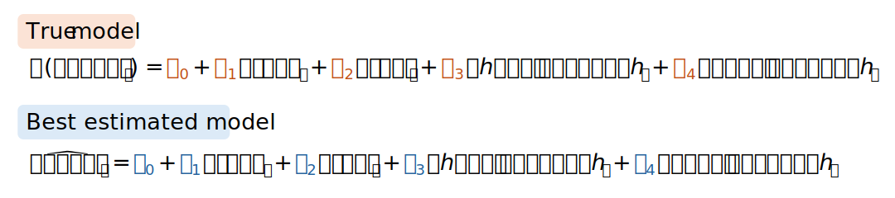

```{r setup, include=FALSE}
# Set up global environment ----------------------------------------------------
knitr::opts_chunk$set(echo=TRUE, results="hide", message=FALSE, warning=FALSE)  
```

```{r}
# Load required R packages -----------------------------------------------------
if (!require("pacman")) install.packages("pacman")
pacman::p_load(here,
               tidymodels,
               broom) 
```

# Why linear regression?    

Linear regression is usually the first statistical model that people learn about. Although it has a reputation for being a basic modelling approach, linear regression is still used for different purposes.   

As listed in [Regression and Other Stories](https://avehtari.github.io/ROS-Examples/) by Gelman et al, linear regression can be used to:   

+ Predict or forecast outcomes without aiming to infer causality.   
+ Generate a linear explanation of the associations between variables of interest (also known as features) and an outcome.    
+ Adjust outcomes from a sample to infer something about a population of interest.    
+ Estimate treatment effects by comparing outcomes between a treatment and control group in a randomised controlled trial.    

Linear regression models can be easily misused when purposes deviate from the ones described above. For example, people can mistake the associations produced by a linear regression model as being causal rather than just predictive.  

Think about the association between the temperature and how quickly an icecream melts. How quickly an icecream melts is positively associated with the temperature, but an icecream melting quickly **does not cause** the temperature to increase. Correlation is not causation (but we can sometimes use correlations to help us design better experiments to study causation).   

# Build a linear regression model 

Let's first build a linear regression model and see what results it produces. We will then learn about the mathematical properties, interpretation and assumptions of our model.      

We will provide ourselves with a safety check, by secretly knowing the precise relationship between our independent variables and the outcome of interest. This will never happen in real life.   

Imagine that the amount of money a pet influencer earns per month is influenced by the following variables:    

+ Whether the pet is a cat or a dog or another animal species       
+ The number of photos their owner posts every month      
+ The number of videos their owner posts every month      

To simplify things, We state that there are no confounds between these variables i.e. each variable is independent of one another.   

```{mermaid}
flowchart LR  
  A(Animal species) --> B(monthly income) 
  C(Photos per month) --> B
  D(Videos per month) --> B

  style B fill:#Fff9e3,stroke:#333
```

We can simulate some income data to use for linear regression modelling.  

```{r}
# Simulate pet influencer income dataset ---------------------------------------
set.seed(111)
N <- 500  

# Simulate whether pet is dog, cat or other using a multinomial distribution  
species <- rmultinom(N, 
                     size = 1,
                     prob = c(0.6, 0.3, 0.1))

# Convert species into dummy variables     
is_dog <- species[1, 1:N]
is_cat <- species[2, 1:N]

# Simulate number of photos per month using a poisson distribution 
photos <- rpois(N, lambda = 6)

# Simulate number of videos per month using a poisson distribution
videos <- rpois(N, lambda = 2)

# Simulate monthly income using a normal distribution 
income <- rnorm(N,
                mean = (is_dog * 60 + is_cat * 10 + photos * 6 + videos * 18) + 50,
                sd = 5)

# Ensure that income is a non-negative integer
income <- ifelse(income > 0, round(income, digits = 0), 0)

# Create dataset
data <- data.frame(
  is_dog,
  is_cat,
  photos,
  videos, 
  income
)
```

We will then split the simulated data into training and test data subsets with a 75% versus 25% split.      

```{r}
# Split data into training and test data sets using base R ---------------------
set.seed(111)

# Calculate 75% of the whole data set
train_size <- floor(0.75 * nrow(data))

# Randomly sample train_size number of rows and extract the row index
train_index <- sample(seq_len(nrow(data)), size = train_size) 

train <- data[train_index, ] # Subset by train_index row index
test <- data[-train_index, ] # Subset the remaining rows
```

We will then perform multiple linear regression modelling using the standard formula `lm(Y ~ X1 + X2 + ... + Xn)` and view the results using `summary()`.    

```{r, results='markup'}
# Perform multiple linear regression -------------------------------------------
mlr_model <- lm(
  train$income ~ 
    train$is_dog +
    train$is_cat +
    train$photos + 
    train$videos
)

summary(mlr_model)
```

This looks very complicated! Let us interpret the key results from `summary(mlr_model)` by learning about the mathematical structure of a linear regression model.   


# The mathemathical intuition   

The simplest linear regression model is a line of best fit through the 2-dimensional Cartesian plane. To construct this model, we need to estimate the two properties (or parameters) of an unknown straight line:  

+ The y-intercept, which we refer to as $\beta_0$.  
+ The slope, which we refer to as $\beta_1$   

We assume that there is a **true model** that precisely predicts our outcome of interest $Y_i$ based on our independent variable of interest $X_i$. The true model has the form $Y_i = \beta_0 + \beta_1X_1 + \epsilon_i$, where $\epsilon_i$ represents the error due to natural variation, because objects do not behave like perfect clones of each other in the real world.   

Because there is always error due to natural variation, we view each observation of $Y_i$ as being drawn from a normal distribution of possible values. By making some assumptions about $\epsilon_i$, we can claim that the mean of the probability distribution of $Y_i$ is $E(Y_i) = \beta_0 + \beta_1X_1$. This is the unknown straight line that we want to estimate.      

```{r, echo=FALSE, results='markup', fig.align='center', out.width='80%'} 
      
``` 

We want to use our training data set to find the best estimates of $\beta_0$ and $\beta_1$. This means finding the line that travels closest through all the training data set observations. This line is our **best estimated model**, which has the form $\hat Y_i = b_0 + b_1X_i$. It has a y-intercept of $b_0$ and slope of $b_1$.        

The simple linear regression model coefficients $b_0$ and $b_1$ are therefore our best estimates of $\beta_0$ and $\beta_1$.  

In this tutorial, we hypothesised that our multiple regression model had the form `lm(income ~ is_dog + is_cat + photos + videos)`. We think that the mean monthly pet influencer income is the sum of:    

+ A baseline income value ($\beta_0$)   
+ An additional amount of money if the pet is a dog ($\beta_1$)     
+ An additional amount of money if the pet is a cat ($\beta_2$)   
+ An additional amount of money for each photo posted per month ($\beta_3$)  
+ An additional amount of money for each video posted per month ($\beta_4$)  

In mathematical terms, we think our true unknown model has the structure below.    

```{r, echo=FALSE, results='markup', fig.align='center', out.width='80%'} 
      
``` 

Knowing this, let us examine the coefficients of our multiple linear regression model. We can extract them from our model by using the `tidy()` function from the [`broom`](https://cran.r-project.org/web/packages/broom/vignettes/broom.html) package.      
```{r, results='markup'}
# Extract model coefficients in 
mlr_model |> tidy()
```

The model coefficients tell us that the following associations exist:   

+ XX
+ XX
+ XX  


# Evaluate a linear regression model   


# Linear regression with `tidymodels`   


# Linear regression with `mlr3`   


# Other resources     

+ https://andrewproctor.github.io/rcourse/module5.html#regression_basics    
+ https://andrewproctor.github.io/rcourse/assets/module5.pdf   
+ https://www.andrew.cmu.edu/user/achoulde/94842/lectures/lecture09/lecture09-94842.html    
+ https://www.andrew.cmu.edu/user/achoulde/94842/lectures/lecture11/lecture11-94842-2020.html    