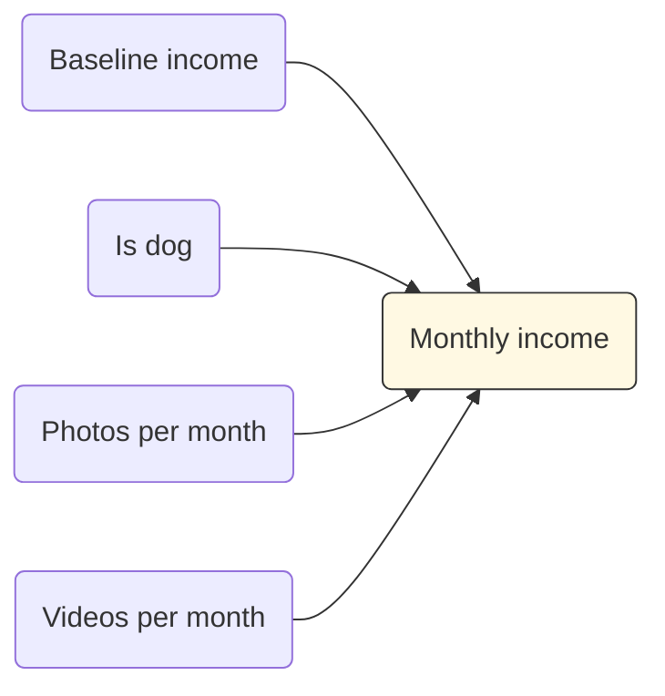
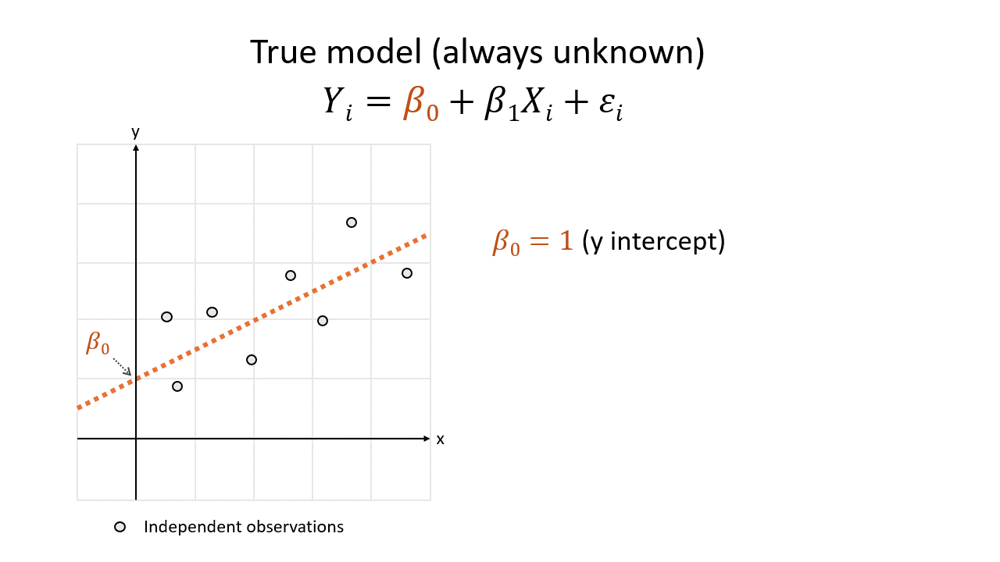
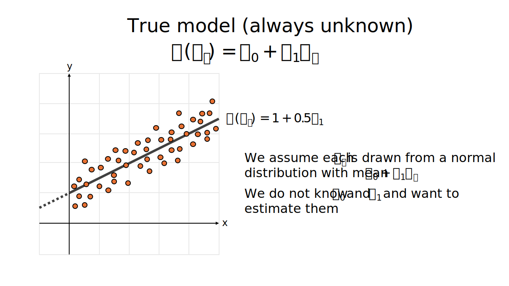
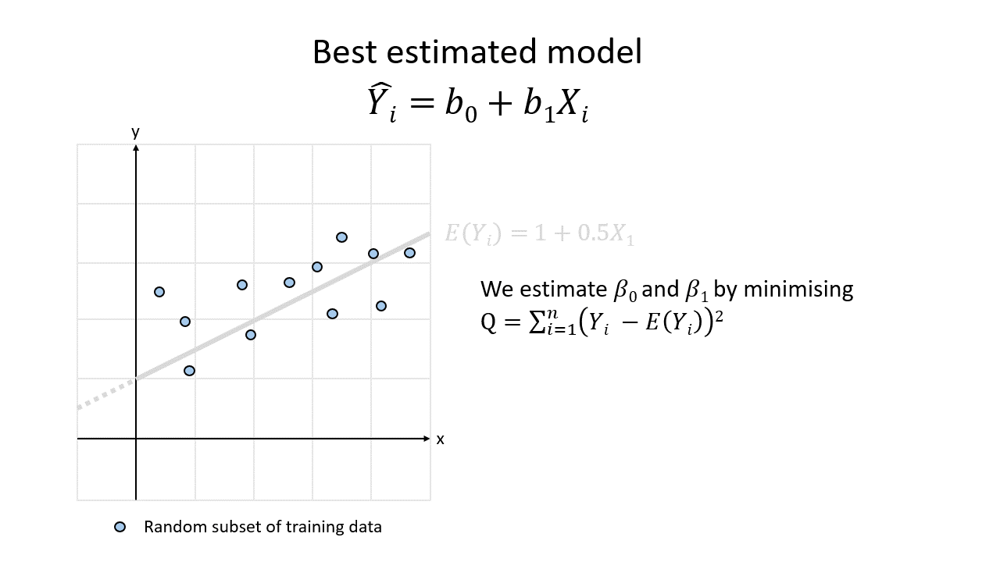
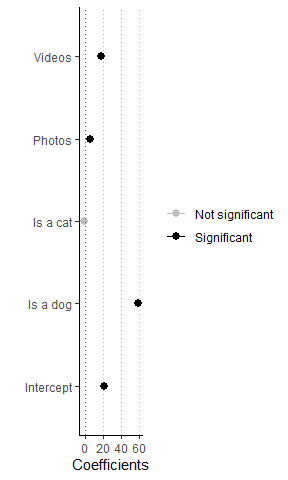

Build a linear regression model
================
Erika Duan
8/11/24

-   <a href="#why-linear-regression" id="toc-why-linear-regression">Why
    linear regression?</a>
-   <a href="#build-a-linear-regression-model"
    id="toc-build-a-linear-regression-model">Build a linear regression
    model</a>
-   <a href="#the-mathemathical-intuition"
    id="toc-the-mathemathical-intuition">The mathemathical intuition</a>
-   <a href="#evaluate-a-linear-regression-model"
    id="toc-evaluate-a-linear-regression-model">Evaluate a linear regression
    model</a>
    -   <a href="#mse" id="toc-mse">MSE</a>
    -   <a href="#r2-and-adjusted-r2" id="toc-r2-and-adjusted-r2">r^2 and
        adjusted r^2</a>
    -   <a href="#residual-plots" id="toc-residual-plots">residual plots</a>
-   <a href="#linear-regression-with-tidymodels"
    id="toc-linear-regression-with-tidymodels">Linear regression with
    <code>tidymodels</code></a>
-   <a href="#linear-regression-with-mlr3"
    id="toc-linear-regression-with-mlr3">Linear regression with
    <code>mlr3</code></a>
-   <a href="#other-resources" id="toc-other-resources">Other resources</a>

``` r
# Load required R packages -----------------------------------------------------
if (!require("pacman")) install.packages("pacman")
pacman::p_load(here,
               tidymodels, 
               broom, # Provides model outputs as a tidy table
               modelsummary) # Plots model properties  
```

# Why linear regression?

Linear regression is usually the first statistical model that people
learn about. Although it has a reputation for being a simple method,
linear regression is still used for different purposes.

As listed in [Regression and Other
Stories](https://avehtari.github.io/ROS-Examples/) by Gelman et al,
linear regression can be used to:

-   Predict or forecast outcomes without aiming to infer causality.  
-   Generate an additive explanation of the associations between
    independent variables of interest (also known as features) and an
    outcome.  
-   Adjust outcomes from a sample to infer something about a population
    of interest.  
-   Estimate treatment effects by comparing outcomes between a treatment
    and control group in a randomised controlled trial.

Linear regression models can be easily misused when purposes deviate
from the ones described above. For example, people can mistake the
associations produced by a linear regression model as being causal
rather than just predictive. This is especially problematic [when some
of the variables fitted into a model are predictive of each
other](https://elevanth.org/blog/2021/06/15/regression-fire-and-dangerous-things-1-3/).

# Build a linear regression model

Let’s first build a linear regression model and see what results it
produces. We will then learn about the mathematical properties,
interpretation and assumptions of our model.

We will provide ourselves with a safety check, by secretly knowing the
precise relationship between our independent variables and the outcome
of interest. This will obviously never happen in real life.

Imagine that the amount of money a pet influencer earns per month is
influenced by the following variables:

-   A baseline monthly income  
-   Whether the pet is a dog or another animal species  
-   The number of photos their owner posts every month  
-   The number of videos their owner posts every month

To simplify things, we state that there are no confounds between these
variables i.e. the value of one variable does not influence the value of
another variable.



We can then simulate some income data to use for modelling.

``` r
# Simulate pet influencer income dataset ---------------------------------------
set.seed(111)
N <- 500 # Simulate 500 observations 

# Simulate whether pet is dog, cat or other from a multinomial distribution  
species <- rmultinom(N, 
                     size = 1,
                     prob = c(0.6, 0.3, 0.1))

# Convert species into dummy variables     
is_dog <- species[1, 1:N]
is_cat <- species[2, 1:N]

# Simulate number of photos per month from a poisson distribution 
photos <- rpois(N, lambda = 6)

# Simulate number of videos per month from a poisson distribution
videos <- rpois(N, lambda = 2)

# Simulate monthly income from a normal distribution 
income <- rnorm(N,
                mean = (is_dog * 60 + photos * 6 + videos * 18) + 20,
                sd = 5)

# Ensure that income is a non-negative integer
income <- ifelse(income > 0, round(income, digits = 0), 0)

# Create dataset
data <- data.frame(
  is_dog,
  is_cat,
  photos,
  videos, 
  income
)
```

We will then split the simulated data into training and test data
subsets with a 75% versus 25% split.

``` r
# Split data into training and test data sets using base R ---------------------
set.seed(111)

# Calculate 75% of the whole data set
train_size <- floor(0.75 * nrow(data))

# Randomly sample train_size number of rows and extract the row index
train_index <- sample(seq_len(nrow(data)), size = train_size) 

train <- data[train_index, ] # Subset by train_index row index
test <- data[-train_index, ] # Subset the remaining rows
```

We will then perform multiple linear regression modelling on the
training data set and view the results.

``` r
# Perform multiple linear regression -------------------------------------------
# Models are fitted with the syntax lm(Y ~ X1 + X2 + ... + Xn) where Y is the
# outcome of interest and X1 ... Xn are distinct independent variables. 

mlr_model <- lm(
  train$income ~ # Y 
    train$is_dog + # X1 
    train$is_cat + # X2 
    train$photos + # X3 
    train$videos # X4 
)

# View the results of the fitted model using summary()
summary(mlr_model)
```


    Call:
    lm(formula = train$income ~ train$is_dog + train$is_cat + train$photos + 
        train$videos)

    Residuals:
         Min       1Q   Median       3Q      Max 
    -12.9609  -3.0948   0.1918   3.3231  12.1918 

    Coefficients:
                 Estimate Std. Error t value Pr(>|t|)    
    (Intercept)   21.5191     1.1122  19.349   <2e-16 ***
    train$is_dog  58.9384     0.9578  61.532   <2e-16 ***
    train$is_cat  -1.0273     1.0042  -1.023    0.307    
    train$photos   5.9010     0.1050  56.180   <2e-16 ***
    train$videos  17.9448     0.1734 103.467   <2e-16 ***
    ---
    Signif. codes:  0 '***' 0.001 '**' 0.01 '*' 0.05 '.' 0.1 ' ' 1

    Residual standard error: 4.849 on 370 degrees of freedom
    Multiple R-squared:  0.9876,    Adjusted R-squared:  0.9874 
    F-statistic:  7341 on 4 and 370 DF,  p-value: < 2.2e-16

This looks very complicated! Let us interpret the key results above by
learning about the mathematical structure of a linear regression model.

# The mathemathical intuition

The simplest linear regression model has the form
.

Graphically, this is a line of best fit through the 2D Cartesian plane.
To construct this model, we only need to estimate the two parameters of
an unknown straight line:

-   The y-intercept, which we refer to as
    .  
-   The slope, which we refer to as
    

We first assume that there is a **true model** which precisely predicts
our outcome of interest
 based on our
independent variable of interest
. The true model
has the form
,
where

represents error due to natural variation, because objects do not behave
like perfect clones of each other in the real world.



Because there is always error due to natural variation, we view each
observation of  as
being drawn from a normal distribution of many possible values. After
making some assumptions about how

behaves, we can claim that the **mean** of the probability distribution
of  is
 = \beta_0 + \beta_1X_1").
") is
the unknown straight line that we want to estimate.



We want to use our training data set to find the best point estimates of
 and
.
This means finding the line that travels closest through all the
training data set observations. This line is our **best estimated
model**, which has the form
.
It has a y-intercept of
 and slope of
.



The model coefficients
 and
 are our best
point estimates of the unknown
 and

parameters. The point estimates for
 and
 are slightly
different depending on which observations are present in our training
data set.

In this tutorial, we hypothesised that our multiple regression model had
the form `lm(income ~ is_dog + is_cat + photos + videos)`. This means
that we think that the mean monthly pet influencer income is the sum of:

-   A potential baseline income (a non-zero
    
    value)  
-   An additional amount of money if the pet is a dog (a non-zero
    
    value)  
-   An additional amount of money if the pet is a cat (a non-zero
    
    value)  
-   An additional amount of money for each photo posted per month (a
    non-zero
    
    value)  
-   An additional amount of money for each video posted per month (a
    non-zero
    
    value)

Mathematically, our best estimated model has the following structure,
where

are the point estimates for

respectively.


Let us examine the coefficients of our model. We can output them into a
tabular format using the `tidy()` function from the
[`broom`](https://cran.r-project.org/web/packages/broom/vignettes/broom.html)
package.

``` r
# Extract model coefficients and output as a tidy table ------------------------
mlr_model |> tidy()
```

    # A tibble: 5 x 5
      term         estimate std.error statistic   p.value
      <chr>           <dbl>     <dbl>     <dbl>     <dbl>
    1 (Intercept)     21.5      1.11      19.3  4.00e- 58
    2 train$is_dog    58.9      0.958     61.5  1.98e-196
    3 train$is_cat    -1.03     1.00      -1.02 3.07e-  1
    4 train$photos     5.90     0.105     56.2  3.22e-183
    5 train$videos    17.9      0.173    103.   3.43e-275

The **point estimates** of the model coefficients are used to construct
our best estimated model, which has the following form.


After examining the **point estimates**, **standard errors** and
**p-values** of our model coefficients, we can also claim that the
following associations exist, provided that our modelling assumptions
are reasonable:

-   A monthly baseline income of \~21.5 dollars exists. A pet influencer
    who posts 0 photos and videos and is not a dog earns an average of
    \~21.5 dollars per month.  
-   If the pet is a dog, the monthly income additionally increases by
    \~58.9 dollars.  
-   There is no additional monthly income increase if the pet is a
    cat.  
-   For each additional photo posted, the monthly income increases by
    \~5.9 dollars.  
-   For each additional video posted, the monthly income increases by
    \~17.9 dollars.

Inspecting the standard errors and p-values are important. The standard
error helps to estimate the range of values that our true model
parameter is likely to fall within. The p-value is used as a yardstick
to conclude if our true model parameter is indeed non-zero.

We can extract and plot 95% confidence intervals for our model
coefficients. The 95% confidence interval is actually a random interval
that is expected to contain the true model parameter
i.e. 
95% of the time. A narrow and non-zero confidence interval indicates a
convincing association between an independent variable and the outcome.

``` r
# Output 95% confidence intervals for model coefficients -----------------------
# We can also output confidence intervals as a tidy table using broom::tidy()
# mlr_model |> tidy(conf.int = TRUE, conf.level = 0.95)

confint(mlr_model)
```

                     2.5 %     97.5 %
    (Intercept)  19.332135 23.7061121
    train$is_dog 57.054881 60.8218933
    train$is_cat -3.001889  0.9473509
    train$photos  5.694441  6.1075318
    train$videos 17.603735 18.2858186

The plot below clearly illustrates that being a cat is the only
independent variable that is not predictive of monthly pet influencer
income.

``` r
# Plot 95% confidence intervals for model coefficients -------------------------
# Set p-value cut-off at p < 0.001 

coef_names <- c(
  "(Intercept)" = "Intercept",
  "train$is_dog" = "Is a dog",
  "train$is_cat" = "Is a cat",
  "train$photos" = "Photos",
  "train$videos" = "Videos"
)

modelplot(mlr_model,
          coef_map = coef_names) +
  geom_vline(xintercept = 0, 
             colour = "firebrick",
             linetype = "dotted") +
  aes(colour = ifelse(p.value < 0.001, "Significant", "Not significant")) +
  scale_colour_manual(values = c("grey", "black")) + 
  labs(title = "95% CI for linear regression model coefficients",
         x = "Coefficients",
       colour = NULL) +
    theme_classic() +
  theme(panel.grid.major.x = element_line(colour = "grey70",
                                          linetype = "dotted"))
```



Although model coefficients tell us how our model makes a prediction and
which independent variables are predictive of the outcome, we cannot use
them to evaluate whether our model is a good or poor one. To evaluate
our model, we need to examine some different metrics.

# Evaluate a linear regression model

A linear regression model outputs several metrics and plots which are
useful for model evaluation. A summary of the key metrics are below.

| Metric                                                            | Description |
|:------------------------------------------------------------------|:------------|
| Residual mean square (MSE)                                        |             |
| Residual standard error                                           |             |
| F statistic                                                       |             |
| Multiple  |             |
| Adjusted  |             |

We can examine the model metrics of our model using the `tidy()`
function

## MSE

## r^2 and adjusted r^2

## residual plots

# Linear regression with `tidymodels`

``` r
# Build model
# Make a new prediction
# Note that the predicted value is technically a point estimate of E(Y) rather than Y
```

# Linear regression with `mlr3`

``` r
# Build model
# Make a new prediction
# Note that the predicted value is technically a point estimate of E(Y) rather than Y
```

# Other resources

-   https://andrewproctor.github.io/rcourse/module5.html#regression_basics  
-   https://andrewproctor.github.io/rcourse/assets/module5.pdf  
-   https://www.andrew.cmu.edu/user/achoulde/94842/lectures/lecture09/lecture09-94842.html  
-   https://www.andrew.cmu.edu/user/achoulde/94842/lectures/lecture11/lecture11-94842-2020.html
